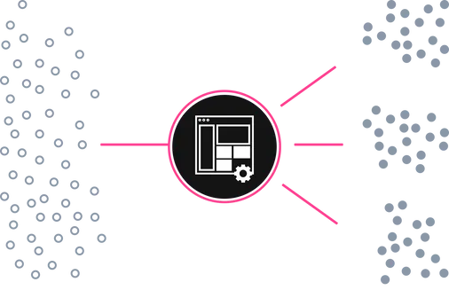
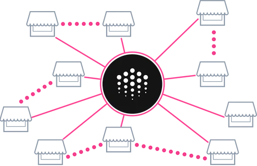
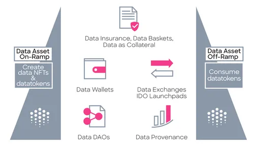
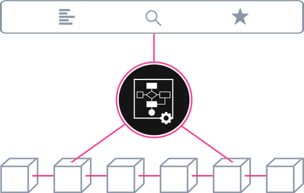

# Ocean Documentation

## What is Ocean?

Ocean provides the next generation of tools to unlock data at a large scale. Ocean makes it easy to publish and consume data services. 

Ocean uses Data NFTs (ERC721) and datatokens (ERC20) as the interface to connect data assets with blockchain and DeFi tools. Crypto wallets become data wallets, crypto exchanges become data marketplaces, DAOs for data co-ops, and more via DeFi composability.

The following guides are a greate place to start if you are new to Ocean:

* [Architecture Overview](core-concepts/architecture.md)
* [Data NFTs and Datatokens](core-concepts/datanft-and-datatoken.md)
* [Publish a data asset](using-ocean-market/marketplace-publish-data-asset.md)
* [Download a data asset](using-ocean-market/marketplace-download-data-asset.md)

## What is our Mission?

**To unlock data, for more equitable outcomes for users of data, using a thoughtful application of both technology and governance.**

Society is becoming increasingly reliant on data, especially with the advent of AI. However, a small handful of organizations with both massive data assets and AI capabilities attained worrying levels of control which is a danger to a free and open society.

Our team and community is committed to kick-starting a New Data Economy that reaches every single person, company and device, giving power back to data owners and enabling people to capture value from data to better our world.

Find out more about the people building Ocean on our [site](https://oceanprotocol.com/about).

## What can you do with Ocean?

### Buy or Sell Data

Use Ocean Market to publish and sell data, or browse and buy data. Data is published as interoperable ERC721 data NFTs & ERC20 datatokens. It's a decentralized exchange (DEX), tuned for data. The acts of publishing data, purchasing data, and consuming data are all recorded on the blockchain to make a tamper-proof audit trail.

As a data scientist or AI practitioner, you can benefit from access to more data (including private data), crypto-secured provenance in data & AI training, and income opportunities for selling data and curating data.

The following guides will help you get started with buying and selling data:

* [Publish a data asset](using-ocean-market/marketplace-publish-data-asset.md)
* [Download a data asset](using-ocean-market/marketplace-download-data-asset.md)
* [Publishing with hosting services](building-with-ocean/asset-hosting.md)

### Build Your Own Data Market

Use Ocean Protocol software tools to build your own data marketplace, by either forking [Ocean Market](https://v4.market.oceanprotocol.com/) code or building up with Ocean components.

If you're interested in starting your own marketplace checkout the following guides:

<!-- TODO: Internal links won't work until marketplace launchpad content PR is merged -->

* [Forking Ocean Market](building-with-ocean/build-a-marketplace/forking-ocean-market.md)
* [Customising your market](building-with-ocean/build-a-marketplace/customising-your-market.md)
* [Deploying your market](building-with-ocean/build-a-marketplace/deploying-market.md)

### Manage datatokens and data NFTs for use in DeFi

Ocean makes it easy to publish data services (deploy ERC721 data NFTs and ERC20 datatokens), and to consume data services (spend datatokens). Crypto wallets, exchanges, and DAOs become data wallets, exchanges, and DAOs.

Use Ocean [JavaScript](https://github.com/oceanprotocol/ocean.js) or [Python](https://github.com/oceanprotocol/ocean.py) drivers to manage data NFTs and datatokens:

Ocean-based apps make data asset on-ramps and off-ramps easy for end users. Ocean smart contracts and libraries make this easy for developers. The data itself does not need to be on-chain, just the access control.

Data NFTs are ERC721 tokens representing the unique asset and datatokens are ERC20 tokens to access data services. Each data service gets its own data NFT and one or more type of datatokens.

To access the dataset, you send 1.0 datatokens to the data provider (running Ocean Provider). To give access to someone else, send them 1.0 datatokens. That's it.

Since datatokens are ERC20, and live on Ethereum mainnet, there's a whole ecosystem to leverage.

* _Publish and access data services:_ downloadable files or compute-to-data. Use Ocean to deploy a new [ERC721](https://github.com/ethereum/EIPs/blob/master/EIPS/eip-721.md) and [ERC20](https://github.com/ethereum/EIPs/blob/7f4f0377730f5fc266824084188cc17cf246932e/EIPS/eip-20.md) datatoken contract for each data service, then mint datatokens.
* _Transfer datatokens_ to another owner (or approve & transferFrom).
* _And more._ Use ERC20 support in [web3.js](https://web3js.readthedocs.io/), [web3.py](https://web3py.readthedocs.io/en/stable/examples.html#working-with-an-erc20-token-contract) and Solidity to connect datatokens with crypto wallets and other DeFi services.

### Compute-to-Data

Ocean's "Compute-to-Data" feature enables private data to be bought & sold. You can sell compute access to privately-held data, which never leaves the data owner’s premises. Ocean-based marketplaces enable the monetization of private data while preserving privacy. [Here](tutorials/compute-to-data-architecture/) are details.

Checkout these guides if you are aiming to get a deeper understanding on how compute-to-data works:

* [Architecture](building-with-ocean/compute-to-data/compute-to-data-architecture.md)
* [Datasets & Algorithms](building-with-ocean/compute-to-data/compute-to-data-datasets-algorithms.md)
* [Minikube Environment](building-with-ocean/compute-to-data/compute-to-data-minikube.md)
* [Writing Algorithms](building-with-ocean/compute-to-data/compute-to-data-algorithms.md)
* [Private docker registry](building-with-ocean/compute-to-data/compute-to-data-docker-registry.md)
## How does it work?

In Ocean Protocol, each asset gets its own ERC721 **data NFT** and one(or more) ERC20 **datatokens**. This enables data wallets, data exchanges, and data co-ops by directly leveraging crypto wallets, exchanges, and more.

OCEAN token is used for staking, and more. [Here](https://oceanprotocol.com/token) are details.

Ocean Protocol provides tools for developers to _build data markets_, and to _manage data NFTs and datatokens_ for use in DeFi.

## Supporters

[GitBook](https://www.gitbook.com/) is a supporter of this open source project by providing hosting for this documentation.
