# Publishing with Hosting Services

### Overview

To publish assets on the Ocean Marketplace, publishers must provide a link(an URL) to the file. It is up to the asset publisher to decide where to host the asset. For example, a publisher can store the content on their AWS server, private cloud server, or other third-party hosting services. Through publishing, the URL of the asset is encrypted and stored as a part of DDO on the blockchain. Buyers don't have access directly to the URL, but they interact with the Provider, which decrypts the URL and acts as a proxy to serve the asset. The DDO only stores the location of the file, which is accessed on-demand by the Provider. Implementing a security policy that allows only the Provider to access the URL and blocks requests from other unauthorized actors is recommended. One of the possible ways to achieve this is to allow only the Provider's IP address to access the URL. But, not all hosting services provide this feature. So, the publishers must consider the security features while choosing a hosting service.

On Ocean Marketplace, a publisher must provide the link to the asset during publish step in the field shown in the below image.

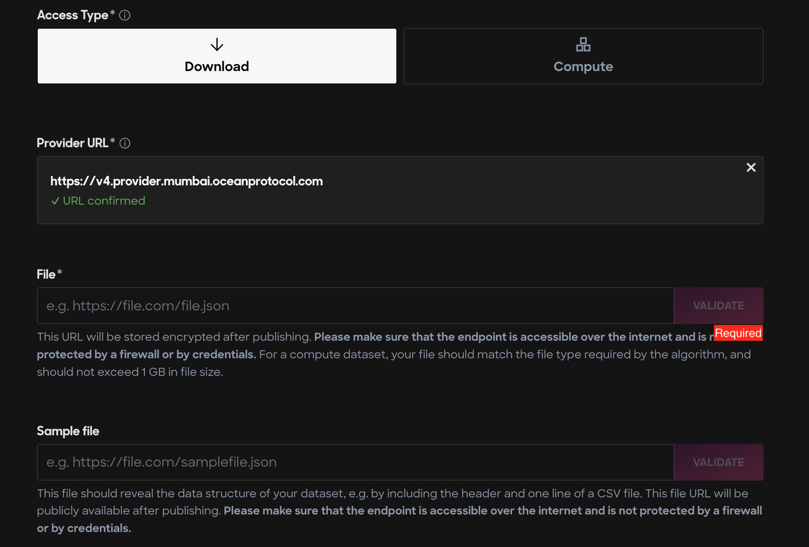

### Hosting services

Publishers can choose any hosting service of their choice. The below section explains how to use commonly used hosting services with Ocean Marketplace.

As a mention, Google Drive is not a reliable data storage solution that integrates well with Ocean.
Multiple issues encountered when consuming or purchasing assets, therefore please avoid Google Drive.
#### AWS

AWS provides various options to host data and multiple configuration possibilities. Publishers are required to do their research and decide what would be the right choice. The below steps provide one of the possible ways to host data using AWS S3 bucket and publish it on Ocean Marketplace.

**Prerequisite**

Create an account on [AWS](https://aws.amazon.com/s3/). Users might also be asked to provide payment details and billing addresses that are out of this tutorial's scope.

**Step 1 - Create a storage account**

**Go to AWS portal**

Go to the AWS portal for S3: https://aws.amazon.com/s3/ and select from the upper right corner `Create an AWS account` as shown below.

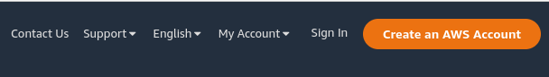

**Fill in the details**

)

**Create a bucket**

After logging into the new account, search for the available services and select `S3` type of
storage.


In order to create a S3 bucket, choose `Create bucket`.


Fill in the form with the necessary information. Then, the bucket is up & running.

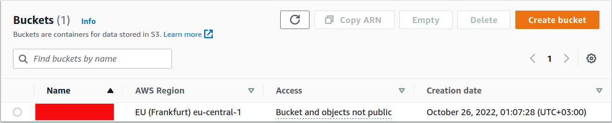

**Step 2 - Upload asset on S3 bucket**

Now, the asset can be uploaded by selecting the bucket name and choose `Upload`
in the `Objects` tab.


**Add files to the bucket**

Get the files and add them to the bucket.

The file is an example used in multiple Ocean repositories, and it can be
found [here](https://raw.githubusercontent.com/oceanprotocol/c2d-examples/main/branin_and_gpr/branin.arff).

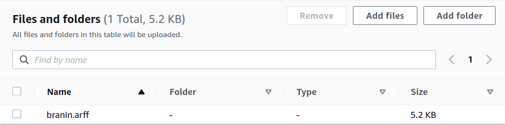

The permissions and properties can be set afterwards, for the moment keep them as default.

After selecting `Upload`, make sure that the status is `Succeeded`.

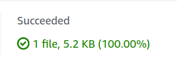

**Step 3 - Access the Object URL on S3 Bucket**

By default, the permissions of accessing the file from S3 bucket are set to private.
To publish an asset on the market, the S3 URL needs to be public.
This step shows how to set up access control policies to grant permissions to others. 

**Editing permissions**

Go to the `Permissions` tab and select `Edit` and then uncheck `Block all public access` 
boxes to give everyone read access to the object and click `Save`.

If editing the permissions is unavailable, modify the `Object Ownership` by enabling the ACLs
as shown below.

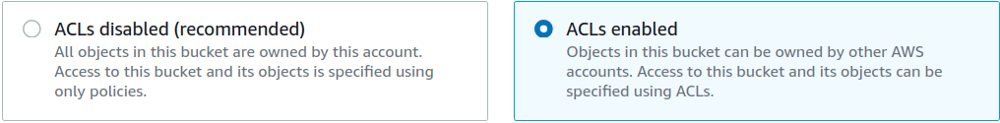

**Modifying bucket policy**

In order to have the bucket granted on public access, its policy needs to be
modified likewise.

Note that the `<BUCKET-NAME>` must be chosen from personal buckets' dashboard.

```json
{
    "Version": "2012-10-17",
    "Statement": [
        {
            "Sid": "Public S3 Bucket",
            "Principal": "*",
            "Effect": "Allow",
            "Action": "s3:GetObject",
            "Resource": "arn:aws:s3:::<BUCKET-NAME>/*"
        }
    ]
}
```

After saving the changes, the bucket should appear as `Public` access.

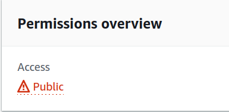

**Verify the object URL on public access**

Select the file from the bucket that needs verification and select `Open`. Now it should
be able to download the file on personal system.

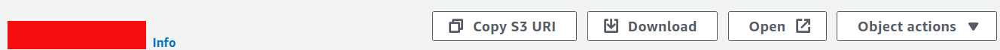


**Step 4 - Get the S3 Bucket Link & Publish Asset on Market**

Now that the S3 endpoint has public access, the asset will be hosted successfully.

Go to [Ocean Market](https://market.oceanprotocol.com/publish/1) to complete the form
for asset creation.

Copy the `Object URL` that can be found at `Object Overview` from AWS S3 bucket
and paste it in the `File` field from the form as it is illustrated below.

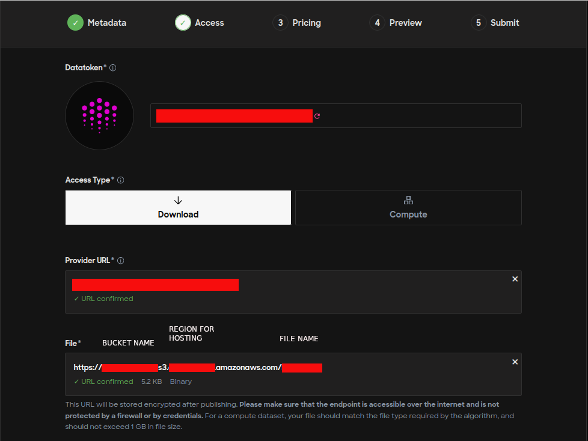

#### Azure storage

Azure provides various options to host data and multiple configuration possibilities. Publishers are required to do their research and decide what would be the right choice. The below steps provide one of the possible ways to host data using Azure storage and publish it on Ocean Marketplace.

**Prerequisite**

Create an account on [Azure](https://azure.microsoft.com/en-us/). Users might also be asked to provide payment details and billing addresses that are out of this tutorial's scope.

**Step 1 - Create a storage account**

**Go to Azure portal**

Go to the Azure portal: https://portal.azure.com/#home and select `Storage accounts` as shown below.

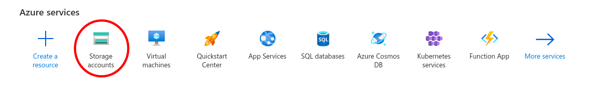

**Create a new storage account**

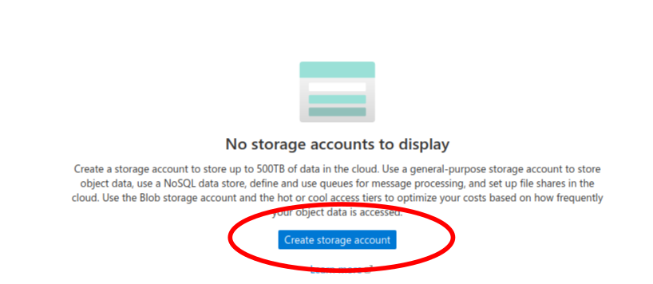

**Fill in the details**

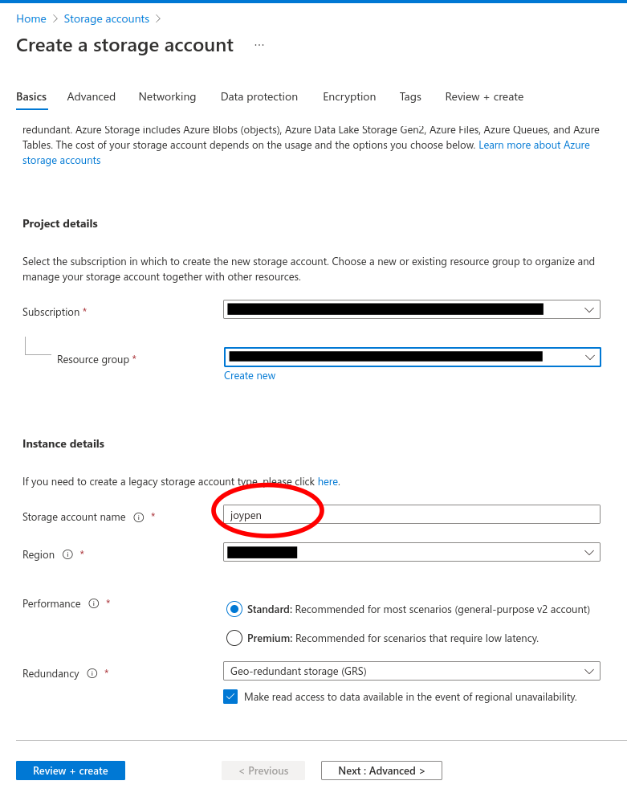

**Storage account created**

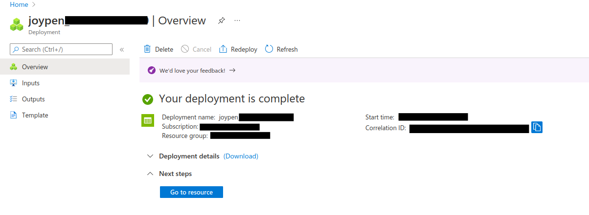

**Step 2 - Create a blob container**

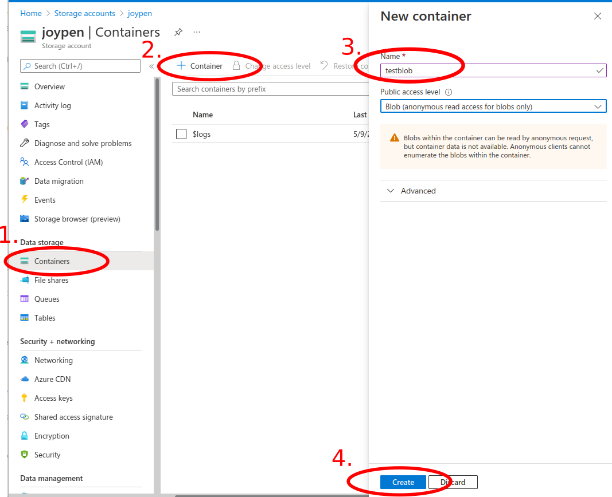

**Step 3 - Upload a file**

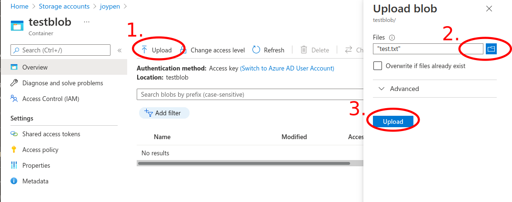

**Step 4 - Share the file**

**Select the file to be published and click Generate SAS**

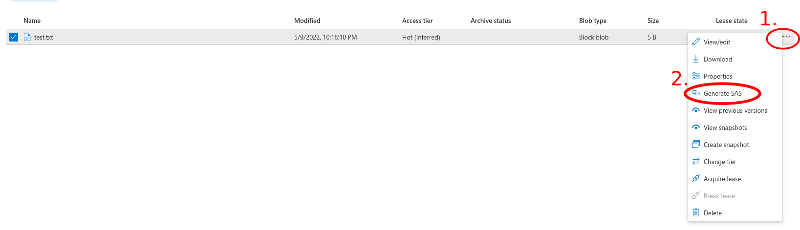

**Configure the SAS details and click `Generate SAS token and URL`**

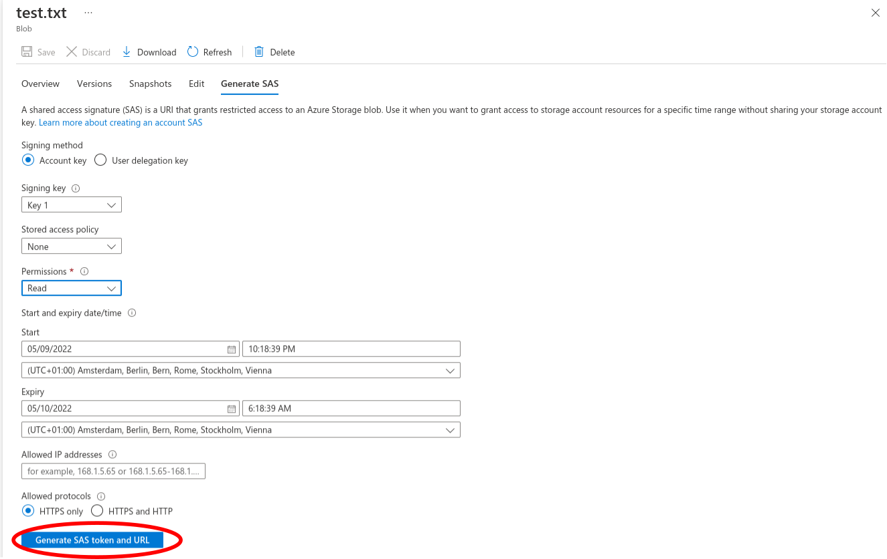

**Copy the generated link**

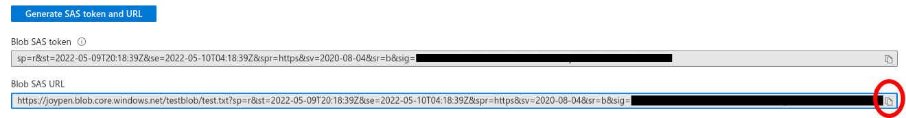

**Step 5 - Publish the asset using the generated link**

Now, copy and paste the link in the Publish page in the Ocean Marketplace.

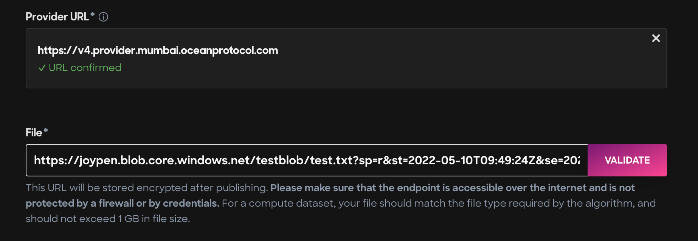


