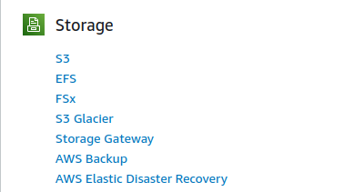

# Publishing with Hosting Services

### Overview

To publish assets on the Ocean Marketplace, publishers must provide a link(an URL) to the file. It is up to the asset publisher to decide where to host the asset. For example, a publisher can store the content on their Google Drive, AWS server, private cloud server, or other third-party hosting services. Through publishing, the URL of the asset is encrypted and stored as a part of DDO on the blockchain. Buyers don't have access directly to the URL, but they interact with the Provider, which decrypts the URL and acts as a proxy to serve the asset. The DDO only stores the location of the file, which is accessed on-demand by the Provider. Implementing a security policy that allows only the Provider to access the URL and blocks requests from other unauthorized actors is recommended. One of the possible ways to achieve this is to allow only the Provider's IP address to access the URL. But, not all hosting services provide this feature. So, the publishers must consider the security features while choosing a hosting service.

On Ocean Marketplace, a publisher must provide the link to the asset during publish step. Once the asset is published, this link cannot be changed. So, it is essential that the publisher correctly sets this field (shown in the below image).

### Hosting services

Publishers can choose any hosting service of their choice. The below section explains how to use commonly used hosting services with Ocean Marketplace.

#### AWS

AWS provides various options to host data and multiple configuration possibilities. Publishers are required to do their research and decide what would be the right choice. The below steps provide one of the possible ways to host data using AWS S3 bucket and publish it on Ocean Marketplace.

**Prerequisite**

Create an account on [AWS](https://aws.amazon.com/s3/). Users might also be asked to provide payment details and billing addresses that are out of this tutorial's scope.

**Step 1 - Create a storage account**

**Go to AWS portal**

Go to the AWS portal for S3: https://aws.amazon.com/s3/ and select from the upper right corner `Create an AWS account` as shown below.

**Fill in the details**

)

**Create a bucket**

After logging into the new account, search for the available services and select `S3` type of
storage.

In order to create a S3 bucket, choose `Create bucket`.

Fill in the form with the necessary information. Then, the bucket is up & running.

**Step 2 - Upload asset on S3 bucket**

Now, the asset can be uploaded by selecting the bucket name and choose `Uploads`
in the `Objects` tab.

The asset can be created through market app and further provide the URL of it.

