# Customizing your fork of Ocean market

So you’ve got a fully functioning data marketplace at this point, which is pretty cool. But it doesn’t really look like your data marketplace. Right now, it’s still just a clone of Ocean Market — the same branding, name, logo, etc. The next few steps focus on personalizing your data marketplace.

- Change your Market Name

- Change the Logo

- Change the Styling

- Edit the Publish Form

- Change the Fee Address

- Build and host your Data Marketplace

## Change your Market Name

It’s now time to open up your favorite code editor and start getting stuck into the code. The first thing we will be doing is changing the name of your marketplace. A decent code editor (such as VS Code) makes this incredibly simple by searching and replacing all the places where the name appears.

Let’s start by searching and replacing “Ocean Marketplace”. In VS Code there is a magnifying glass symbol in the left-hand panel (arrow 1 in the image below) that will open up the interface for searching and replacing text. Type “Ocean Marketplace” into the first textbox, and the name of your marketplace into the second textbox (arrow 2). To make things simple, there is a button to the right of the second textbox (arrow 3) that will replace all instances at once. You can take a moment to review all the text you’re changing if you wish, and then click this button.

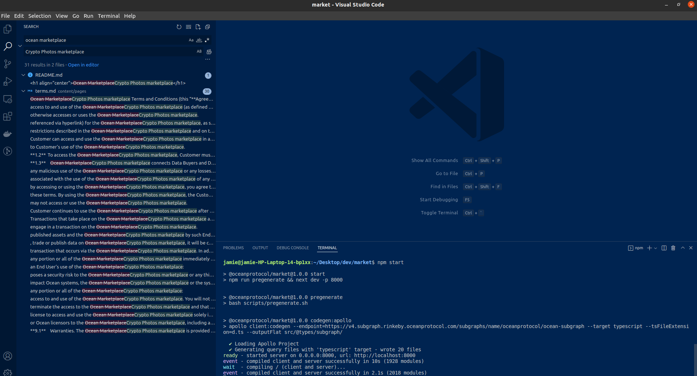

Next up, we need to repeat the process but this time we’ll be searching and replacing “Ocean Market”. As you can see in the screenshot below, we have called our fork “Crypto Photos Market”.

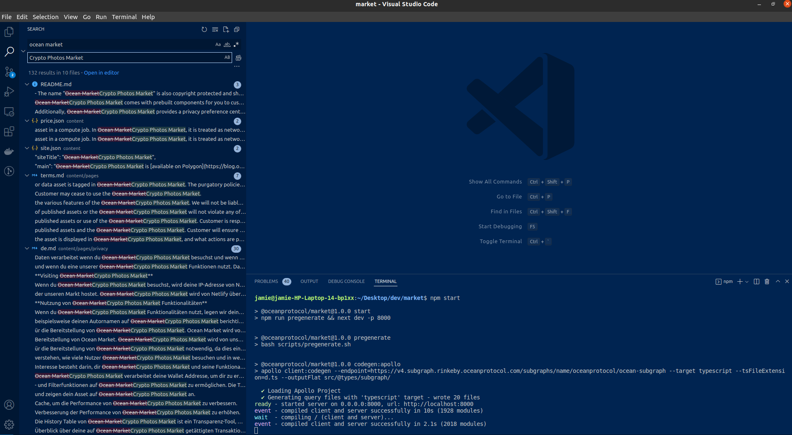

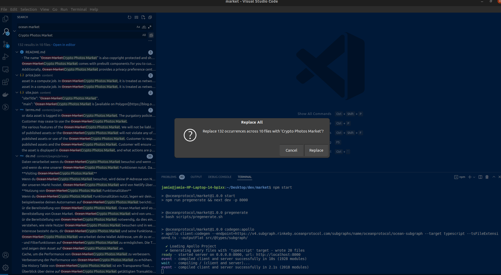


Now let’s change the tagline of your site. Open up the folder called “content” and then open the file called “site.json”.


On line 3 in this file you can enter the tagline that you want for your marketplace.


## Change the Logo

The next important step to personalizing your marketplace is setting your own logo. We highly recommend using your logo in SVG format for this. The site logo is stored in the following location:

```
src/@images/logo.svg
```

Delete the “logo.svg” file from that folder and paste your own logo in the same folder. Then, if you rename your logo “logo.svg” everything will work without any problems.

At this point, it’s a good idea to check how things are looking. First check that you have saved all of your changes, then cancel the build that’s running in your terminal (Ctrl + C OR Cmnd + C) and start it again `npm start`. Once the build has finished, navigate to http://localhost:8000/ and see how things look.


Awesome! Our logo is looking great!

## Change the Styling

Hopefully, you like our pink and purple branding, but we don’t expect you to keep it in your own marketplace. This step focuses on applying your own brand colors and styles.

### Background

Let’s start with the background. Open up the following CSS file:

```
src/components/App/index.module.css
```

You’ll notice in the screenshot above that we are setting our “wave” background on line 3. Here, you’ll want to use your own background color or image. For this example, we’ll use an SVG background from [here](https://www.svgbackgrounds.com/). First, we save the new background image into the src/images/ folder (same folder as the logo), then we change the CSS to the file location of the new background (see line 3 in the image below).


If we save this file and view the site at this point, we get a white section at the top (see image below). And you’ll also notice that the background doesn’t fill all the way down to the bottom of the screen.

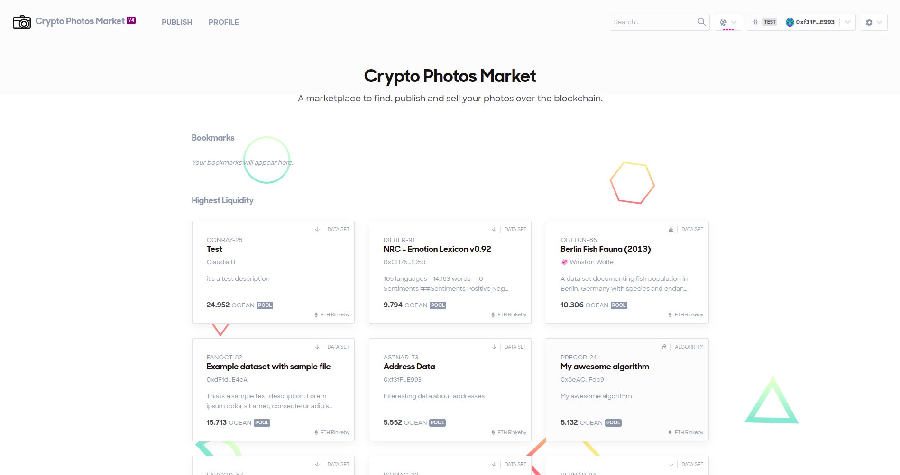
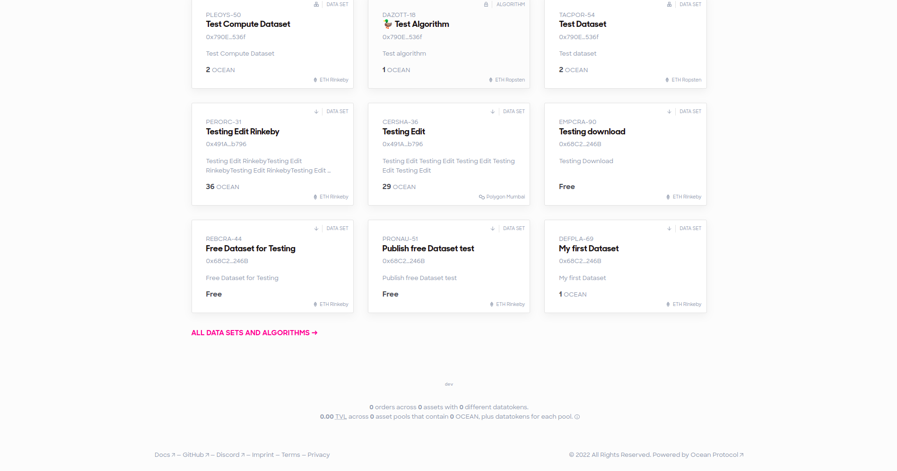

To fix this, we need to change the starting position of the background image and change it from no-repeat to repeat. We can do this on line 3.

When we view our marketplace, we can see that the new background starts at the top and fills the whole page. Perfect!

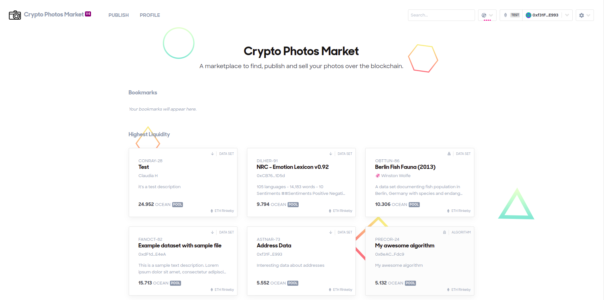

## Brand Colors

Next up, let’s change the background colors to match your individual style. Open up the following file: src/global/\_variables.css. Here you’ll see the global style colors that are set. Now is the time to get creative, or consult your brand handbook (if you already have one).

You can change these colors as much as you wish until you’re happy with how everything looks. Each time you save your changes, the site will immediately update so you can see how things look. You can see the styles chosen for this example in the image below.

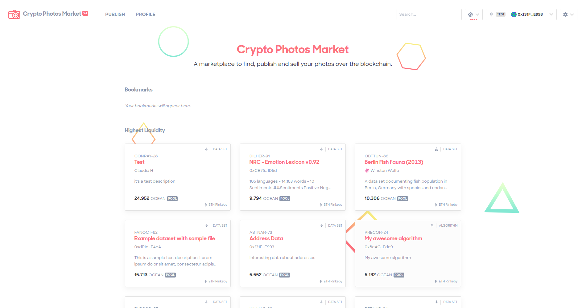

## Change Fonts

The final part of the styling that we’ll alter in this guide is the fonts. This is an important step because the font used in Ocean Market is one of the few elements of the market that are copyright protected. If you want to use the same font you’ll need to purchase a license. The other copyrighted elements are the logo and the name — which we have already changed.

If you don’t already have a brand font, head over to Google Fonts to pick some fonts that suit the brand you’re trying to create. Google makes it nice and easy to see how they’ll look, and it’s simple to import them into your project.

The global fonts are set in the same file as the colors, scroll down and you’ll see them on lines 36 to 41.

If you are importing fonts, such as from Google fonts, you need to make sure that you include the import statement at the top of the \_variables.css file.

As with the color changes, it’s a good idea to save the file with each change and check if the site is looking the way that you expected it to. You can see our eclectic choices below.


## Customize the Publish Form

Let’s head to the publish page to see what it looks like with our new styling - so far, so good. But there is one major issue, the publish form is still telling people to publish datasets. On our new marketplace, we want people to publish and sell their photos, so we’re going to have to make some changes here.

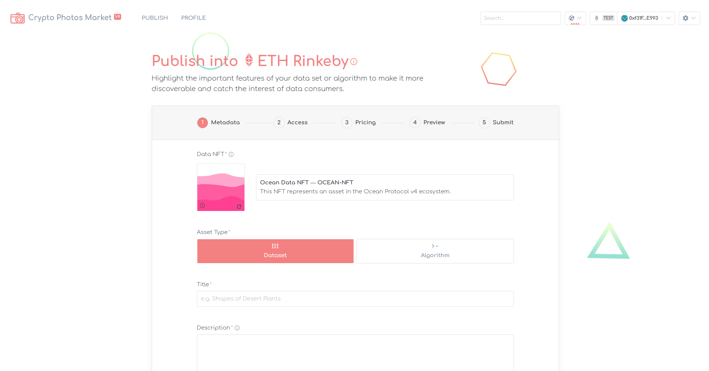

Open up the index.json file from content/publish/index.json - here we change the text to explain that this form is for publishing photos.


Additionally, the asset type current says dataset, and we need to change this so that it says photo. The simplest way to do this is to change the title of the asset type without changing anything else. Ocean can handle selling any digital asset that can be accessed via a URL, so no further changes are needed to accommodate selling photos.

Open up src/components/Publish/Metadata/index.tsx and change line 28 so that it says ‘Photo’


Great, now our publish page explains that users should be publishing photos and photo is provided as an asset type option. We’ll also leave algorithm as an option in case some data scientists want to do some analysis or image transformation on the photos.


There is one more thing that is fun to change before we move away from the publish form. You’ll notice that Ocean Market V4 now has a cool SVG generation feature that creates the images for the Data NFT. It creates a series of pink waves. Let’s change this so that it uses our brand colors in the waves!

Open up /src/@utils/SvgWaves.ts and have a look at lines 27 to 30 where the colors are specified. Currently, the pink color is the one used in the svg generator. You can replace this with your own brand color:

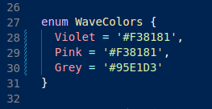

If you’re interested in doing some further customization, take a look at lines 53 to 64. You can change these properties to alter how the image looks. Feel free to play around with it. We’ve increased the number of layers from 4 to 5.

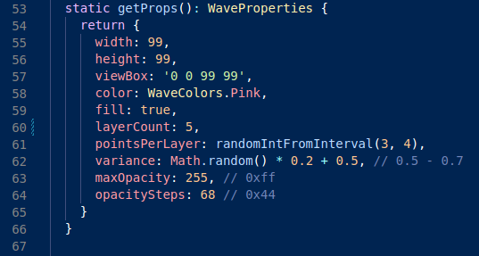

And now your customized publish page is ready for your customers:


## Change the Fee Address

At this point, we have made a lot of changes and hopefully you’re happy with the way that your marketplace is looking. Given that you now have your own awesome photo marketplace, it’s about time we talked about monetizing it. Yup, that’s right - you will earn a commission when people buy and sell photos in your marketplace. In Ocean V4, there are a whole host of new fees and customization options that you can use (read more about that here).

When someone sets the pricing for their photos in your marketplace, they are informed that a commission will be sent to the owner of the marketplace. You see that at the moment this fee is set to zero, so you’ll want to increase that. And in order to receive the fees you’ll you need to set the address that you want to recieve these fees in.

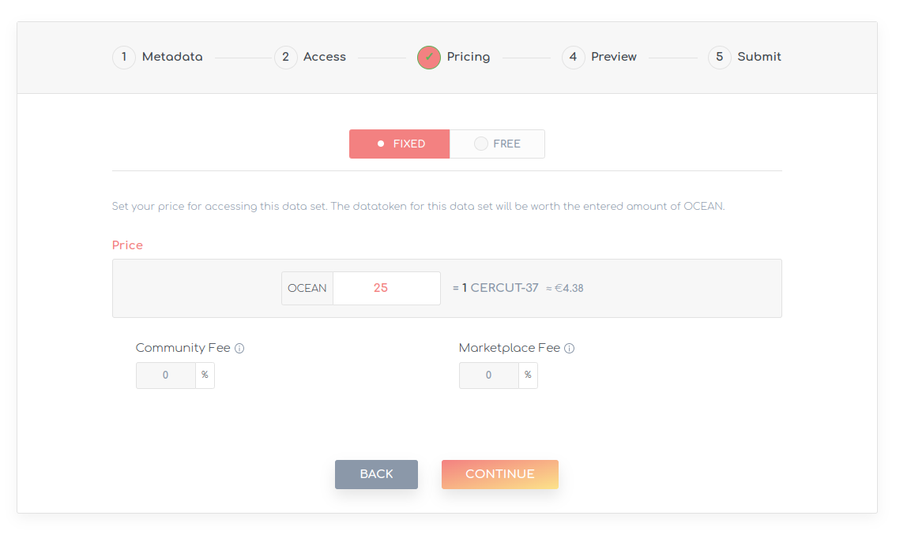

This important step is the last thing that we will change in this guide. To set the marketplace fees and address, you’ll need to save them as environmental variables. Create a new file called .env in the root of your repository.

Copy and paste the following into the file:

```

NEXT_PUBLIC_MARKET_FEE_ADDRESS="0x123abc"
NEXT_PUBLIC_PUBLISHER_MARKET_ORDER_FEE="0.01"
NEXT_PUBLIC_PUBLISHER_MARKET_FIXED_SWAP_FEE="0.01"
NEXT_PUBLIC_CONSUME_MARKET_ORDER_FEE="0.01"
NEXT_PUBLIC_CONSUME_MARKET_FIXED_SWAP_FEE="0.01"

```

You need to replace “0x123abc” with your ethereum address (this is where the fees will be sent) and alter the fees to the levels that you intend them to be at. If you change you mind, these fees can always be altered later.

Go to [Fees page](https://docs.oceanprotocol.com/concepts/fees/) to know more details about each type of fee and its relevance.

It is important that the file is saved in the right place at the root of your repository, your file structure should look the same as below.

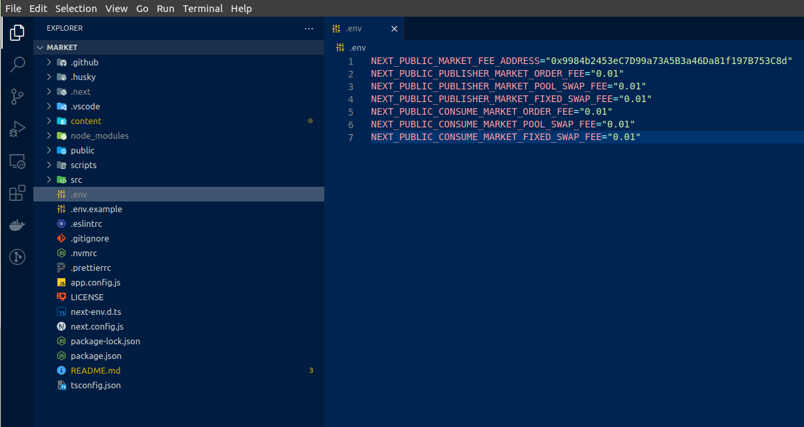

Now that’s it; you now have a fully functioning photo marketplace that operates over the blockchain. Everytime someone uses it, you will receive revenue.

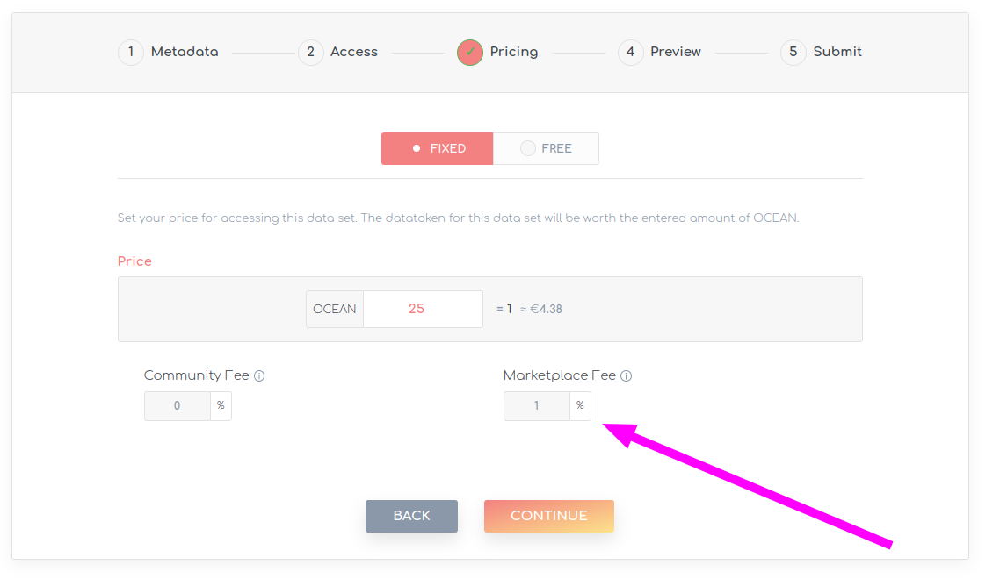
