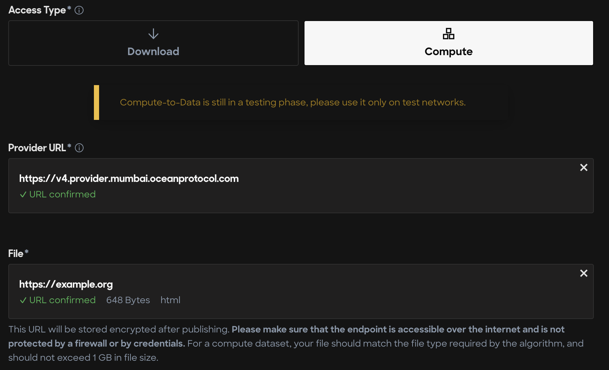
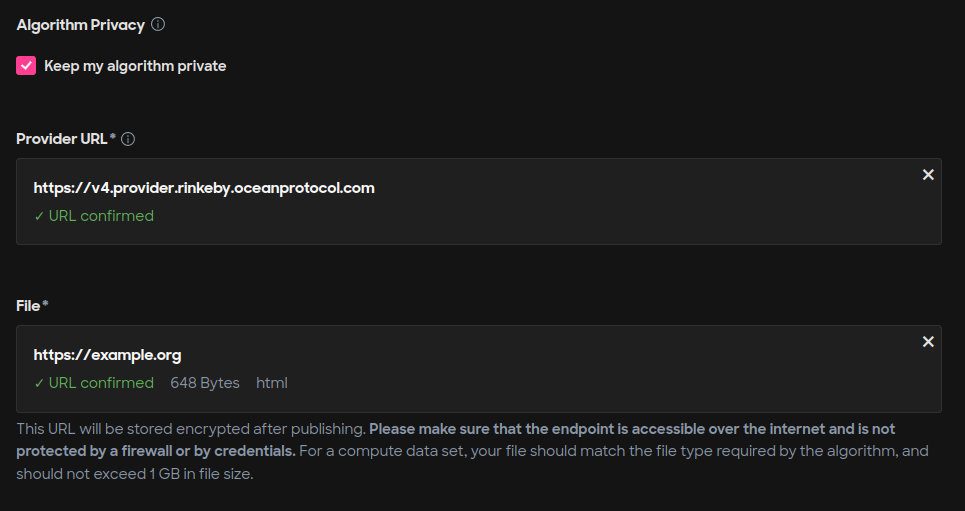

# User defined parameters

### Overview

Ocean Protocol allows dataset buyers to provide custom parameters that can be used to fetch the downloaded data in a specific format, download a different type of data or pass some additional input to the algorithms in the Compute-to-Data job.

There 2 are types of parameters that asset publishers can support:

* User defined parameters
* Algorithm custom parameters

### Publish a dataset that uses custom parameters

The dataset publisher can support these parameters to allow filtering or querying of the published dataset. The additional parameters that facilitate this are called `User defined parameters`. The Provider combines the original asset URL and the entered parameter values into a new URL and then streams the response from the modified URL back to the buyer.

#### Use case for user defined parameters

For example, if the publisher has published an URL `https://example.com` which serves large size historical weather data from all over the world, the publisher could allow buyers to filter the data based on location, type of data, etc. It is possible to do this using user defined parameters.

Suppose the publisher defines the following 2 parameters:

* `location`: A string indicating region code
* `type`: A string indicating the type of weather data. It can be temperature/humidity/pressure.

Suppose the buyer wants to download the temperature data in the region code `XYZ`. While downloading the data, the buyer enters the desired parameter values using ocean.py or ocean.js.

The provider will decrypt the URL from the DDO published on-chain, construct a new URL with the additional parameters and finally stream data to the buyer.

Internally, the new URL will be of the format `https://example.com/?location=XYZ&type=temperature`. The server hosting the data has to read these parameters and serve the appropriate data.

The following steps will specify how the publisher can support additional parameters.

#### Step 1: Create a service

The below python script exposes a REST endpoint that takes two parameters, namely: `location` and `type`. Let's assume that the dataset publisher hosts the service at domain `example.com` along with HTTPS support. The publisher must ensure that the URL is accessible to Provider.

The code snippet is only for demo purposes and not for production use.

```python
from flask import Flask, request
def get_data(data_type: str, location: str):
    '''
        Add some business logic here to get
        the required data with given parameters
    '''
    return {}
@app.route('/', methods=['GET'])
def serve_content():
    args = request.args
    data_type = args.get('type')
    location = args.get('location')
    result = get_data(data_type, location)
    return result
```

#### Step 2: Publish dataset asset with compute service

The publisher now must provide the file URL as `https://example.com` while publishing the asset, as shown in the below image.



For a complete tutorial on publishing asset using Ocean Marketplace read [our guide on publishing with Ocean Market](../../using-ocean-market/marketplace-publish-data-asset.md).

### Publish an algorithm that uses custom parameters

#### Use case for algorithm custom parameters

For example, if the algorithm publisher has published an URL `https://example.org` which serves python script to analyze historical weather data published in the previous section. If the algorithm publisher wants buyers to specify the number of iterations the algorithm must perform over the data, it is possible to do so using algorithm custom parameters.

Suppose the algorithm publisher defines a parameter called `iterations` and expects the buyer to give this input before running the algorithm in a Compute-to-Data environment. The buyer can enter the desired parameter value using ocean.py or ocean.js.

The provider passes the entered parameters and saves them in a specific path in the Compute-to-Data environment. The algorithm can later read this value and perform required computations.

The following steps will specify how the algorithm publisher can support additional algorithm custom parameters.

#### Step 1: Create an algorithm

The code snippet is only for demo purposes and not for production use.

```python
def run_algorithm(i: int):
    pass
def read_algorithm_custom_input():
    parameters_file = os.path.join(os.sep, "data", "inputs", "algoCustomData.json")
    with open(parameters_file, "r") as file:
        return json.load(file)
algorithm_inputs = read_algorithm_custom_input()
iterations = algorithm_inputs["iterations"]
for i in range(iterations):
    # Run some machine learning algorithm
    print(f"Running iteration {i}")
    result = run_algorithm(i)
output_dir = os.path.join(os.sep, "data", "outputs")
with open(os.path.join(output_dir, "result"), "w") as f:
    f.write(result)
```

#### Step 2: Publish algorithm asset

The publisher now must provide the file URL as `https://example.org` while publishing the algorithm asset, as shown in the below image.



To view a complete tutorial on publishing asset using Ocean Marketplace click [here](../../using-ocean-market/marketplace-publish-data-asset.md).

### Starting compute job with custom parameters

After the publishing, assume that a buyer wants to run the with certain parameters algorithm on selected dataset. The code snippet below shows how the buyer can start the compute job with custom parameter values. Searching dataset, allowing algorithm to run the dataset, buying datatokens, setting up ocean.py/ocean.js is out of scope of this tutorial.

For configuring ocean.py/ocean.js, please refer this [guide](../using-ocean-libraries/configuration.md). Copy the below code snippet to a file locally after completing required configurations and execute the script.



<pre class="language-python" data-title="start_compute.py"><code class="lang-python"># Import dependencies
from config import web3_wallet, ocean, config, web3_wallet
from ocean_lib.models.compute_input import ComputeInput

<strong># Replace theses variables with the appropriate did values
</strong><strong>dataset_did = "did:op:&#x3C;>"
</strong>algorithm_did = "did:op:&#x3C;>"

# Define algorithm input
algorithm_input = {
        "iterations": 1000
}

# Define dataset parameters
dataset_input = {
    "type": "temperature",
    "location": "XYZ"
}

# Resolve assets using Aquarius
aquarius = Aquarius.get_instance(config.metadata_cache_uri)
DATA_asset = aquarius.wait_for_asset(dataset_did)
ALGO_asset = aquarius.wait_for_asset(algorithm_did)

compute_service = DATA_asset.services[0]
algo_service = ALGO_asset.services[0]
free_c2d_env = ocean.compute.get_free_c2d_environment(compute_service.service_endpoint)
    
DATA_compute_input = ComputeInput(DATA_asset, compute_service, userdata=dataset_input)
ALGO_compute_input = ComputeInput(ALGO_asset, algo_service)

# Pay for the compute job
datasets, algorithm = ocean.assets.pay_for_compute_service(
    datasets=[DATA_compute_input],
    algorithm_data=ALGO_compute_input,
    consume_market_order_fee_address=web3_wallet.address,
    wallet=web3_wallet,
    compute_environment=free_c2d_env["id"],
    valid_until=int((datetime.utcnow() + timedelta(days=1)).timestamp()),
    consumer_address=free_c2d_env["consumerAddress"],
)

assert datasets, "pay for dataset unsuccessful"
assert algorithm, "pay for algorithm unsuccessful"

# Start compute job
job_id = ocean.compute.start(
    consumer_wallet=web3_wallet,
    dataset=datasets[0],
    compute_environment=free_c2d_env["id"],
    algorithm=algorithm,
    algorithm_algocustomdata=algorithm_input
)
# Printing the job id here. Use this job_id to retrive the result of the compute job. 
print("job_id", job_id)</code></pre>

Execute script

```bash
python start_compute.py
```



