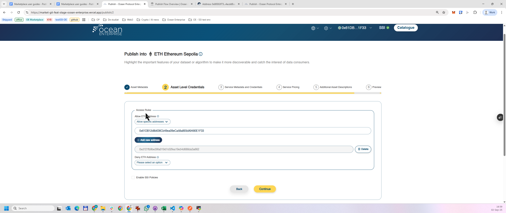

# Setup server

## **Using hosting services**

Ocean Protocol's components can be hosted on any infrastructure providers like AWS, Azure, Heroku, Digitalocean, and many others. The tutorial here explains how to create a server using Digitalocean and installing docker which will be required to host Ocean Protocol's components. Apart from steps for create a server, the remaining part of the tutorial will be same for all hosting providers.

#### Creating account and setting billing

Go to [https://www.digitalocean.com/](https://www.digitalocean.com/) and create an account. Provide the appropriate information for billing and accounting.

#### Create a droplet

Click on **`Create`** button and choose **`Droplets`** options from dropdown.



#### Configure droplet

Select Ubuntu OS and choose a plan. The required CPU, Memory depends on the number of requests Aquarius is expected to serve.&#x20;

.png>)

Also, select the region where you want Aquarius to be hosted and a root password.

.png>)

.png>)

Finalize the parameters for the server, click on `Create Droplet.` After the server is ready, select the `Access console` option from the dropdown.

.png>)

.png>)

A window will open with a terminal session. Now, the required infrastructure is ready for hosting Aquarius, Provider or the Subgraph. Let's install docker and docker-compose on the server. Follow the installation guide [here](https://docs.docker.com/engine/install/ubuntu/).

The below commands shows the commands executed by following the guide.

```bash
sudo apt-get update
sudo apt-get install ca-certificates curl gnupg lsb-release
sudo mkdir -p /etc/apt/keyrings
curl -fsSL https://download.docker.com/linux/ubuntu/gpg | sudo gpg --dearmor -o /etc/apt/keyrings/docker.gpg
echo \
  "deb [arch=$(dpkg --print-architecture) signed-by=/etc/apt/keyrings/docker.gpg] https://download.docker.com/linux/ubuntu \
  $(lsb_release -cs) stable" | sudo tee /etc/apt/sources.list.d/docker.list > /dev/null
sudo apt-get update
sudo apt-get install docker-ce docker-ce-cli containerd.io docker-compose-plugin

# Now install docker-compose
sudo apt-get update
sudo apt-get install docker-compose-plugin
```

Now that, the server is ready with all the required dependencies are installed for hosting Ocean Components, follow the instructions given in Component specific guide.&#x20;

* [Deploying Marketplace](deploying-marketplace.md)
* [ Deploying Aquarius ](deploying-aquarius.md)

