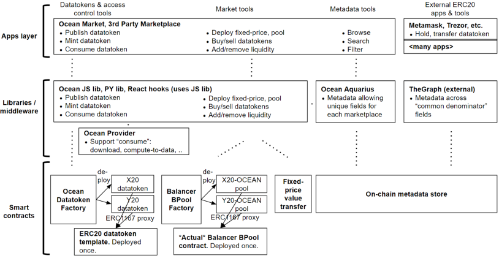

## Overview

Here is the Ocean architecture.

Here’s an overview of the figure.

- The top layer is **applications** like Ocean Market. With these apps, users can onboard services like data, algorithms, compute-to-data into crypto (publish and mint data NFTs and datatokens), hold datatokens as assets (data wallets), discover assets, and buy/sell datatokens for a fixed or auto-determined price (data marketplaces), and use data services (spend datatokens).
- Below are **libraries** used by the applications: Ocean.js (JavaScript library) and Ocean.py (Python library). This also includes middleware to assist discovery:
  - **Aquarius**: Provides metadata cache for faster search by caching on-chain data into elasticsearch
  - **Provider**: Facilitates downloading assets, DDO encryption, and communicating with `operator-service` for Compute-to-Data jobs.
  - **The Graph**: It is a 3rd party tool that developers can utilize the libraries to build their custom applications and marketplaces.
- The lowest level has the **smart contracts**. The smart contracts are deployed on the Ethereum mainnet and other compatible networks. Libraries encapsulate the calls to these smart contracts and provide features like publishing new assets, facilitating consumption, managing pricing, and much more. To see the supported networks click [here](/concepts/networks/).

## Data NFTs, Datatokens and Access Control Tools

Data NFTs are based on [ERC721](https://eips.ethereum.org/EIPS/eip-721) standard. The publisher can use Marketplace or client libraries to deploy a new data NFT contract. To save gas fees, it uses [ERC1167](https://eips.ethereum.org/EIPS/eip-1167) proxy approach on the **ERC721 template**. Publisher can then assign manager role to other Ethereum addresses who can deploy new datatoken contracts and even mint them. Each datatoken contract is associated with one data NFT contract.
Click [here](/concepts/datanft-and-datatoken/) to further read about data NFTs and datatokens.

ERC721 data NFTs represent holding copyright/base IP of a data asset, and ERC20 datatokens represent licenses to access the asset by downloading the content or running Compute-to-Data jobs.

Datatoken represents the asset that the publisher wants to monetize. The asset can be a dataset or an algorithm. The publisher actor holds the asset in Google Drive, Dropbox, AWS S3, on their phone, on their home server, etc. The publisher can optionally use IPFS for a content-addressable URL. Or instead of a file, the publisher may run a compute-to-data service.

In the **publish** step, the publisher invokes **Ocean Datatoken Factory** to deploy a new datatoken to the chain. To save gas fees, it uses [ERC1167](https://eips.ethereum.org/EIPS/eip-1167) proxy approach on the **ERC20 datatoken template**. The publisher then mints datatokens.

The publisher runs their own **Ocean Provider** or can use one deployed by Ocean Protocol. In the **download** step or while running C2D job, Provider software needs to retrieve the data service URL given a datatoken address. One approach would be for the publisher to run a database. However, this adds another dependency. To avoid this, the Provider encrypts the URL, which then gets published on-chain.

To initiate the **download** step, the data buyer sends 1.0 datatokens to the Provider wallet. Then they make a service request to the Provider. The Provider loads the encrypted URL, decrypts it, and provisions the requested service (send static data, or enable a compute-to-data job).

Instead of running a Provider themselves, the publisher can have a 3rd party like Ocean Market to run it. While more convenient, it means that the 3rd party has custody of the private encryption/decryption key (more centralized). Ocean will support more service types and URL custody options in the future.

**Ocean JavaScript and Python libraries** act as drivers for the lower-level contracts. Each library integrates with Ocean Provider to provision & access data services, and Ocean Aquarius for metadata.

<repo name="provider"></repo>
<repo name="ocean.js"></repo>
<repo name="ocean.py"></repo>

## Market Tools

Once someone has generated datatokens, they can be used in any ERC20 exchange, centralized or decentralized. In addition, Ocean provides a convenient default marketplace that is tuned for data: **Ocean Market**. It’s a vendor-neutral reference data marketplace for use by the Ocean community.

The marketplaces are decentralized (no single owner or controller), and non-custodial (only the data owner holds the keys for the datatokens).

Ocean Market supports fixed pricing and automatic price discovery.

- For **fixed pricing**, there’s a simple contract for users to buy/sell datatokens for OCEAN while avoiding custodianship during value transfer.
- For **automatic price discovery**, Ocean Market uses automated market makers (AMMs) powered by [Balancer](https://www.balancer.fi). Each pool is a datatoken-OCEAN pair. In the Ocean Market GUI, the user adds liquidity then invokes pool creation; the GUI’s React code calls the Ocean JavaScript library, which calls the **Pool Factory** to deploy a **Pool** contract. (The Python library also does this.) Deploying a datatoken pool can be viewed as an “Initial Data Offering” (IDO).

Complementary to Ocean Market, Ocean has reference code to ease building **third-party data marketplaces**, such as for logistics ([dexFreight data marketplace](https://blog.oceanprotocol.com/dexfreight-ocean-protocol-partner-to-enable-transportation-logistics-companies-to-monetize-data-7aa839195ac)) or mobility ([Daimler](https://blog.oceanprotocol.com/ocean-protocol-delivers-proof-of-concept-for-daimler-ag-in-collaboration-with-daimler-south-east-564aa7d959ca)).

[This post](https://blog.oceanprotocol.com/ocean-market-an-open-source-community-marketplace-for-data-4b99bedacdc3) elaborates on Ocean marketplace tools.

<repo name="market"></repo>

## Metadata Tools

Marketplaces use the Metadata of the asset for discovery. Metadata consists of information like the type of asset, name of the asset, creation date, license, etc. Each data asset can have a [decentralized identifier](https://w3c-ccg.github.io/did-spec/) (DID) that resolves to a DID document (DDO) for associated metadata. The DDO is essentially [JSON](https://www.json.org/) filling in metadata fields. For more details on working with OCEAN DIDs check out the [DID concept documentation](https://docs.oceanprotocol.com/concepts/did-ddo/).
The [DDO Metadata documentation](https://docs.oceanprotocol.com/concepts/ddo-metadata/) goes into more depth regarding metadata structure.

[OEP8](/concepts/did-ddo/) specifies Ocean metadata schema, including fields that must be filled. It’s based on the public [DataSet schema from schema.org](https://schema.org/Dataset).

Ocean uses the Ethereum mainnet and other compatible networks as an **on-chain metadata store**, i.e. to store both DID and DDO. This means that once the transaction fee is paid, there are no further expenses or devops work needed to ensure metadata availability into the future, aiding in the discoverability of data assets. It also simplifies integration with the rest of the Ocean system, which is Ethereum-based. Storage cost on Ethereum mainnet is not negligible, but not prohibitive and the other benefits are currently worth the trade-off compared to alternatives.

Due to the permissionless, decentralized nature of data on the Ethereum mainnet, any last mile tool can access metadata. **Ocean Aquarius** supports different metadata fields for each different Ocean-based marketplace. Developers could also use [The Graph](https://www.thegraph.com) to see metadata fields that are common across all marketplaces.

<repo name="aquarius"></repo>

## Third-Party ERC20 Apps & Tools

The ERC20 nature of datatokens eases composability with other Ethereum tools and apps, including **MetaMask** and **Trezor** as data wallets, DEXes as data exchanges, and more. [This post](https://blog.oceanprotocol.com/ocean-datatokens-from-money-legos-to-data-legos-4f867cec1837) has details.

## Actor Identities

Actors like data providers and buyers have Ethereum addresses, aka web3 accounts. These are managed by crypto wallets, as one would expect. For most use cases, this is all that’s needed. There are cases where the Ocean community could layer on protocols like [Verifiable Credentials](https://www.w3.org/TR/vc-data-model/) or tools like [3Box](https://3box.io/).
