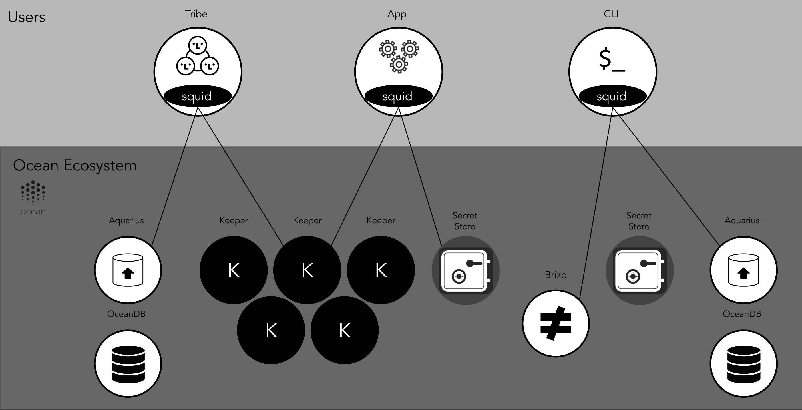

Before reading this page, you should understand some [Ocean-specific terminology](/concepts/terminology/).

## Keeper

A computer running an EVM-compatible blockchain client
(such as [Parity Ethereum](https://www.parity.io/ethereum/))
where the associated blockchain network is running the Ocean Protocol
[keeper-contracts](https://github.com/oceanprotocol/keeper-contracts)
(smart contracts).

<repo name="keeper-contracts"></repo>

See also: [Run a Keeper](/setup/keeper/)

## Secret Store

A [Parity Secret Store](https://wiki.parity.io/Secret-Store): software for distributed key pair generation, distributed key storage, and threshold retrieval. It's used to store [asset](/concepts/terminology/#asset-or-data-asset) access-control keys.

<repo name="parity-ethereum"></repo>

There are several clients for integrating the Parity Secret Store into Ocean:

<repo name="secret-store-client-js"></repo>
<repo name="secret-store-client-py"></repo>
<repo name="secret-store-client-java"></repo>

## Aquarius

Marketplaces run Aquarius to store and manage metadata about the [assets](/concepts/terminology/#asset-or-data-asset) available in their marketplace. It provides an HTTP API for interacting with an off-chain database (sometimes called "OceanDB").

<repo name="aquarius"></repo>

### OceanDB Drivers

Aquarius supports several options for the off-chain database (OceanDB), including Elasticsearch and MongoDB. One can add support for another off-chain database by creating a new driver similar to the existing OceanDB drivers.

<repo name="oceandb-elasticsearch-driver"></repo>
<repo name="oceandb-mongodb-driver"></repo>

> There is also a [BigchainDB driver](https://github.com/oceanprotocol/oceandb-bigchaindb-driver) but it hasn't been maintained.

You can create your own OceanDB drivers by extending on the `oceandb-driver-interface`.

<repo name="oceandb-driver-interface"></repo>

## Brizo

Publishers run Brizo to manage interactions with marketplaces and consumers.
It interacts with the publisher's cloud and/or on-premise infrastructure.

The most basic scenario for a publisher is to provide access to the [assets](/concepts/terminology/#asset-or-data-asset) the publisher owns or manages, but [Brizo can do much more](/concepts/architecture/#brizo).

<repo name="brizo"></repo>

### Events Handler

Brizo communicates with the Events Handler to deal with Keeper Contracts events.

The Events Handler monitors Service Execution Agreement (SEA) events and acts as a provider agent to grant access and release rewards for the publisher/provider. This is a critical part in the process of consuming data sets in the Ocean Protocol network.

Every provider in the network must run some sort of an events handler to be able to fulfill the access condition of an `Access` service in a Service Execution Agreement.

<repo name="events-handler"></repo>

### Osmosis Drivers

Brizo supports several options for file storage, including Azure Storage, Amazon S3 and on-premise storage. One can add support for another file storage option by creating a new driver similar to one of the existing Osmosis drivers.

<repo name="osmosis-azure-driver"></repo>
<repo name="osmosis-aws-driver"></repo>
<repo name="osmosis-on-premise-driver"></repo>

You can create your own Osmosis drivers by extending on the `osmosis-driver-interface`.

<repo name="osmosis-driver-interface"></repo>

## Squid Libraries

Client libraries used by applications (such as Pleuston or Jupyter notebooks) to interact with Ocean components, including Keepers, Aquarius nodes, Brizo nodes, etc.

<repo name="squid-js"></repo>
<repo name="squid-py"></repo>
<repo name="squid-java"></repo>

## Pleuston

An example marketplace/publisher front-end for developers to explore, download, and publish [assets](/concepts/terminology/#asset-or-data-asset) in an Ocean Protocol network. Implemented using [React](https://reactjs.org/) and [squid-js](https://github.com/oceanprotocol/squid-js).

<repo name="pleuston"></repo>

## Commons Marketplace

An online example marketplace/publisher for consumers to explore, download, and publish open data sets in the [Pacific Network](/concepts/pacific-network/). Implemented using [React](https://reactjs.org/) and [squid-js](https://github.com/oceanprotocol/squid-js).

For more information, see [the blog post about Commons Marketplace](https://blog.oceanprotocol.com/the-commons-data-marketplace-c57a44288314).

<repo name="commons"></repo>
