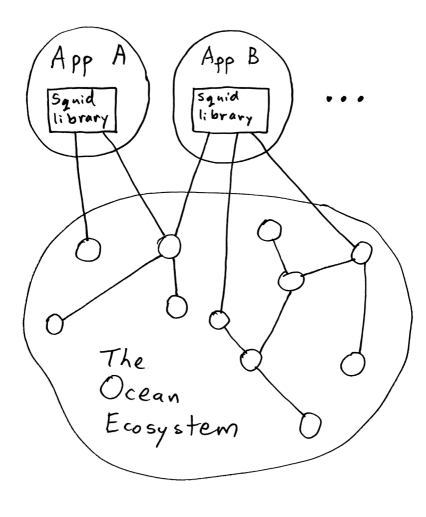

Before reading this page, you should understand some [Ocean-specific terminology](/concepts/terminology/).

## Aquarius

Marketplaces run Aquarius to store and manage metadata about the data assets available in their marketplace. It provides an HTTP API for interacting with an off-chain database ([OceanDB](/concepts/components/#oceandb-drivers)).

<repo name="aquarius"></repo>

## Brizo

Publishers run Brizo to manage interactions with marketplaces and consumers.
It interacts with the publisher's cloud and/or on-premise infrastructure.
The most basic scenario for a publisher is to provide access to the assets the publisher owns or manages, but [Brizo can do much more](/concepts/architecture/#brizo).

<repo name="brizo"></repo>

## Keeper

A computer running a blockchain client
(such as [Parity Ethereum](https://www.parity.io/ethereum/))
where the associated blockchain network is running the Ocean Protocol
[💧 keeper-contracts](https://github.com/oceanprotocol/keeper-contracts)
(smart contracts).

<repo name="keeper-contracts"></repo>

See also: [Run a Keeper](/setup/keeper/)

## Pleuston

An example marketplace front-end for consumers to explore, download, and publish data assets within the Ocean Protocol network. Implemented using [React](https://reactjs.org/) and [🦑 squid-js](https://github.com/oceanprotocol/squid-js).

<repo name="pleuston"></repo>

## Squid Libraries

Client libraries used by applications (such as Pleuston or Jupyter notebooks) to interact with Ocean components, including Keepers, Aquarius nodes, Brizo nodes, etc.

<repo name="squid-js"></repo>
<repo name="squid-py"></repo>
<repo name="squid-java"></repo>

## OceanDB Drivers

OceanDB is an off-chain database for storing metadata about data assets.

<repo name="oceandb-mongodb-driver"></repo>
<repo name="oceandb-bigchaindb-driver"></repo>
<repo name="oceandb-elasticsearch-driver"></repo>

These drivers are extended from a high-level module implementing OceanDB functions. You can create your own plugins based on its abstracted interface:

<repo name="oceandb-driver-interface"></repo>

## Secret Store

A [Parity Secret Store](https://wiki.parity.io/Secret-Store): software for distributed key pair generation, distributed key storage, and threshold retrieval. It's used to store asset access-control keys.

There are several clients for integrating the Parity Secret Store into Ocean:

<repo name="secret-store-client-js"></repo>
<repo name="secret-store-client-py"></repo>
<repo name="secret-store-client-java"></repo>
