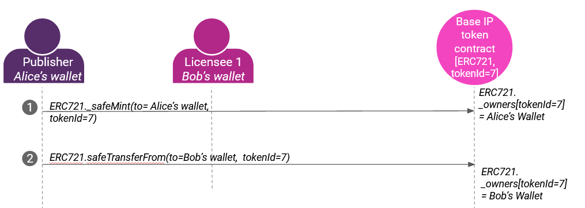

A non-fungible token stored on the blockchain represents a unique asset. NFTs can represent images, videos, digital art, or any piece of information. NFTs can be traded and allow transfer of ownership and copyright. [EIP-721](https://eips.ethereum.org/EIPS/eip-721) defines an interface for handling NFTs on Ethereum blockchain. The creator of the NFT can deploy a new contract on Ethereum or any Blockchain supporting NFT related interface and also, transfer the ownership through transfer transactions.

## Terminology

- **Base IP** means the artifact being copyrighted. Represented by the {ERC721 address, tokenId} from the publish transactions.
- **Base IP holder** means the holder of the Base IP. Represented as the the actor that did the initial "publish" action.
- **Sub-licensee** is the holder of the sub-license. Represented as the entity that controls address ERC721.\_owners[tokenId=x].
- **To Publish**: Claim copyright or exclusive base license
- **To Sub-license**:Transfer one (of many) sub-licenses to new licensee: ERC20.transfer(to=licensee, value=1.0)

## Supporting NFTs using Ocean Protocol

Ocean Protocol defines the [ERC721Factory](https://github.com/oceanprotocol/contracts/blob/v4main/contracts/ERC721Factory.sol) contract, allowing **Base IP holders** to create their ERC721 contract instances on any supported networks. The deployed contract stores Metadata, ownership, sub-license information, permissions. The creator of the contract can also create and mint ERC20 token instances for sub-licensing the **Base IP**.

## Sub-licensing the Base IP

ERC721 tokens are non-fungible, thus cannot be used for automatic price discovery like ERC20 tokens. ERC721 and ERC20 combined together can be used for sub-licensing. Ocean Protocol's [ERC721Template](https://github.com/oceanprotocol/contracts/blob/v4main/contracts/templates/ERC721Template.sol) solves this problem by using ERC721 for tokenizing the **Base IP** and tokenizing sub-licenses by using ERC20. Thus, sub-licenses can be traded on any AMM as the underlying contract is ERC20 compliant.

## Roles

[ERC721Template](https://github.com/oceanprotocol/contracts/blob/v4Hardhat/contracts/templates/ERC721Template.sol) contract defines following roles:

### NFT Owner

- NFT Owner is the publisher. I.e. Owner is a public address which transacted with `ERC721Factory` contract and deployed a new `ERC721` contract.
- NFT Owner can assign managers while deploying the contract.
- NFT Owner is also added to the Managers.
- NFT Owner can add/remove Managers.
- Clean all permissions

### Manager

- A public address with a `Magner` role can update the metadata
- Can deploy new ERC20 contract which is associtated with the `ERC721` contract.

## Use case 1

Alice is the creator of a painting and wants to make sure that the ownership of her artwork is uniquely determined. She performs the **Publish** action. She creates an ERC721 token which represents the ownership of the physical asset. Here, **Base IP** is Alice's artwork. **Base IP holder** is Alice. Now, Alice wants to transfer the ownership of her Artwork to Bob. So, Alice makes Bob's address as owner of the token in the discussion by sending a Blockchain transaction.

## Use case 2

Alice is the author of a book. Alice wants to hold the copyright of her work but, allows others to read her book. So, She creates 2 versions of her book namely: digital copy, physical copy. She assigns Bob as one of the holder of digital edition of the book. Here, **Base IP** is the book. **Base IP holder** is Alice and Bob is **Sub-licensee** for a digital edition of the book. Alice tokenizes her work by performing **Publish** action i.e _ERC721.safeMint(to=aliceWalletAddress, tokenid=1)_. Alice also creates sub-licenses of her book by creating two ERC20 tokens and transfers the digital copy token to Bob's wallet.

## Other References

- [Practical Connections of ERC721 with Intellectual Property](https://blog.oceanprotocol.com/nfts-ip-1-practical-connections-of-erc721-with-intellectual-property-dc216aaf005d)
- [Leveraging ERC20 Fungibility](https://blog.oceanprotocol.com/nfts-ip-2-leveraging-erc20-fungibility-bcee162290e3)
- [Combining ERC721 & ERC20](https://blog.oceanprotocol.com/nfts-ip-3-combining-erc721-erc20-b69ea659115e)
- [Fungibility sightings in NFTs](https://blog.oceanprotocol.com/on-difficult-to-explain-fungibility-sightings-in-nfts-26bc18620f70)
