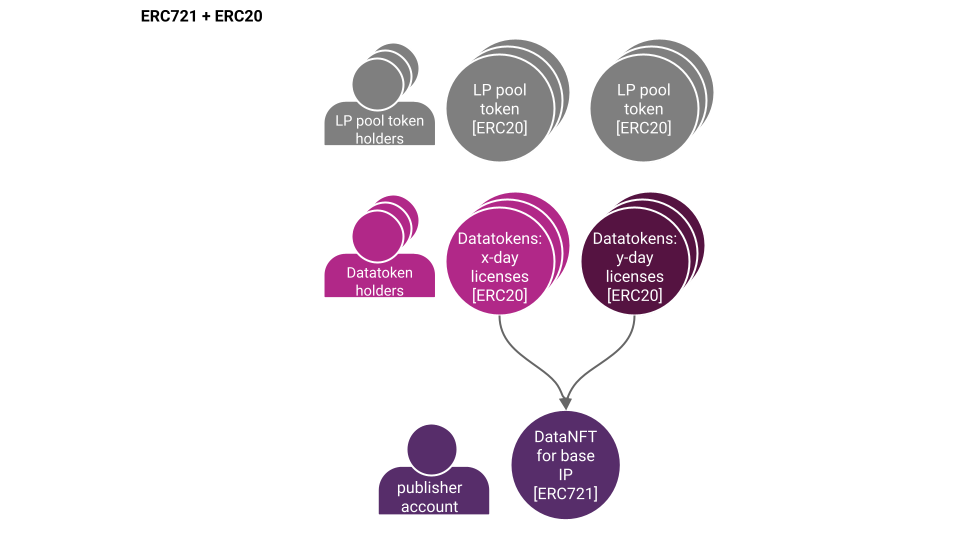
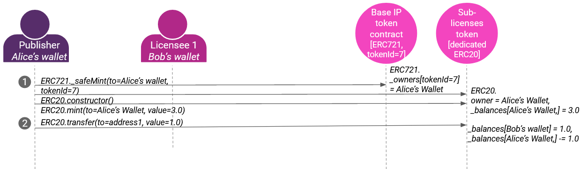

A non-fungible token stored on the blockchain represents a unique asset. NFTs can represent images, videos, digital art, or any piece of information. NFTs can be traded, and allow transfer of copyright/base IP. [EIP-721](https://eips.ethereum.org/EIPS/eip-721) defines an interface for handling NFTs on EVM-compatible blockchains. The creator of the NFT can deploy a new contract on Ethereum or any Blockchain supporting NFT related interface and also, transfer the ownership of copyright/base IP through transfer transactions.

Fungible tokens represent fungible assets. If you have 5 ETH and Alice has 5 ETH, you and Alice could swap your ETH and your final holdings remain the same. They're apples-to-apples. Licenses (contracts) to access a copyrighted asset are naturally fungible - they can be swapped with each other.

## High-Level Architecture

The image above describes how ERC721 data NFTs, ERC20 datatokens, and AMMs relate.

- Bottom: The publisher deploys an ERC721 data NFT contract representing the base IP for the data asset. They are now the manager of the data NFT.
- Middle: The manager then deploys an ERC20 datatoken contract against the data NFT. The ERC20 represents a license with specific terms like "can download for the next 3 days". They could even publish further ERC20 datatoken contracts, to represent different license terms or for compute-to-data.
- Top: The manager then deploys a pool of the datatoken and OCEAN (or H2O), adds initial liquidity, and receives ERC20 pool tokens in return. Others may also add liquidity to receive pool tokens, i.e. become liquidity providers (LPs).

## Terminology

- **Base IP** means the artifact being copyrighted. Represented by the {ERC721 address, tokenId} from the publish transactions.
- **Base IP holder** means the holder of the Base IP. Represented as the actor that did the initial "publish" action.
- **Sub-licensee** is the holder of the sub-license. Represented as the entity that controls address ERC721.\_owners[tokenId=x].
- **To Publish**: Claim copyright or exclusive base license.
- **To Sub-license**: Transfer one (of many) sub-licenses to new licensee: ERC20.transfer(to=licensee, value=1.0).

## Implementation in Ocean Protocol

Ocean Protocol defines the [ERC721Factory](https://github.com/oceanprotocol/contracts/blob/v4main/contracts/ERC721Factory.sol) contract, allowing **Base IP holders** to create their ERC721 contract instances on any supported networks. The deployed contract stores Metadata, ownership, sub-license information, permissions. The contract creator can also create and mint ERC20 token instances for sub-licensing the **Base IP**.

ERC721 tokens are non-fungible, thus cannot be used for automatic price discovery like ERC20 tokens. ERC721 and ERC20 combined together can be used for sub-licensing. Ocean Protocol's [ERC721Template](https://github.com/oceanprotocol/contracts/blob/v4main/contracts/templates/ERC721Template.sol) solves this problem by using ERC721 for tokenizing the **Base IP** and tokenizing sub-licenses by using ERC20. Thus, sub-licenses can be traded on any AMM as the underlying contract is ERC20 compliant.

## High-Level Behavior

Here's an example.

- In step 1, Alice **publishes** her dataset with Ocean: this means deploying an ERC721 data NFT contract (claiming copyright/base IP), then an ERC20 datatoken contract (license against base IP).
- In step 2, she **mints** some ERC20 datatokens and **transfers** 1.0 of them to Bob's wallet; now he has a license to be able to download that dataset.

## Other References

- [Data & NFTs 1: Practical Connections of ERC721 with Intellectual Property](https://blog.oceanprotocol.com/nfts-ip-1-practical-connections-of-erc721-with-intellectual-property-dc216aaf005d)
- [Data & NFTs 2: Leveraging ERC20 Fungibility](https://blog.oceanprotocol.com/nfts-ip-2-leveraging-erc20-fungibility-bcee162290e3)
- [Data & NFTs 3: Combining ERC721 & ERC20](https://blog.oceanprotocol.com/nfts-ip-3-combining-erc721-erc20-b69ea659115e)
- [Fungibility sightings in NFTs](https://blog.oceanprotocol.com/on-difficult-to-explain-fungibility-sightings-in-nfts-26bc18620f70)
