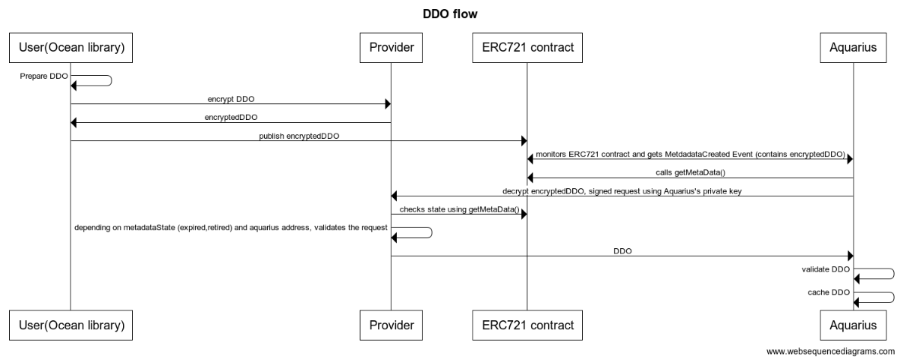

**v4.0.0**

## Overview

This document describes how Ocean assets follow the DID/DDO spec, such that Ocean assets can inherit DID/DDO benefits and enhance interoperability.

Decentralized identifiers (DIDs) are a type of identifier that enables verifiable, decentralized digital identity. Each DID is associated with a unique entity. DIDs may represent humans, objects, and more.

A DID Document (DDO) is JSON blob that holds information about the DID. Given a DID, a _resolver_ will return the DDO of that DID.

If a DID is the index key in a key-value pair, then the DID Document is the value to which the index key points. The combination of a DID and its associated DID Document forms the root record for a decentralized identifier.

DIDs and DDOs follow the [specification defined by the World Wide Web Consortium (W3C)](https://w3c-ccg.github.io/did-spec/).

## Rules for DIDs & DDOs

An _asset_ in Ocean represents a downloadable file, compute service, or similar. Each asset is a _resource_ under control of a _publisher_. The Ocean network itself does _not_ store the actual resource (e.g. files).

An _asset_ should have a DID and DDO. The DDO should include [metadata](#metadata) about the asset, and define access in at least one [service](#services). The DDO can only can be modified by _owners_ or _delegated users_.

There _must_ be at least one client library acting as _resolver_, to get a DDO from a DID. A metadata cache like Aquarius can help in reading and searching through DDO data from the chain.

## State

Each asset has a state, which is held by the NFT contract. The possible states are:

- `0` = active
- `1` = end-of-life
- `2` = deprecated (by another asset)
- `3` = revoked by publisher

## Publishing & Retrieving DDOs

The DDO is stored on-chain as part of the NFT contract and it is stored encrypted using the private key of the _Provider_. To resolve it, a metadata cache like _Aquarius_ must query the provider to decrypt the DDO.

Here is the complete flow:



```text
title DDO flow

User(Ocean library) -> User(Ocean library): Prepare DDO
User(Ocean library) -> Provider: encrypt DDO
Provider -> User(Ocean library): encryptedDDO
User(Ocean library) -> ERC721 contract: publish encryptedDDO
Aquarius <-> ERC721 contract: monitors ERC721 contract and gets MetdadataCreated Event (contains encryptedDDO)
Aquarius -> ERC721 contract: calls getMetaData()
Aquarius -> Provider: decrypt encryptedDDO, signed request using Aquarius's private key
Provider -> ERC721 contract: checks state using getMetaData()
Provider -> Provider: depending on metadataState (expired,retired) and aquarius address, validates the request
Provider -> Aquarius: DDO
Aquarius -> Aquarius : validate DDO
Aquarius -> Aquarius : cache DDO
Aquarius -> Aquarius : enhance cached DDO in response with additional infos like `events` & `stats`
```

## DID Structure

In Ocean, a DID is a string that looks like:

```text
did:op:0ebed8226ada17fde24b6bf2b95d27f8f05fcce09139ff5cec31f6d81a7cd2ea
```

where

```text
0ebed8226ada17fde24b6bf2b95d27f8f05fcce09139ff5cec31f6d81a7cd2ea` = sha256(ERC721 contract address + chainId)
```

It follows [the generic DID scheme](https://w3c-ccg.github.io/did-spec/#the-generic-did-scheme).

## DDO Attributes

A DDO in Ocean has these required attributes:

| Attribute            | Type                        | Description                                                                                    |
| -------------------- | --------------------------- | ---------------------------------------------------------------------------------------------- |
| **`@context`**       | Array of `string`           | Contexts used for validation.                                                                  |
| **`id`**             | `string`                    | Computed as `sha256(address of ERC721 contract + chainId)`.                                    |
| **`version`**        | `string`                    | Version information referring to this DDO spec version, like `4.0.0`.                          |
| **`chainId`**        | `number`                    | Stores chainId of the network the DDO was published to.                                        |
| **`created`**        | `ISO Date Time string`      | Contains the date of publishing in ISO Date Time Format, e.g. `2000-10-31T01:30:00`.           |
| **`updated`**        | `ISO Date Time string`      | Contains the the date of last update in ISO Date Time Format, e.g. `2000-10-31T01:30:00`.      |
| **`services`**       | [Services](#services)       | Stores an array of services defining access to the asset.                                      |
| **`files`**          | [Files](#files)             | Stores information about the asset's files.                                                    |
| **`encryptedFiles`** | [Files](#files)             | Added after publishing.                                                                        |
| **`credentials`**    | [Credentials](#credentials) | Describes the credentials needed to access a dataset in addition to the `services` definition. |

## Metadata

This object holds information describing the actual actual asset.

| Attribute                   | Type            | Required | Description                                                                                                                                                                                       |
| --------------------------- | --------------- | -------- | ------------------------------------------------------------------------------------------------------------------------------------------------------------------------------------------------- |
| **`description`**           | Text            | **Yes**  | Details of what the resource is. For a dataset, this attribute explains what the data represents and what it can be used for.                                                                     |
| **`copyrightHolder`**       | Text            | No       | The party holding the legal copyright. Empty by default.                                                                                                                                          |
| **`name`**                  | Text            | **Yes**  | Descriptive name or title of the asset.                                                                                                                                                           |
| **`type`**                  | Text            | **Yes**  | Asset type. Includes `"dataset"` (e.g. csv file), `"algorithm"` (e.g. Python script). Each type needs a different subset of metadata attributes.                                                  |
| **`author`**                | Text            | **Yes**  | Name of the entity generating this data (e.g. Tfl, Disney Corp, etc.).                                                                                                                            |
| **`license`**               | Text            | **Yes**  | Short name referencing the license of the asset (e.g. Public Domain, CC-0, CC-BY, No License Specified, etc. ). If it's not specified, the following value will be added: "No License Specified". |
| **`links`**                 | Array of string | No       | Mapping of URL strings for data samples, or links to find out more information. Links may be to either a URL or another asset.                                                                    |
| **`contentLanguage`**       | Text            | No       | The language of the content. Please use one of the language codes from the [IETF BCP 47 standard](https://tools.ietf.org/html/bcp47)                                                              |
| **`categories`**            | Array of Text   | No       | Optional array of categories associated to the asset. Note: recommended to use `"tags"` instead of this.                                                                                          |
| **`tags`**                  | Array of Text   | No       | Array of keywords or tags used to describe this content. Empty by default.                                                                                                                        |
| **`additionalInformation`** | Object          | No       | Stores additional information, this is customizable by publisher                                                                                                                                  |

Example:

```json
{
  "metadata": {
    "description": "Sample description",
    "name": "Sample asset",
    "type": "dataset",
    "author": "OPF",
    "license": "https://market.oceanprotocol.com/terms"
  }
}
```

### Algorithm Metadata

An asset of type `algorithm` has the following additional attributes under `algorithm` within the `metadata` object:

| Attribute       | Type        | Required | Description                                             |
| --------------- | ----------- | -------- | ------------------------------------------------------- |
| **`language`**  | `string`    | no       | Language used to implement the software                 |
| **`version`**   | `string`    | no       | Version of the software.                                |
| **`container`** | `container` | yes      | Object describing the Docker container image. See below |

The `container` object has the following attributes defining the Docker image the algorithm needs to run:

| Attribute        | Type     | Required | Description                                                       |
| ---------------- | -------- | -------- | ----------------------------------------------------------------- |
| **`entrypoint`** | `string` | yes      | The command to execute, or script to run inside the Docker image. |
| **`image`**      | `string` | yes      | Name of the Docker image.                                         |
| **`tag`**        | `string` | yes      | Tag of the Docker image.                                          |
| **`checksum`**   | `string` | yes      | Checksum of the Docker image.                                     |

## Services

Services define the access to the asset.

| Attribute              | Type                  | Required                   | Description                                                                                                                                |
| ---------------------- | --------------------- | -------------------------- | ------------------------------------------------------------------------------------------------------------------------------------------ |
| **`type`**             | Text                  | **Yes**                    | Type of service (access, compute, wss, etc                                                                                                 |
| **`name`**             | Text                  | No                         | Service friendly name                                                                                                                      |
| **`description`**      | Text                  | No                         | Service description                                                                                                                        |
| **`datatokenAddress`** | Text                  | Yes                        | Datatoken address                                                                                                                          |
| **`providerEndpoint`** | Text                  | **Yes**                    | Provider URI                                                                                                                               |
| **`timeout`**          | Number                | **Yes**                    | describing how long the service can be used after consumption is initiated. A timeout of 0 represents no time limit. Expressed in seconds. |
| **`files`**            | Array of files object | **Yes**                    | Array of `File` objects for publishing. These will be transformed to `encryptedFiles` during publish process. See [Files](#files)          |
| **`privacy`**          | Object                | **Yes for compute assets** | If asset is of compute `type`, holds information about the compute-related privacy settings.                                               |

### Compute Privacy

An asset with a service of `type` `compute` has the following additional attributes under the `privacy` object. This object is required if the asset is of `type` `compute`, but can be omitted for `type` of `access`.

| Attribute                                  | Type                                  | Required | Description                                                                                                        |
| ------------------------------------------ | ------------------------------------- | -------- | ------------------------------------------------------------------------------------------------------------------ |
| **`allowRawAlgorithm`**                    | `boolean`                             | yes      | If `true`, a drag & drop algorithm can be run                                                                      |
| **`allowNetworkAccess`**                   | `boolean`                             | yes      | If `true`, the algorithm job will have network access (still WIP)                                                  |
| **`publisherTrustedAlgorithmPublishers `** | Array of `String`                     | yes      | If Empty , then any published algo is allowed. Otherwise, only published algorithms by some publishers are allowed |
| **`publisherTrustedAlgorithms `**          | Array of `publisherTrustedAlgorithms` | yes      | If Empty , then any published algo is allowed. (see below)                                                         |

The `publisherTrustedAlgorithms ` is an array of objects with the following structure:

| Attribute                      | Type     | Required | Description                                                    |
| ------------------------------ | -------- | -------- | -------------------------------------------------------------- |
| **`did`**                      | `string` | yes      | The DID of the algorithm which is trusted by the publisher.    |
| **`filesChecksum`**            | `string` | yes      | Hash of algorithm's encryptedFiles + files section (as string) |
| **`containerSectionChecksum`** | `string` | yes      | Hash of the algorithm container section (as string)            |

To produce `filesChecksum`:

```js
sha256(
  algorithm_ddo.metadata.encryptedFiles +
    JSON.Stringify(algorithm_ddo.metadata.files)
)
```

To produce `containerSectionChecksum`:

```js
sha256(JSON.Stringify(algorithm_ddo.metadata.algorithm.container))
```

Example:

```json
{
  "services": [
    {
      "type": "access",
      "name": "Download service",
      "description": "Download service",
      "datatokenAddress": "0x123",
      "providerEndpoint": "https://myprovider",
      "timeout": 0
    },
    {
      "type": "compute",
      "name": "Compute service",
      "description": "Compute service",
      "datatokenAddress": "0x124",
      "providerEndpoint": "https://myprovider",
      "timeout": 0,
      "privacy": {
        "allowRawAlgorithm": false,
        "allowNetworkAccess": true,
        "publisherTrustedAlgorithmPublishers": ["0x234", "0x235"],
        "publisherTrustedAlgorithms": [
          {
            "did": "did:op:123",
            "filesChecksum": "100",
            "containerSectionChecksum": "200"
          },
          {
            "did": "did:op:124",
            "filesChecksum": "110",
            "containerSectionChecksum": "210"
          }
        ]
      }
    }
  ]
}
```

## Files

The `files` section contains a `file` object (that contains a list of `file` objects) and a `encryptedFiles` string which contains the encrypted urls

Each `file` object has the following attributes, with the details necessary to consume and validate the data.

| Attribute            | Required | Description                                                                                                                                                                              |
| -------------------- | -------- | ---------------------------------------------------------------------------------------------------------------------------------------------------------------------------------------- |
| **`contentType`**    | **Yes**  | File format.                                                                                                                                                                             |
| **`url`**            | Local    | Content URL. Omitted from the remote metadata. Supports `http(s)://` and `ipfs://` URLs.                                                                                                 |
| **`name`**           | No       | File name.                                                                                                                                                                               |
| **`checksum`**       | No       | Checksum of the file using your preferred format (i.e. MD5). Format specified in `checksumType`. If it's not provided can't be validated if the file was not modified after registering. |
| **`checksumType`**   | No       | Format of the provided checksum. Can vary according to server (i.e Amazon vs. Azure)                                                                                                     |
| **`contentLength`**  | No       | Size of the file in bytes.                                                                                                                                                               |
| **`encoding`**       | No       | File encoding (e.g. UTF-8).                                                                                                                                                              |
| **`compression`**    | No       | File compression (e.g. no, gzip, bzip2, etc).                                                                                                                                            |
| **`encrypted`**      | No       | Boolean. Is the file encrypted? If is not set is assumed the file is not encrypted                                                                                                       |
| **`encryptionMode`** | No       | Encryption mode used. Just valid if `encrypted=true`                                                                                                                                     |
| **`resourceId`**     | No       | Remote identifier of the file in the external provider. It is typically the remote id in the cloud provider.                                                                             |
| **`attributes`**     | No       | Key-Value hash map with additional attributes describing the asset file. It could include details like the Amazon S3 bucket, region, etc.                                                |

Example:

```json
{
  "files": {
    "files": [
      {
        "url": "https://demo.com/file.csv"
      }
    ],
    "encryptedFiles": "0x044736da6dae39889ff570c34540f24e5e084f4e5bd81eff3691b729c2dd1465ae8292fc721e9d4b1f10f56ce12036c9d149a4dab454b0795bd3ef8b7722c6001e0becdad5caeb2005859642284ef6a546c7ed76f8b350480691f0f6c6dfdda6c1e4d50ee90e83ce3cb3ca0a1a5a2544e10daa6637893f4276bb8d7301eb35306ece50f61ca34dcab550b48181ec81673953d4eaa4b5f19a45c0e9db4cd9729696f16dd05e0edb460623c843a263291ebe757c1eb3435bb529cc19023e0f49db66ef781ca692655992ea2ca7351ac2882bf340c9d9cb523b0cbcd483731dc03f6251597856afa9a68a1e0da698cfc8e81824a69d92b108023666ee35de4a229ad7e1cfa9be9946db2d909735"
  }
}
```

## Credentials

By default, a consumer can access a resource if they have 1.0 datatokens. _Credentials_ allow the publisher to optionally specify finer-grained permissions.

Consider a medical data use case, where only a credentialed EU researcher can legally access a given dataset. Ocean supports this as follows: a consumer can only access the resource if they have 1.0 datatokens _and_ one of the specified `"allow"` credentials.

This is like going to an R-rated movie, where you can only get in if you show both your movie ticket (datatoken) _and_ some some id showing you're old enough (credential).

Only credentials that can be proven are supported. This includes Ethereum public addresses, and (in the future) [W3C Verifiable Credentials](https://www.w3.org/TR/vc-data-model/) and more.

Ocean also supports `"deny"` credentials: if a consumer has any of these credentials, they can not access the resource.

Here's an example object with both `"allow"` and `"deny"` entries:

```json
{
  "credentials": {
    "allow": [
      {
        "type": "address",
        "values": ["0x123", "0x456"]
      }
    ],
    "deny": [
      {
        "type": "address",
        "values": ["0x2222", "0x333"]
      }
    ]
  }
}
```

For future usage, we can extend that with different credentials types.

Example:

```json
{
  "type": "credential3Box",
  "values": ["profile1", "profile2"]
}
```

## DDO Hash

In order to ensure the integrity of the DDO, a hash is computed for each DDO:

```js
const hash = sha256(JSON.stringify(DDO))
```

The hash is used when publishing/update metadata using `setMetaData` function in the ERC721 contract, and is stored in the event generated by the ERC721 contract:

```solidity
event MetadataCreated(
       address indexed createdBy,
       uint8 state,
       string decryptorUrl,
       bytes flags,
       bytes data,
       bytes metaDataHash,
       uint256 timestamp,
       uint256 blockNumber
   );

event MetadataUpdated(
       address indexed updatedBy,
       uint8 state,
       string decryptorUrl,
       bytes flags,
       bytes data,
       bytes metaDataHash,
       uint256 timestamp,
       uint256 blockNumber
   );
```

_Aquarius_ should always check the hash after data is decrypted via a _Provider_ API call, in order to ensure DDO integrity.

## Aquarius Enhanced DDO Response

The following fields are added by _Aquarius_ in its DDO response for convenience reasons. These are never stored on-chain, and are never taken into consideration when [hashing the DDO](#ddo-hash).

### NFT

The `nft` object contains information about the NFT contract which represents the intellectual property of the publisher.

| Attribute     | Type     | Description                                   |
| ------------- | -------- | --------------------------------------------- |
| **`address`** | `string` | Contract address of the deployed NFT contract |
| **`name`**    | `string` | Name of NFT set in contract                   |
| **`symbol`**  | `string` | Symbol of NFT set in contract                 |
| **`owner`**   | `string` | ETH account address of the NFT owner          |

Example:

```json
{
  "nft": {
    "adddress": "0x000000",
    "name": "Ocean Protocol Asset v4",
    "symbol": "OCEAN-A-v4",
    "owner": "0x0000000"
  }
}
```

### Status

The `status` object contains attributes for marketplaces to implement various visibility states for an asset.

| Attribute             | Type      | Description                                                               |
| --------------------- | --------- | ------------------------------------------------------------------------- |
| **`state`**           | `number`  | State of the asset reflecting the NFT contract value. See [State](#state) |
| **`isListed`**        | `boolean` | If this asset should be displayed                                         |
| **`isOrderDisabled`** | `boolean` | If this asset has ordering disabled                                       |

Example:

```json
{
  "status": {
    "state": 0,
    "isListed": true,
    "isOrderDisabled": false
  }
}
```

### Events

The `events` section contains information about the transactions that created or updated the DDO which can be useful for displaying a metadata history for provenance reasons.

Example:

```json
{
  "events": [
    {
      "txid": "0x8d127de58509be5dfac600792ad24cc9164921571d168bff2f123c7f1cb4b11c",
      "blockNo": 12831214,
      "from": "0xAcca11dbeD4F863Bb3bC2336D3CE5BAC52aa1f83",
      "contract": "0x1a4b70d8c9DcA47cD6D0Fb3c52BB8634CA1C0Fdf",
      "update": false,
      "chainId": 1
    }
  ]
}
```

### Statistics

The `stats` section contains different statistics fields.

| Attribute      | Type     | Description                                                                                                   |
| -------------- | -------- | ------------------------------------------------------------------------------------------------------------- |
| **`consumes`** | `number` | How often an asset was consumed, meaning how often it was either downloaded or used as part of a compute job. |

Example:

```json
{
  "stats": {
    "consumes": 4
  }
}
```

## Full Enhanced DDO Example:

```json
{
  "@context": ["https://w3id.org/did/v1"],
  "id": "did:op:ACce67694eD2848dd683c651Dab7Af823b7dd123",
  "created": "2020-11-15T12:27:48Z",
  "updated": "2021-05-17T21:58:02Z",
  "version": "4.0.0",
  "chainId": 1,
  "metadata": {
    "description": "Sample description",
    "name": "Sample asset",
    "type": "dataset",
    "author": "OPF",
    "license": "https://market.oceanprotocol.com/terms"
  },
  "files": {
    "files": [
      {
        "url": "https://demo.com/file.csv"
      }
    ],
    "encryptedFiles": "0x044736da6dae39889ff570c34540f24e5e084f4e5bd81eff3691b729c2dd1465ae8292fc721e9d4b1f10f56ce12036c9d149a4dab454b0795bd3ef8b7722c6001e0becdad5caeb2005859642284ef6a546c7ed76f8b350480691f0f6c6dfdda6c1e4d50ee90e83ce3cb3ca0a1a5a2544e10daa6637893f4276bb8d7301eb35306ece50f61ca34dcab550b48181ec81673953d4eaa4b5f19a45c0e9db4cd9729696f16dd05e0edb460623c843a263291ebe757c1eb3435bb529cc19023e0f49db66ef781ca692655992ea2ca7351ac2882bf340c9d9cb523b0cbcd483731dc03f6251597856afa9a68a1e0da698cfc8e81824a69d92b108023666ee35de4a229ad7e1cfa9be9946db2d909735"
  },
  "services": [
    {
      "type": "access",
      "name": "Download service",
      "description": "Download service",
      "datatokenAddress": "0x123",
      "providerEndpoint": "https://myprovider.com",
      "timeout": 0
    }
  ],
  "credentials": {
    "allow": [
      {
        "type": "address",
        "values": ["0x123", "0x456"]
      }
    ],
    "deny": [
      {
        "type": "address",
        "values": ["0x2222", "0x333"]
      }
    ]
  },

  // Enhanced Aquarius response begins here
  "nft": {
    "adddress": "0x000000",
    "name": "Ocean Protocol Asset v4",
    "symbol": "OCEAN-A-v4",
    "owner": "0x0000000"
  },
  "status": {
    "state": 0,
    "isListed": true,
    "isOrderDisabled": false
  },
  "events": [
    {
      "txid": "0x8d127de58509be5dfac600792ad24cc9164921571d168bff2f123c7f1cb4b11c",
      "blockNo": 12831214,
      "from": "0xAcca11dbeD4F863Bb3bC2336D3CE5BAC52aa1f83",
      "contract": "0x1a4b70d8c9DcA47cD6D0Fb3c52BB8634CA1C0Fdf",
      "update": false,
      "chainId": 1
    }
  ],
  "stats": {
    "consumes": 4
  }
}
```
