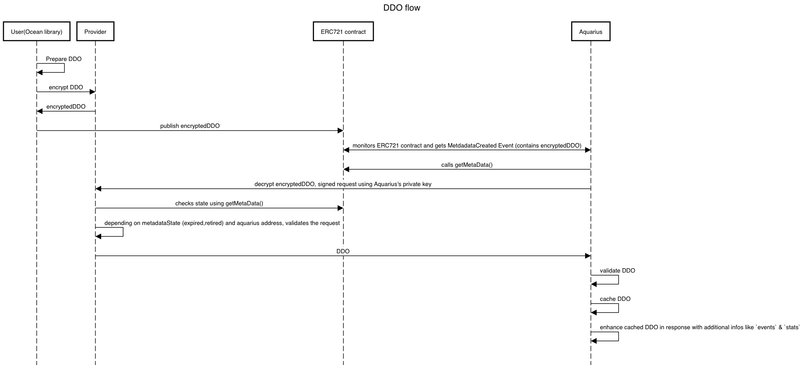

**v4.1.0**

## Overview

This document describes how Ocean assets follow the DID/DDO specification, such that Ocean assets can inherit DID/DDO benefits and enhance interoperability. DIDs and DDOs follow the [specification defined by the World Wide Web Consortium (W3C)](https://w3c-ccg.github.io/did-spec/).

Decentralized identifiers (DIDs) are a type of identifier that enable verifiable, decentralized digital identity. Each DID is associated with a unique entity, and DIDs may represent humans, objects, and more.

A DID Document (DDO) is a JSON blob that holds information about the DID. Given a DID, a _resolver_ will return the DDO of that DID.

## Rules for DID & DDO

An _asset_ in Ocean represents a downloadable file, compute service, or similar. Each asset is a _resource_ under the control of a _publisher_. The Ocean network itself does _not_ store the actual resource (e.g. files).

An _asset_ has a DID and DDO. The DDO should include [metadata](#metadata) about the asset, and define access in at least one [service](#services). Only _owners_ or _delegated users_ can modify the DDO.

All DDOs are stored on-chain in encrypted form to be fully GDPR-compatible. A metadata cache like _Aquarius_ can help in reading, decrypting, and searching through encrypted DDO data from the chain. Because the file URLs are encrypted on top of the full DDO encryption, returning unencrypted DDOs e.g. via an API is safe to do as the file URLs will still stay encrypted.

## Publishing & Retrieving DDOs

The DDO is stored on-chain as part of the NFT contract and stored in encrypted form using the private key of the _Provider_. To resolve it, a metadata cache like _Aquarius_ must query the provider to decrypt the DDO.

Here is the flow:



<details>
  <summary>UML source</summary>

```text
title DDO flow

User(Ocean library) -> User(Ocean library): Prepare DDO
User(Ocean library) -> Provider: encrypt DDO
Provider -> User(Ocean library): encryptedDDO
User(Ocean library) -> ERC721 contract: publish encryptedDDO
Aquarius <-> ERC721 contract: monitors ERC721 contract and gets MetdadataCreated Event (contains encryptedDDO)
Aquarius -> ERC721 contract: calls getMetaData()
Aquarius -> Provider: decrypt encryptedDDO, signed request using Aquarius's private key
Provider -> ERC721 contract: checks state using getMetaData()
Provider -> Provider: depending on metadataState (expired,retired) and aquarius address, validates the request
Provider -> Aquarius: DDO
Aquarius -> Aquarius : validate DDO
Aquarius -> Aquarius : cache DDO
Aquarius -> Aquarius : enhance cached DDO in response with additional infos like events & stats
```

</details>

## DID

In Ocean, a DID is a string that looks like this:

```text
did:op:0ebed8226ada17fde24b6bf2b95d27f8f05fcce09139ff5cec31f6d81a7cd2ea
```

The part after `did:op:` is the ERC721 contract address(in checksum format) and the chainId (expressed as a decimal) the asset has been published to:

```js
const checksum = sha256(ERC721 contract address + chainId)
console.log(checksum)
// 0ebed8226ada17fde24b6bf2b95d27f8f05fcce09139ff5cec31f6d81a7cd2ea
```

It follows [the generic DID scheme](https://w3c-ccg.github.io/did-spec/#the-generic-did-scheme).

## DDO

A DDO in Ocean has these required attributes:

| Attribute         | Type                        | Description                                                                                                    |
| ----------------- | --------------------------- | -------------------------------------------------------------------------------------------------------------- |
| **`@context`**    | Array of `string`           | Contexts used for validation.                                                                                  |
| **`id`**          | `string`                    | Computed as `sha256(address of ERC721 contract + chainId)`.                                                    |
| **`version`**     | `string`                    | Version information in [SemVer](https://semver.org) notation referring to this DDO spec version, like `4.1.0`. |
| **`chainId`**     | `number`                    | Stores chainId of the network the DDO was published to.                                                        |
| **`nftAddress`**  | `string`                    | NFT contract linked to this asset                                                                              |
| **`metadata`**    | [Metadata](#metadata)       | Stores an object describing the asset.                                                                         |
| **`services`**    | [Services](#services)       | Stores an array of services defining access to the asset.                                                      |
| **`credentials`** | [Credentials](#credentials) | Describes the credentials needed to access a dataset in addition to the `services` definition.                 |

### Metadata

This object holds information describing the actual asset.

| Attribute                   | Type                                      | Required                          | Description                                                                                                                                                                                       |
| --------------------------- | ----------------------------------------- | --------------------------------- | ------------------------------------------------------------------------------------------------------------------------------------------------------------------------------------------------- |
| **`created`**               | `ISO date/time string`                    |                                   | Contains the date of the creation of the dataset content in ISO 8601 format preferably with timezone designators, e.g. `2000-10-31T01:30:00Z`.                                                    |
| **`updated`**               | `ISO date/time string`                    |                                   | Contains the date of last update of the dataset content in ISO 8601 format preferably with timezone designators, e.g. `2000-10-31T01:30:00Z`.                                                     |
| **`description`**           | `string`                                  | **✓**                             | Details of what the resource is. For a dataset, this attribute explains what the data represents and what it can be used for.                                                                     |
| **`copyrightHolder`**       | `string`                                  |                                   | The party holding the legal copyright. Empty by default.                                                                                                                                          |
| **`name`**                  | `string`                                  | **✓**                             | Descriptive name or title of the asset.                                                                                                                                                           |
| **`type`**                  | `string`                                  | **✓**                             | Asset type. Includes `"dataset"` (e.g. csv file), `"algorithm"` (e.g. Python script). Each type needs a different subset of metadata attributes.                                                  |
| **`author`**                | `string`                                  | **✓**                             | Name of the entity generating this data (e.g. Tfl, Disney Corp, etc.).                                                                                                                            |
| **`license`**               | `string`                                  | **✓**                             | Short name referencing the license of the asset (e.g. Public Domain, CC-0, CC-BY, No License Specified, etc. ). If it's not specified, the following value will be added: "No License Specified". |
| **`links`**                 | Array of `string`                         |                                   | Mapping of URL strings for data samples, or links to find out more information. Links may be to either a URL or another asset.                                                                    |
| **`contentLanguage`**       | `string`                                  |                                   | The language of the content. Use one of the language codes from the [IETF BCP 47 standard](https://tools.ietf.org/html/bcp47)                                                                     |
| **`tags`**                  | Array of `string`                         |                                   | Array of keywords or tags used to describe this content. Empty by default.                                                                                                                        |
| **`categories`**            | Array of `string`                         |                                   | Array of categories associated to the asset. Note: recommended to use `tags` instead of this.                                                                                                     |
| **`additionalInformation`** | Object                                    |                                   | Stores additional information, this is customizable by publisher                                                                                                                                  |
| **`algorithm`**             | [Algorithm Metadata](#algorithm-metadata) | **✓** (for algorithm assets only) | Information about asset of `type` `algorithm`                                                                                                                                                     |

Example:

```json
{
  "metadata": {
    "created": "2020-11-15T12:27:48Z",
    "updated": "2021-05-17T21:58:02Z",
    "description": "Sample description",
    "name": "Sample asset",
    "type": "dataset",
    "author": "OPF",
    "license": "https://market.oceanprotocol.com/terms"
  }
}
```

#### Algorithm Metadata

An asset of type `algorithm` has additional attributes under `metadata.algorithm`, describing the algorithm and the Docker environment it is supposed to be run under.

| Attribute                | Type                                        | Required | Description                                                                                |
| ------------------------ | ------------------------------------------- | -------- | ------------------------------------------------------------------------------------------ |
| **`language`**           | `string`                                    |          | Language used to implement the software.                                                   |
| **`version`**            | `string`                                    |          | Version of the software preferably in [SemVer](https://semver.org) notation. E.g. `1.0.0`. |
| **`consumerParameters`** | [Consumer Parameters](#consumer-parameters) |          | An object that defines required consumer input before running the algorithm                 |
| **`container`**          | `container`                                 | **✓**    | Object describing the Docker container image. See below                                    |

The `container` object has the following attributes defining the Docker image for running the algorithm:

| Attribute        | Type     | Required | Description                                                       |
| ---------------- | -------- | -------- | ----------------------------------------------------------------- |
| **`entrypoint`** | `string` | **✓**    | The command to execute, or script to run inside the Docker image. |
| **`image`**      | `string` | **✓**    | Name of the Docker image.                                         |
| **`tag`**        | `string` | **✓**    | Tag of the Docker image.                                          |
| **`checksum`**   | `string` | **✓**    | Checksum of the Docker image.                                     |

```json
{
  "metadata": {
    "created": "2020-11-15T12:27:48Z",
    "updated": "2021-05-17T21:58:02Z",
    "description": "Sample description",
    "name": "Sample algorithm asset",
    "type": "algorithm",
    "author": "OPF",
    "license": "https://market.oceanprotocol.com/terms",
    "algorithm": {
      "language": "Node.js",
      "version": "1.0.0",
      "container": {
        "entrypoint": "node $ALGO",
        "image": "ubuntu",
        "tag": "latest",
        "checksum": "44e10daa6637893f4276bb8d7301eb35306ece50f61ca34dcab550"
      },
      "consumerParameters": {}
    }
  }
}
```

### Services

Services define the access for an asset, and each service is represented by its respective datatoken.

An asset should have at least one service to be actually accessible, and can have as many services which make sense for a specific use case.

| Attribute              | Type                        | Required                        | Description                                                                                                                                  |
| ---------------------- | --------------------------- | ------------------------------- | -------------------------------------------------------------------------------------------------------------------------------------------- |
| **`id`**               | `string`                    | **✓**                           | Unique ID                                                                                                                                    |
| **`type`**             | `string`                    | **✓**                           | Type of service (`access`, `compute`, `wss`, etc.                                                                                            |
| **`name`**             | `string`                    |                                 | Service friendly name                                                                                                                        |
| **`description`**      | `string`                    |                                 | Service description                                                                                                                          |
| **`datatokenAddress`** | `string`                    | **✓**                           | Datatoken address                                                                                                                            |
| **`serviceEndpoint`**  | `string`                    | **✓**                           | Provider URL (schema + host)                                                                                                                 |
| **`files`**            | [Files](#files)             | **✓**                           | Encrypted file URLs.                                                                                                                         |
| **`timeout`**          | `number`                    | **✓**                           | Describing how long the service can be used after consumption is initiated. A timeout of `0` represents no time limit. Expressed in seconds. |
| **`compute`**          | [Compute](#compute-options) | **✓** (for compute assets only) | If service is of `type` `compute`, holds information about the compute-related privacy settings & resources.                                 |
| **`consumerParameters`** | [Consumer Parameters](#consumer-parameters)    |          | An object the defines required consumer input before consuming the asset|
| **`additionalInformation`** | Object                                    |                                   | Stores additional information, this is customizable by publisher                                                         |


#### Files

The `files` field is returned as a `string` which holds the encrypted file URLs.

Example:

```json
{
  "files": "0x044736da6dae39889ff570c34540f24e5e084f4e5bd81eff3691b729c2dd1465ae8292fc721e9d4b1f10f56ce12036c9d149a4dab454b0795bd3ef8b7722c6001e0becdad5caeb2005859642284ef6a546c7ed76f8b350480691f0f6c6dfdda6c1e4d50ee90e83ce3cb3ca0a1a5a2544e10daa6637893f4276bb8d7301eb35306ece50f61ca34dcab550b48181ec81673953d4eaa4b5f19a45c0e9db4cd9729696f16dd05e0edb460623c843a263291ebe757c1eb3435bb529cc19023e0f49db66ef781ca692655992ea2ca7351ac2882bf340c9d9cb523b0cbcd483731dc03f6251597856afa9a68a1e0da698cfc8e81824a69d92b108023666ee35de4a229ad7e1cfa9be9946db2d909735"
}
```

During the publish process, file URLs must be encrypted with a respective _Provider_ API call before storing the DDO on-chain. For this, you need to send the following object to Provider:
```json
{
  "datatokenAddress":"0x1",
  "nftAddress": "0x2",
  "files": [
    ...
  ]
}
```
where "files" contains one or more storage objects.

Type of objects supported :

<table>
<tr>
<th>Type</th>
<th>Description</th>
<th>Example</th>
</tr>
<td><code>url</code></td>
<td>Static URL.  Contains url and HTTP method</td>
<td>

```json
[
  {
    "type": "url",
    "url": "https://url.com/file1.csv",
    "method": "GET",
    "headers":
      [
       {"Authorization": "Bearer 123"}, 
       {"APIKEY": "124"},
      ]
  }
]
```

</td>
</tr></table>

First class integrations supported in the future :

<table>
<tr>
<th>Type</th>
<th>Description</th>
<th>Example</th>
</tr>
<tr>
<td><code>ipfs</code></td><td>IPFS files</td>
<td>

```json
[
  {
    "type": "ipfs",
    "hash": "XXX"
  }
]
```

</td>

<tr><td><code>filecoin</code></td><td>Filecoin storage</td><td>&nbsp;</td></tr>
<tr><td><code>arwave</code></td><td>Arwave</td><td>&nbsp;</td></tr>
<tr><td><code>storj</code></td><td>Storj</td><td>&nbsp;</td></tr>
<tr><td><code>sql</code></td><td>Sql connection, dataset is generated by a query</td><td>&nbsp;</td></tr>
</table>

A service can contain multiple files, using multiple storage types.

Example:

```json
{
  "datatokenAddress":"0x1",
  "nftAddress": "0x2",
  "files": [
    {
      "type": "url",
      "url": "https://url.com/file1.csv",
      "method": "GET"
    },
    {
      "type": "ipfs",
      "hash": "XXXX"
    }
  ]
}
```

To get information about the files after encryption, the `/fileinfo` endpoint of _Provider_ returns based on a passed DID an array of file metadata (based on the file type):

```json
[
  {
    "type": "url",
    "contentLength": 100,
    "contentType": "application/json"
  },
  {
    "type": "ipfs",
    "contentLength": 130,
    "contentType": "application/text"
  }
]
```

This only concerns metadata about a file, but never the file URLs. The only way to decrypt them is to exchange at least 1 datatoken based on the respective service pricing scheme.

#### Compute Options

An asset with a service of `type` `compute` has the following additional attributes under the `compute` object. This object is required if the asset is of `type` `compute`, but can be omitted for `type` of `access`.

<table>
  <tbody>
    <tr>
      <td><b><code>allowRawAlgorithm</code></b>
        <table>
          <tbody>
            <tr>
              <th>Type</th>
              <th>Required</th>
              <th>Description</th>
            </tr>
            <tr>
              <td><code>boolean</code></td>
              <td><b>✓</b></td>
              <td>If <code>true</code>, any passed raw text will be allowed to run. Useful for an algorithm drag & drop use case, but increases risk of data escape through malicious user input. Should be <code>false</code> by default in all implementations.</td>
            </tr>
          </tbody>
        </table>
      </td>
    </tr>
    <tr>
        <td><b><code>allowNetworkAccess</code></b>
        <table>
          <tbody>
            <tr>
              <th>Type</th>
              <th>Required</th>
              <th>Description</th>
            </tr>
            <tr>
              <td><code>boolean</code></td>
              <td><b>✓</b></td>
              <td>If <code>true</code>, the algorithm job will have network access.</td>
            </tr>
          </tbody>
        </table>
      </td>
    </tr>
    <tr>
      <td><b><code>publisherTrustedAlgorithmPublishers</code></b>
        <table>
          <tbody>
            <tr>
              <th>Type</th>
              <th>Required</th>
              <th>Description</th>
            </tr>
            <tr>
              <td>Array of <code>string</code></td>
              <td><b>✓</b></td>
              <td>If empty, then any published algorithm is allowed. Otherwise, only published algorithms by some publishers are allowed.</td>
            </tr>
          </tbody>
        </table>
      </td>
    </tr>
    <tr>
      <td><b><code>publisherTrustedAlgorithms</code></b>
        <table>
          <tbody>
            <tr>
              <th>Type</th>
              <th>Required</th>
              <th>Description</th>
            </tr>
            <tr>
              <td>Array of <code>publisherTrustedAlgorithms</code></td>
              <td><b>✓</b></td>
              <td>If empty, then any published algorithm is allowed. (see below).</td>
            </tr>
          </tbody>
        </table>
      </td>
    </tr>
  </tbody>
</table>

The `publisherTrustedAlgorithms ` is an array of objects with the following structure:

| Attribute                      | Type     | Required | Description                                                               |
| ------------------------------ | -------- | -------- | ------------------------------------------------------------------------- |
| **`did`**                      | `string` | **✓**    | The DID of the algorithm which is trusted by the publisher.               |
| **`filesChecksum`**            | `string` | **✓**    | Hash of algorithm's `files` section (as `string`).                        |
| **`containerSectionChecksum`** | `string` | **✓**    | Hash of algorithm's `metadata.algorithm.container` section (as `string`). |

To produce `filesChecksum`:

```js
sha256(JSON.Stringify(algorithm_ddo.services[0].files))
```

To produce `containerSectionChecksum`:

```js
sha256(JSON.Stringify(algorithm_ddo.metadata.algorithm.container))
```

Example:

```json
{
  "services": [
    {
      "id": "1",
      "type": "access",
      "files": "0x044736da6dae39889ff570c34540f24e5e084f...",
      "name": "Download service",
      "description": "Download service",
      "datatokenAddress": "0x123",
      "serviceEndpoint": "https://myprovider.com",
      "timeout": 0
    },
    {
      "id": "2",
      "type": "compute",
      "files": "0x6dd05e0edb460623c843a263291ebe757c1eb3...",
      "name": "Compute service",
      "description": "Compute service",
      "datatokenAddress": "0x124",
      "serviceEndpoint": "https://myprovider.com",
      "timeout": 0,
      "compute": {
        "allowRawAlgorithm": false,
        "allowNetworkAccess": true,
        "publisherTrustedAlgorithmPublishers": ["0x234", "0x235"],
        "publisherTrustedAlgorithms": [
          {
            "did": "did:op:123",
            "filesChecksum": "100",
            "containerSectionChecksum": "200"
          },
          {
            "did": "did:op:124",
            "filesChecksum": "110",
            "containerSectionChecksum": "210"
          }
        ]
      }
    }
  ]
}
```

#### Consumer Parameters

Sometimes, the asset needs additional input data before downloading or running a Compute-to-Data job.
Examples:

- The publisher needs to know the sampling interval before the buyer downloads it. Suppose the dataset URL is `https://example.com/mydata`. The publisher defines a field called `sampling` and asks the buyer to enter a value. This parameter is then added to the URL of the published dataset as query parameters: `https://example.com/mydata?sampling=10`.

- An algorithm that needs to know the number of iterations it should perform. In this case, the algorithm publisher defines a field called `iterations`. The buyer needs to enter a value for the `iterations` parameter. Later, this value is stored in a specific location in the Compute-to-Data pod for the algorithm to read and use it.

The `consumerParameters` is an array of objects. Each object defines a field and has the following structure:

| Attribute         | Type                                                | Required | Description                                                                |
| ----------------- | --------------------------------------------------- | -------- | -------------------------------------------------------------------------- |
| **`name`**        | `string`                                            | **✓**    | The parameter name (this is sent as HTTP param or key towards algo)        |
| **`type`**        | `string`                                            | **✓**    | The field type (text, number, boolean, select)                             |
| **`label`**       | `string`                                            | **✓**    | The field label which is displayed                                         |
| **`required`**    | `boolean`                                           | **✓**    | If customer input for this field is mandatory.                             |
| **`description`** | `string`                                            | **✓**    | The field description.                                                     |
| **`default`**     | `string`, `number`, or `boolean`                    | **✓**    | The field default value. For select types, `string` key of default option. |
| **`options`**     | Array of `option`                                   |          | For select types, a list of options.                                       |

Each `option` is an `object` containing a single key:value pair where the key is the option name, and the value is the option value.

Example:

```json
[
  {
    "name": "hometown",
    "type": "text",
    "label": "Hometown",
    "required": true,
    "description": "What is your hometown?",
    "default": "Nowhere"
  },
  {
    "name":"age",
    "type": "number",
    "label": "Age",
    "required": false,
    "description":"Please fill your age",
    "default": 0
  },
  {
    "name":"developer",
    "type": "boolean",
    "label": "Developer",
    "required": false,
    "description":"Are you a developer?",
    "default": false
  },
  {
    "name":"languagePreference",
    "type": "select",
    "label": "Language",
    "required": false,
    "description": "Do you like NodeJs or Python",
    "default": "nodejs",
    "options": [
      {
        "nodejs" : "I love NodeJs"
      },
      {
        "python" : "I love Python"
      }
    ]
  }
]
```

Algorithms will have access to a JSON file located at /data/inputs/algoCustomData.json, which contains the keys/values for input data required. Example:

```json
{
  "hometown": "São Paulo",
  "age": 10,
  "developer": true,
  "languagePreference": "nodejs"
}
```

### Credentials

By default, a consumer can access a resource if they have 1 datatoken. _Credentials_ allow the publisher to optionally specify more fine-grained permissions.

Consider a medical data use case, where only a credentialed EU researcher can legally access a given dataset. Ocean supports this as follows: a consumer can only access the resource if they have 1 datatoken _and_ one of the specified `"allow"` credentials.

This is like going to an R-rated movie, where you can only get in if you show both your movie ticket (datatoken) _and_ some identification showing you're old enough (credential).

Only credentials that can be proven are supported. This includes Ethereum public addresses, and in the future [W3C Verifiable Credentials](https://www.w3.org/TR/vc-data-model/) and more.

Ocean also supports `"deny"` credentials: if a consumer has any of these credentials, they can not access the resource.

Here's an example object with both `"allow"` and `"deny"` entries:

```json
{
  "credentials": {
    "allow": [
      {
        "type": "address",
        "values": ["0x123", "0x456"]
      }
    ],
    "deny": [
      {
        "type": "address",
        "values": ["0x2222", "0x333"]
      }
    ]
  }
}
```

### DDO Checksum

In order to ensure the integrity of the DDO, a checksum is computed for each DDO:

```js
const checksum = sha256(JSON.stringify(ddo))
```

The checksum hash is used when publishing/updating metadata using the `setMetaData` function in the ERC721 contract, and is stored in the event generated by the ERC721 contract:

```solidity
event MetadataCreated(
  address indexed createdBy,
  uint8 state,
  string decryptorUrl,
  bytes flags,
  bytes data,
  bytes metaDataHash,
  uint256 timestamp,
  uint256 blockNumber
);

event MetadataUpdated(
  address indexed updatedBy,
  uint8 state,
  string decryptorUrl,
  bytes flags,
  bytes data,
  bytes metaDataHash,
  uint256 timestamp,
  uint256 blockNumber
);
```

_Aquarius_ should always verify the checksum after data is decrypted via a _Provider_ API call.

### State

Each asset has a state, which is held by the NFT contract. The possible states are:

| State   | Description                     |
| ------- | ------------------------------- |
| **`0`** | Active.                         |
| **`1`** | End-of-life.                    |
| **`2`** | Deprecated (by another asset).  |
| **`3`** | Revoked by publisher.           |
| **`4`** | Ordering is temporary disabled. |

## Aquarius Enhanced DDO Response

The following fields are added by _Aquarius_ in its DDO response for convenience reasons, where an asset returned by _Aquarius_ inherits the DDO fields stored on-chain.

These additional fields are never stored on-chain, and are never taken into consideration when [hashing the DDO](#ddo-checksum).

### NFT

The `nft` object contains information about the ERC721 NFT contract which represents the intellectual property of the publisher.

| Attribute      | Type                   | Description                                                               |
| -------------- | ---------------------- | ------------------------------------------------------------------------- |
| **`address`**  | `string`               | Contract address of the deployed ERC721 NFT contract.                     |
| **`name`**     | `string`               | Name of NFT set in contract.                                              |
| **`symbol`**   | `string`               | Symbol of NFT set in contract.                                            |
| **`owner`**    | `string`               | ETH account address of the NFT owner.                                     |
| **`state`**    | `number`               | State of the asset reflecting the NFT contract value. See [State](#state) |
| **`created`**  | `ISO date/time string` | Contains the date of NFT creation.                                        |
| **`tokenURI`** | `string`               | tokenURI                                                                  |

Example:

```json
{
  "nft": {
    "address": "0x000000",
    "name": "Ocean Protocol Asset v4",
    "symbol": "OCEAN-A-v4",
    "owner": "0x0000000",
    "state": 0,
    "created": "2000-10-31T01:30:00Z"
  }
}
```

### Datatokens

The `datatokens` array contains information about the ERC20 datatokens attached to [asset services](#services).

| Attribute       | Type     | Description                                      |
| --------------- | -------- | ------------------------------------------------ |
| **`address`**   | `string` | Contract address of the deployed ERC20 contract. |
| **`name`**      | `string` | Name of NFT set in contract.                     |
| **`symbol`**    | `string` | Symbol of NFT set in contract.                   |
| **`serviceId`** | `string` | ID of the service the datatoken is attached to.  |

Example:

```json
{
  "datatokens": [
    {
      "address": "0x000000",
      "name": "Datatoken 1",
      "symbol": "DT-1",
      "serviceId": "1"
    },
    {
      "address": "0x000001",
      "name": "Datatoken 2",
      "symbol": "DT-2",
      "serviceId": "2"
    }
  ]
}
```

### Event

The `event` section contains information about the last transaction that created or updated the DDO.

Example:

```json
{
  "event": {
    "tx": "0x8d127de58509be5dfac600792ad24cc9164921571d168bff2f123c7f1cb4b11c",
    "block": 12831214,
    "from": "0xAcca11dbeD4F863Bb3bC2336D3CE5BAC52aa1f83",
    "contract": "0x1a4b70d8c9DcA47cD6D0Fb3c52BB8634CA1C0Fdf",
    "datetime": "2000-10-31T01:30:00"
  }
}
```

### Purgatory

Contains information about an asset's purgatory status defined in [`list-purgatory`](https://github.com/oceanprotocol/list-purgatory). Marketplace interfaces are encouraged to prevent certain user actions like adding liquidity on assets in purgatory.

| Attribute    | Type      | Description                                                                                   |
| ------------ | --------- | --------------------------------------------------------------------------------------------- |
| **`state`**  | `boolean` | If `true`, asset is in purgatory.                                                             |
| **`reason`** | `string`  | If asset is in purgatory, contains the reason for being there as defined in `list-purgatory`. |

Example:

```json
{
  "purgatory": {
    "state": true,
    "reason": "Copyright violation"
  }
}
```

```json
{
  "purgatory": {
    "state": false
  }
}
```

### Statistics

The `stats` section contains different statistics fields.

| Attribute    | Type     | Description                                                                                                  |
| ------------ | -------- | ------------------------------------------------------------------------------------------------------------ |
| **`orders`** | `number` | How often an asset was ordered, meaning how often it was either downloaded or used as part of a compute job. |

Example:

```json
{
  "stats": {
    "orders": 4
  }
}
```

## Full Enhanced DDO Example

```json
{
  "@context": ["https://w3id.org/did/v1"],
  "id": "did:op:ACce67694eD2848dd683c651Dab7Af823b7dd123",
  "version": "4.1.0",
  "chainId": 1,
  "nftAddress": "0x123",
  "metadata": {
    "created": "2020-11-15T12:27:48Z",
    "updated": "2021-05-17T21:58:02Z",
    "description": "Sample description",
    "name": "Sample asset",
    "type": "dataset",
    "author": "OPF",
    "license": "https://market.oceanprotocol.com/terms"
  },
  "services": [
    {
      "id": "1",
      "type": "access",
      "files": "0x044736da6dae39889ff570c34540f24e5e084f4e5bd81eff3691b729c2dd1465ae8292fc721e9d4b1f10f56ce12036c9d149a4dab454b0795bd3ef8b7722c6001e0becdad5caeb2005859642284ef6a546c7ed76f8b350480691f0f6c6dfdda6c1e4d50ee90e83ce3cb3ca0a1a5a2544e10daa6637893f4276bb8d7301eb35306ece50f61ca34dcab550b48181ec81673953d4eaa4b5f19a45c0e9db4cd9729696f16dd05e0edb460623c843a263291ebe757c1eb3435bb529cc19023e0f49db66ef781ca692655992ea2ca7351ac2882bf340c9d9cb523b0cbcd483731dc03f6251597856afa9a68a1e0da698cfc8e81824a69d92b108023666ee35de4a229ad7e1cfa9be9946db2d909735",
      "name": "Download service",
      "description": "Download service",
      "datatokenAddress": "0x123",
      "serviceEndpoint": "https://myprovider.com",
      "timeout": 0,
      "consumerParameters": [
        {
          "name": "surname",
          "type": "text",
          "label": "Name",
          "required": true,
          "default": "NoName",
          "description": "Please fill your name"
        },
        {
          "name": "age",
          "type": "number",
          "label": "Age",
          "required": false,
          "default": 0,
          "description": "Please fill your age"
        }
      ]
    },
    {
      "id": "2",
      "type": "compute",
      "files": "0x044736da6dae39889ff570c34540f24e5e084f4e5bd81eff3691b729c2dd1465ae8292fc721e9d4b1f10f56ce12036c9d149a4dab454b0795bd3ef8b7722c6001e0becdad5caeb2005859642284ef6a546c7ed76f8b350480691f0f6c6dfdda6c1e4d50ee90e83ce3cb3ca0a1a5a2544e10daa6637893f4276bb8d7301eb35306ece50f61ca34dcab550b48181ec81673953d4eaa4b5f19a45c0e9db4cd9729696f16dd05e0edb460623c843a263291ebe757c1eb3435bb529cc19023e0f49db66ef781ca692655992ea2ca7351ac2882bf340c9d9cb523b0cbcd483731dc03f6251597856afa9a68a1e0da698cfc8e81824a69d92b108023666ee35de4a229ad7e1cfa9be9946db2d909735",
      "name": "Compute service",
      "description": "Compute service",
      "datatokenAddress": "0x124",
      "serviceEndpoint": "https://myprovider.com",
      "timeout": 3600,
      "compute": {
        "allowRawAlgorithm": false,
        "allowNetworkAccess": true,
        "publisherTrustedAlgorithmPublishers": ["0x234", "0x235"],
        "publisherTrustedAlgorithms": [
          {
            "did": "did:op:123",
            "filesChecksum": "100",
            "containerSectionChecksum": "200"
          },
          {
            "did": "did:op:124",
            "filesChecksum": "110",
            "containerSectionChecksum": "210"
          }
        ]
      }
    }
  ],
  "credentials": {
    "allow": [
      {
        "type": "address",
        "values": ["0x123", "0x456"]
      }
    ],
    "deny": [
      {
        "type": "address",
        "values": ["0x2222", "0x333"]
      }
    ]
  },

  "nft": {
    "address": "0x123",
    "name": "Ocean Protocol Asset v4",
    "symbol": "OCEAN-A-v4",
    "owner": "0x0000000",
    "state": 0,
    "created": "2000-10-31T01:30:00",
    "tokenURI": "xxx"
  },

  "datatokens": [
    {
      "address": "0x000000",
      "name": "Datatoken 1",
      "symbol": "DT-1",
      "serviceId": "1"
    },
    {
      "address": "0x000001",
      "name": "Datatoken 2",
      "symbol": "DT-2",
      "serviceId": "2"
    }
  ],

  "event": {
    "tx": "0x8d127de58509be5dfac600792ad24cc9164921571d168bff2f123c7f1cb4b11c",
    "block": 12831214,
    "from": "0xAcca11dbeD4F863Bb3bC2336D3CE5BAC52aa1f83",
    "contract": "0x1a4b70d8c9DcA47cD6D0Fb3c52BB8634CA1C0Fdf",
    "datetime": "2000-10-31T01:30:00"
  },

  "purgatory": {
    "state": false
  },

  "stats": {
    "orders": 4
  }
}
```
