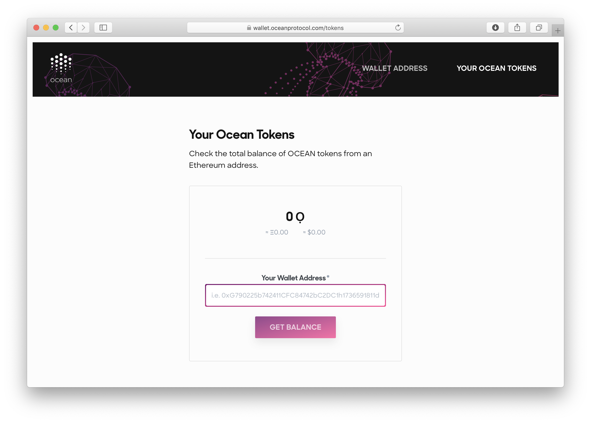

## Basics

**Ocean Tokens** are the [cryptocurrency](https://en.wikipedia.org/wiki/Cryptocurrency) associated with Ocean Protocol. They are standards-compliant [ERC-20 tokens](https://en.wikipedia.org/wiki/ERC-20).

Ocean Tokens can, in principle, live in any EVM-compatible network. The [Ocean Token contract](https://github.com/oceanprotocol/keeper-contracts/blob/develop/contracts/OceanToken.sol) is deployed in the Ethereum Mainnet, Pacific Mainnet, and the Nile Testnet. The tokens sold in the Ocean Protocol token sale were in the Ethereum Mainnet.

| Property                 | Value                                                                                                                                                                                                                                                                                                                                                                                                                                                                                                        |
| ------------------------ | ------------------------------------------------------------------------------------------------------------------------------------------------------------------------------------------------------------------------------------------------------------------------------------------------------------------------------------------------------------------------------------------------------------------------------------------------------------------------------------------------------------ |
| Token Contract Addresses | _Ethereum Mainnet_  [`0x985dd3D42De1e256d09e1c10F112bCCB8015AD41`](https://etherscan.io/token/0x985dd3d42de1e256d09e1c10f112bccb8015ad41)  _Pacific Mainnet_  [`0x012578f9381e876A9E2a9111Dfd436FF91A451ae`](https://submarine.oceanprotocol.com/address/0x012578f9381e876a9e2a9111dfd436ff91a451ae/transactions)  _Nile Testnet_ [`0x9861Da395d7da984D5E8C712c2EDE44b41F777Ad`](https://submarine.nile.dev-ocean.com/address/0x9861Da395d7da984D5E8C712c2EDE44b41F777Ad) |
| Token Symbol             | OCEAN                                                                                                                                                                                                                                                                                                                                                                                                                                                                                                        |
| Decimals of Precision    | 18                                                                                                                                                                                                                                                                                                                                                                                                                                                                                                           |

## Ethereum Mainnet Ocean Tokens

There were several ways to acquire some of the Ethereum Mainnet Ocean Tokens in the initial circulating supply, including:

- participation in the seed round
- participation in the pre-sale
- participation in the token sale
- participation in the initial exchange offering (IEO)
- completion of a [bounty](/concepts/bounties/)

After [the initial exchange offering on Bittrex International](https://blog.oceanprotocol.com/initial-exchange-offering-of-ocean-protocol-on-bittrex-international-a454688f466a), Ethereum Mainnet Ocean Tokens became available in the Ethereum Mainnet (and not in any other network).

The initial circulating supply of Ethereum Mainnet Ocean Tokens became available on the Ethereum Mainnet in May 2019. If you acquired Ocean Tokens in the initial circulating supply, they should have been, or will be, sent to the address you provided, in the Ethereum Mainnet.

At the time of writing, you could use Ethereum Mainnet Ocean Tokens to do various things in the Ethereum Mainnet, including but not limited to:

- buy other cryptocurrencies. See the next subsection for more details.
- stake in [dxDAO](https://dxdao.daostack.io/).

### Check Your Ethereum Mainnet Ocean Token Balance

There are many ways to check your Ethereum Mainnet Ocean Token balance. Starting with the easiest, here are some ways:

#### Ocean Token Tool

Enter your account address into the form on the [Ocean Token page on our website](https://oceanprotocol.com/token#balance).

#### Blowfish

Download and use [Blowfish](https://github.com/kremalicious/blowfish), a desktop app that tells you your Ocean Token balance (and other things).

#### MetaMask

Use MetaMask or other ERC-20-compatible wallet software. See the page about [using wallet software to manage Ocean Tokens](/tutorials/wallets-and-ocean-tokens/). You can also use wallet software to send Ocean Tokens to some other account.

#### Etherscan

Go to [Etherscan](https://etherscan.io/), enter your account address into the search field, click **Search**, click on **Erc20 Token Txns**, look for an _OceanToken_ transaction in the _Token_ colum, and click on **OceanToken** there.

### Buy or Sell Ethereum Mainnet Ocean Tokens

You can buy or sell Ethereum Mainnet Ocean Tokens via any exchange that lists them. See the official list of exchanges below.

You could also make a deal with someone where you send them something and they send you some Ocean Tokens in return (or vice versa). Ethereum Mainnet Ocean Tokens are standard ERC-20 tokens, so any software that can send ERC-20 tokens can be used (e.g. [wallet software](/concepts/wallets/) such as MetaMask).

### Official List of Exchanges

An always up-to-date _official list_ of exchanges which listed Ethereum Mainnet Ocean Tokens (OCEAN) can be found on the [Ocean Token page on our website](https://oceanprotocol.com/token#balance).

## Pacific Network Ocean Tokens

Ocean Tokens in Ocean's Mainnet, [Pacific](/concepts/pacific-network/), represent the same value as in the Ethereum Mainnet. The only way to get Ocean Tokens in Pacific is to transfer them from the Ethereum Mainnet.

### Ocean Token Bridge

For this purpose there is a token bridge between the Ethereum Mainnet and the Pacific Network, allowing anyone with Ocean Tokens to move them from the Ethereum Mainnet to the Pacific Network, and vice versa.

- [**Ocean Token Bridge**](https://bridge.oceanprotocol.com)
- [Tutorial: Transfer Ocean Tokens between Networks](/tutorials/token-bridge/)

Once you have some Ocean Tokens in Pacific, you can use them for all currently-implemented Ocean Protocol tasks _in Pacific_ (e.g. buying assets from a marketplace connected to Pacific).

However, please be aware that transferring tokens between networks can put your Ocean Tokens at risk.

## Testnet Ocean Tokens

There are Ocean Tokens in several testnets, including the Nile testnet. They are just testnet Ocean Tokens (i.e. for testing purposes only) and they aren't interchangeable with Ethereum Mainnet Ocean Tokens. For more details, see the the [page about Testnets](/concepts/testnets/) and the [tutorials](/tutorials/introduction/).

Once you have some Testnet Ocean Tokens, you can use them for all currently-implemented Ocean Protocol tasks _in that testnet_ (e.g. buying assets).

### Get Testnet Ocean Tokens

All Squid libraries have methods to request Ocean Tokens. They work by calling the _Dispenser_ keeper contract, a contract which is only deployed to testnets. Therefore they will only work in testnets.

They're documented in the following places:

- The squid-js docs for:
  - [`OceanAccounts.requestTokens()`](/references/squid-js/#OceanAccounts-requestTokens)
  - [`Account.requestTokens()`](/references/squid-js/#Account-requestTokens)
- The squid-py docs for:
  - [the `squid_py.ocean.ocean_tokens` module](https://squid-py.readthedocs.io/en/develop/api/squid_py.ocean.ocean_tokens.html): see the `request()` method.
  - [the `squid_py.ocean.ocean_accounts` module](https://squid-py.readthedocs.io/en/develop/api/squid_py.ocean.ocean_accounts.html): see the `request_tokens()` method.
- [The squid-java docs](https://www.javadoc.io/doc/com.oceanprotocol/squid/): click _All Classes_ then _AccountsManager_ then scroll to the bottom of the Class _AccountsManager_ page where you'll find the `requestTokens()` method.

The [Example Code page](/tutorials/example-code/) has links to example Squid code (in all of the languages), including examples of using the above methods.

## Further Reading about Ocean Tokens

- [Ocean Token page](https://oceanprotocol.com/token)
- [Tutorial: Use Your Wallet to Manage Ocean Tokens](/tutorials/wallets-and-ocean-tokens/)
- [Blog: Ocean Tokenomics](https://blog.oceanprotocol.com/ocean-tokenomics-d34f28c480a8)
- [Blog: Ocean Tokenomics II](https://blog.oceanprotocol.com/https-blog-oceanprotocol-com-ocean-tokenomics-ii-faf05854314b)
- [Ocean Protocol Technical Whitepaper](https://oceanprotocol.com/tech-whitepaper.pdf)
- [Blog: What Happened with the IEO?](https://blog.oceanprotocol.com/what-happened-with-the-ieo-54cc5c6c3db9)
- [Blog: Ocean Protocol — Token Sale](https://blog.oceanprotocol.com/ocean-protocol-token-sale-96d03f968e22)
- [Blog: Ocean Protocol Pre-Launch is Target Reached](https://blog.oceanprotocol.com/ocean-protocol-pre-launch-is-target-reached-d10e53272a2e)
