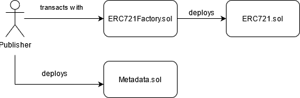

### What is NFT?

A non-fungible token stored on the blockchain represents a unique asset. NFTs can represent images, videos, digital art, or any piece of information. NFTs can be traded and allow transfer of ownership and copyright.

### How are NFTs handled in the Blockchain world?

[EIP-721](https://eips.ethereum.org/EIPS/eip-721) defines an interface for handling NFTs on Ethereum blockchain. The creator of the NFT can deploy a new contract on Ethereum or any Blockchain supporting NFT related interface and also, transfer the ownership through the transaction(s).

### How will Ocean Protocol support the NFT market?

Ocean Protocol defines an [ERC721Factory](https://github.com/oceanprotocol/contracts/blob/v4Hardhat/contracts/ERC721Factory.sol) contract which will allow users to deploy ERC721 contract instances on any of the supported networks. The deployed contract can be associated with Metadata information which describes, also published on-chain. The [Metadata](https://github.com/oceanprotocol/contracts/blob/v4Hardhat/contracts/metadata/Metadata.sol) contract will store the information about the asset, and associated access rights defined through roles.

### Combining ERC721 and ERC20

ERC20 interface represents fungible tokens. ERC721 and ERC20 combined together can be used for sub-licensing. These sub-licenses can be traded on any AMM as the underlying contract is ERC20 compliant.

Ocean Protocol's [ERC721Template](https://github.com/oceanprotocol/contracts/blob/v4Hardhat/contracts/templates/ERC721Template.sol) provides functionality to create comibinations of ERC721 and ERC20 contract pairs, each of this pair can represent a different sub-license.

Once the contract is deployed, it will be available on the Ocean Marketplace for trade.

### Other References

- https://en.wikipedia.org/wiki/Non-fungible_token
- https://blog.oceanprotocol.com/nfts-ip-3-combining-erc721-erc20-b69ea659115e
- https://blog.oceanprotocol.com/nfts-ip-2-leveraging-erc20-fungibility-bcee162290e3
- https://blog.oceanprotocol.com/nfts-ip-1-practical-connections-of-erc721-with-intellectual-property-dc216aaf005d
- https://blog.oceanprotocol.com/on-difficult-to-explain-fungibility-sightings-in-nfts-26bc18620f70
