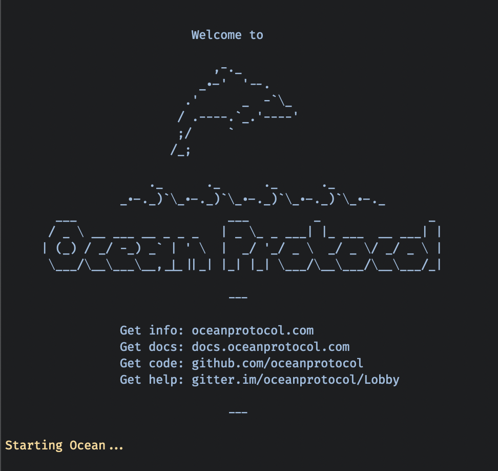

You can run and try every [Ocean software component](/concepts/components/) in your local machine, all at once, using Docker Compose:

```bash
git clone https://github.com/oceanprotocol/barge.git
cd barge/

./start_ocean.sh --latest
```

Seeing the dolphin means it's working:



Once everything is up and running, you can interact with the components. For example, to interact with Pleuston, go to:

[http://localhost:3000/](http://localhost:3000/)

Note that everything is running on your local machine, including a local Ethereum node, and it's not connected to any external Ethereum network.

For the details of what components are running, see the [Ocean Protocol barge repository](https://github.com/oceanprotocol/barge).

<repo name="barge"></repo>
