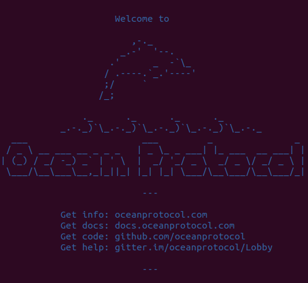

You can run and try every [Ocean software component](/concepts/components/) in your local machine, all at once, using Docker Compose.

First, you must [set up some storage on Azure](/tutorials/azure-for-brizo/). (Yes, we know that's not quick. Some day there will be a local storage option and then this really will be quick.)

Then:

```bash
git clone https://github.com/oceanprotocol/barge.git
cd barge/

./start_ocean.sh --latest
```

Seeing the dolphin means it's working:



Once everything is up and running, you can interact with the components. For example, to interact with Pleuston, go to:

[http://localhost:3000/](http://localhost:3000/)

For the details of what components are running, see the [Ocean Protocol barge repository](https://github.com/oceanprotocol/barge).

<repo name="barge"></repo>
