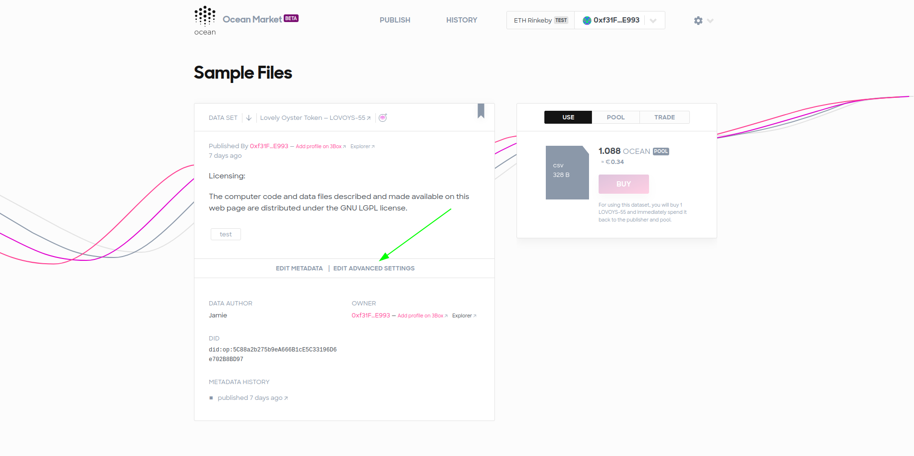
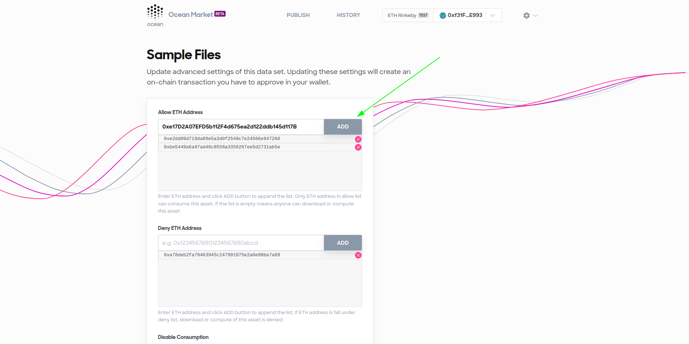
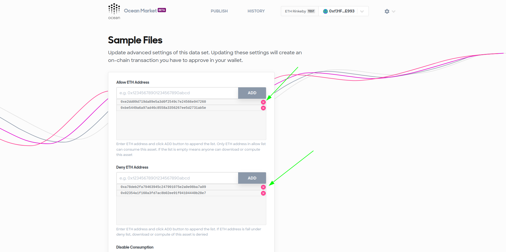
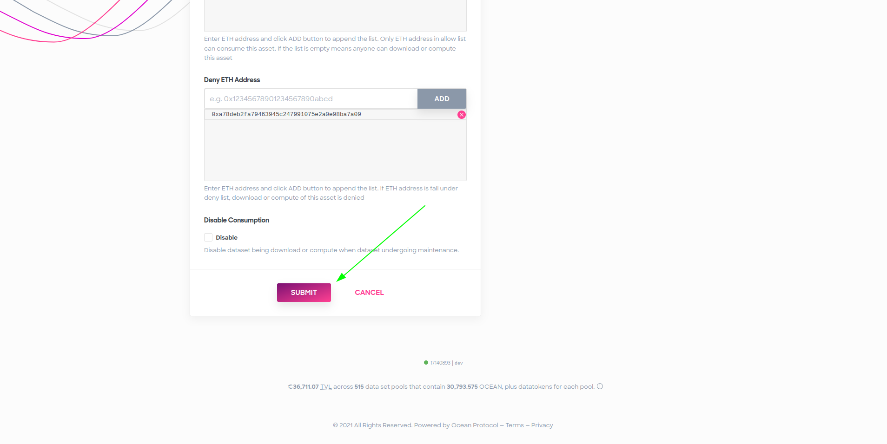
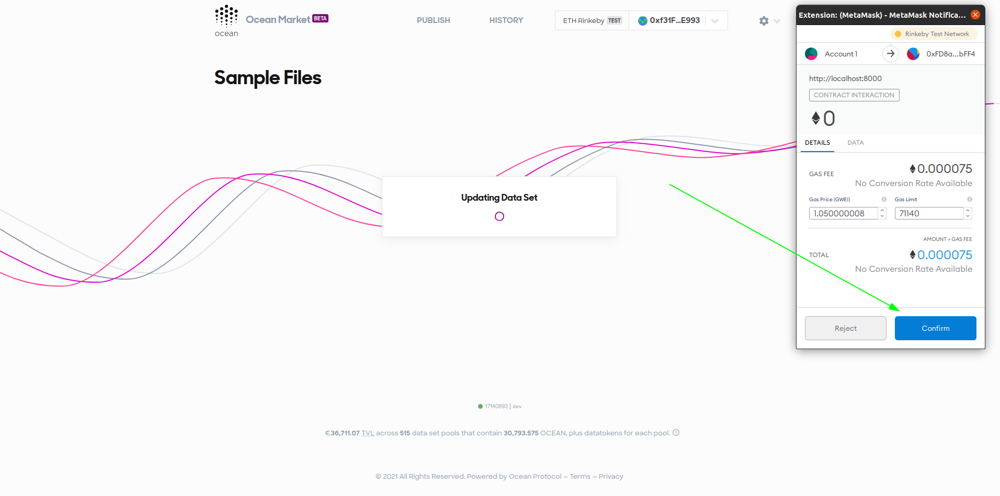
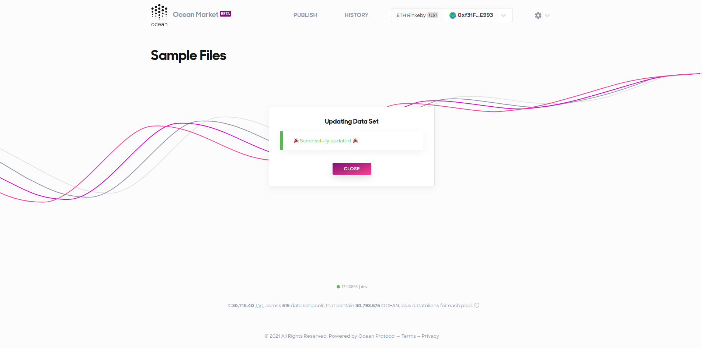

Allow and deny lists are advanced features that allow publishers to control access to individual data assets. Publishers can restrict assets so that they can only be accessed by approved users (allow lists) or they can restrict assets so that they can be accessed by anyone except certain users (deny lists). 

## Setup

All and deny lists are not enabled by default in Ocean Market. You need to edit the environmental variables to enable this feature in your fork of Ocean Market:

- To enable allow and deny lists you need to add the following environmental variable to your .env file in your fork of Ocean Market: `GATSBY_ALLOW_ADVANCED_SETTINGS="true"`
- Publishers in your market will now have the ability to restrict who can consume their datasets.

## Usage 

To use allow or deny lists you need to navigate to your data asset and click on "Advance Settings".

In order to add a user to a allow or deny list, you need to first know their ethereum address. You can then enter the address of the user into the input section and click the "ADD" button. 

To remove a user from an all or deny list you can click the cross next to their ethereum address. 

Any changes you make on the advanced settings page need to be submitted and signed in a transaction. To do this, first click the "SUBMIT" button.

Next you will need to sign the transaction in Metamask, or the wallet of your choice. 

When the process of updating the allow or deny lists is complete you will receive a success message. 

