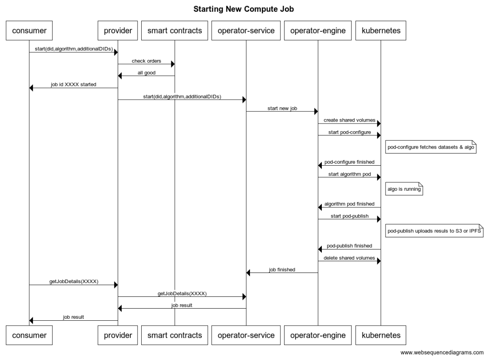

## Architecture Overview

Here's the sequence diagram for starting a new compute job. 

The Consumer calls the Provider with `start(did, algorithm, additionalDIDs)`. It returns job id `XXXX`. The Provider oversees the rest of the work. At any point, the Consumer can query the Provider for the job status via `getJobDetails(XXXX)`.

Here's how Provider works. First, it ensures that the Consumer has sent the appropriate datatokens to get access. Then, it calls asks the Operator-Service (a microservice) to start the job, which passes on the request to Operator-Engine (the actual compute system). Operator-Engine runs Kubernetes compute jobs etc as needed. Operator-Engine reports when to Operator-Service when the job has finished.

Here's the actors/components:

- Consumers - The end users who need to use some computing services offered by the same Publisher as the data Publisher.
- Operator-Service - Micro-service that is handling the compute requests.
- Operator-Engine - The computing systems where the compute will be executed.
- Kubernetes - a K8 cluster

Before the flow can begin, these pre-conditions must be met:

- The Asset DDO has a `compute` service.
- The Asset DDO compute service must permit algorithms to run on it.
- The Asset DDO must specify an Ocean Provider endpoint exposed by the Publisher.

## Access Control using Ocean Provider

As [with the `access` service](/concepts/architecture/#datatokens--access-control-tools), the `compute` service requires the **Ocean Provider** as a component handled by Publishers. Ocean Provider is in charge of interacting with users and managing the basics of a Publisher's infrastructure to integrate this infrastructure into Ocean Protocol. The direct interaction with the infrastructure where the data resides happens through this component only.

Ocean Provider includes the credentials to interact with the infrastructure (initially in cloud providers, but it could be on-premise).

<repo name="provider"></repo>

## Compute-to-Data Environment

### Operator Service

The **Operator Service** is a micro-service in charge of managing the workflow executing requests.

The main responsibilities are:

- Expose an HTTP API allowing for the execution of data access and compute endpoints.
- Interact with the infrastructure (cloud/on-premise) using the Publisher's credentials.
- Start/stop/execute computing instances with the algorithms provided by users.
- Retrieve the logs generated during executions.

Typically the Operator Service is integrated from Ocean Provider, but can be called independently of it.

The Operator Service is in charge of establishing the communication with the K8s cluster, allowing it to:

- Register new compute jobs
- List the current compute jobs
- Get a detailed result for a given job
- Stop a running job

The Operator Service doesn't provide any storage capability, all the state is stored directly in the K8s cluster.

<repo name="operator-service"></repo>

### Operator Engine

The **Operator Engine** is in charge of orchestrating the compute infrastructure using Kubernetes as backend where each compute job runs in an isolated [Kubernetes Pod](https://kubernetes.io/docs/concepts/workloads/pods/). Typically the Operator Engine retrieves the workflows created by the Operator Service in Kubernetes, and manage the infrastructure necessary to complete the execution of the compute workflows.

The Operator Engine is in charge of retrieving all the workflows registered in a K8s cluster, allowing to:

- Orchestrate the flow of the execution
- Start the configuration pod in charge of download the workflow dependencies (datasets and algorithms)
- Start the pod including the algorithm to execute
- Start the publishing pod that publish the new assets created in the Ocean Protocol network.
- The Operator Engine doesn't provide any storage capability, all the state is stored directly in the K8s cluster.

<repo name="operator-engine"></repo>

### Pod: Configuration

<repo name="pod-configuration"></repo>

### Pod: Publishing

<repo name="pod-publishing"></repo>
