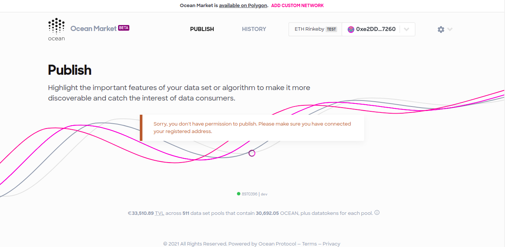
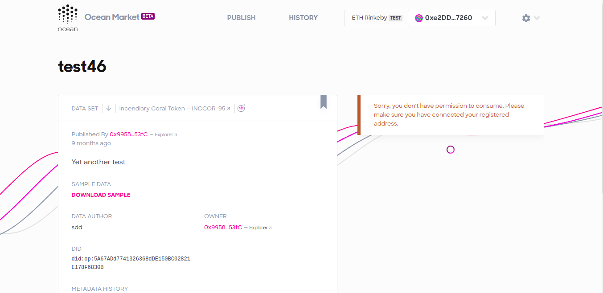
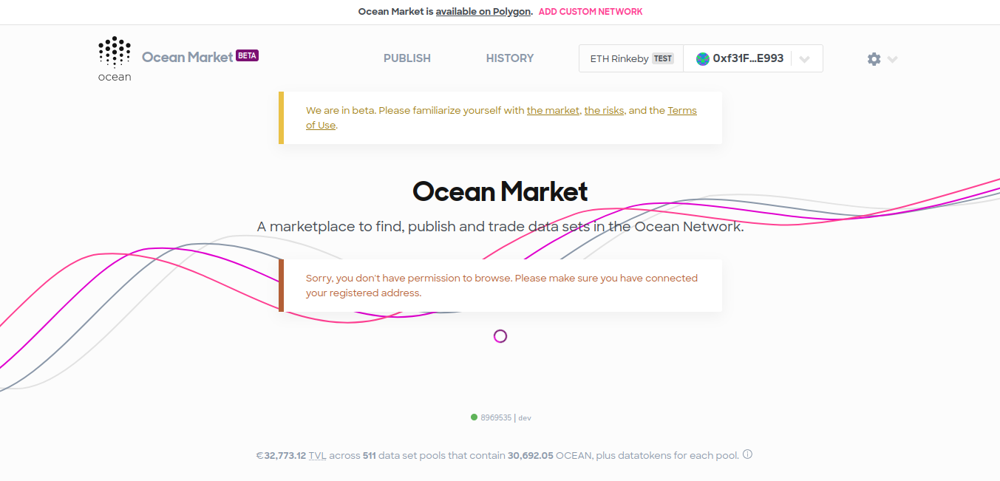
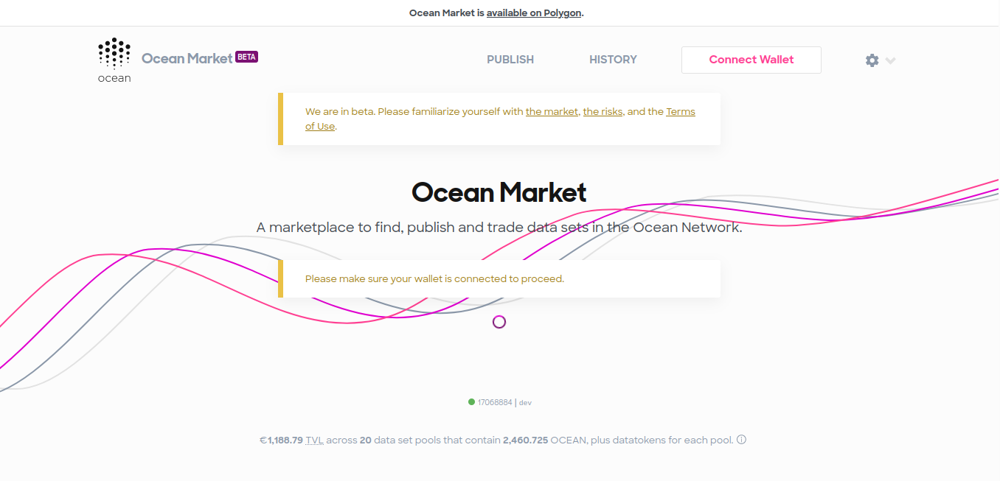

## Introduction

For market-level permissions, Ocean implements a role-based access control server (RBAC server). It implements restrictions at the user level, based on the user’s role (credentials). The RBAC server is run & controlled by the marketplace owner. Therefore permissions at this level are at the discretion of the marketplace owner. 

The RBAC server is the primary mechanism for restricting your users ability to publish, buy, or browse assets in the market.  

## Roles

The RBAC server defines four different roles: 

- Admin
- Publisher
- Consumer
- User

### Admin/ Publisher

Currently users with either the admin or publisher roles will be able to use the Market without any restrictions. They can publish, buy and browse datasets. 

### Consumer

A user with the consumer is able to browse datasets, purchase them, trade datatokens and also contribute to datapools. However, they are not able to publish datasets. 



### Users

Users are able to browse and search datasets but they are not able to purchase datasets, trade datatokens, or contribute to data pools. They are also not able to publish datasets. 



### Address without a role

If a user attempts to view the data market without a role, or without a wallet connected, they will not be able to view or search any of the datasets. 



### No wallet connected

When the RBAC server is enabled on the market, users are required to have a wallet connected to browse the datasets.



## Mapping roles to addresses 

Currently the are two ways that the RBAC server can be configured to map user roles to Ethereum addresses. The RBAC server is also built in such a way that it is easy for you to add your own authorization service. They two existing methods are: 

1. Keycloak

If you already have a [Keycloak](https://www.keycloak.org/) identity and access management server running you can configure the RBAC server to use it by adding the URL of your Keycloak server to the `KEYCLOAK_URL` environmental variable in the RBAC `.enb` file. 

2. JSON

Alternatively, if you are not already using Keycloak, the easiest way to map user roles to ethereum addresses is in a JSON object that is saved as the `JSON_DATA` environmental variable in the RBAC `.env` file. There is an example of the format required for this JSON object in `.example.env`

It is possible that you can configure both of these methods of mapping user roles to Ethereum Addresses. In this case the requests to your RBAC server should specify which auth service they are using e.g. `"authService": "json"` or `"authService": "keycloak"`

### Default Auth service

Additionally, you can also set an environmental variable within the RBAC server that specifies the default authorization method that will be used e.g. `DEFAULT_AUTH_SERVICE = "json"`. When this variable is specified, requests sent to your RBAC server don't need to include an `authService` and they will automatically use the default authorization method. 

## Running the RBAC server locally

You can start running the RBAC server by following these steps:

1. Clone this repository:

```Bash
git clone https://github.com/oceanprotocol/RBAC-Server.git
cd RBAC-Server
```

2. Install the dependencies:

```Bash
npm install
```

3. Build the service

```Bash
npm run build
```

4. Start the server

```Bash
npm run start
```

## Running in Docker

When you are ready to deploy the RBAC server to 

1. Replace the KEYCLOAK_URL in the Dockerfile with the correct URL for your hosting of [Keycloak](https://www.keycloak.org/).
2. Run the following command to build the RBAC service in a Docker container:

```Bash
npm run build:docker
```

3. Next, run the following command to start running the RBAC service in the Docker container:

```Bash
npm run start:docker
```

4. Now you are ready to send requests to the RBAC server via postman. Make sure to replace the URL to `http://localhost:49160` in your requests.

## Setting up the RBAC in the Market

To use the RBAC server with the market you need to save the URL of your RBAC server as an env within the market. 

- First setup and host the Ocean role based access control (RBAC) server. Follow the instructions in the [RBAC repository](https://github.com/oceanprotocol/RBAC-Server)
- In your .env file in your fork of Ocean Market, set the value of the `GATSBY_RBAC_URL` environmental variable to the URL of the Ocean RBAC server that you have hosted, e.g. `GATSBY_RBAC_URL= "http://localhost:3000"`
- Users of your marketplace will now require the correct role ("user", "consumer", "publisher") to access features in your marketplace. The market will check the role that has been allocated to the user based on the address that they have connected to the market with.
- The following features have been wrapped in the `Permission` component and will be restricted once the `GATSBY_RBAC_URL` has been defined:
  - Viewing or searching datasets requires the user to have permission to `browse`
  - Purchasing or trading a datatoken, or adding liquidity to a pool require the user to have permission to `consume`
  - Publishing a dataset requires the user to have permission to `publish`
- You can change the permission restrictions by either removing the `Permission` component or passing in a different eventType prop e.g. `<Permission eventType="browse">`.

