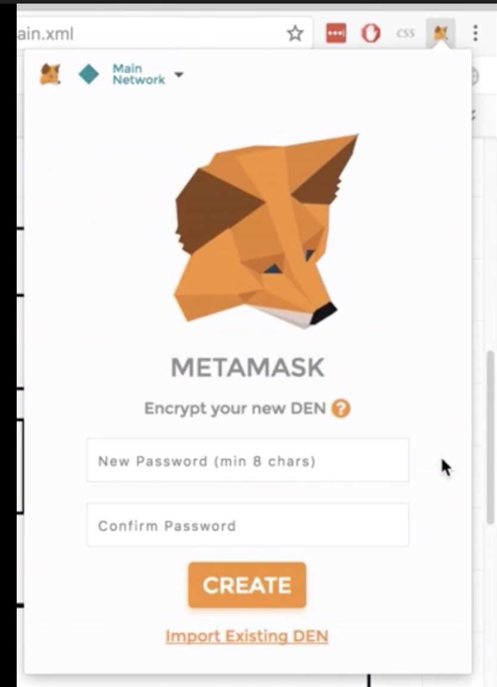

**Note: MetaMask can also be used with a TREZOR or Ledger hardware wallet but we don't cover those options below; see [the MetaMask documentation](https://metamask.zendesk.com/hc/en-us/articles/360020394612-How-to-connect-a-Trezor-or-Ledger-Hardware-Wallet).**

1. Go to the [Chrome Web Store for extensions](https://chrome.google.com/webstore/category/extensions) and search for MetaMask.

   

2. Install MetaMask. It will get added as a browser extension in the top right corner of your browser. Read through and accept the terms and conditions. Create a username and password in the next step.

   

3. MetaMask will generate a secret backup phrase for you. Write it down, store it in a safe place, and click next.

   

4. Confirm your secret backup phrase and finish your MetaMask wallet setup.

   

5. Voila! Your account is now created. You can now manage Ether and Ocean Tokens with your wallet. You can copy your account address to clipboard from the options. When you want someone to send Ether or Ocean Tokens to you, you will have to give them that address. It's not a secret.

You can also watch our [tutorial video snippets](https://www.youtube.com/playlist?list=PL_dn0wVs9kWolBCbtHaFxsi408cumOeth) if you want more help setting up MetaMask.
