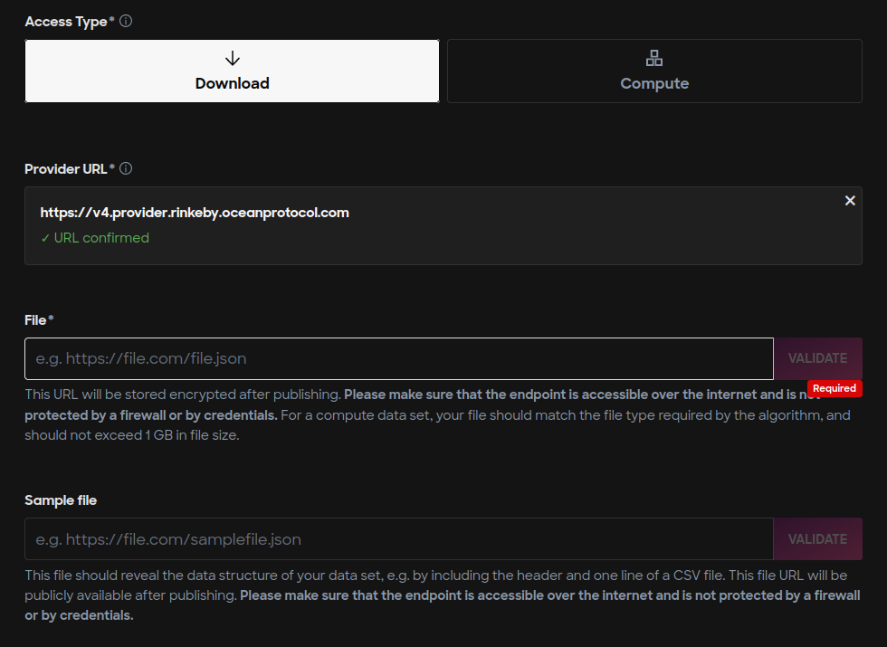
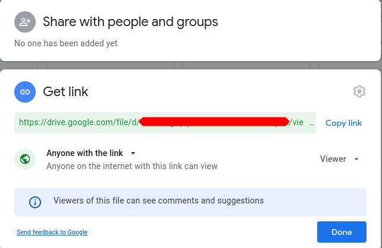

## Overview

While publishing assets on Ocean Marketplace, publishers must provide a link (a URL) to the asset from where the content of the asset can be accessed. The URL of the asset is encrypted and is stored as a part of DDO on the blockchain. When a buyer pays for the asset, **Provider** decrypts this content and acts as a proxy to serve the asset. It is up to the asset publisher to decide where to host the asset. For example, a publisher can store the content on their google drive, AWS server, private cloud server, or other third-party hosting services. The DDO only stores the location of the asset, which is accessed on-demand by the Provider. 

On Ocean Marketplace, a publisher must provide the link to the asset during publish step. Once the asset is published, this link cannot be changed. So, it is essential that the publisher correctly sets this field (shown in the below image).

## Using hosting services

Publishers can choose any hosting service of their choice. The below section explains how to use commonly used hosting services with Ocean Marketplace.

### Google drive

Google Drive allows users to share files/folders with various access policies. Publishers must set the access policy such that anyone with the link can download the file when using Ocean Marketplace with Ocean Protocol's default Provider (https://v4.provider.rinkeby.oceanprotocol.com).

#### Step 1: Get link

Open https://drive.google.com and upload the file you want to publish on the Ocean Marketplace.
Right-click on the uploaded file and click the `Share` option. Set the file access policy correctly and click the `Copy link` button.

The file URL will be of the form `https://drive.google.com/file/d/<FILE-ID>/view?usp=sharing`, where the `<FILE-ID>` is the unique alphanumeric string. Verify if the URL is correct by entering it in a browser and check if file is downloaded.

#### Step 2: Create a downloadable link

If you paste the copied URL into the browser, it will load an HTML page. Directly pasting the link in the publish page will publish the HTML page instead of a downloadable file URL. So, let's make a downloadable file URL.

Note the `<FILE-ID>` from step 1 and create a URL as below.

`https://drive.google.com/uc?export=download&id=<FILE-ID>`

#### Step 3: Enter the downloadable link in publishing the page

After creating a downloadable file URL, fill the `File*` field with the downloadable URL created in step 2.

_Note: Google Drive allows only shared files to be downloaded, as shown in the above steps. The above method does not work with the shared folder. As a workaround, publishers can upload a zip of a folder and upload it as a file._

---

### Azure storage

Azure provides various options to host data and multiple configuration possibilities. Publishers are required to do their research and decide what would be the right choice. The below steps provide one of the possible ways to host data using Azure storage and publish it on Ocean Marketplace.

#### Prerequisite

Create an account on [Azure](https://azure.microsoft.com/en-us/). Users might also be asked to provide payment details and billing addresses that are out of this tutorial's scope.

#### Step 1: Create a storage account

##### Go to Azure portal

Go to the Azure portal: https://portal.azure.com/#home and select `Storage accounts` as shown below.

##### Create a new storage account

##### Fill the details

##### Storage account created

#### Step 2: Create a blob container

#### Step 3: Upload a file

#### Step 4: Share the file

##### Select the file to be published and click Generate SAS

##### Configure the SAS details and click `Generate SAS token and URL`

##### Copy the generated link

#### Step 5: Enter the downloadable link in publishing the page

Now, copy and paste the link in the Publish page in the Ocean Marketplace.

