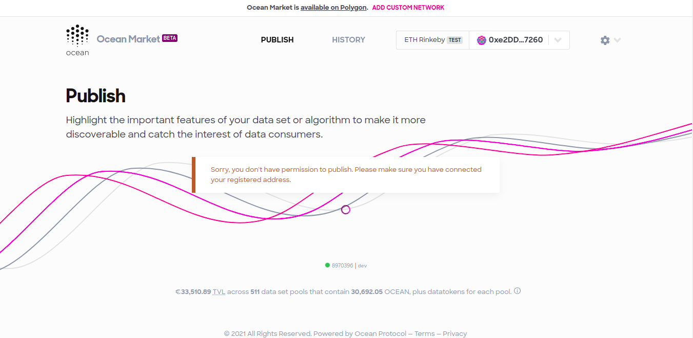

The primary mechanism for restricting your users ability to publish, consume, or browse is the role-based access (RBAC) control server. The RBAC server defines four different roles: 

- Admin
- Publisher
- Consumer
- User

## Admin/ Publisher
Currently both users with either the admin or publisher roles will be able to use the Market without any restrictions. They can publish, consume and browse datasets. 

## Consumer

A user with the consumer is able to browse datasets, purchase them, trade datatokens and also contribute to datapools. However, they are not able to publish datasets. 



## Users

Users are able to browse and search datasets but they are not able to purchase datasets, trade datatokens, or contribute to data pools. They are also not able to publish datasets. 


## Address without a role

If a user attempts to view the data market without a role, or without a wallet connected, they will not be able to view or search any of the datasets. 


## No wallet connected

When the RBAC server is enabled on the market, users are required to have a wallet connected to browse the datasets.


## Running the RBAC server locally
You can start running the RBAC server by following these steps:

1. Clone this repository:

```Bash
git clone https://github.com/oceanprotocol/RBAC-Server.git
cd RBAC-Server
```

2. Install the dependancies:

```Bash
npm install
```

3. Build the service

```Bash
npm run build
```

4. Start the server

```Bash
npm run start
```

## Running in Docker
When you are ready to deploy the RBAC server to 
1. Replace the KEYCLOAK_URL in the Dockerfile with the correct URL for your hosting of keycloak.
2. Run the following command to build the RBAC service in a Docker container:

```Bash
npm run build:docker
```

3. Next, run the following command to start running the RBAC service in the Docker container:

```Bash
npm run start:docker
```

4. Now you are ready to send requests to the RBAC server via postman. Make sure to replace the URL to `http://localhost:49160` in your requests.
