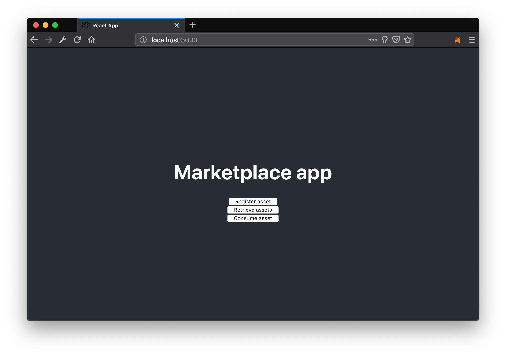

## Requirements

This is a continuation of the [React App Setup](/tutorials/react-setup/) tutorial, so make sure you have done all the steps described in there.

1. [React App Setup](/tutorials/react-setup/)

Open `src/index.js` from your `marketplace/` folder.

## Define Asset

First, let's add the [asset](/concepts/terminology/#asset-or-data-asset) that we want to publish.

To do that, we need to define the asset based on the [OEP-08](https://github.com/oceanprotocol/OEPs/tree/master/8) metadata structure. An asset can have multiple `files` attached to it and each file's `url` value will be encrypted during the publish process. To download that file later on, this value will be decrypted during the consume process.

Let's create a new file `src/asset.js` and fill it with:

GITHUB-EMBED https://github.com/oceanprotocol/react-tutorial/blob/14df1d877be48deda15afa12bf3c4efbafffcd4b/src/asset.js js GITHUB-EMBED

Then import this asset definition at the top of `src/index.js`:

GITHUB-EMBED https://github.com/oceanprotocol/react-tutorial/blob/2765a7e6ae9a948d311d3949636cf832d2664900/src/index.js jsx 5 GITHUB-EMBED

## Handle Asset Publishing

Now that we have an asset to submit, we need a function to handle it. Just before `render() {` let's add this `registerAsset` function:

GITHUB-EMBED https://github.com/oceanprotocol/react-tutorial/blob/2765a7e6ae9a948d311d3949636cf832d2664900/src/index.js jsx 40-52 GITHUB-EMBED

The last thing we need is a button to start our registration inside the `render()` function:

GITHUB-EMBED https://github.com/oceanprotocol/react-tutorial/blob/2765a7e6ae9a948d311d3949636cf832d2664900/src/index.js jsx 111-113 GITHUB-EMBED

Note how we disable the button when Web3 is not available to reduce user confusion. Within the Ocean Protocol flow of registering, searching, and consuming, only searching is possible without Web3.

In your browser, you should now end up like this:

When you click on the _Register asset_ button, you should get four separate dialog boxes from MetaMask, in a series, i.e. the second one only appears after you accept/approve the first one, and so on.

Have a look into `console.log` to see the various steps of the register process. If you have no errors in your `console.log`, then you have successfully registered an asset.

## Final Result

Here is the full source of `src/index.js` that you should have if you followed this tutorial:

GITHUB-EMBED https://github.com/oceanprotocol/react-tutorial/blob/2765a7e6ae9a948d311d3949636cf832d2664900/src/index.js jsx 1-5,6-16,18-27,34-52,96-113,119-124 GITHUB-EMBED

**Move on to [Get & Use a Data Set](/tutorials/react-get-use-data-set/).**
