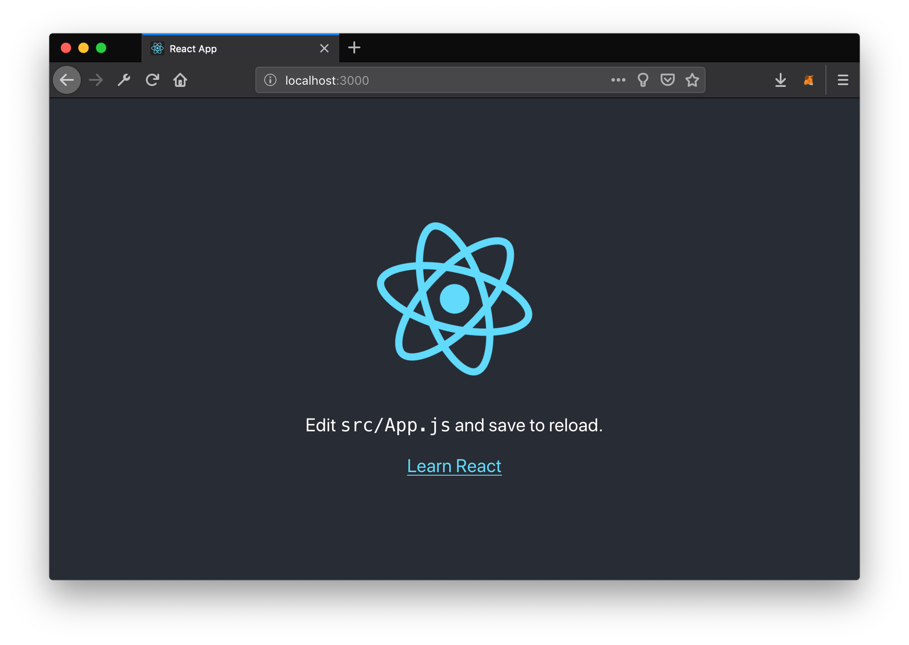
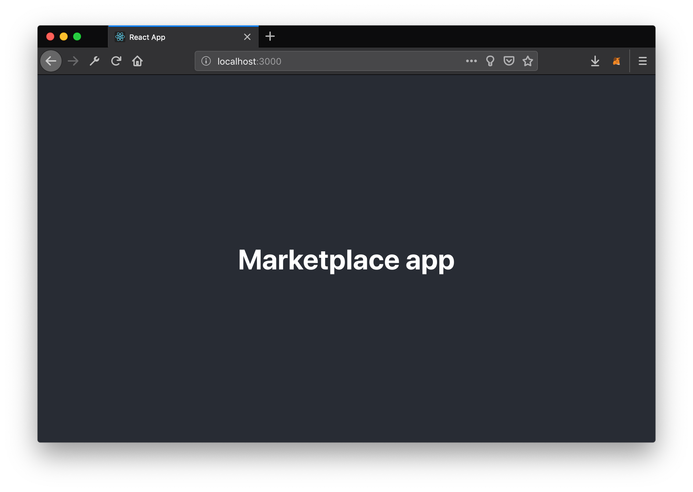
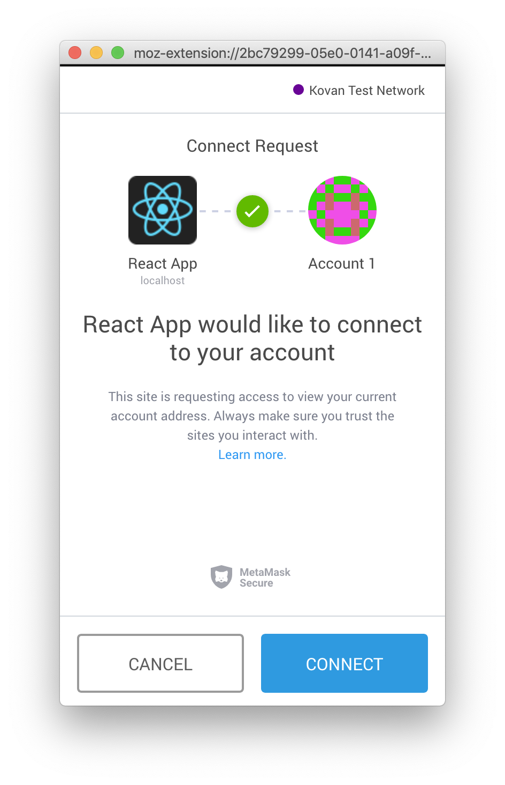
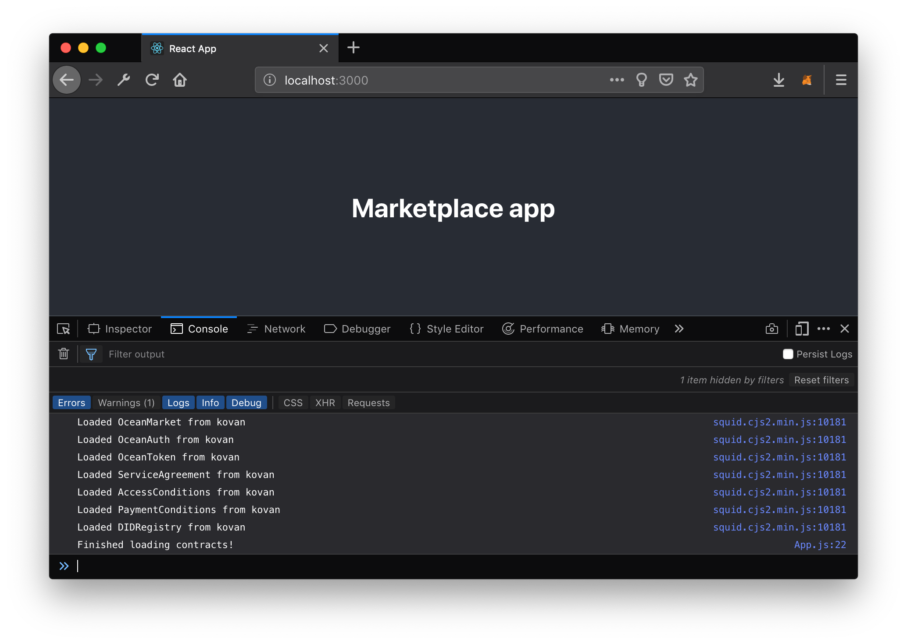

## Requirements

- `Node.js` >= 10 is installed. You can check using `node -v`
- `npm` >= 5.2 is installed. You can check using `npm -v`
- Git clone the [oceanprotocol/barge](https://github.com/oceanprotocol/barge) repository, then in that directory:
  - (Optional) If you want to use Azure Storage or Amazon S3 storage, then go through the tutorials to set those up: [Azure](/tutorials/azure-for-brizo/) or [Amazon](/tutorials/amazon-s3-for-brizo/). Note that if you're using Azure Storage, you must edit the `barge/brizo.env` file and set all `AZURE_`... values.
  - Use Barge to run a local Spree Testnet:

    ```bash
    export KEEPER_VERSION=v0.8.6
    export AQUARIUS_VERSION=v0.2.0
    export BRIZO_VERSION=v0.3.0
    ./start_ocean.sh --latest --no-pleuston --local-spree-node
    ```

- [Get some Spree Ether](/tutorials/get-ether-and-ocean-tokens/#get-ether-for-a-local-spree-testnet) in a local account managed by MetaMask.

## New Create React App

First, kickstart your new React app by creating a boilerplate with Create React App:

```bash
npx create-react-app marketplace
```

This will create a folder named `marketplace` with a boilerplate React app. Go into that new folder and add the Ocean Protocol JavaScript library and Web3 packages to the app's dependencies:

```bash
cd marketplace/
npm install @oceanprotocol/squid@0.4.1 web3
```

At this point you can already run `npm start` which starts the app in your browser at [localhost:3000](http://localhost:3000):



## Add Markup & Web3

Let's make it ours, open `src/App.js` and replace the whole source with:

```jsx
import React, { Component } from 'react'
import './App.css'

class App extends Component {
  render() {
    return (
      <div className="App App-header">
        <h1>Marketplace app</h1>
      </div>
    )
  }
}

export default App
```

Below the `import './App.css'` line, let's import the packages we installed, set up web3 and unlock MetaMask accounts (if locked):

```js
import { Ocean } from '@oceanprotocol/squid'
import * as Web3 from 'web3'

const web3 = new Web3(window.web3.currentProvider)
window.ethereum.enable()
```

After those steps you should see this, and MetaMask should have asked you to allow access to your account:




Note: If you see an error like `inpage.js:1 MetaMask - RPC Error: Internal JSON-RPC error.` in your `console.log`, don't worry about it. It's a MetaMask thing.

## Create Ocean instance

Now that we are successfully connected with Web3, we can set up our Ocean instance.

At the beginning of your component, create a new Ocean instance with all configuration within the `componentDidMount` lifecycle method. All Ocean Protocol operations can be executed from this Ocean instance.

```js
async componentDidMount() {
  this.ocean = await new Ocean.getInstance({
    web3Provider: web3,
    nodeUri: "http://localhost:8545",
    aquariusUri: "http://localhost:5000",
    brizoUri: "http://localhost:8030",
    parityUri: "http://localhost:8545",
    secretStoreUri: "http://localhost:12001",
    threshold: 0,
    password: "node0",
    address: "0x00bd138abd70e2f00903268f3db08f2d25677c9e",
  })
  console.log("Finished loading contracts!")
}
```

## Final Result

That's it, if you have no errors in your `console.log` then you have successfully initialized an Ocean instance in your brand new React app and you are ready for the [next part of this tutorial](/tutorials/react-publish-data-set/).



Here is the full source of `src/App.js` that you should have if you followed this tutorial:

```jsx
import React, { Component } from 'react'
import './App.css'
import { Ocean } from '@oceanprotocol/squid'
import * as Web3 from 'web3'

const web3 = new Web3(window.web3.currentProvider)
window.ethereum.enable()

class App extends Component {
  async componentDidMount() {
    this.ocean = await new Ocean.getInstance({
      web3Provider: web3,
      nodeUri: 'http://localhost:8545',
      aquariusUri: 'http://localhost:5000',
      brizoUri: 'http://localhost:8030',
      parityUri: 'http://localhost:8545',
      secretStoreUri: 'http://localhost:12001',
      threshold: 0,
      password: 'node0',
      address: '0x00bd138abd70e2f00903268f3db08f2d25677c9e'
    })
    console.log('Finished loading contracts!')
  }

  render() {
    return (
      <div className="App App-header">
        <h1>Marketplace app</h1>
      </div>
    )
  }
}

export default App
```

Move on to [Publish a Data Set](/tutorials/react-publish-data-set/).
