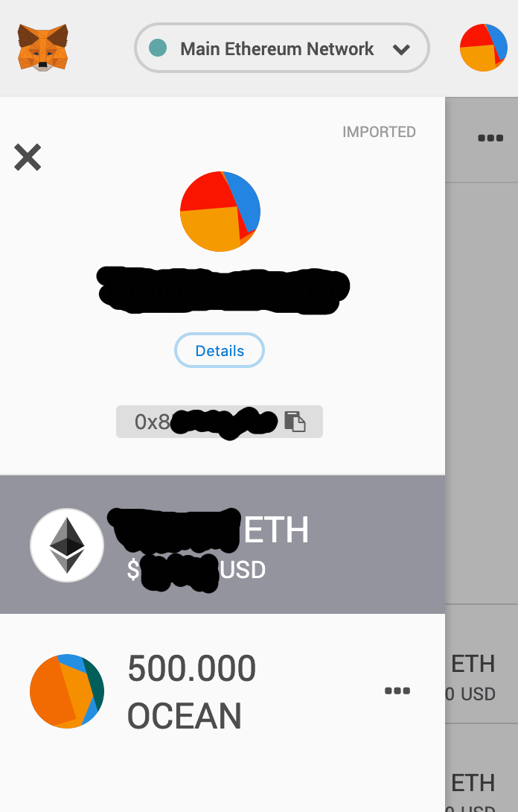
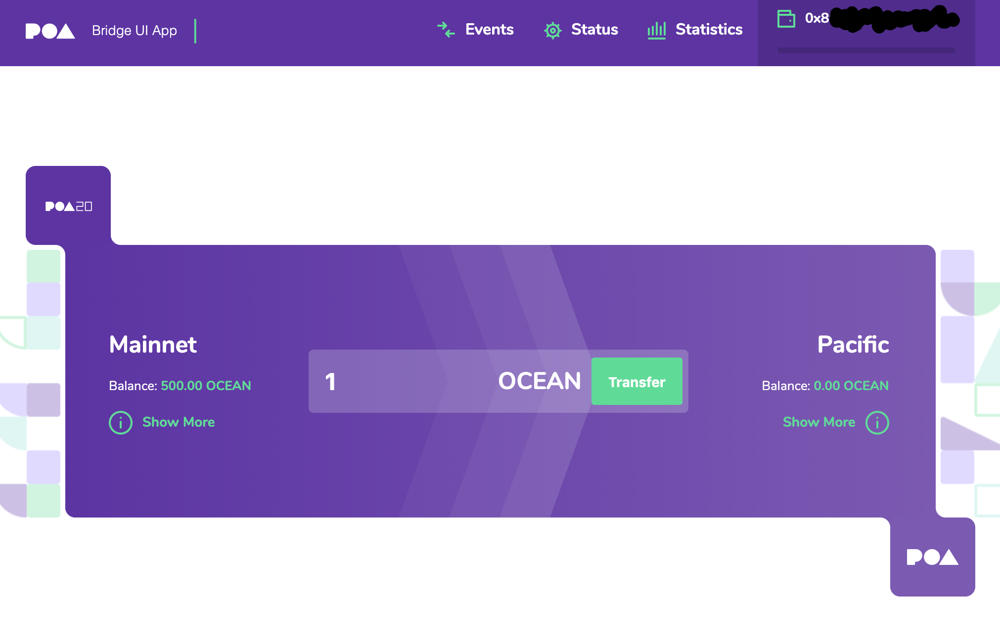
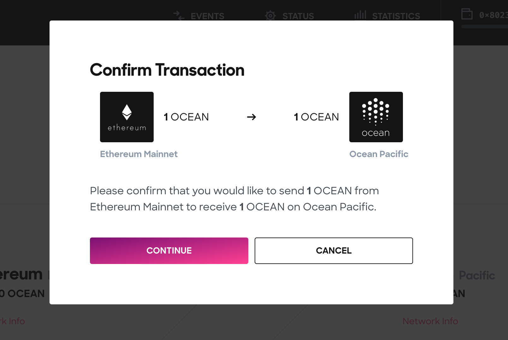
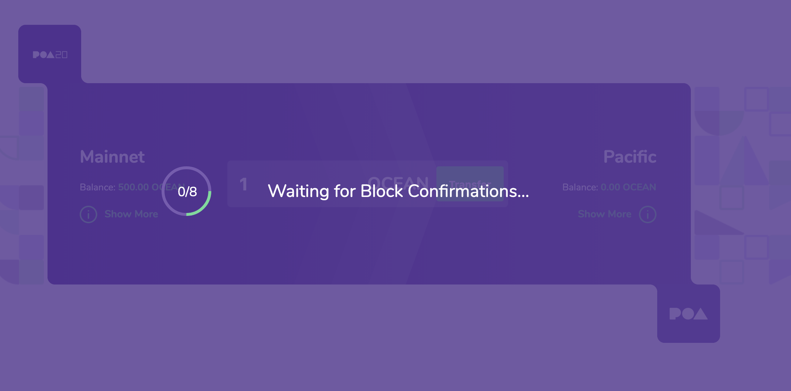
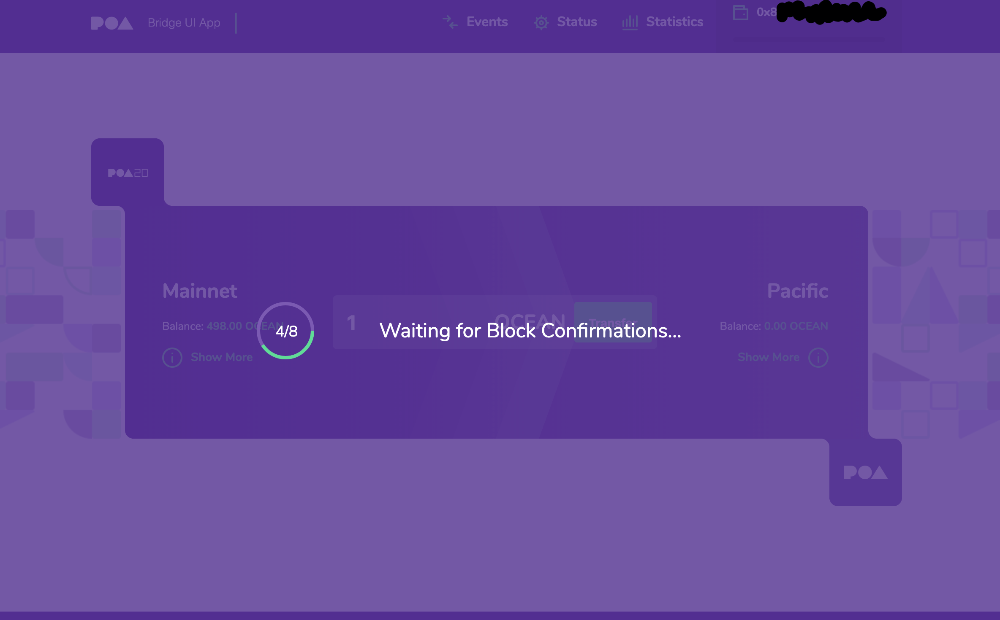
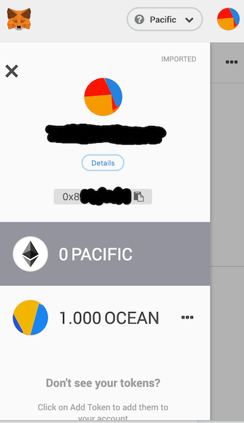
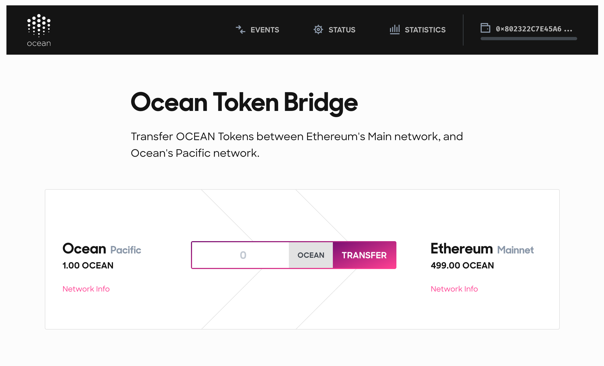
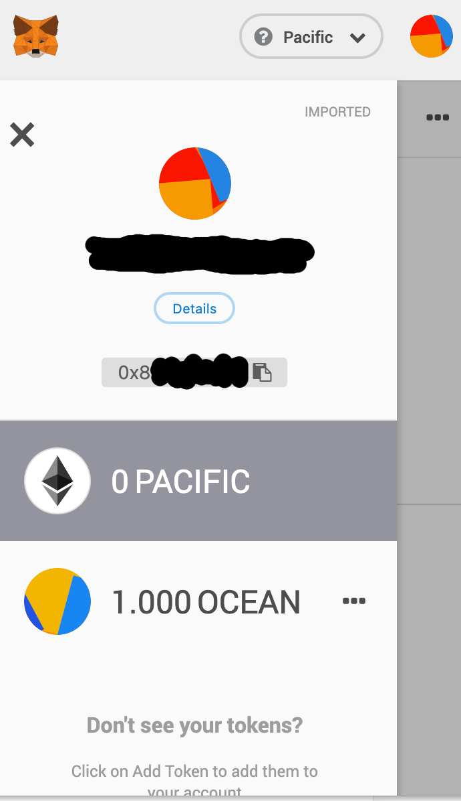

TODO: All images here are placeholders for now. Replace them with images showing the Ocean-specific token bridge UI.

## Introduction

There is a token bridge between the Ethereum Mainnet and the Ocean Production Network. It's based on [the TokenBridge by POA Network](https://medium.com/poa-network/introducing-the-erc20-to-erc20-tokenbridge-ce266cc1a2d0) (the company).
This tutorial shows how you can use the token bridge to transfer Ocean Tokens (OCEAN) from the Ethereum Mainnet to the Ocean Production Network.

## WARNING

**Please Note: At the time of writing, if you transfer your Ocean Tokens to the Ocean Production Network, then you are putting your Ocean Tokens at risk.**

## Using the Token Bridge

If you want to transfer OCEAN out of the Ethereum Mainnet, then first you need an Ethereum account with some OCEAN in the Ethereum Mainnet. If you want to get some OCEAN in the Ethereum Mainnet, then see [the page about Ocean Tokens](/concepts/ocean-tokens/).

Below is a screenshot of MetaMask showing an account (with address `0x8…`) which has 500 OCEAN in the Ethereum Mainnet. If you want MetaMask to show OCEAN, then see [the page about using your wallet to manage Ocean Tokens](/tutorials/wallets-and-ocean-tokens/).

To use the token bridge between the Ethereum Mainnet and the Ocean Production Network (a.k.a. Pacific), then go to [https://token-bridge.pacific.oceanprotocol.com](https://token-bridge.pacific.oceanprotocol.com). You should see something like this:

TODO: or maybe the URL will be bridge.oceanprotocol.com ? Update accordingly.

The above screenshot shows that the account with address `0x8…` has 500.00 OCEAN in the Ethereum Mainnet and 0.00 OCEAN in Pacific.

- Enter the amount of OCEAN you want to transfer (e.g. 1 OCEAN in the screenshot)
- Click **Transfer**

A confirmation dialog box like the following should appear.

- Click **Continue**

You should see some status updates like the following.

If the transfer is a success, then you should see a dialog box like the following.

Notice how the transaction ID is shown.

- Click **OK**

If you go back to MetaMask and switch the network to Pacific, then the account's OCEAN balance in Pacific should be higher by the amount just transferred.

