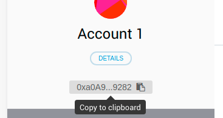

At the time of writing, there were two testnets you could use to test an Ocean Protocol application: the Kovan Testnet and the Ocean Testnet. For more information about those, see the page about [testnets](/concepts/testnets/). Also at the time of writing, there was no easy was to get Ocean Testnet Ether for the Ocean Testnet, so this tutorial focuses on the Kovan Testnet (for now).

## Get a Kovan Address

You can use any Ethereum wallet that can hold Kovan Ether (KEth) and Kovan Ocean Tokens. For now, we recommend [MetaMask](https://metamask.io/).

- Follow MetaMask instructions to install it.
- Switch from the Main Ethereum Network to the Kovan Test Network.
- Hover your mouse over your account address (e.g. `0x0A9...9282`). A tooltip should appear, saying, "Copy to clipboard".

- Copy the address to your clipboard. That's your Kovan address.

## Get Kovan Ether (KEth)

You can get Kovan Ether from a Kovan faucet: see [the official list of Kovan faucets](https://github.com/kovan-testnet/faucet). It will ask you for your Kovan address (copied to your clipboard in the last step).

## Get Kovan Ocean Tokens

Use Pleuston... TODO

INSERT SCREENSHOT

Note that Kovan Ocean Tokens can't be transferred to or used in other Ethereum networks (or at least it wasn't possible at the time of writing).

## Get Connected

To connect to the Kovan Testnet and the the Ocean Secret Store for Kovan, you need information about where to connect, and other information (e.g. the addresses of the Ocean keeper contracts in Kovan).

That information is bundled into the Ocean Protocol "docker-images" files and scripts, so you can just use those to get connected and using the Kovan testnet (and the Ocean Secret Store for Kovan). There are more details in [the page about setting up a marketplace](/setup/marketplace/).
