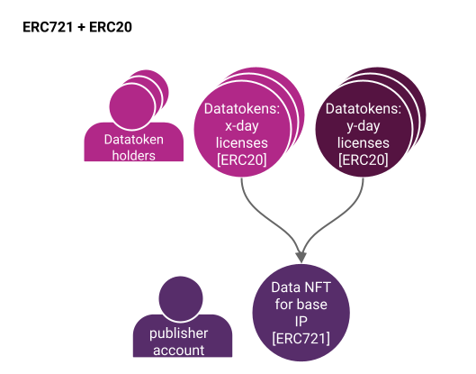

# Data NFTs and Datatokens

A non-fungible token stored on the blockchain represents a unique asset. NFTs can represent images, videos, digital art, or any piece of information. NFTs can be traded, and allow transfer of copyright/base IP. [EIP-721](https://eips.ethereum.org/EIPS/eip-721) defines an interface for handling NFTs on EVM-compatible blockchains. The creator of the NFT can deploy a new contract on Ethereum or any Blockchain supporting NFT related interface and also, transfer the ownership of copyright/base IP through transfer transactions.

Fungible tokens represent fungible assets. If you have 5 ETH and Alice has 5 ETH, you and Alice could swap your ETH and your final holdings remain the same. They're apples-to-apples. Licenses (contracts) to access a copyrighted asset are naturally fungible - they can be swapped with each other.

## What is a Data NFT?

A data NFT represents the copyright (or exclusive license against copyright) for a data asset on the blockchain — we call this the “base IP”. When a user publishes a dataset in OceanOnda V4, they create a new NFT as part of the process. This data NFT is proof of your claim of base IP. Assuming a valid claim, you are entitled to the revenue from that asset, just like a title deed gives you the right to receive rent.

The data NFT smart contract holds metadata about the data asset, stores roles like “who can mint datatokens” or “who controls fees”, and an open-ended key-value store to enable custom fields.

If you have the private key that controls the NFT, you are the owner of that NFT. The owner has the claim on the base IP and is the default recipient of any revenue. They can also assign another account to receive revenue. This enables the publisher to sell their base IP and the revenues that come with it. When the Data NFT is transferred to another user, all the information about roles and where the revenue should be sent is reset. The default recipient of the revenue is the new owner of the data NFT.

### Data NFTs Open Up New Possibilities

With data NFTs, you are able to take advantage of the wider NFT ecosystem and all the tools and possibilities that come with it. As a first example, many leading crypto wallets have first-class support for NFTs, allowing you to manage data NFTs from those wallets. Or, you can post your data NFT for sale on a popular NFT marketplace like [OpenSea](https://www.opensea.io/) or [Rarible](https://www.rarible.com/). As a final example, we’re excited to see [data NFTs linked to physical items via WiseKey chips](https://www.globenewswire.com/news-release/2021/05/19/2232106/0/en/WISeKey-partners-with-Ocean-Protocol-to-launch-TrustedNFT-io-a-decentralized-marketplace-for-objects-of-value-designed-to-empower-artists-creators-and-collectors-with-a-unique-solu.html).

## High-Level Architecture

The image above describes how ERC721 data NFTs and ERC20 datatokens relate.

* Bottom: The publisher deploys an ERC721 data NFT contract representing the base IP for the data asset. They are now the manager of the data NFT.
* Top: The manager then deploys an ERC20 datatoken contract against the data NFT. The ERC20 represents a license with specific terms like "can download for the next 3 days". They could even publish further ERC20 datatoken contracts, to represent different license terms or for compute-to-data.

### Terminology

* **Base IP** means the artifact being copyrighted. Represented by the {ERC721 address, tokenId} from the publish transactions.
* **Base IP holder** means the holder of the Base IP. Represented as the actor that did the initial "publish" action.
* **Sub-licensee** is the holder of the sub-license. Represented as the entity that controls address ERC721.\_owners\[tokenId=x].
* **To Publish**: Claim copyright or exclusive base license.
* **To Sub-license**: Transfer one (of many) sub-licenses to new licensee: ERC20.transfer(to=licensee, value=1.0).

### Implementation in Ocean Protocol

We have implemented data NFTs using the [ERC721 standard](https://erc721.org/). Ocean Protocol defines the [ERC721Factory](https://github.com/oceanprotocol/contracts/blob/v4main/contracts/ERC721Factory.sol) contract, allowing **Base IP holders** to create their ERC721 contract instances on any supported networks. The deployed contract stores Metadata, ownership, sub-license information, permissions. The contract creator can also create and mint ERC20 token instances for sub-licensing the **Base IP**.

ERC721 tokens are non-fungible, thus cannot be used for automatic price discovery like ERC20 tokens. ERC721 and ERC20 combined together can be used for sub-licensing. Ocean Protocol's [ERC721Template](https://github.com/oceanprotocol/contracts/blob/v4main/contracts/templates/ERC721Template.sol) solves this problem by using ERC721 for tokenizing the **Base IP** and tokenizing sub-licenses by using ERC20.

Our implementation has been built on top of the battle-tested [OpenZeppelin contract library](https://docs.openzeppelin.com/contracts/4.x/erc721). However, there are a bunch of interesting parts of our implementation that go a bit beyond an out-of-the-box NFT.

OceanOnda V4’s data NFT factory can deploy different types of data NFTs based on a variety of templates. Some templates could be tuned for data unions, others for DeFi, and others yet for enterprise use cases.

Something else that we’re super excited about in our data NFTs is a cutting-edge standard called [ERC725](https://github.com/ERC725Alliance/erc725/blob/main/docs/ERC-725.md) being driven by our friends at [Lukso](https://lukso.network/about). The ERC725y feature enables the NFT owner (or a user with the “store updater” role) to input and update information in a key-value store. These values can be viewed externally by anyone.

ERC725y is incredibly flexible and can be used to store any string; you could use it for anything from additional metadata to encrypted values. This helps future-proof the data NFTs and ensure that they are suitable for a wide range of projects that have not been launched yet. As you can imagine, the inclusion of ERC725y has huge potential and we look forward to seeing the different ways people end up using it. If you’re interested in using this, take a look at [EIP725](https://eips.ethereum.org/EIPS/eip-725#erc725y).

Continuing the theme of flexibility, for a given data NFT, you can have one or more ERC20 datatoken contracts. Here’s the main idea: 1.0 datatokens allows you to consume the corresponding dataset. Put another way, it’s a sub-license from the base IP to be able to use the dataset according to the license terms (when you send it to the publisher). License terms can be set from a “good default”, or by the Data NFT owner. ERC20 fungible token standard is a natural choice for datatokens, because licenses themselves are fungible: one license can be exchanged 1:1 another. Using the ERC20 standard enables interoperability of datatokens with ERC20-based wallets, DEXes, DAOs, and more. Datatokens can be given (simply transferred), purchased on a marketplace / exchange, airdropped, etc.

You can publish a data NFT initially with no ERC20 datatoken contracts. This means you simply aren’t ready to grant access to your data asset yet (sub-license it). Then, you can publish one or more ERC20 datatoken contracts against the data NFT. One datatoken contract might grant consume rights for 1 day, another for 1 week, etc. Each different datatoken contract is for different license terms.

Ocean provides convenient methods to list ERC20 datatokens for sale, with fixed-price (atomic swap), or for free. Like any ERC20 token, datatokens may be listed in many decentralised exchanges (DEXes), centralised exchanges (CEXes), over-the-counter, or otherwise.

### High-Level Behavior

.png>)

Here's an example.

* In step 1, Alice **publishes** her dataset with Ocean: this means deploying an ERC721 data NFT contract (claiming copyright/base IP), then an ERC20 datatoken contract (license against base IP).
* In step 2, she **mints** some ERC20 datatokens and **transfers** 1.0 of them to Bob's wallet; now he has a license to be able to download that dataset.

### Revenue

By default revenue is sent to the owner of the data NFT and this automatically updates when the data NFT is sent to a new owner. Owning a data NFT therefore has an explicit value - the revenue stream associated with selling the digital asset.

In some situations, you may want the revenue to be sent to another account rather than the owner. This can be done by setting a new **payment collector**. Changing the payment collector can be particularly useful when the data NFT is owned by an organization or enterprise, rather than an individual.

In order to set a new payment collector, you need to visit the asset detail page and then click on “Edit Asset” and then scroll down to the field call “Payment Collector Address”. Add the new Ethereum address in this field and then click “Submit“. Finally, you will then need to sign two transactions to finalize the update.

### TemplateIds

Each data NFT or a datatoken is cloned from pre-defined template contracts. The _templateId_ parameter refers to the template from which a data NFT or datatoken is created. The templateId can be set while creating data NFT/datatoken. The templateId is stored in the code of the smart contract and can be retrived using `getId()` function. Currently, Ocean protocol supports 1 template type for data NFT and 2 template variants for datatokens, namely: **regular template** and **enterprise template**. Each template supports the same interfaces but differs in the underlying implementation and can have additional features.

The only data NFT template currently available has templateId `1` and the source code is available [here](https://github.com/oceanprotocol/contracts/blob/v4main/contracts/templates/ERC721Template.sol).

The details regarding currently supported datatoken templates are as follows:

* **Regular template**: The regular template allows users to buy/sell/hold datatokens. The datatokens can be minted by the address having a `MINTER` role, making the supply of datatoken variable. This template is assigned templateID `1` and the source code is available [here](https://github.com/oceanprotocol/contracts/blob/v4main/contracts/templates/ERC20Template.sol).
* **Enterprise template**: The enterprise template has additional functions apart from methods in the ERC20 interface. This additional feature allows access to the service by paying in the basetoken instead of datatoken. Internally, the smart contract handles conversion of basetoken to datatoken, initiating an order to access the service, and minting/burning the datatoken. The total supply of the datatoken effectively remains 0 in the case of the enterprise template. This template is assigned templateID `2` and the source code is available [here](https://github.com/oceanprotocol/contracts/blob/v4main/contracts/templates/ERC20TemplateEnterprise.sol).

_NOTE: Ocean Protocol might support additional variations of data NFT/datatoken by adding new templates._

### Fractional Ownership

Fractional ownership is an exciting sub-niche of Web3, at the intersection of NFTs and DeFi. IT allows co-ownership of data IP.

Ocean provides two approaches to fractional ownership:

* Sharded holding of ERC20 datatokens, where each ERC20 holder has the usual datatoken rights as described above, e.g. 1.0 datatokens to consume an asset. This comes out-of-the-box with Ocean.
* Sharding ERC721 data NFT, where each co-holder has right to some earnings against base IP, and co-controls the data NFT. For example, there’s a DAO with the sole purpose to hold the data NFT; this DAO has its own ERC20 token; DAO members vote with tokens to update data NFT roles or deploy ERC20 datatokens against the ERC721.

Note: For (2), one might consider doing sharding with something like Niftex. But then there are questions: what rights do the shard-holders get exactly? It could be zero; for example, Amazon shareholders don’t have the right to walk the hallways of the Amazon offices just because they hold shares. Secondly, how do the shard-holders control the data NFT? These questions get resolved by using a tokenized DAO, as described above.

Data DAOs are a cool use case whenever you have a group of people that wish to co-manage data, or bundle up data for larger collective bargaining power. The DAO may be a union, co-op, or trust.

Consider the following mobile app example. You install the app; it has a built-in crypto wallet; you give the app permission to see your location data; the app gets the DAO to sell your (anonymized) location data on your behalf; the DAO sells your data bundled along with thousands of other DAO members; as a DAO member you get a cut of the profits.

This has several variants. Each member’s data feed could be its own data NFT with associated datatokens. Or, there’s simply one data NFT aggregating datafeeds across all members into a single feed, and the feed is fractionalized by sharded holding of ERC20 tokens (1 above) or sharding the ERC721 data NFT (2 above). If you’re interested in starting a data union then we recommend getting in touch with our friends at [Data Union](https://www.dataunion.app/).

### Other References

* [Data & NFTs 1: Practical Connections of ERC721 with Intellectual Property](https://blog.oceanprotocol.com/nfts-ip-1-practical-connections-of-erc721-with-intellectual-property-dc216aaf005d)
* [Data & NFTs 2: Leveraging ERC20 Fungibility](https://blog.oceanprotocol.com/nfts-ip-2-leveraging-erc20-fungibility-bcee162290e3)
* [Data & NFTs 3: Combining ERC721 & ERC20](https://blog.oceanprotocol.com/nfts-ip-3-combining-erc721-erc20-b69ea659115e)
* [Fungibility sightings in NFTs](https://blog.oceanprotocol.com/on-difficult-to-explain-fungibility-sightings-in-nfts-26bc18620f70)
