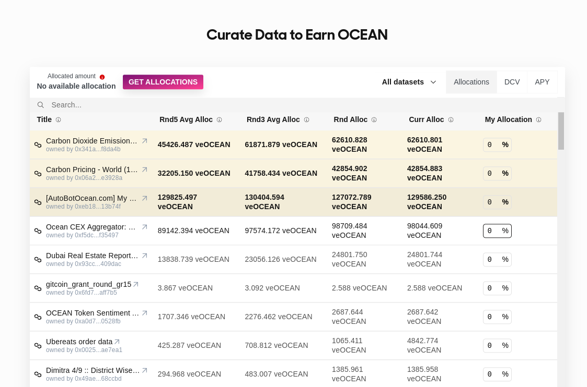

<figure><figcaption>
K.I.S.S.
</figcaption></figure>

# Guide to Estimating APYs

Recall that APY is Annual Percentage Yield, and WPY is Weekly Percentage Yield.

**This page provides guidance to estimate APYs.**

### Estimating APY from WPYs

Here are a couple ways to estimate APY from WPYs: _with_ compounding, and without.

**APY with compounding.** 
- If you were to take OCEAN rewards for given week and immediately put them back into Data Farming, then your rewards will **compound** every week.
- Then, `APY = (1.0 + WPY for week 1) * (1.0 + WPY for week 2) * ... * (1.0 WPY for week 52) - 1.0.
- Assuming equal WPY per week, `APY = (1.0 + WPY)^52 - 1.0`. Use 52.25 not 52.0 if you wish.
- For WPY of 0.005, then `APY = (1.0 + 0.005)^52 - 1.0 = 0.296 = 29.6%`.
- This assumes zero gas fees. That's reasonable given that staking & claiming are one-time transactions.

**APY without compounding.**
- If you don't do compounding, then `APY = (WPY for week 1) + (WPY for week 2) + ... + (WPY for week 52)`.
- Assuming equal WPY per week, `APY = WPY * 52`.
- For WPY of 0.05, then `APY = 0.005 * 52 = 0.260 = 26.0%`.
- This assumes zero gas fees. This works if you have a large amount of veOCEAN, and therefore large weekly OCEAN rewards, compared to gas fees. If that's not the case, so that gas fees don't destroy your profits, then you should (a) compound less often (b) use gas when it's cheapest, [see here](https://www.useweb3.xyz/gas).

### Estimating Passive DF APYs

The [Passive DF page](https://df.oceandao.org/passive-df) estimates profit & APY for you, as you explore different values of # OCEAN, lock time, and number of compounds. It accounts for gas costs.

You'll find that if # OCEAN is too small or lock time is too short, profit and APY will be <0 because gas fees will overwhelm rewards. Conversely, higher OCEAN locked and longer lock times will make APY larger.

### Estimating Volume DF APYs

APY from Volume DF is a bit more complicated and depend on many factors that are currently hard to predict accurately. It is unlikely for the user to get a practical result, which is why we don't offer a tool to estimate this value right now.

You can easily expand the spreadsheet above to support a basic, naive calculations for Volume DF Rewards such as adding a fixed-rate.

To help solve this challenge, [we built a dashboard](https://df.oceandao.org/volume-df) that shows historical and ongoing summaries of APY, Data Consume Volume, and veOCEAN allocations per-round.

<figure><figcaption>
Curate like a Pro.
</figcaption></figure>

Finally, you can [review df-web code](https://github.com/oceanprotocol/df-web/blob/main/src/utils/rewards.js) to understand how the APYs on the UI are calculated.

### Estimating Predictoor DF APYs

**Predictoor and staking.** Staking is a fundamental component of Predictoor: when someone makes a prediction, they must have an OCEAN stake amount accompanying that prediction.

Amount of stake increases potential gain and potential loss. For a given prediction, the more one stakes, the more they earn if they're right; and the more they lose if wrong. Earnings if right are also a function of Predictoor data feed sales revenue.

Predictoor has staking independent of Data Farming. Therefore, yield comes even without DF. Then, _Predictoor DF_ acts as _extra_ sales revenue for Predictoor data feeds; and yield with Predictoor DF is even higher.

**Yield for predictoors.** We can apply the yield formula for each prediction:

`yield = (start amount + gained amount) / (start amount) - 1.0`

Where in Predictoor and Predictoor DF, values are:
- `start amount` = OCEAN staked in prediction
- `gained amount` = `revenue * stake / (all users stake) - fee` if correct, `stake` if incorrect

**Be careful!** Yield can be negative if one's stake far exceeds revenue, even with a highly accurate model. But, if one has right-sized stakes and an accurate model, then yield can be quite healthy.

**Rapid compounding.** In other DF streams, rewards come weekly; so compounding is weekly. In Predictoor and Predictoor DF, a predictoor's revenue (rewards) come every epoch (every 5min or 1h). Therefore compounding in Predictoor could be _very_ fast, for much healthier yields yet.

**Estimation fidelity.** Since Predictoor is so young, we don't have detailed estimates of Predictoor APYs yet. We're excited to see where this takes us:)

----

_Next: [FAQ](faq.md)_

_Back: [APYs](apys.md)_
