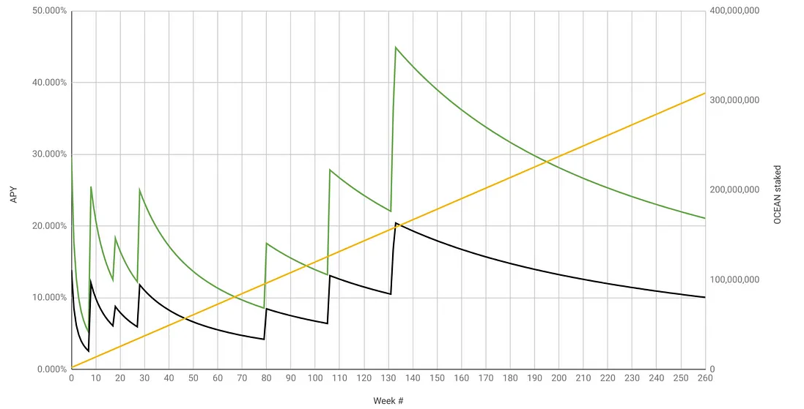

<figure><figcaption>

</figcaption></figure>

# Estimated APY vs Time

The plot below shows estimated APY over time. It brings together data from the [OCEAN reward schedule](reward-schedule.md) and estimates of **amount staked (yellow line** in plot).

**Green is total APY** from passive and active rewards.  **Passive rewards (black)** provides a great baseline with upside in **active rewards (green)**. For example, in DF29 wash consume became unprofitable and led to a drop in DCV and therefore active rewards.

<figure><figcaption>
<em>Green: estimated APYs (passive + active). Black: estimated APYs (just passive). Yellow: estimated staking</em> 
</figcaption></figure>

**It's an estimate.**
- That's ok! As the great statistician G.E. Box said, "All models are wrong, some are useful".
- APYs are an estimate because they depend on both DF rewards and OCEAN locked. Both of those are estimates, as follows.
- For simplicity, the model assumes that Active DF rewards are solely composed of Volume DF using the whole Active DF budget [1].
- OCEAN locked and lock time is not known for future weeks; it must be estimated [2].

**OCEAN lock time greatly affects APY.**
- The numbers above assume that all locked OCEAN is **locked for 4 years**, so that 1 OCEAN → 1 veOCEAN.
- But APY could be much worse or more if you lock for shorter durations. Divide by 4 if you lock for 1 year. [3] elaborates.

**Raw model.** All the plots are calculated from [this Google Sheet](https://docs.google.com/spreadsheets/d/1F4o7PbV45yW1aPWOJ2rwZEKkgJXbIk5Yq7tj8749drc/edit#gid=1051477754).

# Notes

[1] For better accuracy, one would need to account for Challenge DF and Predictoor DF. However, this gets more complex because Predictoor DF is highly dependent on prediction accuracy.

[2] We modeled OCEAN locked by observing linear growth from DF week 5 (when OCEAN locking was introduced) to week 28: OCEAN locked grew from 7.89M OCEAN to 34.98M OCEAN respectively, or 1.177M more OCEAN locked per week. The true values of OCEAN locked was last updated on DF week 29. For more accuracy, that could be updated to the values since then.

[3] Here are approximate bounds: If you lock for 4 years, and everyone else locks for 2, then multiply expected APY by 2. If you lock for 4 years and others for 1, then multiply by 4. Conversely, if you lock for 2 years and everyone else for 4, then divide your expected APY by 2. If you lock for 1 year and others for 4, then divide by 4. The numbers assume that you’re actively allocating veOCEAN allocation towards high-DCV data assets. For passive locking or low-DCV data assets, divide APY by 2 (approximate).
