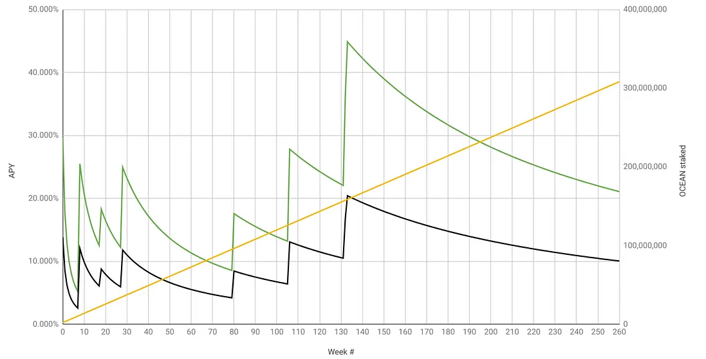

# APYs

**Contents:**

- [About APYs](#about-apys)
- [User Guide to Estimating APYs](#user-guide-to-estimating-apys)

# About APYs

Rewards are earned by users that hold and use their veOCEAN to help the protocol improve and grow.  

To receive competitive short-term APYs, veOCEAN requires users to make long-term commitments.

Pre-requisite: to really know APYs, you should first understand OCEAN reward schedule. Learn more [here](ocean-reward-schedule.md).

## Estimated APY vs Time

Let's work through the examples and keep it as simple as possible.

The plot below shows estimated APY over time. Green includes both passive and active rewards; black is just passive rewards. As of DF29, wash consume is no longer profitable, so we should expect a large drop in DCV and therefore in active rewards. So passive rewards (black) provides a great baseline with upside in active rewards (green).

APYs are an estimate because APY depends on OCEAN locked. OCEAN locked for future weeks is not known precisely; it must be estimated. The yellow line is the model for OCEAN locked. We modeled OCEAN locked by observing linear growth from week 5 (when OCEAN locking was introduced) to week 28 (now): OCEAN locked grew from 7.89M OCEAN to 34.98M OCEAN respectively, or 1.177M more OCEAN locked per week.

<figure><figcaption>
<em>Green: estimated APYs (passive + active). Black: estimated APYs (just passive). Yellow: estimated staking</em> 
</figcaption></figure>

All the plots are calculated from [this Google Sheet](https://docs.google.com/spreadsheets/d/1F4o7PbV45yW1aPWOJ2rwZEKkgJXbIk5Yq7tj8749drc/edit#gid=1051477754).

OCEAN lock time affects APY. The numbers above assume that all locked OCEAN is locked for 4 years, so that 1 OCEAN → 1 veOCEAN. But APY could be much worse or more if you lock for shorter durations. Here are approximate bounds.

If you lock for 4 years, and everyone else locks for 2, then multiply expected APY by 2. If you lock for 4 years and others for 1, then multiply by 4. Conversely, if you lock for 2 years and everyone else for 4, then divide your expected APY by 2. If you lock for 1 year and others for 4, then divide by 4. The numbers assume that you’re actively allocating veOCEAN allocation towards high-DCV data assets. For passive locking or low-DCV data assets, divide APY by 2 (approximate).

----

<figure><figcaption>
K.I.S.S.
</figcaption></figure>

# User Guide to Estimating APYs

### Estimating Passive APY

To make it easier to estimate your APY, [we have created a simple spreadsheet](https://docs.google.com/spreadsheets/d/1zzuW5pBbX6j6hZL_XtJDtSR2-rDHa_LGOEwgoQ4D8lk/edit?usp=sharing) that let's you easily estimate your Passive APY.

We have provided 2 sheets as an example of locking-up 10,000 OCEAN for:
1. A 4-year investment period
2. A 6-mo investment period

The above are simplified examples meant for everyone to understand. They are naive investment strategies and are meant to provide you, the reader, with some examples to build upon. You can use these as a reference to create your own plan, so feel free to make a copy of this spreadsheet and customize it to your needs and wants.

### Estimating Active APY (from Volume DF)

Active Rewards are a bit more complicated and depend on many factors that are currently hard to predict accurately. It is unlikely for the user to get a practical result, which is why we don't offer a tool to estimate Active APY right now.

You can easily expand the spreadsheet above to support a basic, naive calculations for Active Rewards such as adding a fixed-rate.

To help solve this challenge, [we built a dashboard](https://df.oceandao.org/volume-df) that shows historical and ongoing summaries of APY, Data Consume Volume, and veOCEAN allocations per-round.

<figure><figcaption>
Curate like a Pro.
</figcaption></figure>

You can also [learn how rewards are calculated](../df-volumedf.md#how-rewards-are-calculated) to understand more about what's happening behind the scenes of each Data Farming round.

Finally, you can [review the implementation inside df-web](https://github.com/oceanprotocol/df-web/blob/main/src/utils/rewards.js) to understand how the APYs on the UI are calculated.