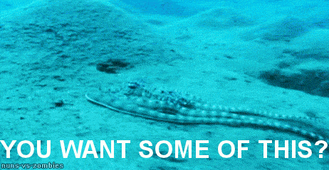

# Challenge Data Farming

<figure><figcaption>
It's a competition. Let's gooo!
</figcaption></figure>

**Contents:**

- [About Challenge DF](#about-challenge-df)
- [User Guide to Challenge DF](#user-guide-to-challenge-df)

## About Challenge DF

Challenge DF rewards data scientists for making predictions for future ETH price. It's a weekly challenge.

## Publish prediction models and earn rewards

**Prizes:**

Prize Pool: 1,000 OCEAN (as of Nov 2, 2022)

- 1st Place - 500 OCEAN
- 2nd Place - 300 OCEAN
- 3rd Place - 200 OCEAN

### What are the base rules?

- A fresh challenge begins and concludes every Thursday
- You have to submit your entry before the deadline.
- At the beginning of each week, a predetermined amount of OCEAN is allocated as rewards.
- Competitors need to submit 12 predictions by using a DataNFT to share data.
- The rewards are divided into specific amounts for the top three positions.
- The individuals who submit the top three entries will receive rewards, and their wallet addresses will be showcased within the Data Farming dapp.

For the full details on how to submit, please read the [Where to start](#where-to-start) section.

### What do I gain from this?

- Earn OCEAN rewards, [claimable inside the app](https://df.oceandao.org/rewards)
- Gain in-depth knowledge of the Ocean Protocol stack.
- Increase your visibility by achieving a place on the podium.
- Create valuable assets that can be monetized on the Ocean Marketplace.
- Enhance your skills and engage in friendly competition with other participants.

### Where to start?

Head over to the [Challenges Page](https://df.oceandao.org/challenge-df) to learn more about Challenge DF, see historical results, and find out where you go to submit.

If you're looking for a step-by-step guide on what a challenge entails and how to claiming your well-deserved rewards, check out the [Challenge DF  user guide](user-guides/how-to-challengedf.md). It will provide you with all the necessary information you need to make the most out of the challenges.

You can find a direct link to the [Challenge DF README](https://github.com/oceanprotocol/predict-eth/blob/main/challenges/challenge-df.md) which you'll be using to submit your predictions.

### Good lock and happy coding!

<figure><figcaption></figcaption></figure>

----

# User Guide to Challenge DF

<figure></figure>

## Predict to earn

By participating in the weekly data challenges of predicting the price of Ethereum, you will become familiar with the Ocean Protocol stack and with building predictions that can be sold for money.

These are the steps to get involved:

#### Step 1 - Navigate to the Data Farming dApp

Go to [Data Farming dApp](https://df.oceandao.org)

#### Step 2 - Go to the "Challenges" page

After the dApp loads, look for the menu and click on "Challenges"

<figure><figcaption>
Find "Challenges" in the menu and click on it
</figcaption></figure>

#### Step 3 - Click on "Participate"

After clicking on "Participate" you will be [linked to the Challenge DF README](https://github.com/oceanprotocol/predict-eth/blob/main/challenges/challenge-df.md) that outlines all details about the challenge.

<figure><figcaption>
Click the Participate button
</figcaption></figure>

#### Step 4 - Use README to publish your predictions

You can see the ongoing challenge right away together with some key informations such as submission deadline and available rewards.

Follow the README steps to publish your model and compete in the challenge.

<figure><figcaption>
How to submit Challenge DF
</figcaption></figure>

#### Step 5 - Check weekly results

Challenge DF weekly results become available at the end of every Data Farming round and can be viewed in the Challenges page.

The top 3 competitors win prizes and are visible in the leaderboard.

<figure><figcaption>
Past Challenges leaderboard
</figcaption></figure>

#### Step 6 - View and claim Active Rewards.

To view and claim your rewards:

1. Make sure your wallet is connected.
2. Your Challenge DF substream rewards will be displayed to the left besides "rewards". As you can see, it will be added to other active rewards that can be claimed besides "total rewards".
3. To claim all Active Rewards including your Challenge DF rewards, simply click on the "Claim Rewards" button.

<figure><figcaption>
Click the Claim Rewards button
</figcaption></figure>
