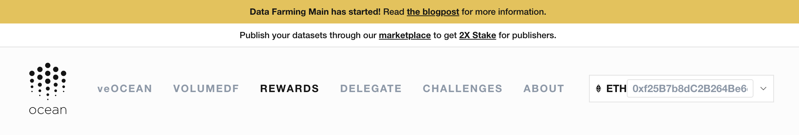
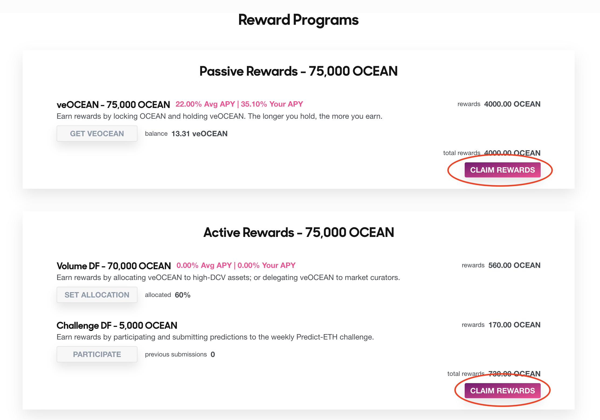

# Claim Rewards in DF

<figure><figcaption></figcaption></figure>

**This page describes how to claim DF rewards.** (Predictoor DF is an exception, [see here](predictoordf-guide.md).)

To claim rewards, go to DF webapp's **[Rewards page](https://df.oceandao.org/rewards)** and click "Claim OCEAN rewards" button.

Detailed instructions are below.

### Step 1 - Navigate to the Data Farming Rewards page

Go to [https://df.oceandao.org/](https://df.oceandao.org), and click the Rewards [link](https://df.oceandao.org/rewards) at the top of the page.

<figure><figcaption>
Click the Rewards link at the top of the page
</figcaption></figure>

### Step 2 - Click the pink 'Claim # OCEAN' buttons 🛎️

At the bottom of the 'Passive Rewards' and 'Active Rewards' panels are the 'Claim # OCEAN' buttons that appear pink and clickable on Thursdays.

This is where you click to claim your rewards! Easy peasy. You will need to approve the transactions with your wallet.

<figure><figcaption>
Click the pink Claim # Ocean buttons
</figcaption></figure>

### First time claiming?

You will need to wait at least one week, but not more than two weeks to claim your rewards for the first time. Check back on Thursday!

### Forgot to claim?

If you forget to claim your OCEAN rewards, then do not worry because they continue to accumulate! It's all fine. You can claim them anytime after Thursday. 😃

----

_Next: [Reward Schedule](reward-schedule.md)_

_Back: [Predictoor DF Guide](predictoordf-guide.md)_
