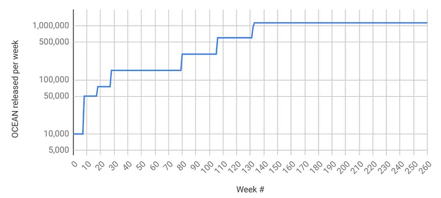
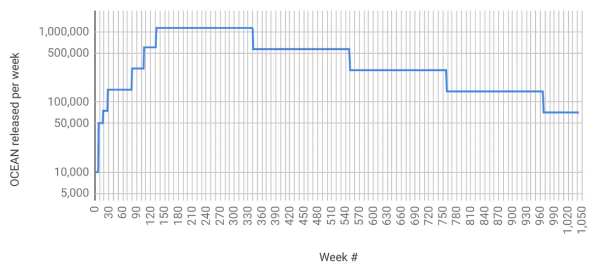
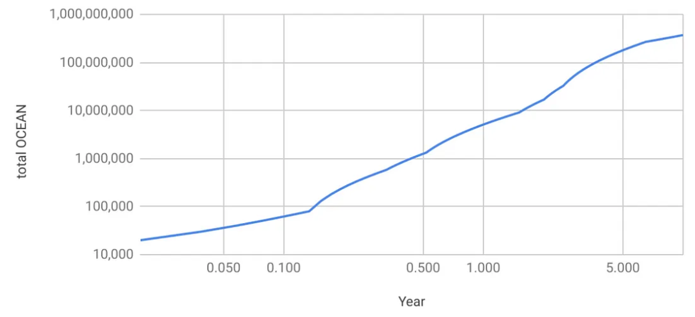

# Emissions & APYs

<figure><figcaption>
Like a true master of The Way of Data Farming.
</figcaption></figure>

## Understand emissions to know APYs

To really know APYs, you should understand emissions and how they play a role in the funds disributed inside Ocean Protocol.  

If you are looking to get an overview of APYs, please read the [basics of estimating APY](df-intro.md#estimating-apy) first.  

If you want to see some examples of how to calculate it, you can find out more in the [Estimate APY user guides](user-guides/how-to-estimate-apy.md).  

### Why veOCEAN is important to OceanDAO

veOCEAN enables OceanDAO to be more user-focused, community-driven, and futuristic revenue-sharing like CurveDAO:

* ve (vote escrowed) is at the heart with v = voting (in asset curation) and e = escrowed (locked) OCEAN. The longer that Data Farmers lockup their OCEAN, the more voting and rewards, which reconciles near and long-term DAO incentives.
* OceanDAO has an increased bias to automation and to minimizing the governance attack (hack) surface via veOCEAN.

The baseline emissions schedule determines the weekly OCEAN budget for this phase. The schedule mimics Bitcoin when including a half-life of 4 years. Unlike Bitcoin, there is a burn-in period to ratchet up value-at-risk versus time:

* The curve initially gets a multiplier of 10% for 12 months (DF Main 1)
* Then, it transitions to multiplier of 25% for 6 months (DF Main 2)
* Further, a multiplier of 50% for 6 months (DF Main 3)
* Finally, a multiplier of 100%. (DF Main 4)

We implement the first three phases as constants, because they are relatively short in duration. We implement the fourth phase as a Bitcoin-style exponential: constant, with the constant dividing by two (“halvening”) every four years.

Let’s visualize!

## Emissions — first 5 years.

The image below shows the first 5 years. The y-axis is OCEAN released each week. It’s log-scaled to easily see the differences. The x-axis is time, measured in weeks. In weeks 0–29, we can see the distinct phases for DF Alpha (DF1 // week 0), DF/VE Alpha (DF5 // week 4), DF Beta (DF9 // week 8), DF Main 1 (DF29 // week 28), DF Main 2 (DF80 // week 79), DF Main 3 (DF106 // week 105), and DF Main 4 (DF132 // week 131).

<figure><figcaption>
<em>OCEAN released to DF per week — first 5 years</em>
</figcaption></figure>

## Emissions — first 20 years.

The image below is like the previous one: OCEAN released per week, but now for the first 20 years. Week 131 onwards is DF Main 4. We can see that the y-value divides by two (“halvens”) every four years.

<figure><figcaption>
<em>OCEAN released to DF per week — first 20 years</em>
</figcaption></figure>

## Total OCEAN released.

The image below shows the total OCEAN released by DF for the first 20 years. The y-axis is log-scaled to capture both the small initial rewards and exponentially larger values later on. The x-axis is also log-scaled so that we can more readily see how the curve converges over time.

<figure><figcaption>
<em>Total OCEAN released to DF — first 20 years</em>
</figcaption></figure>

## Example APYs

The plot below shows estimated APY over time. Green includes both passive and active rewards; black is just passive rewards. As of DF29, wash consume is no longer profitable, so we should expect a large drop in DCV and therefore in active rewards. So passive rewards (black) provides a great baseline with upside in active rewards (green).

APYs are an estimate because APY depends on OCEAN locked. OCEAN locked for future weeks is not known precisely; it must be estimated. The yellow line is the model for OCEAN locked. We modeled OCEAN locked by observing linear growth from week 5 (when OCEAN locking was introduced) to week 28 (now): OCEAN locked grew from 7.89M OCEAN to 34.98M OCEAN respectively, or 1.177M more OCEAN locked per week.

<figure><figcaption>
<em>Green: estimated APYs (passive + active). Black: estimated APYs (just passive). Yellow: estimated staking</em> 
</figcaption></figure>

All the plots are calculated from [this Google Sheet](https://docs.google.com/spreadsheets/d/1F4o7PbV45yW1aPWOJ2rwZEKkgJXbIk5Yq7tj8749drc/edit#gid=1051477754).

OCEAN lock time affects APY. The numbers above assume that all locked OCEAN is locked for 4 years, so that 1 OCEAN → 1 veOCEAN. But APY could be much worse or more if you lock for shorter durations. Here are approximate bounds.

If you lock for 4 years, and everyone else locks for 2, then multiply expected APY by 2. If you lock for 4 years and others for 1, then multiply by 4. Conversely, if you lock for 2 years and everyone else for 4, then divide your expected APY by 2. If you lock for 1 year and others for 4, then divide by 4. The numbers assume that you’re actively allocating veOCEAN allocation towards high-DCV data assets. For passive locking or low-DCV data assets, divide APY by 2 (approximate).

## A Brief History of Data Farming

Data Farming has evolved over time and will continue to do so as the Emission Curve progresses. Below are the phases and parameters incurred during the evolution of the Data Farming program. We are now in the DF Main phase.

**DF Alpha - Rounds 1-4 (4 wks)**\
10K OCEAN rewards were budgeted per week. Counting started Thu June 16, 2022 and ended July 13, 2022. Rewards were distributed at the end of every week, for the activity of the previous week. It ran for 4 weeks. The aim was to test technology, learn, and onboard data publishers.

**DF/VE Alpha - Rounds 5-8 (4 wks)**\
10K OCEAN rewards were budgeted per week. Counting started Thu Sep 29, 2022 and ended Oct 27, 2022. Rewards were distributed at the end of every week, for the activity of the previous week. It ran for 4 weeks. The aim was to resume Data Farming along with veOCEAN, test the technology, onboard data publishers, and keep learning.

**DF Beta - Rounds 9-28 (20 wks)**\
Up to 100K OCEAN rewards were budgeted per week. Counting started Thu Oct 27, 2022, and ended on March 15, 2023. It ran for 20 weeks. The aim was to test the effect of larger incentives, and support ecosystem participation, while continually refining the underlying technology.

**DF Main - Rounds 29-1000+**\
We are now in DF Main which immediately followed the release of DF Beta on Thu Mar 16, 2023. Rewards begin at 150k per week and goes up to 1.1M OCEAN per week. DF Main emits 503.4M OCEAN worth of rewards and lasts for decades.

The amount of OCEAN released is determined by the emission schedule as defined by the [Emission Curve](df-emissions-apys.md#emissions--first-5-years), and perhaps more easily understood in the [Reward Schedule](df-intro.md#reward-schedule).