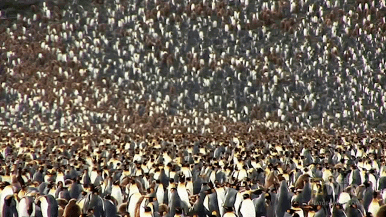

# OCEAN Reward Schedule

<figure><figcaption>
Multiply, and multiply again. And again.
</figcaption></figure>

## OCEAN Reward Schedule

## Reward Schedule

The table below shows the total amount of OCEAN rewards that will be distributed among Passive and Active rewards each week. The table cross-references DF Round Number, Start Date, Phase & Week, Sub-Phase & Week, and OCEAN Rewards/Week.

<figure><figcaption>
<em>Ocean Reward Schedule for the next 20+ years</em>
</figcaption></figure>

<figure><figcaption></figcaption></figure>

### DF Phases

DF proceeds one round at a time. Each round is weekly. Rounds are grouped into four phases: DF Alpha, DF/VE Alpha, DF Beta, and DF Main. We are now in the "DF Main" phase. Here are details including OCEAN emissions per phase.

**DF Alpha - Rounds 1-4 (4 wks)**

10K OCEAN rewards were budgeted per week. Counting started Thu June 16, 2022 and ended July 13, 2022. Rewards were distributed at the end of every week, for the activity of the previous week. It ran for 4 weeks. The aim was to test technology, learn, and onboard data publishers.

**DF/VE Alpha - Rounds 5-8 (4 wks)**

10K OCEAN rewards were budgeted per week. Counting started Thu Sep 29, 2022 and ended Oct 27, 2022. Rewards were distributed at the end of every week, for the activity of the previous week. It ran for 4 weeks. The aim was to resume Data Farming along with veOCEAN, test the technology, onboard data publishers, and keep learning.

**DF Beta - Rounds 9-28 (20 wks)**

Up to 100K OCEAN rewards were budgeted per week. Counting started Thu Oct 27, 2022, and ended on March 15, 2023. It ran for 20 weeks. The aim was to test the effect of larger incentives, and support ecosystem participation, while continually refining the underlying technology.

**DF Main - Rounds 29-1000+**

We are now in DF Main which immediately followed the release of DF Beta on Thu Mar 16, 2023. Rewards begin at 150k per week and goes up to 1.1M OCEAN per week. DF Main emits 503.4M OCEAN worth of rewards and lasts for decades.

## Emissions schedule

The emissions schedule determines the weekly OCEAN budget for Data Farming.

The schedule mimics Bitcoin when including a half-life of 4 years. Unlike Bitcoin, there is a _burn-in period_ to ratchet up value-at-risk versus time:

* The curve initially gets a multiplier of 10% for 12 months (DF Main 1)
* Then, it transitions to multiplier of 25% for 6 months (DF Main 2)
* Further, a multiplier of 50% for 6 months (DF Main 3)
* Finally, a multiplier of 100%. (DF Main 4)

We implement the first three phases as constants, because they are relatively short in duration. We implement the fourth phase as a Bitcoin-style exponential: constant, with the constant dividing by two (“halvening”) every four years.

Let’s visualize!

## Emissions — first 5 years

The image below shows the first 5 years. The y-axis is OCEAN released each week. It’s log-scaled to easily see the differences. The x-axis is time, measured in weeks. In weeks 0–29, we can see the distinct phases for DF Alpha (DF1 // week 0), DF/VE Alpha (DF5 // week 4), DF Beta (DF9 // week 8), DF Main 1 (DF29 // week 28), DF Main 2 (DF80 // week 79), DF Main 3 (DF106 // week 105), and DF Main 4 (DF132 // week 131).

<figure><figcaption>
<em>OCEAN released to DF per week — first 5 years</em>
</figcaption></figure>

## Emissions — first 20 years

The image below is like the previous one: OCEAN released per week, but now for the first 20 years. Week 131 onwards is DF Main 4. We can see that the y-value divides by two (“halvens”) every four years.

<figure><figcaption>
<em>OCEAN released to DF per week — first 20 years</em>
</figcaption></figure>

## Total OCEAN released

The image below shows the total OCEAN released by DF for the first 20 years. The y-axis is log-scaled to capture both the small initial rewards and exponentially larger values later on. The x-axis is also log-scaled so that we can more readily see how the curve converges over time.

<figure><figcaption>
<em>Total OCEAN released to DF — first 20 years</em>
</figcaption></figure>

