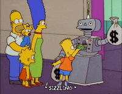

# Guide to Predictoor DF

<figure></figure>

In Predictoor DF (and Predictoor proper), you run prediction bots to earn continuously. This guide describes how to become eligible for USDC rewards and claim them. And of course first thing you need to do is become a predictoor.

## How to become a predictoor

- Play with the dapp: http://predictoor.ai
- Then go through "How to earn as a Predictoor" in [Predictoor docs](https://docs.predictoor.ai)
- Or, go straight to the [quickstart README](https://github.com/oceanprotocol/pdr-backend/blob/main/READMEs/predictoor.md) :) 🏎️

## On USDC Rewards in Predictoor DF

- **Duration:** ongoing
- **To be eligible:** predictoors are automatically eligible 🧘
- **To claim:** Run the USDC payout script. See the [payout README](https://github.com/oceanprotocol/pdr-backend/blob/main/READMEs/payout.md) for specific instructions.

----

_Next: Jump to [DF FAQ](faq.md)._

_Back: [Predictoor DF](predictoordf.md)_
