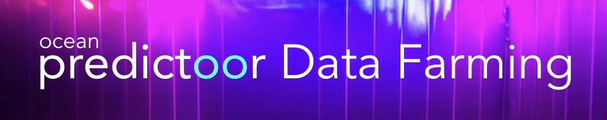

<figure></figure>

**This page** is about Predictoor DF, and [this page](predictoordf-guide.md) is a guide.

# Predictoor DF Overview

**Predictoor DF** is a DF stream that amplifies predictoors’ earnings, via extra sales to ASI Predictoor data feeds.

Predictoor DF weekly rewards are 3,750 [OCEAN](https://www.coingecko.com/en/coins/ocean-protocol) and 20,000 ROSE rewards (through 2025).

## Introduction

**[Predictoor](../predictoor/README.md)** data feeds predict whether BTC, ETH etc will rise or fall 5min or 1h into the future. These feeds are crowdsourced by “predictoors”: people running AI-powered prediction bots.

**[Data Farming (DF)](../data-farming/README.md)** is Ocean’s incentive program, that rewards OCEAN to people who make crypto price predictions.

You should be familiar with both Predictoor and DF before reading on.

## Predictoor DF Timing

Predictoor DF started counting on Nov 9, 2023, at the beginning of Data Farming Round 63 (DF63). It runs indefinitely.

## Predictoor DF Rewards

Predictoor DF has one component: [OCEAN](https://www.coingecko.com/en/coins/ocean-protocol) rewards.

### OCEAN Rewards

- A special “DF buyer” bot purchases Predictoor feeds. It started operating on Nov 9, 2023. Every day, it spends 1/7 of the weekly Predictoor OCEAN budget for another 24h subscription. It spends an equal amount per feed. (Currently there are  feeds: 10 x 5min, 10 x 1h.)
- The OCEAN comes from the Ocean DF budget, and specifically, the Active DF budget.
- Payout happens on Mondays, 4 days after the end of the DF round. 
- Payout for a given predictoor is pro-rata to the net earnings of that predictoor over that DF round, specifically (total sales $ to the predictoor) minus (predictoor stake slashed due to being wrong).

## How to Earn $ Via Predictoor DF

**Running a predictoor bot will automatically make you eligible for Predictoor DF rewards.**

The [Predictoor DF user guide](predictoordf-guide.md) tells how to get started as a predictoor, and how to claim rewards.

----

_Next: [Predictoor DF Guide](predictoordf-guide.md)_

_Back: [DF Main](README.md)_
