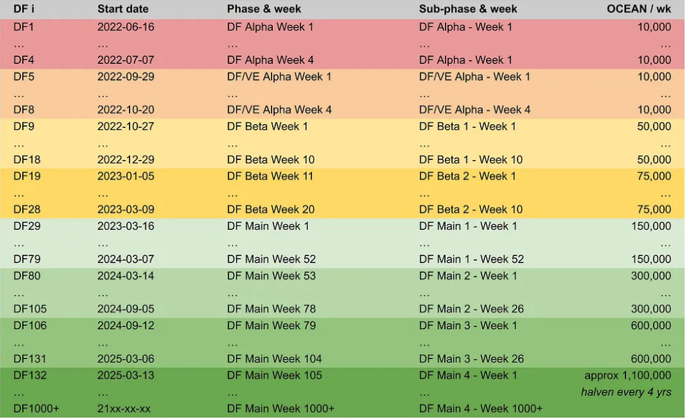
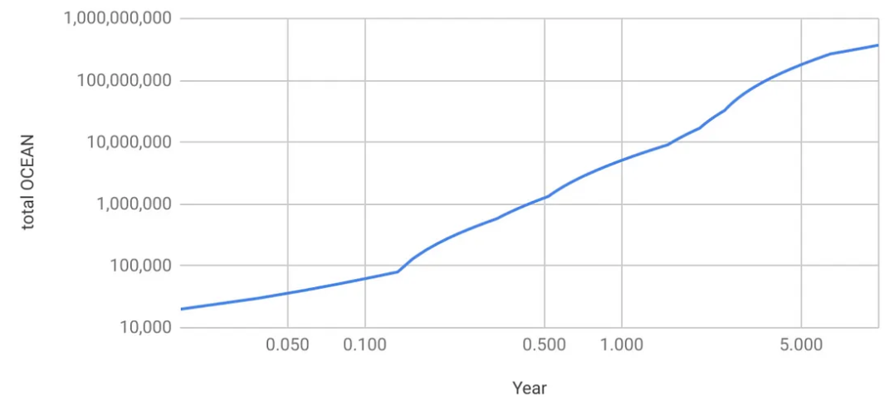

# OCEAN Reward Schedule

<figure><figcaption></figcaption></figure>

## Overview

DF proceeds one round at a time. Each round is weekly.

Rewards are distributed at the end of every week, for the activity of the previous week.

The reward schedule = the emission schedule, definining the weekly OCEAN budget for DF. DF currently rewards 150K OCEAN per round. Over time, rewards will increase to be as high as 1.1M OCEAN / week, then decay over time Bitcoin-style.

DF rounds are grouped into four phases: DF Alpha, DF/VE Alpha, DF Beta, and DF Main. We are now in the "DF Main" phase.

The table below shows OCEAN rewards per round, and corresponding phase.

<figure><figcaption>
<em>Ocean Reward Schedule for the next 20+ years</em>
</figcaption></figure>

### DF Phases

Each of the first three phases -- DF Alpha, DF/VE Alpha, and DF Beta phases -- had a fixed value. Each of these ran for 4-20 weeks. The final phase -- DF Main -- runs for decades with a Bitcoin-like emissions-schedule (plus a burn-in-period).

### Phase: DF Alpha - Rounds 1-4 (4 wks)
  - 10K OCEAN rewards per week.
  - Counting started Thu June 16, 2022 and ended July 13, 2022. It ran for 4 weeks. DF was temporarily paused after this, for time to put veOCEAN into place.
  - The aim was to test technology, learn, and onboard data publishers.

### Phase: DF/VE Alpha - Rounds 5-8 (4 wks)
  - 10K OCEAN rewards were per week.
  - Counting started Thu Sep 29, 2022 and ended Oct 27, 2022. It ran for 4 weeks.
  - The aim was to resume Data Farming with veOCEAN, test the technology, onboard data publishers, and keep learning.

### Phase: DF Beta - Rounds 9-28 (20 wks)
  - Up to 100K OCEAN rewards per week.
  - Counting started on Oct 27, 2022, ie the day DF/VE Alpha ended. Counting ended on March 15, 2023. It ran for 20 weeks.
  - The aim was to test the effect of larger incentives, and support ecosystem participation, while continually refining the underlying technology.

### Phase: DF Main - Rounds 29-1000+
  - Rewards began at 150K OCEAN per week, and go up to 1.1M OCEAN per week. Total emissions are 503.M OCEAN.
  - Counting started on March 15, 2023, ie the day DF Beta ended. It runs for decades.
  - DF Main's schedule mimics Bitcoin including a half-life of 4 years. Unlike Bitcoin, there is a _burn-in period_ to ratchet up value-at-risk versus time. Burn-in is implemented via four sub-phases: DF Main 1, 2, 3 and 4 with multipliers of 10%, 25%, 50%, and 100% respectively.
    - DF Main 1 emits 150K OCEAN per week. It runs 12 months.
    - DF Main 2 starts on Mar 14, 2024 (DF80). Rewards go 2x, to 300K OCEAN / week. It runs 6 months.
    - DF Main 3 starts on Sep 12, 2024 (DF106). Rewards go 2x, to 600K OCEAN / week. It runs 6 months.
    - DF Main 4 starts on Mar 13, 2025 (DF132). Rewards begin at 1.1M OCEAN / week then halve every four years. It runs for decades.

## Visualize Emissions: First 5 years

Let’s visualize emissions!

The image below shows the first 5 years (including all DF Phases). The y-axis is OCEAN released each week. It’s log-scaled to easily see the differences. The x-axis is time, measured in weeks. In weeks 0–29, we can see the distinct phases for DF Alpha (DF1 // week 0), DF/VE Alpha (DF5 // week 4), DF Beta (DF9 // week 8), DF Main 1 (DF29 // week 28), DF Main 2 (DF80 // week 79), DF Main 3 (DF106 // week 105), and DF Main 4 (DF132 // week 131).

<figure><figcaption>
<em>OCEAN released to DF per week — first 5 years</em>
</figcaption></figure>

## Visualize Emissions: First 20 years

The image below is like the previous one: OCEAN released per week. But now, we show for the first 20 years. Week 131 onwards is DF Main 4. We can see that the y-value divides by two (“halvens”) every four years.

<figure><figcaption>
<em>OCEAN released to DF per week — first 20 years</em>
</figcaption></figure>

## Visualize Total OCEAN released

The image below shows the total OCEAN released by DF for the first 20 years. The y-axis is log-scaled to capture both the small initial rewards and exponentially larger values later on. The x-axis is also log-scaled so that we can more readily see how the curve converges over time.

<figure><figcaption>
<em>Total OCEAN released to DF — first 20 years</em>
</figcaption></figure>

## Further resources

The blog post ["Data Farming Main is here"](https://blog.oceanprotocol.com/ocean-data-farming-main-is-here-49c99602419e) provides further detail yet.