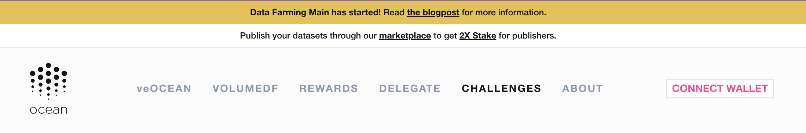

# Guide: Challenge DF

<figure></figure>

## Predict to earn

If you're eager to begin extracting value from data but aren't sure how to get started, then [Challenge DF is here to help](../df-challengedf.md)!

By participating in the weekly data challenges of predicting the price of Ethereum, you will become familiar with the Ocean Protocol stack and with building predictions that can be sold for money.

These are the steps to get involved:

#### Step 1 - Navigate to the Data Farming dApp

Go to [Data Farming dApp](https://df.oceandao.org)

#### Step 2 - Go to the "Challenges" page

After the dApp loads, look for the menu and click on "Challenges"

<figure><figcaption>
Find "Challenges" in the menu and click on it
</figcaption></figure>

#### Step 3 - Click on "Participate"

After clicking on "Participate" you will be [linked to the Challenge DF README](https://github.com/oceanprotocol/predict-eth/blob/main/challenges/challenge-df.md) that outlines all details about the challenge.

<figure><figcaption>
Click the Participate button
</figcaption></figure>

#### Step 4 - Use README to publish your predictions

You can see the ongoing challenge right away together with some key informations such as submission deadline and available rewards.

Follow the README steps to publish your model and compete in the challenge.

<figure><figcaption>
How to submit Challenge DF
</figcaption></figure>

#### Step 5 - Check weekly results

Challenge DF weekly results become available at the end of every Data Farming round and can be viewed in the Challenges page.

The top 3 competitors win prizes and are visible in the leaderboard.

<figure><figcaption>
Past Challenges leaderboard
</figcaption></figure>

#### Step 6 - View and claim Active Rewards.

To view and claim your rewards:

1. Make sure your wallet is connected.
2. Your Challenge DF substream rewards will be displayed to the left besides "rewards". As you can see, it will be added to other active rewards that can be claimed besides "total rewards".
3. To claim all Active Rewards including your Challenge DF rewards, simply click on the "Claim Rewards" button.

<figure><figcaption>
Click the Claim Rewards button
</figcaption></figure>

