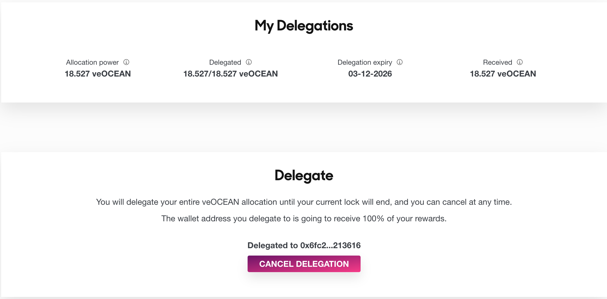

# Guide: Volume DF Delegation

<figure><figcaption></figcaption></figure>

## Why Delegate?

Delegation is a tool for Volume DF.

Consider these challenges:
- Your veOCEAN is on a hardware wallet and you want a "hot" software wallet to auto-delegate based on data consume volume, to increase APY
- You have >1 wallets and it's a pain to switch among them for delegating

[Delegation](https://df.oceandao.org/delegate) solves that. "To delegate" means "to transfer veOCEAN Allocation Power to another wallet address" for a limited period.

When you delegate, you delegate 100% of your veOCEAN Allocation power.


If you delegate 100% of your Allocation Power, your allocations will not count until the delegation expires. The delegation expiration date is the same as your veOCEAN Lock End Date at the time of delegation. If necessary, you can extend your Lock End Date before delegating. You can also cancel your delegation at any time 💪.   

Once delegated, rewards will be sent to the wallet address you delegated to. Then, the delegation receiver is in charge of your active rewards and is responsible for returning those back to you should you choose to do so.



### Steps to Delegate

Follow these steps to delegate your veOCEAN:

1. Go to the [Data Farming dApp](https://df.oceandao.org).
2. Navigate to the [Delegate page](https://df.oceandao.org/delegate).
3. In the 'Receiver wallet address' field, enter the wallet address you wish to delegate to
4. Click the 'Delegate' button, and sign the transaction with your wallet.
5. (Optional) Cancel the delegation to regain your allocation power before the delegation expires.

### What if someone delegates to you?

If you receive veOCEAN allocation power from other wallets, then you will receive their active rewards.

You _cannot_ re-delegate this veOCEAN further downstream.&#x20;

<figure><figcaption></figcaption></figure>