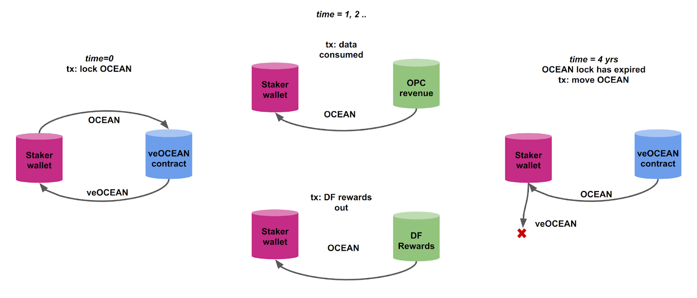

# veOCEAN and Passive Data Farming

<figure><figcaption>
I've got veOCEAN, my work is done.
</figcaption></figure>

**Contents:**

- [About veOCEAN and Passive DF](#about-veocean-and-passive-df)
- [User Guide to veOCEAN and Passive DF](#user-guide-to-veocean-and-passive-df)

# About veOCEAN and Passive DF

Here, Data Farmers earn OCEAN rewards by locking their OCEAN for veOCEAN for a period of time. That's it! It's low effort, ie passive.

The amount of rewards you get is pro-rata to the amount of veOCEAN you hold, cmopared to other veOCEAN holders.

### veOCEAN Time Locking

Users can lock their OCEAN for different lengths of time to gain more veOCEAN **voting power**. The Data Farming dApp is designed to lock OCEAN for **a minimum of 2 weeks and a maximum of four years** (for max rewards). The longer you lock your OCEAN, the more veOCEAN + OCEAN rewards you get!

On the dApp's [veOCEAN page](https://df.oceandao.org/veocean), the "Lock Multiplier" represents the percentage amount of veOCEAN received per OCEAN locked.

When users commit to locking their OCEAN for an extended time duration, they are rewarded with an increased amount of veOCEAN. This incentivizes users to have act with strong network support and confidence in the ecosystem.

| Year | Lock Multiplier | veOCEAN |
| ---- | --------------- | ------- |
| 1    | 0.25x           | 0.25    |
| 2    | 0.50x           | 0.50    |
| 3    | 0.75x           | 0.75    |
| 4    | 1.00x           | 1.00    |

After choosing your lock period and locking up your OCEAN into the vault, you will be credited with veOCEAN.

veOCEAN is non-transferable. You can’t sell it or send it to other addresses.

### Linear Decay

Your veOCEAN balance will slowly start declining as soon as you receive it.

veOCEAN balance decreases linearly over time until the Lock End Date. When your lock time has lapsed by 50%, you will have 50% of your original veOCEAN balance.

When your lock time ends your veOCEAN balance will hit 0, and your OCEAN can be withdrawn.

If you lock 1.0 OCEAN for 4 years, you get 1.0 veOCEAN at the start.

| Years Passed | veOCEAN Left |
| ------------ | ------------ |
| 1 year       | 0.75         |
| 2 years      | 0.50         |
| 3 years      | 0.25         |
| 4 years      | 0.00         |

At the end of your 4 years, your OCEAN is unlocked.

veOCEAN code is a fork of Curve's battle-tested [veCRV](https://curve.readthedocs.io/dao-vecrv.html) contracts that safeguard billions (veCRV). With this model there is no liquidity risk. You can’t lose your OCEAN through Impermanent Loss (IL). It is merely locked.  

# veOCEAN and your APY

Here are some good mental models to improve the outcome of your APY.
1. The longer you lock, the more you'll earn.
1. To improve yield, you will need to make good decisions for how long you'll choose to lock. The best way to do this is to learn how [Time Locking](#veocean-time-locking) and [Linear Decay](#linear-decay) function.
1. APYs are always calculated by dividing the amount of OCEAN received from rewards, by the relative amount of OCEAN locked up.
1. As a rule: _wherever APYs are provided to the user in the app (df.oceandao.org), they are caclulated assuming an initial 4-year lock up period with a weekly schedule of compounding rewards into an updated 4-year lock. This estimate works provided current: number of users, reward emissions, and other reward parameters stay constant while excluding all tx fees._

To help you more easily understand APYs, we have provided a couple of examples in the [how to estimate APY](user-guides/how-to-estimate-apy.md) user guide so you can visualize different setups and their relative yields.

### Replenishing your veOCEAN

To achieve optimal APY, participants would need to update their 4-year lock while considering costs and other variables to maintain an optimal amount of veOCEAN over time.

Participants are also able to add more OCEAN to their vault when updating an existing vault.

At any time, participants can choose to update their lock and continue from where they are or increase their lock duration.

### veOCEAN Earnings

All earnings for veOCEAN holders are claimable in the Ethereum mainnet.  

To be eligible for Data Farming Data assets for DFing may be published in any network where Ocean’s deployed in production: ETH Mainnet, Polygon, etc.)

Data Farming rounds occur weekly; in line with this, there’s a new [`ve`](https://github.com/oceanprotocol/df-py/tree/main/contracts/ve) distribution “epoch” every week. This affects when you can first claim rewards. Specifically, if you lock OCEAN on day x, you’ll be able to claim rewards on the first ve epoch that begins after day x+7.  

Put another way, from the time you lock OCEAN, you must wait at least a week, and up to two weeks, to be able to claim rewards. (This behavior is inherited from veCRV. Here’s the [code](https://github.com/oceanprotocol/df-py/tree/main/contracts/ve)).  

### Locks & Withdrawal

veOCEAN is architected to be locked (i.e. 'staked') for a certain period of time and cannot be transferred or sold during the lock time that is determined by each user.

So it's important to note that: **"you will not be able to retrieve your locked OCEAN until the Lock End Date you selected on the dApp!**

After the Lock End Date, then you can withdraw your principal OCEAN on the [veOCEAN page](https://df.oceandao.org/veocean) on the left side panel.

### Flow of Value

The image below illustrates the flow of value. On the left, at time 0, the staker locks their OCEAN into the veOCEAN contract, and receives veOCEAN. In the middle, the staker receives OCEAN rewards every time there’s revenue to the Ocean Protocol Community (top), and also as part of Data Farming rewards (bottom). On the right, when the lock expires (e.g. 4 years) then the staker is able to move their OCEAN around again.

<figure><figcaption>
Flow of Value
</figcaption></figure>

The veOCEAN design is in accordance with the Web3 Sustainability Loop, which Ocean uses as its system-level design.

The veOCEAN code was forked from the veCRV code. veCRV parameters will be the starting point. To minimize risk, tweaks will be circumspect.

### Tradeability of veOCEAN; Relation to psdnOCEAN

Q: Are veOCEAN tradeable or have a market price?

OCEAN has a market price; it's [available](https://www.oceanprotocol.com/ocean-token) on many exchanges.

Once you lock OCEAN, you get veOCEAN. Unlike OCEAN, veOCEAN cannot be traded or transferred. However, you can [delegate](delegate.md) veOCEAN to others, who then controls allocation to data assets and receives rewards.

There's also the [psdnOCEAN](https://www.coingecko.com/en/coins/poseidon-ocean) option. psdnOCEAN is an ERC20-compliant "liquid staking derivative" [contract](https://etherscan.io/token/0x51fa2efd62ee56a493f24ae963eace7d0051929e) that in turn holds veOCEAN. psdnOCEAN is a product by [H2O](https://www.h2odata.xyz//), a team separate from - though collaborating with - the Ocean core team.
- You can lock OCEAN for psdnOCEAN via [the H2O "convert" dapp](https://liquid-staking.h2odata.xyz/convert/ocean).
- psdnOCEAN can be traded in exchanges like the [OCEAN-psdnOCEAN Balancer pool](https://app.balancer.fi/#/ethereum/swap?outputCurrency=0x51Fa2efd62ee56a493f24AE963eAce7D0051929E). ⚠️Be careful - if liquidity is low you will experience high slippage.

### Where the heck did we get this idea from?

The "veTokenomics" model of veOCEAN (vote-escrowed token economics) is inspired by Curve Finance's [veCRV](https://curve.readthedocs.io/dao-fees.html) token code. We took this inspiration to enable our users to participate in on-chain governance and earn rewards within the Ocean Protocol ecosystem.

[Here is Ocean Protocol's open-source code](https://github.com/oceanprotocol/contracts/blob/main/contracts/ve/veFeeDistributor.vy#L240-L256) for veOCEAN, and if you're a developer, then you'll notice the strong similarities to [veCRV's](https://curve.readthedocs.io/dao-fees.html) code.

### veOCEAN Smart Contracts Security

[veOCEAN core contracts](https://github.com/oceanprotocol/contracts/tree/main/contracts/ve) use [veCRV contracts](https://curve.readthedocs.io/dao-vecrv.html) with zero changes, on purpose: the veCRV contracts have been battle-tested since inception and have not had security issues. Nearly 500 million USD is locked across all forks of veCRV, with the leading DeFi protocols adopting this standard. veCRV contracts [have been audited by Trail of Bits and Quantstamp](https://github.com/curvefi/curve-dao-contracts#audits-and-security).

We have built [a new contract](https://github.com/oceanprotocol/contracts/blob/main/contracts/ve/veAllocate.sol) for users to point their veOCEAN towards given data assets (“allocate veOCEAN”). These new contracts do not control the veOCEAN core contracts at all. In the event of a breach, the only funds at risk would be the rewards distributed for a single week; and we would be able to redirect future funds to a different contract.

We have an [ongoing bug bounty via Immunefi](https://immunefi.com/bounty/oceanprotocol/) for Ocean software, including veOCEAN and DF components. If you identify an issue, please report it there and get rewarded.

----

# User Guide to veOCEAN and Passive DF

<figure><figcaption>
Get your gold. Get your veOCEAN.
</figcaption></figure>

In order to **get yield in DF**, you will need to lock your OCEAN first! When you lock your OCEAN, you get **veOCEAN** and **weekly passive OCEAN rewards** in return. veOCEAN is a token used in Ocean Protocol's Data Farming dApp to **generate even more yield,** called **Volume DF rewards**, for allocating your veOCEAN to your favorite assets and get a portion of their sales!

### Don't have OCEAN yet? Get those first!

#### Step 1 - Get OCEAN

- Acquire OCEAN via a decentralized exchange (DEX) such as Uniswap or a centralized exchange (CEX) such as Binance, Coinbase, etc.

#### Step 2 - Send to your self-custody wallet

- Send your OCEAN to a self-custody wallet of yours that supports ERC-20 tokens, like Metamask for example.

### Where the rubber meets the road 🚗💨

Not much of a reader? Watch and learn, friend


Watch and learn, friend


#### Step 3 - Go to Ocean Protocol's Data Farming dApp

- Go to [https://df.oceandao.org/](https://df.oceandao.org/)

#### Step 4 - Connect Your Wallet + Lock your OCEAN for veOCEAN

- Click on the purple circles in the interactive demo to walk through the steps for locking your OCEAN for veOCEAN.




In this step you will:

- Enter the amount of OCEAN that you are going to lock up
- Select a Lock End Date indicating how many weeks you’re going to lock up your OCEAN. (As the Lock End Date goes farther into the future, your Lock Multiplier increases).
- Click on the checkbox to agree to the disclaimer.
- Click the pink “Approve # OCEAN” button
- Accept the transaction in your wallet.
- Click the “Create Lock” button.
- Accept the transaction in your wallet.

Congratulations! You have now locked your OCEAN for veOCEAN and are generating passive yield automatically. You can [claim your passive OCEAN rewards](how-to-claim-rewards.md) every Thursday - note that your first time claiming rewards will require at least one week, but not more than 2 weeks of wait!