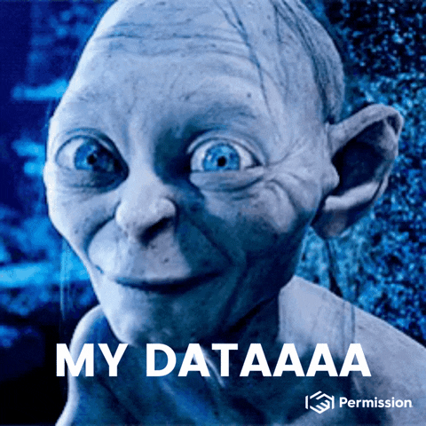

# 📊 Data Science

<figure><figcaption>
Ocean Protocol - Built to protect your precious.
</figcaption></figure>

### Why should data scientists use Ocean Protocol?

Ocean Protocol is built for data scientists to **monetize data effectively and** solve the ["Data Value Creation Loop"](the-data-value-creation-loop.md). Our [open-source tools](https://github.com/oceanprotocol) tackle some of **the biggest problems for data scientists**: how to sell data anonymously, how to sell compute jobs on datasets, how to control access to data, etc. By using blockchain architecture, Ocean achieves several tactical advantages over Web2 to solve these data sharing problems.

### What are some use cases for Ocean Protocol?

* Enable trustless transactions (i.e. buy, sell, and transfer data)
* Trace data provenance and consumption
* Token gate a website or dApp using datatokens
* Deploy a decentralized data marketplace
* Sell algorithmic compute jobs on private datasets

### How to design a ML system using Ocean Protocol?

The first step is to tokenize data into data NFTs and datatokens on the blockchain. We offer a no-code way to tokenize data via the [Ocean Market](https://market.oceanprotocol.com). But we also offer code options for data scientists to use the [Ocean.py](../developers/ocean.py/) and [Ocean.js](../developers/ocean.js/) libraries. Data scientists can then build sophisticated ML systems on top of the tokenized data by using composable Ocean Protocol tools. ML models can use a variety of Ocean smart contracts, including Ocean's [Compute-to-Data](../developers/compute-to-data/), to build model outputs all the way to the last-mile delivery for businesses.

### **Key Links for Data Scientists:**

* Learn the difference between Ocean Protocol [data NFTs and datatokens](../developers/contracts/datanft-and-datatoken.md), the two types of tokenized data assets you need to start building your ML systems.
* Discover Ocean's [Compute-to-Data](../developers/compute-to-data/) engine that can help you to solve the difficult problem of selling algorithmic compute jobs on your datasets without actually revealing the contents of the algorithm & dataset to the consumer.

