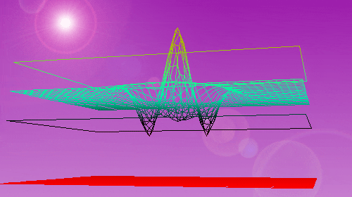

# The Data Value Creation Loop

<figure><figcaption>
A beautiful data visualization.
</figcaption></figure>

### What is the Data Value Creation Loop?

The Data Value Creation Loop is a journey where data progresses from a business problem to valuable insights. It involves collaboration among various skillsets like business stakeholders, data engineers, data scientists, MLOps engineers, and application developers.

Here's a condensed breakdown of the loop:

1. Business Problem: Identify the specific problem to solve using data science, such as reducing customer churn or predicting token prices.
2. Raw Data: Gather unprocessed data directly from sources, whether static or dynamic, like user profiles or historical prices.
3. Cleaned Data and Feature Vectors: Transform raw data into organized numerical representations, like cleaned sales data or preprocessed text transformed into word embeddings.
4. Trained Models: Train machine learning models on feature vectors to learn patterns and relationships, such as a random forest predicting coffee sales or GPT-3 trained on a text corpus.
5. Data to Tune Models: Introduce additional data to further refine and enhance model performance, like new sales data for the coffee shop model or domain-specific text data for GPT-3.
6. Tuned Models: Optimize models for high performance, accuracy, and robustness, such as a tuned random forest predicting busy hours for the coffee shop or a fine-tuned GPT-3 generating expert-level text.
7. Model Prediction Inputs: Provide inputs to the models to generate insights, like today's date and weather for the sales model or a text prompt for GPT-3 to generate a blog post.
8. Model Prediction Outputs: Obtain predictions or insights from the models based on the inputs, such as the sales model forecasting a spike in iced coffee sales or GPT-3 generating a blog post on sustainability in business.
9. Application: Package the models into applications that can impact real-world scenarios. Build user experiences around the data and model assets to make them usable and valuable.

To illustrate the process, let's consider an example: an insurance provider aiming to offer drought parametric insurance to farmers. They curate models to accurately predict a drought index value. Data engineers ingest climate and weather data and publish it on Ocean for computation. Data scientists conduct feature engineering and build predictive models using the data. Application developers integrate the models into production, enabling the insurance provider to offer the product. Farmers benefit, revenue is generated, and royalties are distributed to the data and model asset publishers, fostering sustainable value creation.

The described loop is just one example among countless opportunities across various domains. It can be applied in areas like DeFi, real estate, climate, sports, and healthcare. By structuring business problems, curating data, building models, and deploying assets on Ocean, you can kickstart your own data value creation loop.

Explore the next sections for ideas on how to begin your journey in the data value creation loop.

&#x20; &#x20;

