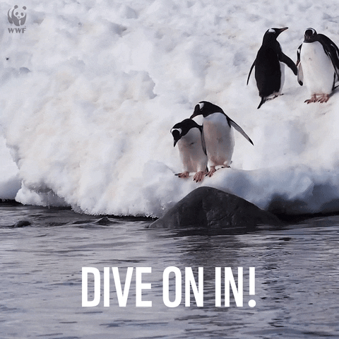

# 👨💻 Developers

Congratulations on making it this far! If you've arrived here, you're ready to embark on a deep dive into the captivating concepts and groundbreaking technology that powers Ocean Protocol. Get ready to unlock the secrets of the data universe and explore the inner workings of this incredible ecosystem. 🌊&#x20;

In Ocean Protocol, every asset gets its own cool and unique **ERC721** **data NFT**, along with one (or more) **ERC20** **datatokens**. It's like giving your data its very own superhero cape! 🦸‍♂️

With Ocean, crypto wallets transform into magical data wallets, where your data can roam freely and securely. Crypto exchanges? Well, they've taken on a new role as bustling data marketplaces, where you can showcase and trade your valuable data treasures. And hold on tight because DAOs are here to create epic data co-ops, where collaboration and innovation reign supreme! 🤝

But wait, there's more! Ocean Protocol offers a whole bunch of tools to unleash your [data scientist](ocean.py/) superpowers or flex your [JavaScript](ocean-libraries/) skills and create the next groundbreaking dAapp (that's a decentralized App, by the way). Get ready to shake up the data world! :ocean:

Now, if you're new to the world of web3 and blockchain technologies, fear not! We've got you covered. Before diving into the depths of Ocean Protocol, we recommend starting with some introductory guides. These [guides](../user-guides/) will gently introduce you to the magical world of [web3](../discover/wallets.md) and help you understand the [basics](../discover/wallets-and-ocean-tokens.md) before you embark on your epic data-driven adventure. So let's get started, shall we?

<figure><figcaption></figcaption></figure>

