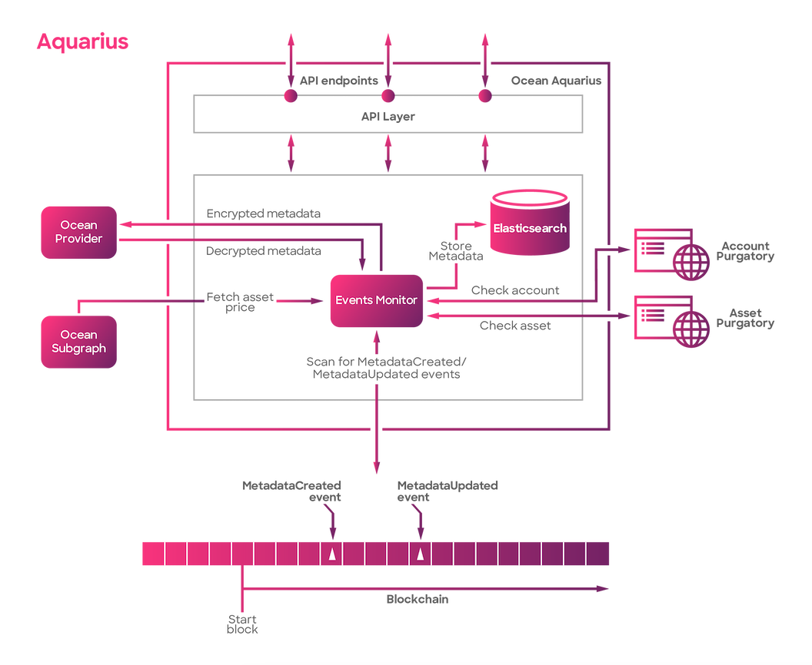

# Aquarius

### What is Aquarius?&#x20;

Aquarius is a tool that tracks and caches the metadata from each chain where the Ocean Protocol smart contracts are deployed. It operates off-chain, running an Elasticsearch database. This makes it easy to query the metadata generated on-chain.

The core job of Aquarius is to continually look out for new metadata being created or updated on the blockchain. Whenever such events occur, Aquarius takes note of them, processes this information, and adds it to its database. This allows it to keep an up-to-date record of the metadata activity on the chains.

Aquarius has its own interface (API) that allows you to easily query this metadata. With Aquarius, you don't need to do the time-consuming task of scanning the data chains yourself. It offers you a convenient shortcut to the information you need. It's ideal for when you need a search feature within your dApp.

<figure><figcaption>
Aquarius high level overview
</figcaption></figure>

### What does Aquarius do?

1. Acts as a cache: It stores metadata from multiple blockchains in off-chain in an Elasticsearch database.
2. Monitors events: It continually checks for MetadataCreated and MetadataUpdated events, processing these events and updating them in the database.
3. Offers easy query access: The Aquarius API provides a convenient method to access metadata without needing to scan the blockchain.
4. Serves as an API: It provides a REST API that fetches data from the off-chain datastore.
5. Features an EventsMonitor: This component runs continually to retrieve and index chain Metadata, saving results into an Elasticsearch database.
6. Configurable components: The EventsMonitor has customizable features like the MetadataContract, Decryptor class, allowed publishers, purgatory settings, VeAllocate, start blocks, and more.

### How to run Aquarius?

We recommend checking the README in the [Aquarius GitHub repository](https://github.com/oceanprotocol/aquarius) for the steps to run the Aquarius. If you see any errors in the instructions, please open an issue within the GitHub repository.&#x20;

### What technology does Aquarius use?

* Python: This is the main programming language used in Aquarius.
* Flask: This Python framework is used to construct the Aquarius API.
* Elasticsearch: This is a search and analytics engine used for efficient data indexing and retrieval.
* REST API: Aquarius uses this software architectural style for providing interoperability between computer systems on the internet.

### Postman documentation

Click [here](https://documenter.getpostman.com/view/2151723/UVkmQc7r) to explore the documentation and more examples in postman.
