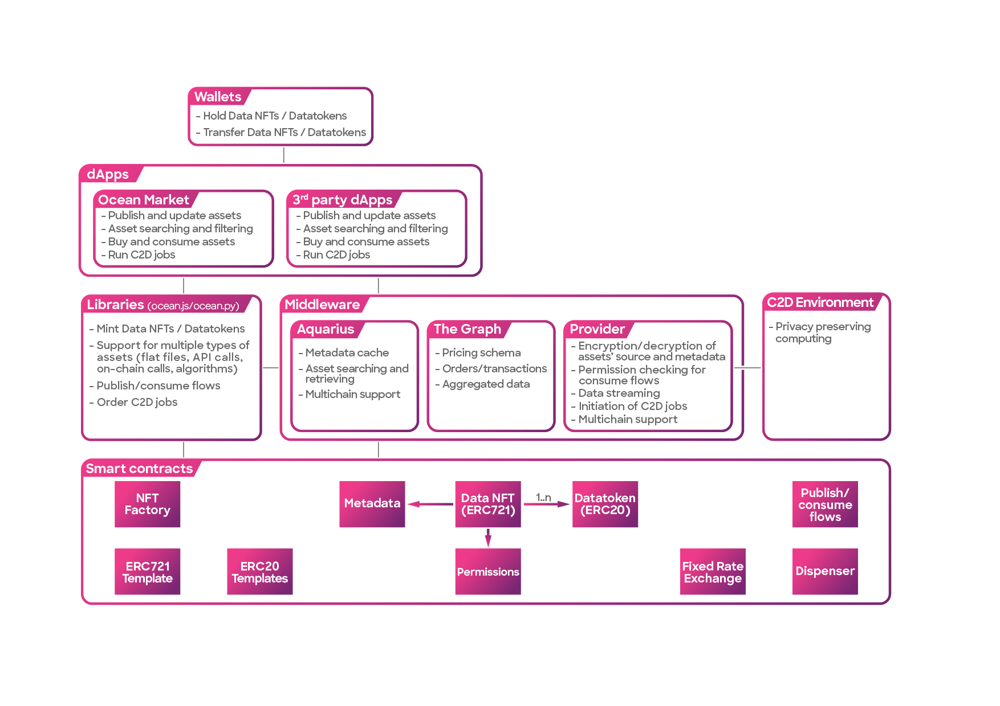

# Architecture Overview

Embark on an exploration of the innovative realm of Ocean Protocol, where data flows seamlessly and AI achieves new heights. Dive into the intricately layered architecture that converges data and services, fostering a harmonious collaboration. Let us delve deep and uncover the profound design of Ocean Protocol.🐬

<figure><figcaption>
Overview of the Ocean Protocol Architecture
</figcaption></figure>

### Layer 1: The Foundational Blockchain Layer

At the core of Ocean Protocol lies the robust [Blockchain Layer](contracts/README.md). Powered by blockchain technology, this layer ensures secure and transparent transactions. It forms the bedrock of decentralized trust, where data providers and consumers come together to trade valuable assets.

The [smart contracts](contracts/README.md) are deployed on the Ethereum mainnet and other compatible [networks](../discover/networks/README.md). The libraries encapsulate the calls to these smart contracts and provide features like publishing new assets, facilitating consumption, managing pricing, and much more. To explore the contracts in more depth, go ahead to the [contracts](contracts/README.md) section.

### Layer 2: The Empowering Middle Layer

Above the smart contracts, you'll find essential [libraries](architecture.md#libraries) employed by applications within the Ocean Protocol ecosystem, the [middleware components](architecture.md#middleware-components), and [Compute-to-Data](architecture.md#compute-to-data).

#### Libraries

These libraries include [Ocean.js](ocean.js/README.md), a JavaScript library, and [Ocean.py](ocean.py/README.md), a Python library. They serve as powerful tools for developers, enabling integration and interaction with the protocol.

1. [Ocean.js](ocean.js/README.md): Ocean.js is a JavaScript library that serves as a powerful tool for developers looking to integrate their applications with the Ocean Protocol ecosystem. Designed to facilitate interaction with the protocol, Ocean.js provides a comprehensive set of functionalities, including data tokenization, asset management, and smart contract interaction. Ocean.js simplifies the process of implementing data access controls, building dApps, and exploring data sets within a decentralized environment.
2. [Ocean.py](ocean.py/README.md): Ocean.py is a Python library that empowers developers to integrate their applications with the Ocean Protocol ecosystem. With its rich set of functionalities, Ocean.py provides a comprehensive toolkit for interacting with the protocol. Developers and [data scientists](../data-scientists/README.md) can leverage Ocean.py to perform a wide range of tasks, including data tokenization, asset management, and smart contract interactions. This library serves as a bridge between Python and the decentralized world of Ocean Protocol, enabling you to harness the power of decentralized data.

#### Middleware components

Additionally, in supporting the discovery process, middleware components come into play:

1. [Aquarius](aquarius/README.md): Aquarius acts as a metadata cache, enhancing search efficiency by caching on-chain data into Elasticsearch. By accelerating metadata retrieval, Aquarius enables faster and more efficient data discovery.
2. [Provider](provider/README.md): The Provider component plays a crucial role in facilitating various operations within the ecosystem. It assists in asset downloading, handles [DDO](ddo-specification.md) (Decentralized Data Object) encryption, and establishes communication with the operator-service for Compute-to-Data jobs. This ensures secure and streamlined interactions between different participants.
3. [Subgraph](subgraph/README.md): The Subgraph is an off-chain service that utilizes GraphQL to offer efficient access to information related to datatokens, users, and balances. By leveraging the subgraph, data retrieval becomes faster compared to an on-chain query. This enhances the overall performance and responsiveness of applications that rely on accessing this information.

#### Compute-to-Data

[Compute-to-Data](compute-to-data/README.md) (C2D) represents a groundbreaking paradigm within the Ocean Protocol ecosystem, revolutionizing the way data is processed and analyzed. With C2D, the traditional approach of moving data to the computation is inverted, ensuring privacy and security. Instead, algorithms are securely transported to the data sources, enabling computation to be performed locally, without the need to expose sensitive data. This innovative framework facilitates collaborative data analysis while preserving data privacy, making it ideal for scenarios where data owners want to retain control over their valuable assets. C2D provides a powerful tool for enabling secure and privacy-preserving data analysis and encourages collaboration among data providers, ensuring the utilization of valuable data resources while maintaining strict privacy protocols.

### Layer 3: The Accessible Application Layer

Here, the ocean comes alive with a vibrant ecosystem of dApps, marketplaces, and more. This layer hosts a variety of user-friendly interfaces, applications, and tools, inviting data scientists and curious explorers alike to access, explore, and contribute to the ocean's treasures.

Prominently featured within this layer is [Ocean Market](../user-guides/using-ocean-market.md), a hub where data enthusiasts and industry stakeholders converge to discover, trade, and unlock the inherent value of data assets. Beyond Ocean Market, the Application Layer hosts a diverse ecosystem of specialized applications and marketplaces, each catering to unique use cases and industries. Empowered by the capabilities of Ocean Protocol, these applications facilitate advanced data exploration, analytics, and collaborative ventures, revolutionizing the way data is accessed, shared, and monetized.

### Layer 4: The Friendly Wallets

At the top of the Ocean Protocol ecosystem, we find the esteemed [Web 3 Wallets](../discover/wallets/README.md), the gateway for users to immerse themselves in the world of decentralized data transactions. These wallets serve as trusted companions, enabling users to seamlessly transact within the ecosystem, purchase and sell data NFTs, and acquire valuable datatokens. For a more detailed exploration of Web 3 Wallets and their capabilities, you can refer to the [wallet intro page](../discover/wallets/README.md).

With the layers of the architecture clearly delineated, the stage is set for a comprehensive exploration of their underlying logic and intricate design. By examining each individually, we can gain a deeper understanding of their unique characteristics and functionalities.
