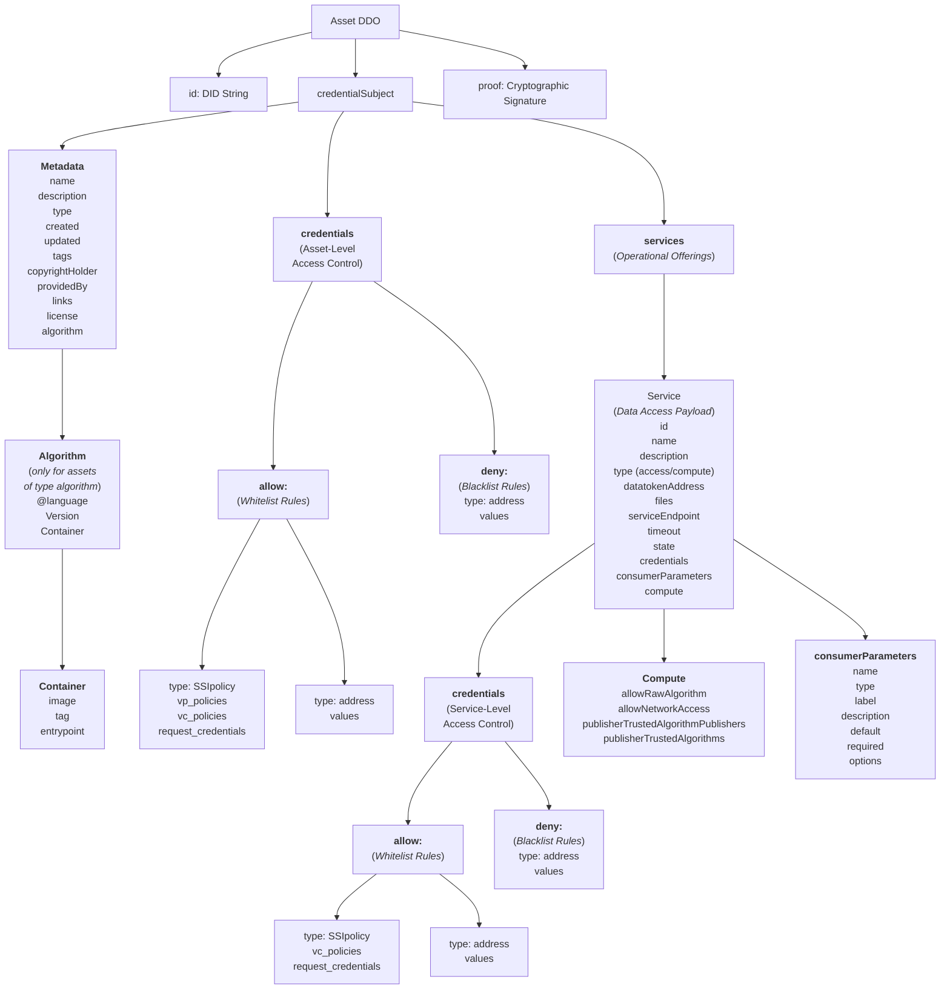

# Asset Metadata

## Introduction

Asset metadata plays a critical role within the Ocean Enterprise ecosystem, enabling the cataloging and management of service offerings. Each asset can include multiple service offerings. The metadata is intended for publication to federated catalogues, ensuring that service offerings are easily discoverable across different data spaces and data ecosystems. To ensure confidentiality and integrity, the metadata is encrypted by default.

Additionally, while most metadata is stored off-chain to optimize performance and scalability, a hash of this metadata is anchored on-chain. This approach combines the benefits of off-chain storage with the immutability and security of blockchain technology, ensuring both scalable data management and verifiable metadata integrity.

Due to privacy and efficiency reasons, the asset metadata is split into two parts:

* **Off-chain part**: it is a W3C-compliant Verifiable Credential (V), encoded in VC-JWT format and stored using IPFS. It is signed by the asset publisher and encrypted.
* **On-chain part**: it is recorded on the blockchain and contains a remote pointer linking to the off‑chain part of the DDO, where the full metadata is stored.


## The off-chain part of the DDO

The off‑chain component of the DDO is encoded as a **W3C‑compliant Verifiable Credential** and signed by the asset’s publisher, ensuring authenticity and integrity.



### Verifiable Credential

| Attribute           | Type               | Description                                                                                                                                                                                                                    |
| ------------------- | ------------------ | ------------------------------------------------------------------------------------------------------------------------------------------------------------------------------------------------------------------------------ |
| `@context`          | `Array of String`  | <p>Specifies the W3C data standards utilized to validate the cryptographic security format of the asset document.<br><code>[</code>
<br><code>"https://www.w3.org/ns/credentials/v2"</code>
<br><code>]</code></p>             |
| `type`              | Array of `Strings` | <p>Declares the identity type of this record, systematically marked as a VerifiableCredential.<br><code>[</code>
<br><code>"VerifiableCredential"</code>
<br><code>]</code></p>                                                |
| `version`           | `String`           | Indicates the system configuration template version used to render the document (e.g., `5.0.0`).                                                                                                                               |
| `id`                | `String`           | The unique Decentralized Identifier (DID) assigned to the asset, serving as its permanent global lookup address on the marketplace.                                                                                            |
| `credentialSubject` | `Object`           | The primary container holding all asset profiles, metadata rules, distribution permissions, and pricing stats. The credentialSubject object is detailed in the table [credentialSubject](asset-metadata.md#credentialsubject). |
| `issuer`            | `String`           | The verified decentralized identity of the entity that signed off on publishing the asset. (e.g. `"did:web:wallet2.demo.oceanenterprise.io:wallet-api:registry:publisher132"`)                                                 |
| `proof`             | `Object`           | The final cryptographic payload consisting of standard encryption schemas used to verify document authenticity.                                                                                                                |


### credentialSubject

| Attribute        | Type               | Description                                                                                                                                                                                                           |
| ---------------- | ------------------ | --------------------------------------------------------------------------------------------------------------------------------------------------------------------------------------------------------------------- |
| `chainId`        | `Integer`          | The blockchain network identification code where this asset and its related smart contracts reside.                                                                                                                   |
| `metadata`       | `Object`           | Contains all human-readable definitions of the asset, such as titles, creation dates, and licensing information. The metadata object is described in the table [Metadata](asset-metadata.md#metadata).                |
| `services`       | `Array of Objects` | Configuration details for asset's services, outlining the technical access paths, the node endpoints, time limits, and parameters. The service object is described in the table [Service](asset-metadata.md#service). |
| `credentials`    | `Object`           | <p>Access rules defining who  can access the overall asset.<br>The credentials object is described in the table <a href="asset-metadata.md#credentials">Credentials</a></p>                                           |
| `nftAddress`     | `String`           | The address of the NFT minted in the blockchain, which represents the asset.                                                                                                                                          |
| `additionalDdos` | `Array`            | List of additional descriptions of the asset in other formats.                                                                                                                                                        |


### Metadata

There are two types of assets managed in Ocean Enterprise: `datasets` and `algorithms`. Each asset type has its specific attributes.

| Attribute         | Type                     | Description                                                                                                                                                                                                                                                                                                                                                                                                                                                                                                                                                                           |
| ----------------- | ------------------------ | ------------------------------------------------------------------------------------------------------------------------------------------------------------------------------------------------------------------------------------------------------------------------------------------------------------------------------------------------------------------------------------------------------------------------------------------------------------------------------------------------------------------------------------------------------------------------------------- |
| `created`         | `String (ISO date/time)` | The exact date and time, in ISO8601 format, when the asset profile was first registered (e.g. `2000-10-31T01:30:00Z`).                                                                                                                                                                                                                                                                                                                                                                                                                                                                |
| `updated`         | `String (ISO date/time)` | The exact date and time, in ISO8601 format, when the asset profile was last updated (e.g. `2000-10-31T01:30:00Z`).                                                                                                                                                                                                                                                                                                                                                                                                                                                                    |
| `type`            | `String`                 | <p>Defines the format classification of the asset entry ( <code>dataset</code> or <code>alogorithm</code>).<br>Each type has a different subset of metadata attributes.</p>                                                                                                                                                                                                                                                                                                                                                                                                           |
| `name`            | `String`                 | The public display name of the asset, shown to marketplace buyers.                                                                                                                                                                                                                                                                                                                                                                                                                                                                                                                    |
| `description`     | `String`                 | Multilingual, direction-aware descriptive text detailing what the dataset contains.The description object is detailed in the table [Description](asset-metadata.md#description)                                                                                                                                                                                                                                                                                                                                                                                                       |
| `tags`            | `Array of Strings`       | Categorization keywords used by portal search bars to filter, search, and group relevant assets.                                                                                                                                                                                                                                                                                                                                                                                                                                                                                      |
| `author`          | `String`                 | Name of the entity generating this data (e.g. `Ocean Enterprise e.V.`).                                                                                                                                                                                                                                                                                                                                                                                                                                                                                                               |
| `copyrightHolder` | `String`                 | The entity holding the legal copyright.                                                                                                                                                                                                                                                                                                                                                                                                                                                                                                                                               |
| `providedBy`      | `string`                 | Verifiable Credential of the entity offering this asset.                                                                                                                                                                                                                                                                                                                                                                                                                                                                                                                              |
| `links`           | `Object`                 | Mapping of URL titles(key) and URL strings(value)                                                                                                                                                                                                                                                                                                                                                                                                                                                                                                                                     |
| `license`         | `Object`                 | The licenses applied to all services of this asset. The license object is detailed in table [License](asset-metadata.md#license).                                                                                                                                                                                                                                                                                                                                                                                                                                                     |
| `algorithm`       | `Object`                 | <mark style="background-color:$warning;">This object is set only if the asset is an algorithm (the field</mark> <mark style="background-color:$warning;"></mark><mark style="background-color:$warning;">`type`</mark>  <mark style="background-color:$warning;"></mark><mark style="background-color:$warning;">is set to</mark> <mark style="background-color:$warning;"></mark><mark style="background-color:$warning;">`algorithm`</mark><mark style="background-color:$warning;">).</mark> This algorithm object is described in table [Algorithm](asset-metadata.md#algorithm)  |


#### Description

| Attribute    | Type     | Description                                                                                                                                                                                                                                                   |
| ------------ | -------- | ------------------------------------------------------------------------------------------------------------------------------------------------------------------------------------------------------------------------------------------------------------- |
| `@value`     | `String` | Description of the asset in one specific language                                                                                                                                                                                                             |
| `@direction` | `String` | Text direction, whose value is a [base direction](https://www.w3.org/TR/i18n-glossary/#dfn-base-direction) string defined by the `@direction` property in \[[JSON-LD11](https://w3c.github.io/vc-data-model/#bib-json-ld11)] .Example: `rtl` (`ltr` or `rtl`) |
| `@language`  | `String` | Text language, as defined by [BCP47](https://w3c.github.io/vc-data-model/#bib-bcp47)                                                                                                                                                                          |

Example of a `description` object:

```
"title": {
  "@value": "HTML و CSS: تصميم و إنشاء مواقع الويب",
  "@language": "ar",
  "@direction": "rtl"
}
```


#### License

| Attribute                                       | Type               | Description                                                                                                                                                                    |
| ----------------------------------------------- | ------------------ | ------------------------------------------------------------------------------------------------------------------------------------------------------------------------------ |
| `name`                                          | `String`           | The primary name, label, or reference link representing the master data license or legal agreement for the asset.                                                              |
| `licenseDocuments`                              | `Array of Objects` | A comprehensive manifest listing individual files, addendums, or reference agreements attached directly to this license profile.                                               |
| `licenseDocuments[].additionalInformation`      | `Object`           | An extensible metadata bucket for storing operational file properties.                                                                                                         |
| `licenseDocuments[].additionalInformation.size` | `Integer`          | The physical file size (measured in bytes) of the attached legal or reference document.                                                                                        |
| `licenseDocuments[].sha256`                     | `String`           | A unique cryptographic fingerprint of the document file. This ensures the legal terms cannot be modified or replaced without invalidating the manifest.                        |
| `licenseDocuments[].mirrors`                    | `Array of Objects` | A list of alternative hosting locations where the marketplace application can safely retrieve the document file.                                                               |
| `licenseDocuments[].mirrors[].method`           | `String`           | The technical HTTP transmission rule used to download the document (e.g., `get`).                                                                                              |
| `licenseDocuments[].mirrors[].type`             | `String`           | The storage infrastructure category hosting this specific copy (e.g., traditional web link `url` or decentralized storage `ipfs`).                                             |
| `licenseDocuments[].mirrors[].url`              | `String`           | The precise URL destination path used to download the file if hosted on standard cloud web servers.                                                                            |
| `licenseDocuments[].mirrors[].headers`          | `String`           | Optional protocol header parameters required by secure servers during the file download process.                                                                               |
| `licenseDocuments[].mirrors[].ipfsCid`          | `String`           | The cryptographic Content Identifier (CID) used to fetch the file copy if it is stored across decentralized networks.                                                          |
| `licenseDocuments[].displayName`                | `Object`           | A localization container for the file label displayed to consumers in the marketplace portal user interface.                                                                   |
| `licenseDocuments[].displayName.@direction`     | `String`           | Layout direction setting for rendering text (e.g., `ltr` for left-to-right languages).                                                                                         |
| `licenseDocuments[].displayName.@language`      | `String`           | niversal language standard code indicating the translation of the display text (e.g., `en`).                                                                                   |
| `licenseDocuments[].name`                       | `String`           | The strict administrative filename matching the document index registry record.                                                                                                |
| `licenseDocuments[].description`                | `Object`           | A localization container used to provide supplementary details or descriptive footnotes about a specific file attachment.                                                      |
| `licenseDocuments[].description.@value`         | `String`           | Human-readable explanation detailing what a specific attached document or addendum covers.                                                                                     |
| `licenseDocuments[].description.@direction`     | `String`           | Layout direction setting for parsing the text block (e.g., `ltr`).                                                                                                             |
| `licenseDocuments[].description.@language`      | `String`           | Universal language standard code specifying the language of the description string (e.g., `en`).                                                                               |
| `licenseDocuments[].fileType`                   | `String`           | The official file format layout standard (e.g., `png` or `text/html; charset=utf-8`), which informs the marketplace app how to correctly render or display the file to a user. |

Example of a license object including the following:

* a license file referenced as a URL ([https://github.com/MBadea17/testdata/blob/af26d4f968fdb6e1882c2a3cca16a1480ca44a9c/License%20Agreement.pdf](https://github.com/MBadea17/testdata/blob/af26d4f968fdb6e1882c2a3cca16a1480ca44a9c/License%20Agreement.pdf))&#x20;
* two additional files:
  * "test additional file": file uploaded to IPFS
  * "test additional file 2": file referenced as a URL available at [https://github.com/MBadea17/testdata/blob/af26d4f968fdb6e1882c2a3cca16a1480ca44a9c/License%20Agreement.pdf](https://github.com/MBadea17/testdata/blob/af26d4f968fdb6e1882c2a3cca16a1480ca44a9c/License%20Agreement.pdf)

```json
      "license": {
        "name": "https://github.com/MBadea17/testdata/blob/af26d4f968fdb6e1882c2a3cca16a1480ca44a9c/License%20Agreement.pdf",
        "licenseDocuments": [
          {
            "additionalInformation": {
              "size": 224393
            },
            "sha256": "891580d4fa62d00141a6237987a68e5da03064478ca3511d95685e810fcf30d0",
            "mirrors": [
              {
                "method": "get",
                "type": "url",
                "url": "https://github.com/MBadea17/testdata/blob/af26d4f968fdb6e1882c2a3cca16a1480ca44a9c/License%20Agreement.pdf"
              }
            ],
            "displayName": {
              "@value": "https://github.com/MBadea17/testdata/blob/af26d4f968fdb6e1882c2a3cca16a1480ca44a9c/License%20Agreement.pdf",
              "@direction": "ltr",
              "@language": "en"
            },
            "name": "https://github.com/MBadea17/testdata/blob/af26d4f968fdb6e1882c2a3cca16a1480ca44a9c/License%20Agreement.pdf",
            "description": {
              "@value": "",
              "@direction": "ltr",
              "@language": "en"
            },
            "fileType": "text/html; charset=utf-8"
          },
          {
            "additionalInformation": {
              "size": 27424
            },
            "sha256": "97edf62ae8f3ff7f77d56b7fba900a457c3d85a5777b58510ef0ca5074a7b440",
            "mirrors": [
              {
                "headers": {},
                "ipfsCid": "QmTU7vUCxUeGMmYnxiU9655meJcfvXfX5Jt58m2V8swprF",
                "type": "ipfs"
              }
            ],
            "displayName": {
              "@value": "test additional file",
              "@direction": "ltr",
              "@language": "en"
            },
            "name": "test additional file",
            "description": {
              "@value": "",
              "@direction": "ltr",
              "@language": "en"
            },
            "fileType": "png"
          },
          {
            "additionalInformation": {
              "size": 224393
            },
            "sha256": "0a526e7a36c2abaed8441112264dfee38d546a6bf28da1c7cac3036af8363d66",
            "mirrors": [
              {
                "method": "get",
                "type": "url",
                "url": "https://github.com/MBadea17/testdata/blob/af26d4f968fdb6e1882c2a3cca16a1480ca44a9c/License%20Agreement.pdf"
              }
            ],
            "displayName": {
              "@value": "test additonal file 2",
              "@direction": "ltr",
              "@language": "en"
            },
            "name": "test additonal file 2",
            "description": {
              "@value": "",
              "@direction": "ltr",
              "@language": "en"
            },
            "fileType": "text/html; charset=utf-8"
          }
        ]
      }
```


#### Algorithm

| Attribute   | Type     | Description                                                                                                                                                                                                  |
| ----------- | -------- | ------------------------------------------------------------------------------------------------------------------------------------------------------------------------------------------------------------ |
| `@language` | `String` | Language to implement the software                                                                                                                                                                           |
| `version`   | `String` | Version of the software, preferably in [SemVer](https://semver.org/) notation. E.g. `1.0.0`.                                                                                                                 |
| `container` | Object   | Describes the Docker container image based on which the container that will run the algorithms will be instantiated. The container object is described in the table [Container](asset-metadata.md#container) |


#### Container

| Attribute    | Type     | Description                                                                                                                             |
| ------------ | -------- | --------------------------------------------------------------------------------------------------------------------------------------- |
| `image`      | `String` | The Docker image name the algorithm will run with.                                                                                      |
| `tag`        | `String` | The Docker image tag.                                                                                                                   |
| `entrypoint` | `String` | The Docker entrypoint. `$ALGO` is a macro that gets replaced inside the compute job, depending where your algorithm code is downloaded. |

Example of a container object for an algorithm written in JavaScript/Node.js, based on Node.js v24:

```json
{
  "algorithm": {
    "container": {
      "entrypoint": "node $ALGO",
      "image": "node",
      "tag": "24"
    }
  }
}
```


### Service

| Attribute            | Type               | Description                                                                                                                                                                                                                                                                                                                                                                                                                                                    |
| -------------------- | ------------------ | -------------------------------------------------------------------------------------------------------------------------------------------------------------------------------------------------------------------------------------------------------------------------------------------------------------------------------------------------------------------------------------------------------------------------------------------------------------- |
| `id`                 | `String`           | Unique ID of the asset's service                                                                                                                                                                                                                                                                                                                                                                                                                               |
| `name`               | `String`           | Service name                                                                                                                                                                                                                                                                                                                                                                                                                                                   |
| `description`        | `Object`           | Multilingual, direction-aware descriptive text detailing what the dataset contains.The description object is detailed in the table [Description](asset-metadata.md#description)                                                                                                                                                                                                                                                                                |
| `type`               | `String`           | Defines the transaction fulfillment style of the service endpoint (e.g., `access` for direct data file downloading or `compute` for access to the service endpoint only within a Compute-to-Data job).                                                                                                                                                                                                                                                         |
| `datatokenAddress`   | `String`           | Smart contract address of the specific token assigned to this service.                                                                                                                                                                                                                                                                                                                                                                                         |
| `files`              | `String`           | Ecrypted access control information of the files associated with this service. When the service is consumed, the files listed here are served to the consumer. The information is encrypted by the node provided in the `serviceEndpoint` parameter. The structure of the file object encrypted and saved in this field depends on the type of file: HTTP, S3 etc. All file objects are presented in chapter [File Types](/broken/pages/UO9SaREtSdAsjbOnSy5q). |
| `serviceEndpoint`    | `String (URL)`     | Tthe URL of the OE Node responsible for controlling the access to the service: verifying payments for the service and streaming the data files safely to the buyer.                                                                                                                                                                                                                                                                                            |
| `timeout`            | `Integer`          | The active lifetime window (measured in seconds) a consumer has to utilize or download the service from the purchase moment (e.g., `86400` seconds equals 24 hours). After the timeout is reached, the consumer has to purchase the service again in order to access it once more.                                                                                                                                                                             |
| `state`              | `Integer`          | Indicates the operational lifecycle status of the service (e.g., `0` means active and purchaseable; other values designate paused or retired services).                                                                                                                                                                                                                                                                                                        |
| `credentials`        | `Object`           | <p>Access rules defining who  can access the service.<br>The credentials object is described in the table <a href="asset-metadata.md#credentials">Credentials</a></p>                                                                                                                                                                                                                                                                                          |
| `consumerParameters` | `Array of Objects` | <p>Defines the parameters the consumer has to input before consuming the asset.<br>This object is described in table <a href="asset-metadata.md#consumer-parameters">Consumer Parameters</a>.</p>                                                                                                                                                                                                                                                              |
| `compute`            | `Object`           | <p><mark style="background-color:$warning;">This object is defined only for services used in C2D (i.e.  <code>service.type</code>  is set to <code>compute).</code></mark> </p><p>This compute object is described in table <a href="asset-metadata.md#compute">Compute</a>. </p>                                                                                                                                                                              |


#### Compute

For services used in C2D jobs, the compute object is added to the service description. This object includes the following attributes.

| Attribute                                               | Type               | Description                                                                                                                                                                                           |
| ------------------------------------------------------- | ------------------ | ----------------------------------------------------------------------------------------------------------------------------------------------------------------------------------------------------- |
| `allowRawAlgorithm`                                     | `boolean`          | <p>Used only for assets of type <code>algorithm</code>.</p><p>Specify if passed raw text will be allowed to run. It is by default set to <code>false</code> (do not allow raw algorithms to run).</p> |
| `allowNetworkAccess`                                    | `boolean`          | <p>Used only for assets of type <code>algorithm</code>.</p><p>Specify if the algorithm job network access. </p>                                                                                       |
| `publisherTrustedAlgorithmPublishers`                   | `Array of Strings` | <p>Used only for assets of type <code>dataset</code>.<br>A list of the web3 addresses of algorithm publishers that the service recognizes as trusted.</p>                                             |
| `publisherTrustedAlgorithms`                            | `Array of Objects` | <p>Used only for assets of type <code>dataset</code>.<br>Specify the list of algorithms allowed to run on the dataset represented by the service.</p>                                                 |
| `publisherTrustedAlgorithms[].did`                      | `String`           | The DID of the asset allowed to run on the dataset                                                                                                                                                    |
| `publisherTrustedAlgorithms[].serviceId`                | `String`           | The ServiceId of the service within the asset that is allowed to run on the dataset.                                                                                                                  |
| `publisherTrustedAlgorithms[].containerSectionChecksum` | `String`           | Hash of algorithm's image details                                                                                                                                                                     |
| `publisherTrustedAlgorithms[].filesChecksum`            | `String`           | Hash of algorithm's files.                                                                                                                                                                            |

Example of a compute object for a dataset service. There are two algorithm publishers trusted by this dataset (listed in `publisherTrustedAlgorithmPublishers`), meaning all algorithms from these two publishers can be executed on the dataset. Moreover, there are three additional trusted algorithms (listed in publisherTrustedAlgorithms), which can also be executed on the dataset.

```json
       "compute": {
          "allowRawAlgorithm": false,
          "allowNetworkAccess": true,
          "publisherTrustedAlgorithmPublishers": [
            "0xd727fb9be39fa019d7c02fea19e54d688da3a662",
            "0x61db12d8b636cb49ea09eca58a893da9480e1f33"
          ],
          "publisherTrustedAlgorithms": [
            {
              "did": "did:ope:c68e6efe498f70cf0d671f9a405374176607d209546837e25b11cedbbcc9cd02",
              "containerSectionChecksum": "ee2da20f61e82ced3033ad6a7cb44fe136d91b715eaf2db2811ee0b0ad4a5b99",
              "filesChecksum": "2c36c054711dad021f45cc7e0990bd38864a51d753c8055b63e78014a6bee515",
              "serviceId": "4d89d718fc670b20217d97466e9612244e82aad21a40d19738d2a6ed0e3e8893"
            },
            {
              "did": "did:ope:c534e37e815b267d229c7051086f17c084ab72dce41af12df6f6daf900b30b16",
              "containerSectionChecksum": "2ea683746c6927342c7ea51ddd9b8acada2490c67a357ff9b41bda64fe05cb34",
              "filesChecksum": "dc0b0c89639614533fecd6ebe7dc53dcfbda96865322213dea7c3ecf88ad7ea4",
              "serviceId": "ae2367882fa6d10c006dcce30b4a2bdd70434f8348c0ed6431f2125b572b12f4"
            },
            {
              "did": "did:ope:b66c9ccce1b117711918ba1232e70d99c75e52a68a88a13639eed3a8450c41f8",
              "containerSectionChecksum": "dfce591ecb9b35c1c2931c8b38b4c216a61b40cd33407ab886df3b44c6b8904d",
              "filesChecksum": "ffd8c9b460451dd7d1677878f60cc93ce35a5a2517f08819761c0ddf424f7f88",
              "serviceId": "40c3fefb7b73c1a3190a437227d1954f8ef682676e26c1a914668f2d05401d22"
            }
          ]
        }
```

&#x20;

### Consumer Parameters

| Attribute     | Type               | Description                                                                                                                                                                                                                                        |
| ------------- | ------------------ | -------------------------------------------------------------------------------------------------------------------------------------------------------------------------------------------------------------------------------------------------- |
| `name`        | `String`           | The internal technical identifier for the parameter.                                                                                                                                                                                               |
| `type`        | `String`           | Controls the visual input style generated on the interface screen. Accepted configurations include `text` (string field), `select` (a dropdown menu), `number` (a numeric keypad/input field), or `boolean` (a true/false checkbox/toggle switch). |
| `label`       | `String`           | The human-readable title displayed directly above the input field in the marketplace portal.                                                                                                                                                       |
| `description` | `String`           | Explanatory instructional text or tooltips presented next to the interface field to guide consumers on what their choice affects.                                                                                                                  |
| `default`     | `String`           | The standard pre-selected value automatically used if the user skips modifying this parameter or leaves the field empty.                                                                                                                           |
| `required`    | `boolean`          | Enforces entry rules. If set to `true`, the marketplace will block the consumption request until the user explicitly inputs a value. If `false`, the parameter is optional.                                                                        |
| `options`     | `Array of Objects` | Applicable only when `type` is set to `select`. Defines the selectable items inside the dropdown menu, mapping a backend code name (e.g., `apac`) to its user-friendly display value (e.g., `Asia Pacific`).                                       |

Example of a consumerParameters object:

```json
"consumerParameters": [
          {
            "default": "eu",
            "name": "region",
            "options": [
              {
                "eu": "Europe"
              },
              {
                "us": "United States"
              },
              {
                "apac": "Asia Pacific"
              }
            ],
            "description": "Choose the region for the download.",
            "label": "Region",
            "type": "select",
            "required": true
          },
          {
            "default": "csv",
            "name": "format",
            "options": [
              {
                "csv": "CSV"
              },
              {
                "json": "JSON"
              },
              {
                "parquet": "Parquet"
              }
            ],
            "description": "Choose the output format returned by the download service.",
            "label": "Export Format",
            "type": "select",
            "required": false
          },
          {
            "default": "1000",
            "name": "rowLimit",
            "description": "Maximum number of rows returned.",
            "label": "Row Limit",
            "type": "number",
            "required": false
          },
          {
            "default": "false",
            "name": "includeHeaders",
            "description": "Whether the exported file should include column headers.",
            "label": "Include Headers",
            "type": "boolean",
            "required": false
          }
        ]
```


### Credentials

The credentials are specified at the asset level (`credentialSubject.credetials`) and at the service level (`credentialSubject.services[].credentials`). Both objects share the same structure. The only difference between the two is that asset-level credentials may include additional clauses regarding the presentation of verifiable credentials. These clauses specific to asset-level credentials are highlighted in the text below.&#x20;

| Attribute | Type               | Description                                                                                                                                                                                                                                             |
| --------- | ------------------ | ------------------------------------------------------------------------------------------------------------------------------------------------------------------------------------------------------------------------------------------------------- |
| `allow`   | `Array of Objects` | The Access Whitelist. A collection of rules defining who _is_ permitted to interact with the asset. If an entity matches any defined rule block here, they are granted baseline access. The allow object is presented in table Allow.                   |
| `deny`    | `Array of Objects` | <p>The Access Blacklist. Explicit ban parameters based on web3 address. <br>Any wallet address matching criteria in this block will be hard-blocked from accessing the asset or service, even if they qualify under the <code>allow</code> section.</p> |


#### Allow

| Attribute                                         | Type                          | Description                                                                                                                                                                                                                                                                                                                                                                                                         |
| ------------------------------------------------- | ----------------------------- | ------------------------------------------------------------------------------------------------------------------------------------------------------------------------------------------------------------------------------------------------------------------------------------------------------------------------------------------------------------------------------------------------------------------- |
| `type`                                            | `String`                      | Specifies the security mechanism used for evaluation. The supported values are  `address` (crypto-wallet-based gating) or `SSIpolicy` (decentralized enterprise identity profiles).                                                                                                                                                                                                                                 |
| `values`                                          | `Array of Objects`            | Contains the operational parameters and settings assigned to the specific rule type.                                                                                                                                                                                                                                                                                                                                |
| `allow[].values[].address`                        | `String`                      | Used when type is `address`. Denotes the explicit blockchain wallet address allowed to see the asset. A value of `*` serves as a wildcard, permitting any connected wallet.                                                                                                                                                                                                                                         |
| `allow[].values[].vc_policies`                    | `Array of Strings`            | Global Verifiable Credential Baselines. Security audits enforced automatically across _every_ submitted credential, such as checking the digital `signature` or ensuring the timeline is valid via `not-before`.                                                                                                                                                                                                    |
| `allow[].values[].vp_policies`                    | `Array of Objects`            | <p><mark style="background-color:$warning;">This field is present only in the asset-level credentials object.</mark><br>Verifiable Presentation (VP) Bundle Rules. Rules dictating how the overall collection of credentials must behave together, such as enforcing anti-spoofing (<code>holder-binding</code>) or setting a minimum number of valid matching certificates (<code>minimum-credentials</code>).</p> |
| `allow[].values[].request_credentials`            | `Array of Objects`            | Used when type is `SSIpolicy`. Outlines the precise digital  verifiable  credentials the user must present from their corporate identity wallet (e.g., corporate registry records).                                                                                                                                                                                                                                 |
| `allow[].values[].request_credentials[].type`     | `String`                      | The specific schema or classification of the requested certificate, such as `gx:LegalPerson` (company profile) or `gx:LeiCode` (Legal Entity Identifier).                                                                                                                                                                                                                                                           |
| `allow[].values[].request_credentials[].format`   | `String`                      | The technical data format of the credential package being checked (e.g., `jwt_vc_json`).                                                                                                                                                                                                                                                                                                                            |
| `allow[].values[].request_credentials[].policies` | `Array of Strings or Objects` | Targeted validation checks applied to that specific credential. Can range from a simple validity check like `expired` to complex dynamic rules containing parameters and evaluation servers.                                                                                                                                                                                                                        |

Example of an asset-level allow object. The following access credentials are defined for the asset:

* access allowed to any web3 address (field `credentials.allow[{"type":"address"}].values[0].address = "*"`)
* access allowed to any consumer who presents the following VCs (the fields `credentials.allow[{"type":"SSIpolicy"}].values[0].request_credentials[].type`):
  * gx:LegalPerson
  * gx:Issuer
  * gx:LeiCode
* all VCs have to comply with the following static policies (the field `credentials.allow[{"type":"SSIpolicy"}].values[0].vc_policies[]`)
  * &#x20;not-before: VC is not used before its validity start date
  * revoked-status-list: VC is not revoked
  * signature: VC has a valid signature
* the Verifiable Presentation (VP) in which the VCs are packed before submission to verification must comply with the following policies (the field `credentials.allow[{"type":"SSIpolicy"}].values[0].vp_policies[]`):
  * &#x20;  holder-binding: the identifier that signs the VP must be the subject of each VC included in the VP
  * minimum-credentials: a minimum of two VCs must be included in the VP
  * vp\_required\_credentials: the VP must include gx:LegalPerson VC and optionally one of the following VCs: gx:LeiCode and gx:Issuer&#x20;
* the gx:LegalPerson VC must comply with the following policy (`credentials.allow[{"type":"SSIpolicy"}].values[0].request_credential[0].policies[]`):
  * expired: the VC has not expired
* the gx:Issuer VC must comply with the following policy (`credentials.allow[{"type":"SSIpolicy"}].values[0].request_credential[1].policies[]`)
  * allowed-issues: the VC must be issued by the entity identified by did:GXCH
* the gx:LeiCode VC must comply with the following policy (`credentials.allow[{"type":"SSIpolicy"}].values[0].request_credential[1].policies[]`):
  * a dynamic policy named countryGermany
  * the dynamic policy verifies if the field gx:countryCode of the VC has the value "DE"


```json
"credentials": {
      "allow": [
        {
          "type": "SSIpolicy",
          "values": [
            {
              "request_credentials": [
                {
                  "format": "jwt_vc_json",
                  "policies": [
                    "expired"
                  ],
                  "type": "gx:LegalPerson"
                },
                {
                  "format": "jwt_vc_json",
                  "policies": [
                    {
                      "policy": "allowed-issuer",
                      "args": [
                        "did:GXCH"
                      ]
                    }
                  ],
                  "type": "gx:Issuer"
                },
                {
                  "format": "jwt_vc_json",
                  "policies": [
                    {
                      "policy": "dynamic",
                      "args": {
                        "policy_name": "countryGermany",
                        "opa_server": "http://ocean-node-vm3.oceanenterprise.io:8181",
                        "policy_query": "data",
                        "rules": {
                          "rego": "package data.countryGermany\n\ndefault allow := false\n\nallow if {\n  lower(input.credentialData.credentialSubject[\"gx:countryCode\"]) == lower(input.parameter.param1)\n}"
                        },
                        "argument": {
                          "param1": "DE"
                        }
                      }
                    }
                  ],
                  "type": "gx:LeiCode"
                }
              ],
              "vc_policies": [
                "not-before",
                "revoked-status-list",
                "signature"
              ],
              "vp_policies": [
                {
                  "policy": "holder-binding"
                },
                {
                  "policy": "minimum-credentials",
                  "args": "2"
                },
                {
                  "policy": "vp_required_credentials",
                  "args": "{\"required\":[{\"credential_type\":\"gx:LegalPerson\"},{\"any_of\":[\"gx:LeiCode\",\"gx:Issuer\"]}]}"
                }
              ]
            }
          ]
        },
        {
          "type": "address",
          "values": [
            {
              "address": "*"
            }
          ]
        }
      ],
      "deny": [],
      "match_deny": "any"
    }
```

&#x20;

#### Deny

| Attribute          | Type               | Description                                                                                                                                              |
| ------------------ | ------------------ | -------------------------------------------------------------------------------------------------------------------------------------------------------- |
| `type`             | `String`           | Specifies the security mechanism used for evaluation. Currently, the only accepted value is `address`                                                    |
| `values`           | `Array of objects` | The list of web3 addresses that are restricted to access the asset/service.                                                                              |
| `values[].address` | `String`           | The web3 address restricteed to access the asset/service (e.g "`0xd727fb9be39fa019d7c02fea19e54d688da3a662`" - specific address; `"*"` - all addresses). |

Example of a deny object where two web3 addresses are restricted from accessing the asset/service.

```json
          "deny": [
            {
              "type": "address",
              "values": [
                {
                  "address": "0xd727fb9be39fa019d7c02fea19e54d688da3a662"
                },
                {
                  "address": "0x61db12d8b636cb49ea09eca58a893da9480e1f33"
                }
              ]
            }
          ],
          "match_deny": "any"
```


Example of a deny object where all addresses are restricted from accessing the asset/service.&#x20;

```json
  "deny": [
    {
      "type": "address",
      "values": [
        {
          "address": "*"
        }
      ]
    }
  ],
  "match_deny": "any"
```


## Examples of DDOs


### Dataset with two services

The asset is of type `dataset` and has two services of type `download` : "Service 1" and "Service 2"&#x20;


```json
{
  "@context": [
    "https://www.w3.org/ns/credentials/v2"
  ],
  "id": "did:ope:7752f58eece2711f16a0a2cd2d4490dcbde06c440386170f0881c9151b9f478c",
  "version": "5.0.0",
  "credentialSubject": {
    "chainId": 11155111,
    "metadata": {
      "created": "2026-06-23T05:39:40Z",
      "updated": "2026-06-23T06:08:24.287Z",
      "type": "dataset",
      "name": "publish with signer server updated",
      "description": {
        "@value": "this is a publishhh updated",
        "@direction": "ltr",
        "@language": "en"
      },
      "tags": [],
      "author": "",
      "license": {
        "name": "https://microsoftedge.github.io/Demos/json-dummy-data/64KB.json",
        "licenseDocuments": [
          {
            "sha256": "cde3fa1e4696435fb274304f710742f67bc4b810fd7ee850543d162f3e10aa70",
            "mirrors": [
              {
                "method": "get",
                "type": "url",
                "url": "https://microsoftedge.github.io/Demos/json-dummy-data/64KB.json"
              }
            ],
            "name": "https://microsoftedge.github.io/Demos/json-dummy-data/64KB.json",
            "fileType": "application/json; charset=utf-8"
          }
        ]
      },
      "additionalInformation": {
        "termsAndConditions": true
      },
      "copyrightHolder": "",
      "providedBy": "",
      "links": {}
    },
    "services": [
      {
        "credentials": {
          "allow": [
            {
              "values": [
                {
                  "address": "*"
                }
              ],
              "type": "address"
            }
          ],
          "match_deny": "any",
          "deny": []
        },
        "name": "Service 1",
        "files": "0x0471e141a36eb191e13122b3aeeefb9ae4ead2be502a411895a7e02aa462e7a0013eb887e0f0a2252f156956c22c57d75c25bf4832506f6e174194323e7876505c0cdd9d0d1d3eb9e3644821e163c7f04c3101b893a96499a28df3b436af3780c0f9c964ff11aa748852837cff27308839bba4ad98befdcb91d0f8523bb7ebcf720856070d6d9d077553f39961e75071710bb3260ec50f4df793b825b703145936a7c28f0f80fdbb9d00ab79efd0e4870686087eef02aeac1f7e0cac197ebe4290b3799d1e77c35a95276699d1047435ccb148e1499d8b60f8e76f2e82eb90e4f90c0cdb469785c30dbda2c3440a21a02e26937143787d2b7b639e0467dbf44e1609b9a8c908610f3529014315b5516765769cdf6f19fcd4700ee91a175426bd245b269e365474b09a33d9f1a509fee148744b07a02ad6566e3a06bf59cc86c7fe8b872692d232b34f1dd298ba4e036f0feccae79d0c8cb2dd82e493d9778f790500a5",
        "description": {
          "@value": "This is a desc",
          "@direction": "ltr",
          "@language": "en"
        },
        "id": "3576f9a8dfd718e8f6ec238433547ca71c6da23259d6fba36712ee3604188d17",
        "datatokenAddress": "0xa5b318dfb75B2f24a87d36791E378761B2174B11",
        "serviceEndpoint": "https://ocean-node-vm3.oceanenterprise.io",
        "state": 0,
        "type": "access",
        "timeout": 0
      },
      {
        "credentials": {
          "allow": [],
          "match_deny": "any",
          "deny": []
        },
        "name": "Service 2",
        "description": {
          "@value": "Service 2 description",
          "@direction": "ltr",
          "@language": "en"
        },
        "files": "0x047653de07d08d316bd10330bcc9ca42d5f3311f08d0e2e6a32931977f719f63be5ac816726ad0ce64628a4bd0f1b09b232d73afbf0274f39ec40ab58f6c938e52a8dbaa4a5d9197f4ae341e247de22736cb440e660ca5f1ea007ae96ad35b05975c0a5131bf2929658daa97bd86c5a04acb6cf2a020b328c59215b773cf5e0b11eea797b96547c96537327db7b41b207e6243039da87f8ed160aca0dc1dd9e879c63c83cb2d699942340c75f64d7cd71c6142ad28ff8a0dbc407d7541c4918e1d5a35b424c7aaf4039953ff56209763f98be0724d97c281e5ecaf6e8dbb9f4837bd87ce4dbb38144c6ec14df95acb42185df2911b9ffb7e3fd4aa7500ccfa2cc1b52ac045322888a500a97bf6e1adb57cece0c69e25d7818df0f2601792128874d6fca4d4032c7ce88ba869c09f0ed6c3b7f7bfbb11051db7f5182bbc6f556a7bb59820e55b9d79085ea618c87fa413166197ecf269c3dfb9a1b765d55f3f7e4cdf43",
        "id": "c052e00890d7f37585be1fa4f39923181fcb3a24872aca9e5c09973534dd3c45",
        "datatokenAddress": "0x9025391B26B38fEd0c4feBaE777Fd0633F4d6a5f",
        "serviceEndpoint": "https://ocean-node-vm3.oceanenterprise.io",
        "state": 0,
        "type": "access",
        "timeout": 86400
      }
    ],
    "nftAddress": "0x7090Eb5346929DdFaAac17d267a5d344381b19cB",
    "credentials": {
      "allow": [
        {
          "values": [
            {
              "address": "*"
            }
          ],
          "type": "address"
        }
      ],
      "deny": [],
      "match_deny": "any"
    },
    "stats": {
      "allocated": 0,
      "orders": 0,
      "price": {
        "value": 1,
        "tokenSymbol": "USDC",
        "tokenAddress": "0x1c7D4B196Cb0C7B01d743Fbc6116a902379C7238"
      }
    },
    "datatokens": [
      {
        "symbol": "OEAT",
        "address": "0xa5b318dfb75B2f24a87d36791E378761B2174B11",
        "name": "Access Token",
        "serviceId": "3576f9a8dfd718e8f6ec238433547ca71c6da23259d6fba36712ee3604188d17"
      },
      {
        "symbol": "OEAT",
        "address": "0x9025391B26B38fEd0c4feBaE777Fd0633F4d6a5f",
        "name": "Access Token",
        "serviceId": "c052e00890d7f37585be1fa4f39923181fcb3a24872aca9e5c09973534dd3c45"
      }
    ]
  },
  "additionalDdos": [],
  "type": [
    "VerifiableCredential"
  ],
  "issuer": "did:web:wallet2.demo.oceanenterprise.io:wallet-api:registry:OEdid",
  "proof": {
    "signature": "iyRgl1AaFKjyCwY4c0rCw9M67OVwOXKkKUpOD2tgN_qws3o260-oQxGA5kzKsNOwnpSClxTlNFoUWCrmx-9r7A",
    "header": {
      "kid": "7r1KFbygYbFTCVj2xK1wLvimt73LgxZDO__SOPx0w_A",
      "typ": "JWT",
      "alg": "ES256K"
    }
  },
  "indexedMetadata": {
    "stats": [
      {
        "symbol": "OEAT",
        "name": "Access Token",
        "orders": 0,
        "datatokenAddress": "0xa5b318dfb75B2f24a87d36791E378761B2174B11",
        "serviceId": "3576f9a8dfd718e8f6ec238433547ca71c6da23259d6fba36712ee3604188d17",
        "prices": [
          {
            "exchangeId": "0x6bd9c49449350aaa653dfe8c780760b6d5c456d31bdcaefdd0d6a7390b3d4107",
            "price": "1.0",
            "contract": "0xfa48673a7C36A2A768f89AC1ee8C355D5c367B02",
            "type": "fixedrate",
            "token": "0x1c7D4B196Cb0C7B01d743Fbc6116a902379C7238"
          }
        ]
      },
      {
        "symbol": "OEAT",
        "name": "Access Token",
        "orders": 0,
        "datatokenAddress": "0x9025391B26B38fEd0c4feBaE777Fd0633F4d6a5f",
        "serviceId": "c052e00890d7f37585be1fa4f39923181fcb3a24872aca9e5c09973534dd3c45",
        "prices": [
          {
            "exchangeId": "0xeab62d1ac355b547cd05a907987c201a7024cc3aeb71c7041fb4c37ae85335b5",
            "price": "1.0",
            "contract": "0xfa48673a7C36A2A768f89AC1ee8C355D5c367B02",
            "type": "fixedrate",
            "token": "0x08210F9170F89Ab7658F0B5E3fF39b0E03C594D4"
          }
        ]
      }
    ],
    "nft": {
      "state": 0,
      "address": "0x7090Eb5346929DdFaAac17d267a5d344381b19cB",
      "name": "Data NFT",
      "symbol": "OEC-NFT",
      "owner": "0xcF3185a502bE4b5Eb2c4Eb81646ECf7Dd0aC2f22",
      "created": "2026-06-23T06:09:24Z",
      "tokenURI": ""
    },
    "event": {
      "txid": "0x2cfb222c4ef199bcd8b113126e21d598fe91d840ad296493daaedc1c2eace272",
      "from": "0xcF3185a502bE4b5Eb2c4Eb81646ECf7Dd0aC2f22",
      "contract": "0x7090Eb5346929DdFaAac17d267a5d344381b19cB",
      "block": 11121002,
      "datetime": "2026-06-23T06:09:24.000Z"
    },
    "purgatory": {
      "state": false
    }
  },
  "accessDetails": [
    {
      "type": "fixed",
      "price": "1.0",
      "addressOrId": "0x6bd9c49449350aaa653dfe8c780760b6d5c456d31bdcaefdd0d6a7390b3d4107",
      "baseToken": {
        "address": "0x1c7D4B196Cb0C7B01d743Fbc6116a902379C7238",
        "name": "USDC",
        "symbol": "USDC",
        "decimals": 6
      },
      "datatoken": {
        "address": "0xa5b318dfb75B2f24a87d36791E378761B2174B11",
        "name": "Access Token",
        "symbol": "OEAT",
        "decimals": 0
      },
      "paymentCollector": "0xcF3185a502bE4b5Eb2c4Eb81646ECf7Dd0aC2f22",
      "templateId": 2,
      "isOwned": false,
      "validOrderTx": "",
      "isPurchasable": true,
      "publisherMarketOrderFee": "0"
    },
    {
      "type": "fixed",
      "price": "1.0",
      "addressOrId": "0xeab62d1ac355b547cd05a907987c201a7024cc3aeb71c7041fb4c37ae85335b5",
      "baseToken": {
        "address": "0x08210F9170F89Ab7658F0B5E3fF39b0E03C594D4",
        "name": "EURC",
        "symbol": "EURC",
        "decimals": 6
      },
      "datatoken": {
        "address": "0x9025391B26B38fEd0c4feBaE777Fd0633F4d6a5f",
        "name": "Access Token",
        "symbol": "OEAT",
        "decimals": 0
      },
      "paymentCollector": "0xcF3185a502bE4b5Eb2c4Eb81646ECf7Dd0aC2f22",
      "templateId": 2,
      "isOwned": false,
      "validOrderTx": "",
      "isPurchasable": true,
      "publisherMarketOrderFee": "0"
    }
  ]
}
```



### Dataset for computing with allowed algorithms and allowed algorithm publishers defined

The asset is of type `dataset` and has a service of type `compute`. The service accepts only a list of algorithms (identified by did and serviceID in the field `publisherTrustedAlgorithms`) and algorithm publishers (identified by web3 address in field `publisherTrustedAlgorithmPublishers`)&#x20;


```json
{
  "@context": [
    "https://www.w3.org/ns/credentials/v2"
  ],
  "id": "did:ope:ea37bfdf3c3d5ad57777db56ffbc1004a4f0f0a297731f37437e5e9d0921cd86",
  "version": "5.0.0",
  "credentialSubject": {
    "chainId": 11155111,
    "metadata": {
      "created": "2026-06-25T13:19:52Z",
      "updated": "2026-06-25T13:19:52Z",
      "type": "dataset",
      "name": "Test dataset - allowedAlgorithms and AllowedAlgorithmPublishers - 1",
      "description": {
        "@value": "Test dataset - allowedAlgorithms and AllowedAlgorithmPublishers - 1",
        "@direction": "ltr",
        "@language": "en"
      },
      "tags": [],
      "author": "",
      "license": {
        "name": "https://github.com/MBadea17/testdata/blob/af26d4f968fdb6e1882c2a3cca16a1480ca44a9c/License%20Agreement.pdf",
        "licenseDocuments": [
          {
            "name": "https://github.com/MBadea17/testdata/blob/af26d4f968fdb6e1882c2a3cca16a1480ca44a9c/License%20Agreement.pdf",
            "fileType": "text/html; charset=utf-8",
            "sha256": "79fc7fd736c48aa7fc18297e8dd5d54631b4f790331b7f4bcc9149081171a3ab",
            "additionalInformation": {
              "size": 224570
            },
            "displayName": {
              "@value": "https://github.com/MBadea17/testdata/blob/af26d4f968fdb6e1882c2a3cca16a1480ca44a9c/License%20Agreement.pdf",
              "@language": "en",
              "@direction": "ltr"
            },
            "description": {
              "@value": "",
              "@language": "en",
              "@direction": "ltr"
            },
            "mirrors": [
              {
                "type": "url",
                "method": "get",
                "url": "https://github.com/MBadea17/testdata/blob/af26d4f968fdb6e1882c2a3cca16a1480ca44a9c/License%20Agreement.pdf"
              }
            ]
          }
        ]
      },
      "additionalInformation": {
        "termsAndConditions": true
      },
      "copyrightHolder": "",
      "providedBy": ""
    },
    "services": [
      {
        "id": "a10c08a31657421035f258968c6fb49ffe7bc23e69bafdd319f559dd9421ae3d",
        "type": "compute",
        "files": "0x04e905d53f1b9e7709c86d5e13391231a5341b16767fccf0dc88b417611edd217dd3bdb044bfda29df46c05b5f80ef18315d5f56f98248cdd757b8f2015ac0164570ba0d879cd208ce4092d679b259580a99224b66adb0f1b2e7291e155d36bf04638954b11bbbc27645d8a16926f30d0073ce7f077bc2be80e4d0a1ff386b0778a05a48801189922df7fe4a47456324bc46b5ec876c3bfd3277e283126b4b5e3d22fead62a43d8653f045e7ed77c366df43694552f95d3a8e906a24d94a0f74034dd491cc15f0aceb4b5049953ad813c92cd89dacbbf0cd6638dfc3d131b6ba9c89eeb4bc341199f7bfd60d702ea0af2818adaa61196e85ca2603b05f06ce33e69b999f5cdbc967054d6f1b0544e9b0f2907aa1a0cdf41eae5dc1fa2ebea7b15ce43c70fac6b54203529c9a453efdf661dd1eeb671166562a7a869483a63c372dff4815f8e095fc73356fe4d51e7494b0d8ffde79787880c0aeb4991ffb9cac103e9daffa518a2e4fcea4e553e374984d76d460c9fd2ae95d",
        "datatokenAddress": "0x37300E09cb7543F09B7E4a0DBE219aDE2cEd582d",
        "serviceEndpoint": "https://ocean-node-vm3.oceanenterprise.io",
        "timeout": 86400,
        "compute": {
          "allowRawAlgorithm": false,
          "allowNetworkAccess": true,
          "publisherTrustedAlgorithmPublishers": [
            "0xd727fb9be39fa019d7c02fea19e54d688da3a662",
            "0x61db12d8b636cb49ea09eca58a893da9480e1f33"
          ],
          "publisherTrustedAlgorithms": [
            {
              "did": "did:ope:c68e6efe498f70cf0d671f9a405374176607d209546837e25b11cedbbcc9cd02",
              "containerSectionChecksum": "ee2da20f61e82ced3033ad6a7cb44fe136d91b715eaf2db2811ee0b0ad4a5b99",
              "filesChecksum": "2c36c054711dad021f45cc7e0990bd38864a51d753c8055b63e78014a6bee515",
              "serviceId": "4d89d718fc670b20217d97466e9612244e82aad21a40d19738d2a6ed0e3e8893"
            },
            {
              "did": "did:ope:c534e37e815b267d229c7051086f17c084ab72dce41af12df6f6daf900b30b16",
              "containerSectionChecksum": "2ea683746c6927342c7ea51ddd9b8acada2490c67a357ff9b41bda64fe05cb34",
              "filesChecksum": "dc0b0c89639614533fecd6ebe7dc53dcfbda96865322213dea7c3ecf88ad7ea4",
              "serviceId": "ae2367882fa6d10c006dcce30b4a2bdd70434f8348c0ed6431f2125b572b12f4"
            },
            {
              "did": "did:ope:b66c9ccce1b117711918ba1232e70d99c75e52a68a88a13639eed3a8450c41f8",
              "containerSectionChecksum": "dfce591ecb9b35c1c2931c8b38b4c216a61b40cd33407ab886df3b44c6b8904d",
              "filesChecksum": "ffd8c9b460451dd7d1677878f60cc93ce35a5a2517f08819761c0ddf424f7f88",
              "serviceId": "40c3fefb7b73c1a3190a437227d1954f8ef682676e26c1a914668f2d05401d22"
            }
          ]
        },
        "name": "Service 1 ",
        "description": {
          "@value": "Service 1 desc",
          "@direction": "ltr",
          "@language": "en"
        },
        "state": 0,
        "credentials": {
          "allow": [],
          "deny": [],
          "match_deny": "any"
        }
      }
    ],
    "nftAddress": "0xB92b1B08247A912c68d564010e1eeE3E01760eBE",
    "credentials": {
      "allow": [
        {
          "type": "address",
          "values": [
            {
              "address": "*"
            }
          ]
        }
      ],
      "deny": [],
      "match_deny": "any"
    },
    "stats": {
      "allocated": 0,
      "orders": 0,
      "price": {
        "value": 1,
        "tokenSymbol": "EURC",
        "tokenAddress": "0x08210F9170F89Ab7658F0B5E3fF39b0E03C594D4"
      }
    },
    "datatokens": [
      {
        "address": "0x37300E09cb7543F09B7E4a0DBE219aDE2cEd582d",
        "name": "Access Token",
        "symbol": "OEAT",
        "serviceId": "a10c08a31657421035f258968c6fb49ffe7bc23e69bafdd319f559dd9421ae3d"
      }
    ]
  },
  "additionalDdos": [],
  "type": [
    "VerifiableCredential"
  ],
  "issuer": "did:web:wallet2.demo.oceanenterprise.io:wallet-api:registry:publisher132",
  "proof": {
    "signature": "renUR-IRTGeCo_PJTwdJiO0X-h3xPj8H2XQNfG2oOYPezL9VQmhimp0ltWa_Itv9fqFULskf6Vt670Kj1iWkJA",
    "header": {
      "kid": "CqCLEltKrojmVXvWPApMYIbTupHhxI6dFwdJ8d2HUrk",
      "typ": "JWT",
      "alg": "ES256"
    }
  },
  "indexedMetadata": {
    "stats": [
      {
        "datatokenAddress": "0x37300E09cb7543F09B7E4a0DBE219aDE2cEd582d",
        "name": "Access Token",
        "symbol": "OEAT",
        "serviceId": "a10c08a31657421035f258968c6fb49ffe7bc23e69bafdd319f559dd9421ae3d",
        "orders": 0,
        "prices": [
          {
            "type": "fixedrate",
            "price": "1.0",
            "token": "0x08210F9170F89Ab7658F0B5E3fF39b0E03C594D4",
            "contract": "0xfa48673a7C36A2A768f89AC1ee8C355D5c367B02",
            "exchangeId": "0x79f8250202522028c0c1a26e9acf6c86c0fdeda096017c4b48a429fc7cdec58b"
          }
        ]
      }
    ],
    "nft": {
      "state": 0,
      "address": "0xB92b1B08247A912c68d564010e1eeE3E01760eBE",
      "name": "Data NFT",
      "symbol": "OEC-NFT",
      "owner": "0x00Dc9e712D3b31Ab5446A5A7CeaDe0a2901E6d26",
      "created": "2026-06-25T13:20:24Z",
      "tokenURI": ""
    },
    "event": {
      "txid": "0x7be6d1da632039b5e04c73ba813700458b2adf51ecb1c60c45e138b42aea3edd",
      "from": "0x00Dc9e712D3b31Ab5446A5A7CeaDe0a2901E6d26",
      "contract": "0xB92b1B08247A912c68d564010e1eeE3E01760eBE",
      "block": 11136986,
      "datetime": "2026-06-25T13:20:24.000Z"
    },
    "purgatory": {
      "state": false
    }
  },
  "accessDetails": [
    {
      "type": "fixed",
      "price": "1.0",
      "addressOrId": "0x79f8250202522028c0c1a26e9acf6c86c0fdeda096017c4b48a429fc7cdec58b",
      "baseToken": {
        "address": "0x08210F9170F89Ab7658F0B5E3fF39b0E03C594D4",
        "name": "EURC",
        "symbol": "EURC",
        "decimals": 6
      },
      "datatoken": {
        "address": "0x37300E09cb7543F09B7E4a0DBE219aDE2cEd582d",
        "name": "Access Token",
        "symbol": "OEAT",
        "decimals": 0
      },
      "paymentCollector": "0x00Dc9e712D3b31Ab5446A5A7CeaDe0a2901E6d26",
      "templateId": 2,
      "isOwned": false,
      "validOrderTx": "",
      "isPurchasable": true,
      "publisherMarketOrderFee": "0"
    }
  ]
}
```



### Dataset with SSI credentials

The dataset has a service of type access. SSI access credentials are defined at both the asset level (`credentialSubject.credentials field`) and service level (`credentialsSubject.services[0].credentials field`).


```json
{
  "@context": [
    "https://www.w3.org/ns/credentials/v2"
  ],
  "id": "did:ope:adb0746adc797cbf9bf72e65bd4c3107de67e33940624e473be21418ee387b03",
  "version": "5.0.0",
  "credentialSubject": {
    "chainId": 11155111,
    "metadata": {
      "created": "2026-06-26T09:54:54Z",
      "updated": "2026-06-26T09:54:54Z",
      "type": "dataset",
      "name": "test dataset - credentials - 1",
      "description": {
        "@value": "test dataset - credentials - 1",
        "@direction": "ltr",
        "@language": "en"
      },
      "tags": [],
      "author": "",
      "license": {
        "name": "https://github.com/MBadea17/testdata/blob/af26d4f968fdb6e1882c2a3cca16a1480ca44a9c/License%20Agreement.pdf",
        "licenseDocuments": [
          {
            "name": "https://github.com/MBadea17/testdata/blob/af26d4f968fdb6e1882c2a3cca16a1480ca44a9c/License%20Agreement.pdf",
            "fileType": "text/html; charset=utf-8",
            "sha256": "33f1b2a911308034b4d5aba53a197ddc51102c774002b45034e342fdc17598e9",
            "additionalInformation": {
              "size": 224919
            },
            "displayName": {
              "@value": "https://github.com/MBadea17/testdata/blob/af26d4f968fdb6e1882c2a3cca16a1480ca44a9c/License%20Agreement.pdf",
              "@language": "en",
              "@direction": "ltr"
            },
            "description": {
              "@value": "",
              "@language": "en",
              "@direction": "ltr"
            },
            "mirrors": [
              {
                "type": "url",
                "method": "get",
                "url": "https://github.com/MBadea17/testdata/blob/af26d4f968fdb6e1882c2a3cca16a1480ca44a9c/License%20Agreement.pdf"
              }
            ]
          }
        ]
      },
      "additionalInformation": {
        "termsAndConditions": true
      },
      "copyrightHolder": "",
      "providedBy": ""
    },
    "services": [
      {
        "id": "ae7883d0ea3d8f95db7b2e56d2397868d2320f6527bc6196fea4447884c15d7d",
        "type": "access",
        "files": "0x04941434fb61204e63121271fb0b3e036aa52b821b6b9dbdd7c1818bcc729f60fc5523de16c74b6ad543293a8f33a20b0d3a00d8ff4ad17d0a08fd61dcd66c76e746f6d8db1f8571ce31944c67fa46ccc247eaf230f25e200147f3f055f936298e7134523bdb46fa0875b1787c0a8476931005cee788a7206187ab01989176996389d2602ec28dae05d4499ae03a604335d96444074b0e7ae56e82b0f8c24a0db069c6ec6517eb062594e3e63003085197af2bcb1c0b0095131bcbd2393f5650ccf8a2e864a64ec5d90d1a6e09352d2bbfd87170c72693ecac4c9b735b409f05504477f4f8b659df0af854fa5f264b376e2ef816a5890fe172ad19ddd2b54f6484ed19d7b3040aa18d97c0e4e53aeaa21199164a5539425e2e1fe0cb3022f595e60b684499ad40d748b9d23ffab7a9c1a9992f0f8e731c0f1daf2518c68bb10a00a14727549e8ab7fdecf2cce445ae45ad691c76ec37afc9db2e95eee8f155f6bc81bb5efee2f5a774768b9ede84921050a689baa3f34d0b51",
        "datatokenAddress": "0xeEaB3064435c7710e7637d50c26A4Cb365E753B0",
        "serviceEndpoint": "https://ocean-node-vm3.oceanenterprise.io",
        "timeout": 86400,
        "name": "Service 1 ",
        "description": {
          "@value": "Service 1 desc",
          "@direction": "ltr",
          "@language": "en"
        },
        "state": 0,
        "credentials": {
          "allow": [
            {
              "type": "SSIpolicy",
              "values": [
                {
                  "request_credentials": [
                    {
                      "format": "jwt_vc_json",
                      "policies": [
                        {
                          "policy": "dynamic",
                          "args": {
                            "policy_name": "companyId",
                            "opa_server": "http://ocean-node-vm3.oceanenterprise.io:8181",
                            "policy_query": "data",
                            "rules": {
                              "rego": "package data.companyId\n\ndefault allow := false\n\nallow if {\n  lower(input.credentialData.credentialSubject[\"gx:vatID\"]) == lower(input.parameter.param1)\n}"
                            },
                            "argument": {
                              "param1": "12345678"
                            }
                          }
                        }
                      ],
                      "type": "gx:VatID"
                    }
                  ]
                }
              ]
            },
            {
              "type": "address",
              "values": [
                {
                  "address": "*"
                }
              ]
            }
          ],
          "deny": [],
          "match_deny": "any"
        }
      }
    ],
    "nftAddress": "0x4C918c866ba6399090711B47Cd07110E4aF886Aa",
    "credentials": {
      "allow": [
        {
          "type": "SSIpolicy",
          "values": [
            {
              "request_credentials": [
                {
                  "format": "jwt_vc_json",
                  "policies": [
                    "expired"
                  ],
                  "type": "gx:LegalPerson"
                },
                {
                  "format": "jwt_vc_json",
                  "policies": [
                    {
                      "policy": "allowed-issuer",
                      "args": [
                        "did:GXCH"
                      ]
                    }
                  ],
                  "type": "gx:Issuer"
                },
                {
                  "format": "jwt_vc_json",
                  "policies": [
                    {
                      "policy": "dynamic",
                      "args": {
                        "policy_name": "countryGermany",
                        "opa_server": "http://ocean-node-vm3.oceanenterprise.io:8181",
                        "policy_query": "data",
                        "rules": {
                          "rego": "package data.countryGermany\n\ndefault allow := false\n\nallow if {\n  lower(input.credentialData.credentialSubject[\"gx:countryCode\"]) == lower(input.parameter.param1)\n}"
                        },
                        "argument": {
                          "param1": "DE"
                        }
                      }
                    }
                  ],
                  "type": "gx:LeiCode"
                }
              ],
              "vc_policies": [
                "not-before",
                "revoked-status-list",
                "signature"
              ],
              "vp_policies": [
                {
                  "policy": "holder-binding"
                },
                {
                  "policy": "presentation-definition"
                },
                {
                  "policy": "minimum-credentials",
                  "args": "2"
                },
                {
                  "policy": "vp_required_credentials",
                  "args": "{\"required\":[{\"credential_type\":\"gx:LegalPerson\"},{\"any_of\":[\"gx:LeiCode\",\"gx:Issuer\"]}]}"
                }
              ]
            }
          ]
        },
        {
          "type": "address",
          "values": [
            {
              "address": "*"
            }
          ]
        }
      ],
      "deny": [],
      "match_deny": "any"
    },
    "stats": {
      "allocated": 0,
      "orders": 0,
      "price": {
        "value": 1,
        "tokenSymbol": "EURC",
        "tokenAddress": "0x08210F9170F89Ab7658F0B5E3fF39b0E03C594D4"
      }
    },
    "datatokens": [
      {
        "address": "0xeEaB3064435c7710e7637d50c26A4Cb365E753B0",
        "name": "Access Token",
        "symbol": "OEAT",
        "serviceId": "ae7883d0ea3d8f95db7b2e56d2397868d2320f6527bc6196fea4447884c15d7d"
      }
    ]
  },
  "additionalDdos": [],
  "type": [
    "VerifiableCredential"
  ],
  "issuer": "did:web:wallet2.demo.oceanenterprise.io:wallet-api:registry:publisher132",
  "proof": {
    "signature": "An0ocY932YWWM3NaDdyTmnERHkPkIp-Hqpl_EZOu80xNAScDXnyk38mqgUyrigTgiJMdyc75GxzpZYQAzjxe-w",
    "header": {
      "kid": "6fvEXSWtuRtxIKQtezO8wWW3EyEj4ouvSZripxo8J1U",
      "typ": "JWT",
      "alg": "ES256"
    }
  },
  "indexedMetadata": {
    "stats": [
      {
        "datatokenAddress": "0xeEaB3064435c7710e7637d50c26A4Cb365E753B0",
        "name": "Access Token",
        "symbol": "OEAT",
        "serviceId": "ae7883d0ea3d8f95db7b2e56d2397868d2320f6527bc6196fea4447884c15d7d",
        "orders": 0,
        "prices": [
          {
            "type": "fixedrate",
            "price": "1.0",
            "token": "0x08210F9170F89Ab7658F0B5E3fF39b0E03C594D4",
            "contract": "0xfa48673a7C36A2A768f89AC1ee8C355D5c367B02",
            "exchangeId": "0xb3ae790b58d0168f3735cad5c93931966600964853175667b501fcd18f968d37"
          }
        ]
      }
    ],
    "nft": {
      "state": 0,
      "address": "0x4C918c866ba6399090711B47Cd07110E4aF886Aa",
      "name": "Data NFT",
      "symbol": "OEC-NFT",
      "owner": "0x00Dc9e712D3b31Ab5446A5A7CeaDe0a2901E6d26",
      "created": "2026-06-26T09:56:00Z",
      "tokenURI": ""
    },
    "event": {
      "txid": "0x9c01d538f1cee7d00f5bae0582ecf5f533180f821671424fcde895f1abf06fdd",
      "from": "0x00Dc9e712D3b31Ab5446A5A7CeaDe0a2901E6d26",
      "contract": "0x4C918c866ba6399090711B47Cd07110E4aF886Aa",
      "block": 11143144,
      "datetime": "2026-06-26T09:56:00.000Z"
    },
    "purgatory": {
      "state": false
    }
  },
  "accessDetails": [
    {
      "type": "fixed",
      "price": "1.0",
      "addressOrId": "0xb3ae790b58d0168f3735cad5c93931966600964853175667b501fcd18f968d37",
      "baseToken": {
        "address": "0x08210F9170F89Ab7658F0B5E3fF39b0E03C594D4",
        "name": "EURC",
        "symbol": "EURC",
        "decimals": 6
      },
      "datatoken": {
        "address": "0xeEaB3064435c7710e7637d50c26A4Cb365E753B0",
        "name": "Access Token",
        "symbol": "OEAT",
        "decimals": 0
      },
      "paymentCollector": "0x00Dc9e712D3b31Ab5446A5A7CeaDe0a2901E6d26",
      "templateId": 2,
      "isOwned": false,
      "validOrderTx": "",
      "isPurchasable": true,
      "publisherMarketOrderFee": "0"
    }
  ]
}
```



### Algorithm for computing&#x20;

The asset is of type algorithm. It has two services - Algo 1 and Algo 2 - both usable only in a compute-to-data environment (`credentialSubject.services[].type` is `"compute"`).&#x20;

The algorithms provided by Algo 1 and Algo 2 are written in JavaScript (`credentialSubject.algorithm.language` is `"js"`) and use the latest node.js image (`credentialSubject.algorithm.container.image` is `"node"`, `credentialSubject.algorithm.container.tag`is `"latest"`).&#x20;

The asset allows network access when the algorithms are executed in a C2D environment (`credentialSubject.services[].compute.allowNetworkAccess` is `true`).


```json
{
  "@context": [
    "https://www.w3.org/ns/credentials/v2"
  ],
  "id": "did:ope:c534e37e815b267d229c7051086f17c084ab72dce41af12df6f6daf900b30b16",
  "version": "5.0.0",
  "credentialSubject": {
    "chainId": 11155111,
    "metadata": {
      "created": "2026-06-23T10:38:04Z",
      "updated": "2026-06-24T09:37:29.998Z",
      "type": "algorithm",
      "name": "Test algo - cookies - SSI - C2D - 3",
      "description": {
        "@value": "Test algo - cookies - SSI - C2D - 3",
        "@direction": "ltr",
        "@language": "en"
      },
      "tags": [],
      "author": "",
      "license": {
        "name": "https://github.com/MBadea17/testdata/blob/af26d4f968fdb6e1882c2a3cca16a1480ca44a9c/License%20Agreement.pdf",
        "licenseDocuments": [
          {
            "additionalInformation": {
              "size": 224420
            },
            "sha256": "87b7148db85eb00fdb4e657827519d323be4b260c0264202638864d6f54a3731",
            "mirrors": [
              {
                "method": "get",
                "type": "url",
                "url": "https://github.com/MBadea17/testdata/blob/af26d4f968fdb6e1882c2a3cca16a1480ca44a9c/License%20Agreement.pdf"
              }
            ],
            "displayName": {
              "@value": "https://github.com/MBadea17/testdata/blob/af26d4f968fdb6e1882c2a3cca16a1480ca44a9c/License%20Agreement.pdf",
              "@direction": "ltr",
              "@language": "en"
            },
            "name": "https://github.com/MBadea17/testdata/blob/af26d4f968fdb6e1882c2a3cca16a1480ca44a9c/License%20Agreement.pdf",
            "description": {
              "@value": "",
              "@direction": "ltr",
              "@language": "en"
            },
            "fileType": "text/html; charset=utf-8"
          }
        ]
      },
      "additionalInformation": {
        "termsAndConditions": true
      },
      "algorithm": {
        "language": "js",
        "version": "0.1",
        "container": {
          "entrypoint": "node $ALGO",
          "image": "node",
          "tag": "latest",
          "checksum": "sha256:d402fe9c95ecdcd8adb4a4125c032b40e6753a0a7c7cc74a659e7b0a90ef83ce"
        }
      },
      "copyrightHolder": "",
      "providedBy": ""
    },
    "services": [
      {
        "compute": {
          "publisherTrustedAlgorithms": [
            {
              "filesChecksum": "*",
              "containerSectionChecksum": "*",
              "serviceId": "*",
              "did": "*"
            }
          ],
          "publisherTrustedAlgorithmPublishers": [
            "*"
          ],
          "allowRawAlgorithm": false,
          "allowNetworkAccess": true
        },
        "credentials": {
          "allow": [],
          "match_deny": "any",
          "deny": []
        },
        "name": "Algo 1 ",
        "files": "0x040dbdf3d97493316012ced90ae27ab1a6a549328dbfece81ef68fc50b7bea540afb6d40253a42db8dabbca327c039eb211e4fa6c8ceddd92e4e532f1f8b190619b939355e92e29c033314794fb4eede45fc3cff206ca450883ae6e43c3b5ebe9174cc741cb7a7e4118fe06824a1bf4fa708c8a75ce2ce325ecb1acc9e42def0f42bacc4afdedec734a4880e8e9f376f4a712787d3f8326ad3e9fc1e68844bebbf766156022ca3dcc3f52e327fb4468ab6a8ac6747cd0644bf5bce371ed65d3f8b8d1da612343dd854ce7f1093f0c9792be583698694099771aa6f7d1f3641a69299af42a644823b9f903bf7dc9feb7e50d552c2b8925d4214b576bade2a4db8dfdca58bf12550e6b358a82089152cc00ed16e8ed71220f45e79dcf3a32f91a70c7bde54f11c5773d0a4505dd0373fb3c0184816bedd90f40d324f27f12f4702774fb997b8d1bfd1ef32a5d9577cc9f0d3f1372aa1559af371e756b5acb971b3ec055408c1af80c99d2ff0ca22c5a636d4e692ab7bc8b9",
        "description": {
          "@value": "Algo 1 Algo 1 Algo 1 ",
          "@direction": "ltr",
          "@language": "en"
        },
        "id": "9b551945221a471a809695ede021c4d27db7d359a6ff3f413a1de8fd201d980e",
        "datatokenAddress": "0x240E8715Abb05594331002ED3ECAA9a656ED5757",
        "serviceEndpoint": "https://ocean-node-vm3.oceanenterprise.io",
        "state": 0,
        "type": "compute",
        "timeout": 86400
      },
      {
        "credentials": {
          "allow": [],
          "match_deny": "any",
          "deny": []
        },
        "name": "Algo 2",
        "description": {
          "@value": "Algo 2 description",
          "@direction": "ltr",
          "@language": "en"
        },
        "files": "0x04958b4d8dfdf784b7aa9a31d1fad9ff50d776981ef683ebb65215c5c450d673ab0bf16991723bc776bd037d91eaeb97b41949f5f0e3b8c041cc0ce131b70e01a36975c161e0a2bc81edc966a031e42cd672f7718e5a37d41a2a7c05a453a1ec6239d121107d73a1d4aa478dc707b3d243c39e65df02d5cd8b009331a45f4454c9c6687bad80ba1112a89c797fb88ec58c3416b51b5888c8722b33b394f7ff17640c7648edbdcc065e78c004fcb1f00a44d57b55ae0748182a4b9e050e756ede3b0ef74dd073e65b96b2d78244d18358568790dc4ed756965833d92ffe29fdef2a555476a20937f9f68ee1c4eadcdfab91965a8be4e88ad90963b354837fbf7178c0c2400e42c1ebbcf7f21487ce01105eabe0ef9c63494e81e2ce5a35051ab43b39050af8ed839a204b5cb024ecf085f51195880b5dd04da59c0998dd0decf2c07108bdfa0acc18cd2e301ecdf5001043ec4dc9bdf409677239def47af82bf1d833a755b48cd5dd79c294893fe45d4717c95267d11a",
        "id": "ae2367882fa6d10c006dcce30b4a2bdd70434f8348c0ed6431f2125b572b12f4",
        "datatokenAddress": "0x9f0c0Ab7c5053F3C1194AF08a487560F19655D85",
        "serviceEndpoint": "https://ocean-node-vm3.oceanenterprise.io",
        "state": 0,
        "type": "compute",
        "timeout": 86400,
        "consumerParameters": [
          {
            "default": "abcd",
            "name": "param1",
            "description": "Parameter 1",
            "label": "Parameter 1",
            "type": "text",
            "required": false
          },
          {
            "default": "1234",
            "name": "param2",
            "description": "Parameter 2",
            "label": "Parameter 2",
            "type": "number",
            "required": true
          }
        ]
      }
    ],
    "nftAddress": "0x24a4Dc380884BEfdaEFBc57f8403B1AbE1B36884",
    "credentials": {
      "allow": [
        {
          "values": [
            {
              "request_credentials": [
                {
                  "format": "jwt_vc_json",
                  "policies": [],
                  "type": "gx:Issuer"
                }
              ],
              "vc_policies": [
                "not-before",
                "revoked-status-list"
              ]
            }
          ],
          "type": "SSIpolicy"
        },
        {
          "values": [
            {
              "address": "*"
            }
          ],
          "type": "address"
        }
      ],
      "deny": [],
      "match_deny": "any"
    },
    "stats": {
      "allocated": 0,
      "orders": 0,
      "price": {
        "value": 1,
        "tokenSymbol": "EURC",
        "tokenAddress": "0x08210F9170F89Ab7658F0B5E3fF39b0E03C594D4"
      }
    },
    "datatokens": [
      {
        "symbol": "OEAT",
        "address": "0x240E8715Abb05594331002ED3ECAA9a656ED5757",
        "name": "Access Token",
        "serviceId": "9b551945221a471a809695ede021c4d27db7d359a6ff3f413a1de8fd201d980e"
      },
      {
        "symbol": "OEAT",
        "address": "0x9f0c0Ab7c5053F3C1194AF08a487560F19655D85",
        "name": "Access Token",
        "serviceId": "ae2367882fa6d10c006dcce30b4a2bdd70434f8348c0ed6431f2125b572b12f4"
      }
    ]
  },
  "additionalDdos": [],
  "type": [
    "VerifiableCredential"
  ],
  "issuer": "did:web:wallet2.demo.oceanenterprise.io:wallet-api:registry:publisher132",
  "proof": {
    "signature": "9Sv9yP28X9thsg19sjvq03C5mJaY_XkWXtQhK3dBL5s3Clr8PeW4NDv-S5bWIJQN31r9BEdKTHm67UpQ3gza-w",
    "header": {
      "kid": "CqCLEltKrojmVXvWPApMYIbTupHhxI6dFwdJ8d2HUrk",
      "typ": "JWT",
      "alg": "ES256"
    }
  },
  "indexedMetadata": {
    "stats": [
      {
        "symbol": "OEAT",
        "name": "Access Token",
        "orders": 1,
        "datatokenAddress": "0x240E8715Abb05594331002ED3ECAA9a656ED5757",
        "serviceId": "9b551945221a471a809695ede021c4d27db7d359a6ff3f413a1de8fd201d980e",
        "prices": [
          {
            "exchangeId": "0xfe538dc442017db7d6aff19f58c6012224ba8be8fabbbb4404ef9ea0ed07addf",
            "price": "1.0",
            "contract": "0xfa48673a7C36A2A768f89AC1ee8C355D5c367B02",
            "type": "fixedrate",
            "token": "0x08210F9170F89Ab7658F0B5E3fF39b0E03C594D4"
          }
        ]
      },
      {
        "symbol": "OEAT",
        "name": "Access Token",
        "orders": 0,
        "datatokenAddress": "0x9f0c0Ab7c5053F3C1194AF08a487560F19655D85",
        "serviceId": "ae2367882fa6d10c006dcce30b4a2bdd70434f8348c0ed6431f2125b572b12f4",
        "prices": [
          {
            "exchangeId": "0x8510e6141bddd79ac640ac6ee5c8c85735c9036f0a864cdc2927630219c7b735",
            "price": "1.0",
            "contract": "0xfa48673a7C36A2A768f89AC1ee8C355D5c367B02",
            "type": "fixedrate",
            "token": "0x1c7D4B196Cb0C7B01d743Fbc6116a902379C7238"
          }
        ]
      }
    ],
    "nft": {
      "state": 0,
      "address": "0x24a4Dc380884BEfdaEFBc57f8403B1AbE1B36884",
      "name": "Data NFT",
      "symbol": "OEC-NFT",
      "owner": "0x00Dc9e712D3b31Ab5446A5A7CeaDe0a2901E6d26",
      "created": "2026-06-24T09:38:36Z",
      "tokenURI": ""
    },
    "event": {
      "txid": "0x34e6ca9814b546c047ddc75682e9bf5c2aa374171020ebbbcc02d4816ae56ee7",
      "from": "0x00Dc9e712D3b31Ab5446A5A7CeaDe0a2901E6d26",
      "contract": "0x24a4Dc380884BEfdaEFBc57f8403B1AbE1B36884",
      "block": 11129055,
      "datetime": "2026-06-24T09:38:36.000Z"
    },
    "purgatory": {
      "state": false
    }
  },
  "accessDetails": [
    {
      "type": "fixed",
      "price": "1.0",
      "addressOrId": "0xfe538dc442017db7d6aff19f58c6012224ba8be8fabbbb4404ef9ea0ed07addf",
      "baseToken": {
        "address": "0x08210F9170F89Ab7658F0B5E3fF39b0E03C594D4",
        "name": "EURC",
        "symbol": "EURC",
        "decimals": 6
      },
      "datatoken": {
        "address": "0x240E8715Abb05594331002ED3ECAA9a656ED5757",
        "name": "Access Token",
        "symbol": "OEAT",
        "decimals": 0
      },
      "paymentCollector": "0x00Dc9e712D3b31Ab5446A5A7CeaDe0a2901E6d26",
      "templateId": 2,
      "isOwned": false,
      "validOrderTx": "",
      "isPurchasable": true,
      "publisherMarketOrderFee": "0"
    },
    {
      "type": "fixed",
      "price": "1.0",
      "addressOrId": "0x8510e6141bddd79ac640ac6ee5c8c85735c9036f0a864cdc2927630219c7b735",
      "baseToken": {
        "address": "0x1c7D4B196Cb0C7B01d743Fbc6116a902379C7238",
        "name": "USDC",
        "symbol": "USDC",
        "decimals": 6
      },
      "datatoken": {
        "address": "0x9f0c0Ab7c5053F3C1194AF08a487560F19655D85",
        "name": "Access Token",
        "symbol": "OEAT",
        "decimals": 0
      },
      "paymentCollector": "0x00Dc9e712D3b31Ab5446A5A7CeaDe0a2901E6d26",
      "templateId": 2,
      "isOwned": false,
      "validOrderTx": "",
      "isPurchasable": true,
      "publisherMarketOrderFee": "0"
    }
  ]
}
```



## The on-chain part of the DDO

On-chain, the following object is saved:


```javascript
const remoteAsset = {
    remote: {
      type: 'ipfs',
      hash: ipfsHash
    }
  }
```



* the `type` field is 'ipfs', meaning that the referenced remote object is saved in IPFS
* the `hash` field contains the hash of the Content ID (CID) where the asset's DDO is saved in IPFS.&#x20;


## References

### SHACL schema

* The SHACL schema used by the OE Node's indexer component to validate the DDO's at publishing or editing time is available here: [https://github.com/oceanprotocol/ddo.js/blob/main/schemas/5.0.0.ttl](https://github.com/oceanprotocol/ddo.js/blob/main/schemas/5.0.0.ttl)
