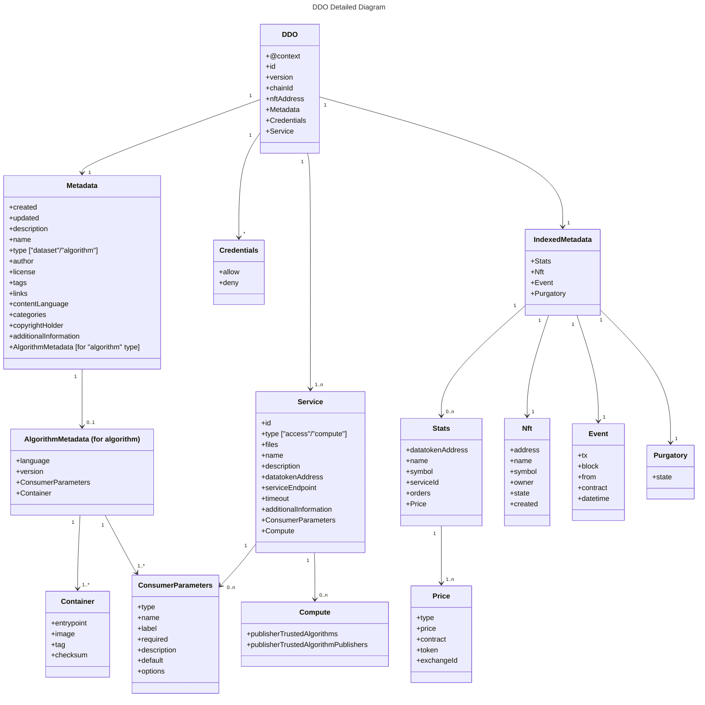

# OE DDO Specification - to be updated

## New DDO Schema - High Level&#x20;

The below diagram shows the high-level DDO schema depicting the content of each data structure and the relations between them.

Please note that some data structures apply only on certain types of services or assets.


### Required Attributes

A DDO in Ocean has these required attributes:

<table><thead><tr><th width="169.6737288135593">Attribute</th><th width="164">Type</th><th>Description</th></tr></thead><tbody><tr><td><strong><code>@context</code></strong></td><td>Array of <code>string</code></td><td>Contexts used for validation.</td></tr><tr><td><strong><code>id</code></strong></td><td><code>string</code></td><td>Computed as <code>sha256(address of ERC721 contract + chainId)</code>.</td></tr><tr><td><strong><code>version</code></strong></td><td><code>string</code></td><td>Version information in <a href="https://semver.org">SemVer</a> notation referring to this DDO spec version, like <code>4.1.0</code>.</td></tr><tr><td><strong><code>chainId</code></strong></td><td><code>number</code></td><td>Stores the chainId of the network the DDO was published to.</td></tr><tr><td><strong><code>nftAddress</code></strong></td><td><code>string</code></td><td>NFT contract linked to this asset</td></tr><tr><td><strong><code>metadata</code></strong></td><td><a href="broken-reference">Metadata</a></td><td>Stores an object describing the asset.</td></tr><tr><td><strong><code>services</code></strong></td><td><a href="broken-reference">Services</a></td><td>Stores an array of services defining access to the asset.</td></tr><tr><td><strong><code>credentials</code></strong></td><td><a href="broken-reference">Credentials</a></td><td>Describes the credentials needed to access a dataset in addition to the <code>services</code> definition.</td></tr></tbody></table>

<details>

<summary>Full Enhanced DDO Example</summary>


```json
{
  "@context": ["https://w3id.org/did/v1"],
  "id": "did:op:ACce67694eD2848dd683c651Dab7Af823b7dd123",
  "version": "4.1.0",
  "chainId": 1,
  "nftAddress": "0x123",
  "metadata": {
    "created": "2020-11-15T12:27:48Z",
    "updated": "2021-05-17T21:58:02Z",
    "description": "Sample description",
    "name": "Sample asset",
    "type": "dataset",
    "author": "OPF",
    "license": "https://market.oceanprotocol.com/terms"
  },
  "services": [
    {
      "id": "1",
      "type": "access",
      "files": "0x044736da6dae39889ff570c34540f24e5e084f4e5bd81eff3691b729c2dd1465ae8292fc721e9d4b1f10f56ce12036c9d149a4dab454b0795bd3ef8b7722c6001e0becdad5caeb2005859642284ef6a546c7ed76f8b350480691f0f6c6dfdda6c1e4d50ee90e83ce3cb3ca0a1a5a2544e10daa6637893f4276bb8d7301eb35306ece50f61ca34dcab550b48181ec81673953d4eaa4b5f19a45c0e9db4cd9729696f16dd05e0edb460623c843a263291ebe757c1eb3435bb529cc19023e0f49db66ef781ca692655992ea2ca7351ac2882bf340c9d9cb523b0cbcd483731dc03f6251597856afa9a68a1e0da698cfc8e81824a69d92b108023666ee35de4a229ad7e1cfa9be9946db2d909735",
      "name": "Download service",
      "description": "Download service",
      "datatokenAddress": "0x123",
      "serviceEndpoint": "https://myprovider.com",
      "timeout": 0,
      "consumerParameters": [
        {
          "name": "surname",
          "type": "text",
          "label": "Name",
          "required": true,
          "default": "NoName",
          "description": "Please fill your name"
        },
        {
          "name": "age",
          "type": "number",
          "label": "Age",
          "required": false,
          "default": 0,
          "description": "Please fill your age"
        }
      ]
    },
    {
      "id": "2",
      "type": "compute",
      "files": "0x044736da6dae39889ff570c34540f24e5e084f4e5bd81eff3691b729c2dd1465ae8292fc721e9d4b1f10f56ce12036c9d149a4dab454b0795bd3ef8b7722c6001e0becdad5caeb2005859642284ef6a546c7ed76f8b350480691f0f6c6dfdda6c1e4d50ee90e83ce3cb3ca0a1a5a2544e10daa6637893f4276bb8d7301eb35306ece50f61ca34dcab550b48181ec81673953d4eaa4b5f19a45c0e9db4cd9729696f16dd05e0edb460623c843a263291ebe757c1eb3435bb529cc19023e0f49db66ef781ca692655992ea2ca7351ac2882bf340c9d9cb523b0cbcd483731dc03f6251597856afa9a68a1e0da698cfc8e81824a69d92b108023666ee35de4a229ad7e1cfa9be9946db2d909735",
      "name": "Compute service",
      "description": "Compute service",
      "datatokenAddress": "0x124",
      "serviceEndpoint": "https://myprovider.com",
      "timeout": 3600,
      "compute": {
        "allowRawAlgorithm": false,
        "allowNetworkAccess": true,
        "publisherTrustedAlgorithmPublishers": ["0x234", "0x235"],
        "publisherTrustedAlgorithms": [
          {
            "did": "did:op:123",
            "filesChecksum": "100",
            "containerSectionChecksum": "200"
          },
          {
            "did": "did:op:124",
            "filesChecksum": "110",
            "containerSectionChecksum": "210"
          }
        ]
      }
    }
  ],
  "credentials": {
    "allow": [
      {
        "type": "address",
        "values": ["0x123", "0x456"]
      }
    ],
    "deny": [
      {
        "type": "address",
        "values": ["0x2222", "0x333"]
      }
    ]
  },
  "indexedMetadata": {
    "stats": [
            {
                "datatokenAddress": "0x35f74f653Dcb291838aa8AF8Be1E1eF30e749bb7",
                "name": "BDT1",
                "symbol": "DT1",
                "serviceId": "0",
                "orders": 1,
                // this service has one dispenser available
                "prices": [
                    {  
                        "type": "dispenser",
                        "price": "0",
                        "contract": "0x457"
                    }
                ]
            },
            {
                "datatokenAddress": "0x34e84f653Dcb291838aa8AF8Be1E1eF30e749ba0",
                "name": "BDT2",
                "symbol": "DT2",
                "serviceId": "1",
                "orders": 5,
                // this service accepts OCEAN for payment, costs 1 token per access
                "prices":
                [
                        {
                            "type": "fixedrate",
                            "price": "1",
                            "token":"0x967da4048cD07aB37855c090aAF366e4ce1b9F48",
                            "contract": "0x978da4048cD07aB37855c090aAF366e4ce1b9e48",  "exchangeId":  "23434"
                        }
                ]
            },
            {
                "datatokenAddress": "0x1234565",
                "name": "BDT3",
                "symbol": "DT3",
                "serviceId": "2",
                "orders": 5,
                // this service accepts either 2 OCEAN or 1 FETCH for payment
                "prices":
                [  
                   {
                    "type": "fixedrate", 
                    "price": "2",
                    "token":"0x967da4048cD07aB37855c090aAF366e4ce1b9F48",
                    "contract": "0x978da4048cD07aB37855c090aAF366e4ce1b9e48",
                    "exchangeId":  "23434"
                    },
                   {
                    "type": "fixedrate",
                    "price": "1",
                    "token":"0xaea46A60368A7bD060eec7DF8CBa43b7EF41Ad85",
                    "contract": "0x978da4048cD07aB37855c090aAF366e4ce1b9e48",
                    "exchangeId":  "4535"
                   }
            ]
        }
    ],
    "nft": {
        "address": "0x123",
        "name": "Ocean Protocol Asset",
        "symbol": "OCEAN-A",
        "owner": "0x0000000",
        "state": 0,
        "created": "2000-10-31T01:30:00",
        "tokenURI": "xxx"
  },

    "event": {
        "tx": "0x8d127de58509be5dfac600792ad24cc9164921571d168bff2f123c7f1cb4b11c",
        "block": 12831214,
        "from": "0xAcca11dbeD4F863Bb3bC2336D3CE5BAC52aa1f83",
        "contract": "0x1a4b70d8c9DcA47cD6D0Fb3c52BB8634CA1C0Fdf",
        "datetime": "2000-10-31T01:30:00"
    },

    "purgatory": {
        "state": false
    }
 },

 "datatokens": [
    {
      "address": "0x000000",
      "name": "Datatoken 1",
      "symbol": "DT-1",
      "serviceId": "1"
    },
    {
      "address": "0x000001",
      "name": "Datatoken 2",
      "symbol": "DT-2",
      "serviceId": "2"
    }
  ]
  
}
```


</details>

#### Metadata

This object holds information describing the actual asset.

<table><thead><tr><th width="260.3333333333333">Attribute</th><th width="166">Type</th><th>Description</th></tr></thead><tbody><tr><td><strong><code>created</code></strong></td><td><code>ISO date/time string</code></td><td>Contains the date of the creation of the dataset content in ISO 8601 format preferably with timezone designators, e.g. <code>2000-10-31T01:30:00Z</code>.</td></tr><tr><td><strong><code>updated</code></strong></td><td><code>ISO date/time string</code></td><td>Contains the date of last update of the dataset content in ISO 8601 format preferably with timezone designators, e.g. <code>2000-10-31T01:30:00Z</code>.</td></tr><tr><td><strong><code>description</code></strong>*</td><td><code>string</code></td><td>Details of what the resource is. For a dataset, this attribute explains what the data represents and what it can be used for.</td></tr><tr><td><strong><code>copyrightHolder</code></strong></td><td><code>string</code></td><td>The party holding the legal copyright. Empty by default.</td></tr><tr><td><strong><code>name</code></strong>*</td><td><code>string</code></td><td>Descriptive name or title of the asset.</td></tr><tr><td><strong><code>type</code></strong>*</td><td><code>string</code></td><td>Asset type. Includes <code>"dataset"</code> (e.g. csv file), <code>"algorithm"</code> (e.g. Python script). Each type needs a different subset of metadata attributes.</td></tr><tr><td><strong><code>author</code></strong>*</td><td><code>string</code></td><td>Name of the entity generating this data (e.g. Tfl, Disney Corp, etc.).</td></tr><tr><td><strong><code>license</code></strong>*</td><td><code>string</code></td><td>Short name referencing the license of the asset (e.g. Public Domain, CC-0, CC-BY, No License Specified, etc. ). If it's not specified, the following value will be added: "No License Specified".</td></tr><tr><td><strong><code>links</code></strong></td><td>Array of <code>string</code></td><td>Mapping of URL strings for data samples, or links to find out more information. Links may be to either a URL or another asset.</td></tr><tr><td><strong><code>contentLanguage</code></strong></td><td><code>string</code></td><td>The language of the content. Use one of the language codes from the <a href="https://tools.ietf.org/html/bcp47">IETF BCP 47 standard</a></td></tr><tr><td><strong><code>tags</code></strong></td><td>Array of <code>string</code></td><td>Array of keywords or tags used to describe this content. Empty by default.</td></tr><tr><td><strong><code>categories</code></strong></td><td>Array of <code>string</code></td><td>Array of categories associated to the asset. Note: recommended to use <code>tags</code> instead of this.</td></tr><tr><td><strong><code>additionalInformation</code></strong></td><td>Object</td><td>Stores additional information, this is customizable by publisher</td></tr><tr><td><strong><code>algorithm</code></strong>**</td><td><a href="../compute-to-data/compute-to-data-algorithms.md#algorithm-metadata">Algorithm Metadata</a></td><td>Information about asset of <code>type</code> <code>algorithm</code></td></tr></tbody></table>

\* Required

\*\* Required for algorithms only

<details>

<summary>Metadata Example</summary>

```json
{
  "metadata": {
    "created": "2020-11-15T12:27:48Z",
    "updated": "2021-05-17T21:58:02Z",
    "description": "Sample description",
    "name": "Sample asset",
    "type": "dataset",
    "author": "OPF",
    "license": "https://market.oceanprotocol.com/terms"
  }
}
```

</details>

#### Services

Services define the access for an asset, and each service is represented by its respective datatoken.

An asset should have at least one service to be actually accessible and can have as many services which make sense for a specific use case.

<table><thead><tr><th width="259.3333333333333">Attribute</th><th width="121">Type</th><th>Description</th></tr></thead><tbody><tr><td><strong><code>id</code></strong>*</td><td><code>string</code></td><td>Unique ID</td></tr><tr><td><strong><code>type</code></strong>*</td><td><code>string</code></td><td>Type of service <code>access</code>, <code>compute</code>, <code>wss</code> etc.</td></tr><tr><td><strong><code>name</code></strong></td><td><code>string</code></td><td>Service friendly name</td></tr><tr><td><strong><code>description</code></strong></td><td><code>string</code></td><td>Service description</td></tr><tr><td><strong><code>datatokenAddress</code></strong>*</td><td><code>string</code></td><td>Datatoken</td></tr><tr><td><strong><code>serviceEndpoint</code></strong>*</td><td><code>string</code></td><td>Provider URL (schema + host)</td></tr><tr><td><strong><code>files</code></strong>*</td><td><a href="new-ddo-specification.md#files">Files</a></td><td>Encrypted file.</td></tr><tr><td><strong><code>timeout</code></strong>*</td><td><code>number</code></td><td>Describing how long the service can be used after consumption is initiated. A timeout of <code>0</code> represents no time limit. Expressed in seconds.</td></tr><tr><td><strong><code>compute</code></strong>**</td><td><a href="../compute-to-data/compute-options.md">Compute</a></td><td>If service is of <code>type</code> <code>compute</code>, holds information about the compute-related privacy settings &#x26; resources.</td></tr><tr><td><strong><code>consumerParameters</code></strong></td><td><a href="../compute-to-data/compute-options.md#consumer-parameters">Consumer Parameters</a></td><td>An object the defines required consumer input before consuming the asset</td></tr><tr><td><strong><code>additionalInformation</code></strong></td><td>Object</td><td>Stores additional information, this is customizable by publisher</td></tr></tbody></table>

\* Required

\*\* Required for compute assets only

#### Files

The `files` field is returned as a `string` which holds the encrypted file URLs.

<details>

<summary>Files Example</summary>


```json
{
  "files": "0x044736da6dae39889ff570c34540f24e5e084f4e5bd81eff3691b729c2dd1465ae8292fc721e9d4b1f10f56ce12036c9d149a4dab454b0795bd3ef8b7722c6001e0becdad5caeb2005859642284ef6a546c7ed76f8b350480691f0f6c6dfdda6c1e4d50ee90e83ce3cb3ca0a1a5a2544e10daa6637893f4276bb8d7301eb35306ece50f61ca34dcab550b48181ec81673953d4eaa4b5f19a45c0e9db4cd9729696f16dd05e0edb460623c843a263291ebe757c1eb3435bb529cc19023e0f49db66ef781ca692655992ea2ca7351ac2882bf340c9d9cb523b0cbcd483731dc03f6251597856afa9a68a1e0da698cfc8e81824a69d92b108023666ee35de4a229ad7e1cfa9be9946db2d909735"
}
```


</details>

#### Credentials

By default, a consumer can access a resource if they have 1 datatoken. _Credentials_ allow the publisher to optionally specify more fine-grained permissions.

Consider a medical data use case, where only a credentialed EU researcher can legally access a given dataset. Ocean supports this as follows: a consumer can only access the resource if they have 1 datatoken _and_ one of the specified `"allow"` credentials.

This is like going to an R-rated movie, where you can only get in if you show both your movie ticket (datatoken) _and_ some identification showing you're old enough (credential).

Only credentials that can be proven are supported. This includes Ethereum public addresses and in the future [W3C Verifiable Credentials](https://www.w3.org/TR/vc-data-model/) and more.

Ocean also supports `deny` credentials: if a consumer has any of these credentials, they can not access the resource.

Here's an example object with both `allow` and `deny` entries:

<details>

<summary>Credentials Example</summary>

```json
{
  "credentials": {
    "allow": [
      {
        "type": "address",
        "values": ["0x123", "0x456"]
      }
    ],
    "deny": [
      {
        "type": "address",
        "values": ["0x2222", "0x333"]
      }
    ]
  }
}
```

</details>

#### DDO Checksum

In order to ensure the integrity of the DDO, a checksum is computed for each DDO:

```js
const checksum = sha256(JSON.stringify(ddo));
```

The checksum hash is used when publishing/updating metadata using the `setMetaData` function in the ERC721 contract, and is stored in the event generated by the ERC721 contract.

<details>

<summary>MetadataCreated and MetadataUpdated smart contract events</summary>

```solidity
event MetadataCreated(
  address indexed createdBy,
  uint8 state,
  string decryptorUrl,
  bytes flags,
  bytes data,
  bytes metaDataHash,
  uint256 timestamp,
  uint256 blockNumber
);

event MetadataUpdated(
  address indexed updatedBy,
  uint8 state,
  string decryptorUrl,
  bytes flags,
  bytes data,
  bytes metaDataHash,
  uint256 timestamp,
  uint256 blockNumber
);
```

</details>

_Aquarius_ should always verify the checksum after data is decrypted via a _Provider_ API call.

#### State

Each asset has a state, which is held by the NFT contract. The possible states are:

<table><thead><tr><th width="95">State</th><th width="271">Description</th><th width="155">Discoverable in Ocean Market</th><th>Ordering allowed</th><th>Listed under profile</th></tr></thead><tbody><tr><td><strong><code>0</code></strong></td><td>Active</td><td>Yes</td><td>Yes</td><td>Yes</td></tr><tr><td><strong><code>1</code></strong></td><td>End-of-life</td><td>Yes</td><td>No</td><td>No</td></tr><tr><td><strong><code>2</code></strong></td><td>Deprecated (by another asset)</td><td>No</td><td>No</td><td>No</td></tr><tr><td><strong><code>3</code></strong></td><td>Revoked by publisher</td><td>No</td><td>No</td><td>No</td></tr><tr><td><strong><code>4</code></strong></td><td>Ordering is temporary disabled</td><td>Yes</td><td>No</td><td>Yes</td></tr><tr><td><strong><code>5</code></strong></td><td>Asset unlisted.</td><td>No</td><td>Yes</td><td>Yes</td></tr></tbody></table>

States details:

1. **Active**: Assets in the "Active" state are fully functional and available for discovery in Ocean Market, and other components. Users can search for, view, and interact with these assets. Ordering is allowed, which means users can place orders to purchase or access the asset's services.
2. **End-of-life**: Assets in the "End-of-life" state remain discoverable but cannot be ordered. This state indicates that the assets are usually deprecated or outdated, and they are no longer actively promoted or maintained.
3. **Deprecated (by another asset)**: This state indicates that another asset has deprecated the current asset. Deprecated assets are not discoverable, and ordering is not allowed. Similar to the "End-of-life" state, deprecated assets are not listed under the owner's profile.
4. **Revoked by publisher**: When an asset is revoked by its publisher, it means that the publisher has explicitly revoked access or ownership rights to the asset. Revoked assets are not discoverable, and ordering is not allowed.
5. **Ordering is temporarily disabled**: Assets in this state are still discoverable, but ordering functionality is temporarily disabled. Users can view the asset and gather information, but they cannot place orders at that moment. However, these assets are still listed under the owner's profile.
6. **Asset unlisted**: Assets in the "Asset unlisted" state are not discoverable. However, users can still place orders for these assets, making them accessible. Unlisted assets are listed under the owner's profile, allowing users to view and access them.

The following fields are added by _Aquarius_ in its DDO response for convenience reasons, where an asset returned by _Aquarius_ inherits the DDO fields stored on-chain.

These additional fields are never stored on-chain and are never taken into consideration when [hashing the DDO](broken-reference).

#### Datatokens

The `datatokens` array contains information about the ERC20 datatokens attached to [asset services](broken-reference).

<table><thead><tr><th width="160.77255871446232">Attribute</th><th width="128.33333333333331">Type</th><th>Description</th></tr></thead><tbody><tr><td><strong><code>address</code></strong></td><td><code>string</code></td><td>Contract address of the deployed ERC20 contract.</td></tr><tr><td><strong><code>name</code></strong></td><td><code>string</code></td><td>Name of NFT set in contract.</td></tr><tr><td><strong><code>symbol</code></strong></td><td><code>string</code></td><td>Symbol of NFT set in contract.</td></tr><tr><td><strong><code>serviceId</code></strong></td><td><code>string</code></td><td>ID of the service the datatoken is attached to.</td></tr></tbody></table>

<details>

<summary>Datatokens Array Example</summary>

```json
{
  "datatokens": [
    {
      "address": "0x000000",
      "name": "Datatoken 1",
      "symbol": "DT-1",
      "serviceId": "1"
    },
    {
      "address": "0x000001",
      "name": "Datatoken 2",
      "symbol": "DT-2",
      "serviceId": "2"
    }
  ]
}
```

</details>

#### IndexedMetadata

**Indexed Metadata** contains off-chain data that helps storing assets pricing details and displaying them properly within decenterlized applications.

**Indexed Metadata** is composed of the following objects:

* NFT
* Event
* Purgatory
* Stats

When hashing is performed against a document, **indexedMeatadata** object has to be removed from the DDO structure, its off-chain data being stored and maintained only in the _**Indexer**_ database, within **DDO** collection.

#### NFT

The `nft` object contains information about the ERC721 NFT contract which represents the intellectual property of the publisher.

<table><thead><tr><th width="144.70989551321452">Attribute</th><th width="234.33333333333331">Type</th><th>Description</th></tr></thead><tbody><tr><td><strong><code>address</code></strong></td><td><code>string</code></td><td>Contract address of the deployed ERC721 NFT contract.</td></tr><tr><td><strong><code>name</code></strong></td><td><code>string</code></td><td>Name of NFT set in contract.</td></tr><tr><td><strong><code>symbol</code></strong></td><td><code>string</code></td><td>Symbol of NFT set in contract.</td></tr><tr><td><strong><code>owner</code></strong></td><td><code>string</code></td><td>ETH account address of the NFT owner.</td></tr><tr><td><strong><code>state</code></strong></td><td><code>number</code></td><td>State of the asset reflecting the NFT contract value. See <a href="broken-reference">State</a></td></tr><tr><td><strong><code>created</code></strong></td><td><code>ISO date/time string</code></td><td>Contains the date of NFT creation.</td></tr><tr><td><strong><code>tokenURI</code></strong></td><td><code>string</code></td><td>tokenURI</td></tr></tbody></table>

<details>

<summary>NFT Object Example</summary>

```json
{
  "nft": {
    "address": "0x000000",
    "name": "Ocean Protocol Asset",
    "symbol": "OCEAN-A",
    "owner": "0x0000000",
    "state": 0,
    "created": "2000-10-31T01:30:00Z"
  }
}
```

</details>

#### Event

The `event` section contains information about the last transaction that created or updated the DDO.

<details>

<summary>Event Example</summary>


```json
{
  "event": {
    "tx": "0x8d127de58509be5dfac600792ad24cc9164921571d168bff2f123c7f1cb4b11c",
    "block": 12831214,
    "from": "0xAcca11dbeD4F863Bb3bC2336D3CE5BAC52aa1f83",
    "contract": "0x1a4b70d8c9DcA47cD6D0Fb3c52BB8634CA1C0Fdf",
    "datetime": "2000-10-31T01:30:00"
  }
}
```


</details>

#### Purgatory

Contains information about an asset's purgatory status defined in [`list-purgatory`](https://github.com/oceanprotocol/list-purgatory). Marketplace interfaces are encouraged to prevent certain user actions like adding liquidity on assets in purgatory.

<table><thead><tr><th width="145.92125984251967">Attribute</th><th width="134">Type</th><th>Description</th></tr></thead><tbody><tr><td><strong><code>state</code></strong></td><td><code>boolean</code></td><td>If <code>true</code>, asset is in purgatory.</td></tr><tr><td><strong><code>reason</code></strong></td><td><code>string</code></td><td>If asset is in purgatory, contains the reason for being there as defined in <code>list-purgatory</code>.</td></tr></tbody></table>

<details>

<summary>Purgatory Example</summary>

```json
{ 
    "purgatory": {
      "state": true,
      "reason": "Copyright violation" 
      } 

}
```

```json
{
  "purgatory": {
    "state": false
  }
}
```

</details>

#### Statistics

The `stats` section contains a list of different statistics fields.

<table><thead><tr><th width="142.75440658049354">Attribute</th><th width="125">Type</th><th>Description</th></tr></thead><tbody><tr><td><strong><code>datatokenAddress</code></strong></td><td><code>string</code></td><td>Datatoken address which has the pricing schema attached.</td></tr><tr><td><strong><code>name</code></strong></td><td><code>string</code></td><td>Name of the datatoken with pricing schema.</td></tr><tr><td><strong><code>symbol</code></strong></td><td><code>string</code></td><td>Symbol of the datatoken with pricing schema.</td></tr><tr><td><strong><code>serviceId</code></strong></td><td><code>string</code></td><td>Service ID of the datatoken with pricing schema.</td></tr><tr><td><strong><code>orders</code></strong></td><td><code>number</code></td><td>How often an asset was ordered, meaning how often it was either downloaded or used as part of a compute job.</td></tr><tr><td><strong><code>prices</code></strong></td><td><code>array</code></td><td>Pricing schemas list for this datatoken (a fixedrate and dispenser can co-exist for the same datatoken).</td></tr><tr><td><strong><code>type</code></strong></td><td><code>string</code></td><td>Static values: <code>"fixedrate"</code>, <code>"dispenser"</code>.</td></tr><tr><td><strong><code>price</code></strong></td><td><code>string</code></td><td>Price for schema (for dispenser is default "0").</td></tr><tr><td><strong><code>contract</code></strong></td><td><code>string</code></td><td>Contract address of pricing schema contract.</td></tr><tr><td><strong><code>token</code></strong></td><td><code>string</code></td><td>Basetoken for <code>fixedrate</code>, Datatoken for <code>dispenser</code>.</td></tr><tr><td><strong><code>exchangeId</code></strong></td><td><code>string</code></td><td>Just for <code>fixedrate</code>.</td></tr></tbody></table>

<details>

<summary>Statistics Example</summary>

```json
{
  "stats":
  [
    {
        "datatokenAddress": "0x123",
        "name": "Branin dataset: DT1",
        "symbol": "DT1",
        "serviceId": "0",
        "orders": 1,
        "prices":
        [
            {
                "type": "fixedrate", // or "dispenser"
                "price": "123",
                "contract": "<contractAddress>",
                "token": "0x89777", // token accepted for payment
                "exchangeId":  "xx" // only for fre, this is exhangeID
            }
        ]
    }
  ]
}
```

</details>

### Compute to data

For algorithms and datasets that are used for compute to data, there are additional fields and objects within the DDO structure that you need to consider. These include:

* `compute` attributes
* `publisherTrustedAlgorithms`
* `consumerParameters`

Details for each of these are explained on the [Compute Options page](../compute-to-data/compute-options.md).

## New DDO Schema - Detailed

The below diagram shows the detailed DDO schema depicting the content of each data structure and the relations between them.

Please note that some data structures apply only on certain types of services or assets.


