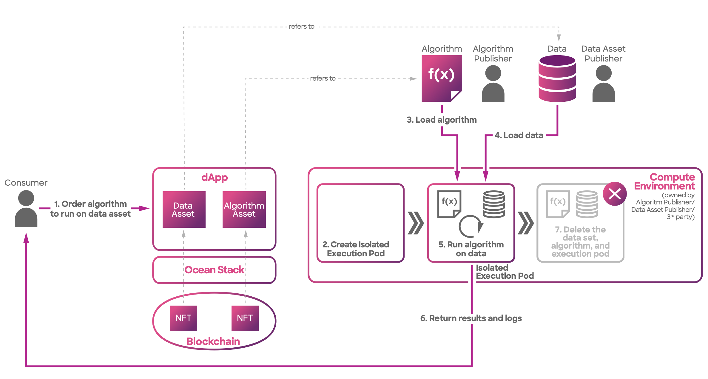

# Architecture

Compute-to-Data (C2D) is a cutting-edge data processing paradigm that enables secure and privacy-preserving computation on sensitive datasets.

In the C2D workflow, the following steps are performed:

1. The consumer initiates a compute-to-data job by selecting the desired data asset and algorithm, and then, the orders are validated via the dApp used.
2. A dedicated and isolated execution pod is created for the C2D job.
3. The execution pod loads the specified algorithm into its environment.
4. The execution pod securely loads the selected dataset for processing.
5. The algorithm is executed on the loaded dataset within the isolated execution pod.
6. The results and logs generated by the algorithm are securely returned to the user.
7. The execution pod deletes the dataset, algorithm, and itself to ensure data privacy and security.

<figure><figcaption>
Compute architecture overview
</figcaption></figure>

The interaction between the Consumer and the Provider follows a specific workflow. To initiate the process, the Consumer contacts the Provider by invoking the `start(did, algorithm, additionalDIDs)` function with parameters such as the data identifier (DID), algorithm, and additional DIDs if required. Upon receiving this request, the Provider generates a unique job identifier (`XXXX`) and returns it to the Consumer. The Provider then assumes the responsibility of overseeing the remaining steps.

Throughout the computation process, the Consumer has the ability to check the status of the job by making a query to the Provider using the `getJobDetails(XXXX)` function, providing the job identifier (`XXXX`) as a reference.


You have the option to initiate a compute job using one or more data assets. You can explore this functionality by utilizing the [ocean.py](../../data-scientists/ocean.py) and [ocean.js](../ocean.js) libraries.


Now, let's delve into the inner workings of the Provider. Initially, it verifies whether the Consumer has sent the appropriate datatokens to gain access to the desired data. Once validated, the Provider interacts with the Operator-Service, a microservice responsible for coordinating the job execution. The Provider submits a request to the Operator-Service, which subsequently forwards the request to the Operator-Engine, the actual compute system in operation.

The Operator-Engine, equipped with functionalities like running Kubernetes compute jobs, carries out the necessary computations as per the requirements. Throughout the computation process, the Operator-Engine informs the Operator-Service of the job's progress. Finally, when the job reaches completion, the Operator-Engine signals the Operator-Service, ensuring that the Provider receives notification of the job's successful conclusion.

Here are the actors/components:

* Consumers - The end users who need to use some computing services offered by the same Publisher as the data Publisher.
* Operator-Service - Micro-service that is handling the compute requests.
* Operator-Engine - The computing systems where the compute will be executed.
* Kubernetes - a K8 cluster

Before the flow can begin, these pre-conditions must be met:

* The Asset DDO has a `compute` service.
* The Asset DDO compute service must permit algorithms to run on it.
* The Asset DDO must specify an Ocean Provider endpoint exposed by the Publisher.

### Access Control using Ocean Node

Similar to the `access service`, the `compute service` within Ocean Protocol relies on the [Ocean Node](../ocean-node/README.md), which is a crucial component managed by the asset Publishers. The role of the Ocean Node is to facilitate interactions with users and handle the fundamental aspects of a Publisher's infrastructure, enabling seamless integration into the Ocean Protocol ecosystem. It serves as the primary interface for direct interaction with the infrastructure where the data is located.

The [Ocean Node](../ocean-node/README.md) encompasses the necessary credentials to establish secure and authorized interactions with the underlying infrastructure. Initially, this infrastructure may be hosted in cloud providers, although it also has the flexibility to extend to on-premise environments if required. By encompassing the necessary credentials, the Ocean Node ensures the smooth and controlled access to the infrastructure, allowing Publishers to effectively leverage the compute service within Ocean Protocol.

The entire Compute-to-Data functionality is embedded in Ocean Node which includes handlers for operations that can be called via **HTTP** and **P2P** protocols:

- `GetComputeEnvironments` - returns list of environments that can be selected to run the algorithm on
- `InitializeCompute` - generates provider fees necessary for asset's ordering
- `FreeStartCompute` - runs algorithms without necessary publish the assets on-chain (dataset and algorithm), using free resources from the selected environment
- `PaidStartCompute` - runs algorithms with on-chain assets (dataset and algorithm), using paid resources from the selected environment. The payment is requested at every start compute call, being handled by `Escrow` contract.
- `ComputeGetStatus` - retrieves compute job status.
- `ComputeStop` - stops compute job execution when the job is `Running`.
- `ComputeGetResult` - returns compute job results when job is `Finished`.

### C2D Engine

The **C2D Engine** class within Ocean Node is in charge of orchestrating the compute infrastructure using `Docker` as backend where each compute job runs in an isolated [Container]. **C2D Engine** can be extended to run on multiple engine types, such as `Kubernetes` (where each compute job runs in an isolated [Kubernetes Pod](https://kubernetes.io/docs/concepts/workloads/pods/)), `Bachalau` and many more, currently it supports only **Docker**.

When handler from Ocean Node (free or paid) is called, C2D Engine processes the job details (e.g. `id`, `payment`, `duration`) and manages the infrastructure necessary to complete the execution of the compute workflows.

* Configuring the setup by downloading the compute job dependencies (datasets and algorithms).
* Creates the container including the algorithm to execute.
* Pulling the docker image in the algorithm container.

#### Configuration Phase

One of its responsibility revolves around fetching and preparing the required assets and files, ensuring a smooth and seamless execution of the job. By meticulously handling the environment configuration, the **C2D Engine** guarantees that all necessary components are in place, setting the stage for a successful job execution.

1. **Fetching Dataset Assets**: It downloads the files corresponding to datasets and saves them in the location `/data/inputs/DID/`. The files are named based on their array index ranging from 0 to X, depending on the total number of files associated with the dataset.
2. **Fetching Algorithm Files**: It retrieves the algorithm files and stores them in the `/data/transformations/` directory. The first file is named 'algorithm', and the subsequent files are indexed from 1 to X, based on the number of files present for the algorithm.
3. **Fetching DDOS**: Additionally, it fetches Decentralized Document Oriented Storage (DDOS) and saves them to the disk at the location `/data/ddos/`.
4. **Error Handling**: In case of any provisioning failures, whether during data fetching or algorithm processing, job status is updated in a SQLite database, and logs the relevant error messages.

### Publishing Phase

Publishing phase serves for efficient processing, logging, and uploading compute job outputs. C2D Engine streamlines the compute job management process, enabling easy and reliable handling of output data generated during computation tasks.
The outputs are published in `/data/outputs` folder which will be available for retrieving and `computeResult` is called by the time that job execution status is updated to `Finished`
in SQLite database.

* C2D Engine does not provide storage capabilities; all state information is stored directly in the dedicated algorithm container
