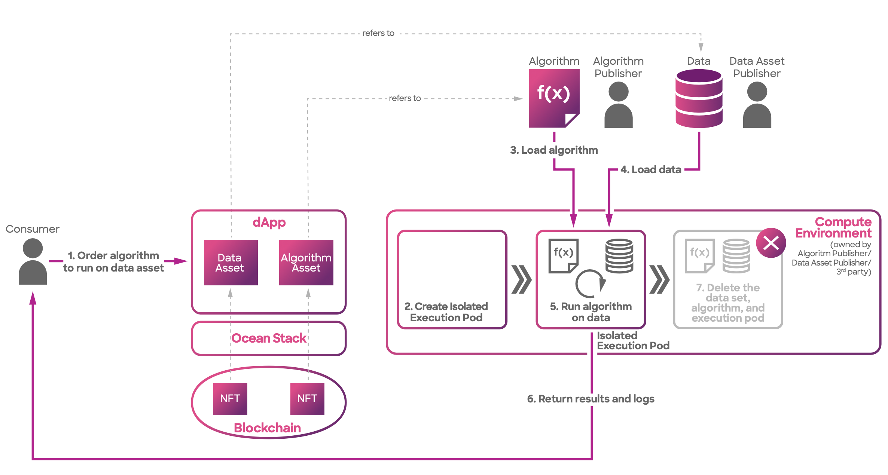

# Architecture

Compute-to-Data (C2D) is a cutting-edge data processing paradigm that enables secure and privacy-preserving computation on sensitive datasets.

In the C2D workflow, the following steps are performed:

1. The consumer initiates a compute-to-data job by selecting the desired data asset and algorithm, and then, the orders are validated via the dApp used.
2. A dedicated and isolated execution pod is created for the C2D job.
3. The execution pod loads the specified algorithm into its environment.
4. The execution pod securely loads the selected dataset for processing.
5. The algorithm is executed on the loaded dataset within the isolated execution pod.
6. The results and logs generated by the algorithm are securely returned to the user.
7. The execution pod deletes the dataset, algorithm, and itself to ensure data privacy and security.

<figure><figcaption>
Compute architecture overview
</figcaption></figure>

The interaction between the Consumer and the Provider follows a specific workflow. To initiate the process, the Consumer contacts the Provider by invoking the `start(did, algorithm, additionalDIDs)` function with parameters such as the data identifier (DID), algorithm, and additional DIDs if required. Upon receiving this request, the Provider generates a unique job identifier (`XXXX`) and returns it to the Consumer. The Provider then assumes the responsibility of overseeing the remaining steps.

Throughout the computation process, the Consumer has the ability to check the status of the job by making a query to the Provider using the `getJobDetails(XXXX)` function, providing the job identifier (`XXXX`) as a reference.


You have the option to initiate a compute job using one or more data assets. You can explore this functionality by utilizing the [ocean.py](https://github.com/oceanprotocol/docs/blob/main/data-scientists/ocean.py) and [ocean.js](https://github.com/oceanprotocol/docs/blob/main/developers/ocean.js) libraries.


Now, let's delve into the inner workings of the Provider. Initially, it verifies whether the Consumer has sent the appropriate datatokens to gain access to the desired data. Once validated, the Provider interacts with the Operator-Service, a microservice responsible for coordinating the job execution. The Provider submits a request to the Operator-Service, which subsequently forwards the request to the Operator-Engine, the actual compute system in operation.

The Operator-Engine, equipped with functionalities like running Kubernetes compute jobs, carries out the necessary computations as per the requirements. Throughout the computation process, the Operator-Engine informs the Operator-Service of the job's progress. Finally, when the job reaches completion, the Operator-Engine signals the Operator-Service, ensuring that the Provider receives notification of the job's successful conclusion.

Here are the actors/components:

* Consumers - The end users who need to use some computing services offered by the same Publisher as the data Publisher.
* Operator-Service - Micro-service that is handling the compute requests.
* Operator-Engine - The computing systems where the compute will be executed.
* Kubernetes - a K8 cluster

Before the flow can begin, these pre-conditions must be met:

* The Asset DDO has a `compute` service.
* The Asset DDO compute service must permit algorithms to run on it.
* The Asset DDO must specify an Ocean Provider endpoint exposed by the Publisher.

### Access Control using Ocean Provider

Similar to the `access service`, the `compute service` within Ocean Protocol relies on the [Ocean Provider](../provider/), which is a crucial component managed by the asset Publishers. The role of the Ocean Provider is to facilitate interactions with users and handle the fundamental aspects of a Publisher's infrastructure, enabling seamless integration into the Ocean Protocol ecosystem. It serves as the primary interface for direct interaction with the infrastructure where the data is located.

The [Ocean Provider](../provider/) encompasses the necessary credentials to establish secure and authorized interactions with the underlying infrastructure. Initially, this infrastructure may be hosted in cloud providers, although it also has the flexibility to extend to on-premise environments if required. By encompassing the necessary credentials, the Ocean Provider ensures the smooth and controlled access to the infrastructure, allowing Publishers to effectively leverage the compute service within Ocean Protocol.

### Operator Service

The **Operator Service** is a micro-service in charge of managing the workflow executing requests.

The main responsibilities are:

* Expose an HTTP API allowing for the execution of data access and compute endpoints.
* Interact with the infrastructure (cloud/on-premise) using the Publisher's credentials.
* Start/stop/execute computing instances with the algorithms provided by users.
* Retrieve the logs generated during executions.

Typically the Operator Service is integrated from Ocean Provider, but can be called independently of it.

The Operator Service is in charge of establishing the communication with the K8s cluster, allowing it to:

* Register new compute jobs
* List the current compute jobs
* Get a detailed result for a given job
* Stop a running job

The Operator Service doesn't provide any storage capability, all the state is stored directly in the K8s cluster.

### Operator Engine

The **Operator Engine** is in charge of orchestrating the compute infrastructure using Kubernetes as backend where each compute job runs in an isolated [Kubernetes Pod](https://kubernetes.io/docs/concepts/workloads/pods/). Typically the Operator Engine retrieves the workflows created by the Operator Service in Kubernetes, and manage the infrastructure necessary to complete the execution of the compute workflows.

The Operator Engine is in charge of retrieving all the workflows registered in a K8s cluster, allowing to:

* Orchestrate the flow of the execution
* Start the configuration pod in charge of download the workflow dependencies (datasets and algorithms)
* Start the pod including the algorithm to execute
* Start the publishing pod that publish the new assets created in the Ocean Protocol network.
* The Operator Engine doesn't provide any storage capability, all the state is stored directly in the K8s cluster.

### Pod Configuration

The Pod-Configuration repository works hand in hand with the Operator Engine, playing a vital role in the initialization phase of a job. It carries out essential functions that establish the environment for job execution.

At the core of the Pod-Configuration is a node.js script that dynamically manages the setup process when a job begins within the operator-engine. Its primary responsibility revolves around fetching and preparing the required assets and files, ensuring a smooth and seamless execution of the job. By meticulously handling the environment configuration, the Pod-Configuration script guarantees that all necessary components are in place, setting the stage for a successful job execution.

1. **Fetching Dataset Assets**: It fetches the files corresponding to datasets and saves them in the location `/data/inputs/DID/`. The files are named based on their array index ranging from 0 to X, depending on the total number of files associated with the dataset.
2. **Fetching Algorithm Files**: The script then retrieves the algorithm files and stores them in the `/data/transformations/` directory. The first file is named 'algorithm', and the subsequent files are indexed from 1 to X, based on the number of files present for the algorithm.
3. **Fetching DDOS**: Additionally, the Pod-Configuration fetches Decentralized Document Oriented Storage (DDOS) and saves them to the disk at the location `/data/ddos/`.
4. **Error Handling**: In case of any provisioning failures, whether during data fetching or algorithm processing, the script updates the job status in a PostgreSQL database, and logs the relevant error messages.

Upon the successful completion of its tasks, the Pod-Configuration gracefully concludes its operations and sends a signal to the operator-engine, prompting the initiation of the algorithm pod for subsequent steps. This repository serves as a fundamental component in ensuring the seamless processing of jobs by efficiently managing assets, algorithm files, and addressing potential provisioning errors. By effectively handling these crucial aspects, the Pod-Configuration establishes a solid foundation for smooth job execution and enables the efficient progression of the overall workflow.

### Pod Publishing

Pod Publishing is a command-line utility that seamlessly integrates with the Operator Service and Operator Engine within a Kubernetes-based compute infrastructure. It serves as a versatile tool for efficient processing, logging, and uploading workflow outputs. By working in tandem with the Operator Service and Operator Engine, Pod Publishing streamlines the workflow management process, enabling easy and reliable handling of output data generated during computation tasks. Whether it's processing complex datasets or logging crucial information, Pod Publishing simplifies these tasks and enhances the overall efficiency of the compute infrastructure.

The primary functionality of Pod Publishing can be divided into three key areas:

1. **Interaction with Operator Service**: Pod Publishing uploads the outputs of compute workflows initiated by the Operator Service to a designated AWS S3 bucket or the InterPlanetary File System (IPFS). It logs all processing steps and updates a PostgreSQL database.
2. **Role in Publishing Pod**: Within the compute infrastructure orchestrated by the Operator Engine on Kubernetes (K8s), Pod Publishing is integral to the Publishing Pod. The Publishing Pod handles the creation of new assets in the Ocean Protocol network after a workflow execution.
3. **Workflow Outputs Management**: Pod Publishing manages the storage of workflow outputs. Depending on configuration, it interacts with IPFS or AWS S3, and logs the processing steps.


* Pod Publishing does not provide storage capabilities; all state information is stored directly in the K8s cluster or the respective data storage solution (AWS S3 or IPFS).
* The utility works in close coordination with the Operator Service and Operator Engine, but does not have standalone functionality.

